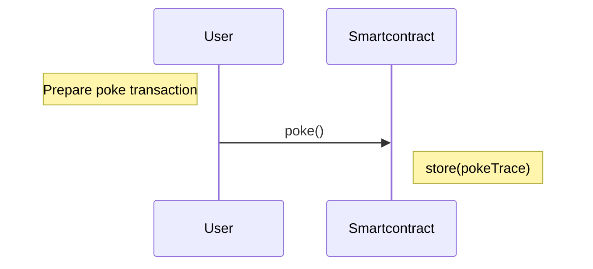

> dApp : A decentralized application is a type of distributed open source software application that runs on a peer-to-peer (P2P) blockchain network rather than on a single computer. DApps are visibly similar to other software applications that are supported on a website or mobile device.

This tutorial shows you how to create a poke game on smart contract.
The game consists on poking the owner of a smart contract. The smart contract keeps a track of user interactions and stores a trace.

Poke sequence diagram

You will learn :

- How to create a Tezos project with Taqueria
- How to create a smart contract in jsLigo
- How to deploy the smart contract a real testnet named Ghostnet
- How to create a frontend dApp using Taquito library and interact with a Tezos browser wallet
- How to use an indexer like TZKT

## Prerequisites

This tutorial uses Typescript, so it will be easier if you are familiar with JavaScript.

1. Make sure that you have installed these tools:

   - [Node.JS and NPM](https://nodejs.org/en/download/): NPM is required to install the web application's dependencies
   - [Taqueria](https://taqueria.io/), version 0.45.0 or later: Taqueria is a platform that makes it easier to develop and test dApps
   - [Docker](https://docs.docker.com/engine/install/): Docker is required to run Taqueria
   - [jq](https://stedolan.github.io/jq/download/): Some commands use the `jq` program to extract JSON data
   - [`yarn`](https://yarnpkg.com/): The frontend application uses yarn to build and run (see this article for details about [differences between `npm` and `yarn`](https://www.geeksforgeeks.org/difference-between-npm-and-yarn/))
   - Any Tezos-compatible wallet that supports Ghostnet, such as [Temple wallet](https://templewallet.com/)

2. Optionally, you can install [`VS Code`](https://code.visualstudio.com/download) to edit your application code in and the [LIGO VS Code extension](https://marketplace.visualstudio.com/items?itemName=ligolang-publish.ligo-vscode) for LIGO editing features such as code highlighting and completion.
   Taqueria also provides a [Taqueria VS Code extension](https://marketplace.visualstudio.com/items?itemName=ecadlabs.taqueria-vscode) that helps visualize your project and run tasks.

## The tutorial application

In this tutorial, you create a simple game where the user is poking though a dApp. The user interacts with the smart contract through a web interface, where they can see the current state of the contract and send poke commands to it. The contract responds by updating its storage with the user's address. Alternately, a user can also poke the contract deployed by other users.

The application looks like this:

The code for the completed application is in this GitHub repository: [solution](https://github.com/marigold-dev/training-dapp-1/tree/main/solution)

When you're ready, move to the next section [Create your minimum dApp on Tezos](./dapp/part-1) to begin setting up the application.
