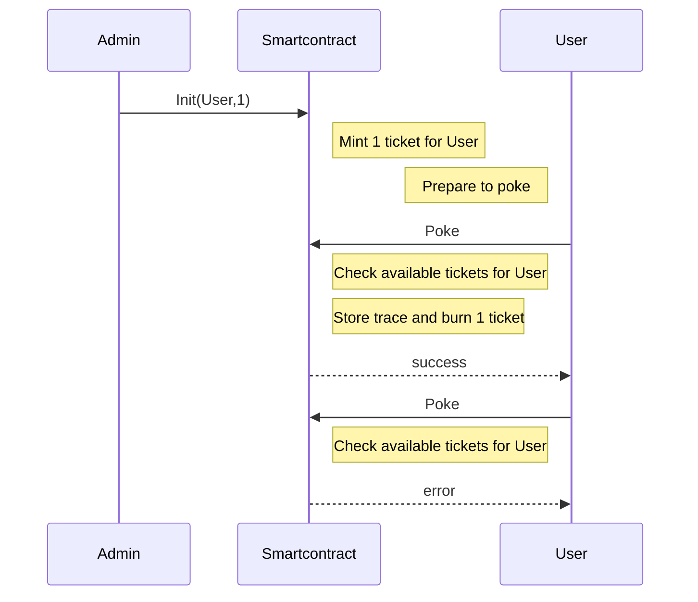

Previously, you learned how to do inter-contract calls, use view and do unit testing.
In this third session, you will enhance your skills on :

- using tickets
- don't mess up with `DUP` errors while manipulating tickets

On the second version of the poke game, you were able to poke any contract without constraint. A right to poke via tickets is now mandatory. Ticket are a kind of object that cannot be copied and can hold some trustable information.

## new Poke sequence diagram



## Prerequisites

Prerequisites are the same as the first session : https://github.com/marigold-dev/training-dapp-1#memo-prerequisites

Get the code from the session 2 solution [here](https://github.com/marigold-dev/training-dapp-2/tree/main/solution)

## Tickets

Tickets came with Tezos **Edo** upgrade, they are great and often misunderstood

Ticket structure :

- ticketer : (address) the creator contract address
- value : (any) Can be any type from string to bytes. It holds whatever arbitrary values
- amount : (nat) quantity of tickets minted

Tickets features :

- Not comparable : it makes no sense to compare tickets because tickets from same type are all equals and can be merged into a single ticket. When ticket types are different then it is no more comparable
- Transferable : you can send ticket into a Transaction parameter
- Storable : only on smart contract storage for the moment (Note : a new protocol release will enable it for implicit account soon)
- Non dupable : you cannot copy or duplicate a ticket, it is a unique singleton object living in specific blockchain instance
- Splittable : if amount is > 2 then you can split ticket object into 2 objects
- Mergeable : you can merge ticket from same ticketer and same type
- Mintable/burnable : anyone can create and destroy tickets

Example of usage :

- Authentication and Authorization token : giving a ticket to a user provides you Authentication. Adding some claims/rules on the ticket provides you some rights
- Simplified FA1.2/FA2 token : representing crypto token with tickets (mint/burn/split/join), but it does not have all same properties and does not respect the TZIP standard
- Voting rights : giving 1 ticket that count for 1 vote on each member
- Wrapped crypto : holding XTZ collateral against a ticket, and redeeming it later
- many others ...

### Minting

Minting is the action of creating ticket from void. In general, minting operations are done by administrators of smart contract or either by an end user.

1. Edit the `./contracts/pokeGame.jsligo` file and add a map of ticket ownership to the default `storage` type.
   This map keeps a list of consumable tickets for each authorized user. It is used as a burnable right to poke

```ligolang
export type storage = {
  pokeTraces: map<address, pokeMessage>,
  feedback: string,
  ticketOwnership: map<address, ticket<string>> //ticket of claims
};
```

In order to fill this map, add an new administration endpoint. A new entrypoint `Init` is adding x tickets to a specific user

> Note : to simplify, there is no security around this entrypoint, but in Production it should

Tickets are very special objects that cannot be **DUPLICATED**. During compilation to Michelson, using a variable twice, copying a structure holding tickets are generating `DUP` command. To avoid our contract to fail at runtime, Ligo parses statically our code during compilation time to detect any DUP on tickets.

To solve most of issues, segregate ticket objects from the rest of the storage, or structures containing ticket objects in order to avoid compilation errors. To do this, just destructure any object until you get tickets isolated.

For each function having the storage as parameter, `store` object need to be destructured to isolate `ticketOwnership` object holding our tickets. Then, don't use anymore the `store` object or it creates a **DUP** error.

2. Add the new `Init` function

```ligolang
@entry
const init = ([a, ticketCount]: [address, nat], store: storage): return_ => {
  const { pokeTraces, feedback, ticketOwnership } = store;
  if (ticketCount == (0 as nat)) {
    return [
      list([]) as list<operation>,
      { pokeTraces, feedback, ticketOwnership }
    ]
  } else {
    const t: ticket<string> =
      Option.unopt(Tezos.create_ticket("can_poke", ticketCount));
    return [
      list([]) as list<operation>,
      { pokeTraces, feedback, ticketOwnership: Map.add(a, t, ticketOwnership) }
    ]
  }
};
```

Init function looks at how many tickets to create from the current caller, then it is added to the current map

3. Modify the poke function

```ligolang
@entry
const poke = (_: unit, store: storage): return_ => {
  const { pokeTraces, feedback, ticketOwnership } = store;
  const [t, tom]: [option<ticket<string>>, map<address, ticket<string>>] =
    Map.get_and_update(
      Tezos.get_source(),
      None() as option<ticket<string>>,
      ticketOwnership
    );
  return match(t) {
    when (None):
      failwith("User does not have tickets => not allowed")
    when (Some(_t)):
      [
        list([]) as list<operation>,
        {
          feedback,
          pokeTraces: Map.add(
            Tezos.get_source(),
            { receiver: Tezos.get_self_address(), feedback: "" },
            pokeTraces
          ),
          ticketOwnership: tom
        }
      ]
  }
};
```

First, extract an existing optional ticket from the map. If an operation is done directly on the map, even trying to find or get this object in the structure, a DUP Michelson instruction is generated. Use the secure `get_and_update` function from Map library to extract the item from the map and avoid any copy.

> Note : more information about this function [here](https://ligolang.org/docs/reference/map-reference)

On a second step, look at the optional ticket, if it exists, then burn it (i.e do not store it somewhere on the storage anymore) and add a trace of execution, otherwise fail with an error message

4. Same for `pokeAndGetFeedback` function, do same checks and type modifications as below

```ligolang
@no_mutation
@entry
const pokeAndGetFeedback = (oracleAddress: address, store: storage): return_ => {
  const { pokeTraces, feedback, ticketOwnership } = store;
  ignore(feedback);
  const [t, tom]: [option<ticket<string>>, map<address, ticket<string>>] =
    Map.get_and_update(
      Tezos.get_source(),
      None() as option<ticket<string>>,
      ticketOwnership
    );
  let feedbackOpt: option<string> =
    Tezos.call_view("feedback", unit, oracleAddress);
  return match(t) {
    when (None):
      failwith("User does not have tickets => not allowed")
    when (Some(_t)):
      match(feedbackOpt) {
        when (Some(feedback)):
          do {
            let feedbackMessage = {
              receiver: oracleAddress,
              feedback: feedback
            };
            return [
              list([]) as list<operation>,
              {
                feedback,
                pokeTraces: Map.add(
                  Tezos.get_source(),
                  feedbackMessage,
                  pokeTraces
                ),
                ticketOwnership: tom
              }
            ]
          }
        when (None):
          failwith("Cannot find view feedback on given oracle address")
      }
  }
};
```

5. Update the storage initialization on `pokeGame.storages.jsligo`

```ligolang
#import "pokeGame.jsligo" "Contract"

const default_storage = {
    pokeTraces: Map.empty as map<address, Contract.pokeMessage>,
    feedback: "kiss",
    ticketOwnership: Map.empty as
        map<
            address,
            ticket<string>
        > //ticket of claims

};
```

6. Compile the contract to check any errors

> Note : don't forget to check that Docker is running for taqueria

```bash
npm i

TAQ_LIGO_IMAGE=ligolang/ligo:1.1.0 taq compile pokeGame.jsligo
```

Check on logs that everything is fine :ok_hand:

Try to display a DUP error now

7. Add this line on `poke function` just after the first line of storage destructuration `const { pokeTraces, feedback, ticketOwnership } = store;`

```ligolang
const t2 = Map.find_opt(Tezos.get_source(), ticketOwnership);
```

8. Compile again

```bash
TAQ_LIGO_IMAGE=ligolang/ligo:1.1.0 taq compile pokeGame.jsligo
```

This time you should see the `DUP` warning generated by the **find** function

```logs
Warning: variable "ticketOwnership" cannot be used more than once.
```

9. Remove it

## Test your code

Update the unit tests files to see if you can still poke

1. Edit the `./contracts/unit_pokeGame.jsligo` file

```ligolang
#import "./pokeGame.jsligo" "PokeGame"

export type main_fn = module_contract<parameter_of PokeGame, PokeGame.storage>;

const _ = Test.reset_state(2 as nat, list([]) as list<tez>);

const faucet = Test.nth_bootstrap_account(0);

const sender1: address = Test.nth_bootstrap_account(1);

const _1 = Test.log("Sender 1 has balance : ");

const _2 = Test.log(Test.get_balance_of_address(sender1));

const _3 = Test.set_baker(faucet);

const _4 = Test.set_source(faucet);

const initial_storage = {
  pokeTraces: Map.empty as map<address, PokeGame.pokeMessage>,
  feedback: "kiss",
  ticketOwnership: Map.empty as map<address, ticket<string>>
};

const initial_tez = 0 as tez;

export const _testPoke = (
  taddr: typed_address<parameter_of PokeGame, PokeGame.storage>,
  s: address,
  ticketCount: nat,
  expectedResult: bool
): unit => {
  const contr = Test.to_contract(taddr);
  const contrAddress = Tezos.address(contr);
  Test.log("contract deployed with values : ");
  Test.log(contr);
  Test.set_source(s);
  const statusInit =
    Test.transfer_to_contract(contr, Init([sender1, ticketCount]), 0 as tez);
  Test.log(statusInit);
  Test.log("*** Check initial ticket is here ***");
  Test.log(Test.get_storage(taddr));
  const status: test_exec_result =
    Test.transfer_to_contract(contr, Poke(), 0 as tez);
  Test.log(status);
  const store: PokeGame.storage = Test.get_storage(taddr);
  Test.log(store);
  return match(status) {
    when (Fail(tee)):
      match(tee) {
        when (Other(msg)):
          assert_with_error(expectedResult == false, msg)
        when (Balance_too_low(_record)):
          assert_with_error(expectedResult == false, "ERROR Balance_too_low")
        when (Rejected(s)):
          assert_with_error(expectedResult == false, Test.to_string(s[0]))
      }
    when (Success(_n)):
      match(
        Map.find_opt(
          s,
          (Test.get_storage(taddr) as PokeGame.storage).pokeTraces
        )
      ) {
        when (Some(pokeMessage)):
          do {
            assert_with_error(
              pokeMessage.feedback == "",
              "feedback " + pokeMessage.feedback + " is not equal to expected "
              + "(empty)"
            );
            assert_with_error(
              pokeMessage.receiver == contrAddress,
              "receiver is not equal"
            )
          }
        when (None()):
          assert_with_error(expectedResult == false, "don't find traces")
      }
  }
};

const _5 = Test.log("*** Run test to pass ***");

const testSender1Poke =
  (
    (): unit => {
      const orig =
        Test.originate(contract_of(PokeGame), initial_storage, initial_tez);
      _testPoke(orig.addr, sender1, 1 as nat, true)
    }
  )();

const _6 = Test.log("*** Run test to fail ***");

const testSender1PokeWithNoTicketsToFail =
  (
    (): unit => {
      const orig =
        Test.originate(contract_of(PokeGame), initial_storage, initial_tez);
      _testPoke(orig.addr, sender1, 0 as nat, false)
    }
  )();
```

- On `Init([sender1, ticketCount])`, initialize the smart contract with some tickets
- On `Fail`, check if you have an error on the test (i.e the user should be allowed to poke)
- On `testSender1Poke`, test with the first user using a preexisting ticket
- On `testSender1PokeWithNoTicketsToFail`, test with the same user again but with no ticket and an error should be caught

2. Run the test, and look at the logs to track execution

```bash
TAQ_LIGO_IMAGE=ligolang/ligo:1.1.0 taq test unit_pokeGame.jsligo
```

First test should be fine

```logs
┌──────────────────────┬───────────────────────────────────────────────────────────────────────────────────────────────────────────────────────────────────────────────────────────────────────┐
│ Contract             │ Test Results                                                                                                                                                          │
├──────────────────────┼───────────────────────────────────────────────────────────────────────────────────────────────────────────────────────────────────────────────────────────────────────┤
│ unit_pokeGame.jsligo │ "Sender 1 has balance : "                                                                                                                                             │
│                      │ 3800000000000mutez                                                                                                                                                    │
│                      │ "*** Run test to pass ***"                                                                                                                                            │
│                      │ "contract deployed with values : "                                                                                                                                    │
│                      │ KT1HeEVF74BLi3fYCpr1tpkDGmruFBNjMATo(None)                                                                                                                            │
│                      │ Success (1858n)                                                                                                                                                       │
│                      │ "*** Check initial ticket is here ***"                                                                                                                                │
│                      │ {feedback = "kiss" ; pokeTraces = [] ; ticketOwnership = [tz1hkMbkLPkvhxyqsQoBoLPqb1mruSzZx3zy -> (KT1HeEVF74BLi3fYCpr1tpkDGmruFBNjMATo , ("can_poke" , 1n))]}        │
│                      │ Success (1024n)                                                                                                                                                       │
│                      │ {feedback = "kiss" ; pokeTraces = [tz1hkMbkLPkvhxyqsQoBoLPqb1mruSzZx3zy -> {feedback = "" ; receiver = KT1HeEVF74BLi3fYCpr1tpkDGmruFBNjMATo}] ; ticketOwnership = []} │
│                      │ "*** Run test to fail ***"                                                                                                                                            │
│                      │ "contract deployed with values : "                                                                                                                                    │
│                      │ KT1HDbqhYiKs8e3LkNAcT9T2MQgvUdxPtbV5(None)                                                                                                                            │
│                      │ Success (1399n)                                                                                                                                                       │
│                      │ "*** Check initial ticket is here ***"                                                                                                                                │
│                      │ {feedback = "kiss" ; pokeTraces = [] ; ticketOwnership = []}                                                                                                          │
│                      │ Fail (Rejected (("User does not have tickets => not allowed" , KT1HDbqhYiKs8e3LkNAcT9T2MQgvUdxPtbV5)))                                                                │
│                      │ {feedback = "kiss" ; pokeTraces = [] ; ticketOwnership = []}                                                                                                          │
│                      │ Everything at the top-level was executed.                                                                                                                             │
│                      │ - testSender1Poke exited with value ().                                                                                                                               │
│                      │ - testSender1PokeWithNoTicketsToFail exited with value ().                                                                                                            │
│                      │                                                                                                                                                                       │
│                      │ 🎉 All tests passed 🎉                                                                                                                                                │
└──────────────────────┴───────────────────────────────────────────────────────────────────────────────────────────────────────────────────────────────────────────────────────────────────────┘
```

## Redeploy the smart contract

Let play with the CLI to compile and deploy

```bash
TAQ_LIGO_IMAGE=ligolang/ligo:1.1.0 taq compile pokeGame.jsligo
taq generate types ./app/src
taq deploy pokeGame.tz -e testing
```

```logs
┌─────────────┬──────────────────────────────────────┬──────────┬──────────────────┬────────────────────────────────┐
│ Contract    │ Address                              │ Alias    │ Balance In Mutez │ Destination                    │
├─────────────┼──────────────────────────────────────┼──────────┼──────────────────┼────────────────────────────────┤
│ pokeGame.tz │ KT1TC1DabCTmdMXuuCxwUmyb51bn2mbeNvbW │ pokeGame │ 0                │ https://ghostnet.ecadinfra.com │
└─────────────┴──────────────────────────────────────┴──────────┴──────────────────┴────────────────────────────────┘
```

## Adapt the frontend code

1. Rerun the app and check that you can cannot use the app anymore without tickets

```bash
cd app
yarn dev
```

2. Connect with any wallet with enough Tez, and Poke your own contract


The Kukai wallet is giving me back the error from the smart contract


Ok, so let's authorize some minting on my user and try again to poke

3. Add a new button for minting on a specific contract, replace the full content of `App.tsx` with :

```typescript
import { NetworkType } from "@airgap/beacon-types";
import { BeaconWallet } from "@taquito/beacon-wallet";
import { TezosToolkit } from "@taquito/taquito";
import * as api from "@tzkt/sdk-api";
import { BigNumber } from "bignumber.js";
import { useEffect, useState } from "react";
import "./App.css";
import ConnectButton from "./ConnectWallet";
import DisconnectButton from "./DisconnectWallet";
import { PokeGameWalletType, Storage } from "./pokeGame.types";
import { address, nat } from "./type-aliases";

function App() {
  api.defaults.baseUrl = "https://api.ghostnet.tzkt.io";

  const Tezos = new TezosToolkit("https://ghostnet.tezos.marigold.dev");
  const wallet = new BeaconWallet({
    name: "Training",
    preferredNetwork: NetworkType.GHOSTNET,
  });
  Tezos.setWalletProvider(wallet);

  const [contracts, setContracts] = useState<Array<api.Contract>>([]);
  const [contractStorages, setContractStorages] = useState<
    Map<string, Storage>
  >(new Map());

  const fetchContracts = () => {
    (async () => {
      const tzktcontracts: Array<api.Contract> = await api.contractsGetSimilar(
        import.meta.env.VITE_CONTRACT_ADDRESS,
        {
          includeStorage: true,
          sort: { desc: "id" },
        }
      );
      setContracts(tzktcontracts);
      const taquitoContracts: Array<PokeGameWalletType> = await Promise.all(
        tzktcontracts.map(
          async (tzktcontract) =>
            (await Tezos.wallet.at(tzktcontract.address!)) as PokeGameWalletType
        )
      );
      const map = new Map<string, Storage>();
      for (const c of taquitoContracts) {
        const s: Storage = await c.storage();
        map.set(c.address, s);
      }
      setContractStorages(map);
    })();
  };

  useEffect(() => {
    (async () => {
      const activeAccount = await wallet.client.getActiveAccount();
      if (activeAccount) {
        setUserAddress(activeAccount.address);
        const balance = await Tezos.tz.getBalance(activeAccount.address);
        setUserBalance(balance.toNumber());
      }
    })();
  }, []);

  const [userAddress, setUserAddress] = useState<string>("");
  const [userBalance, setUserBalance] = useState<number>(0);
  const [contractToPoke, setContractToPoke] = useState<string>("");

  //poke
  const poke = async (
    e: React.MouseEvent<HTMLButtonElement, MouseEvent>,
    contract: api.Contract
  ) => {
    e.preventDefault();
    let c: PokeGameWalletType = await Tezos.wallet.at("" + contract.address);
    try {
      const op = await c.methods
        .pokeAndGetFeedback(contractToPoke as address)
        .send();
      await op.confirmation();
      alert("Tx done");
    } catch (error: any) {
      console.log(error);
      console.table(`Error: ${JSON.stringify(error, null, 2)}`);
    }
  };

  //mint
  const mint = async (
    e: React.MouseEvent<HTMLButtonElement>,
    contract: api.Contract
  ) => {
    e.preventDefault();
    let c: PokeGameWalletType = await Tezos.wallet.at("" + contract.address);
    try {
      console.log("contractToPoke", contractToPoke);
      const op = await c.methods
        .init(userAddress as address, new BigNumber(1) as nat)
        .send();
      await op.confirmation();
      alert("Tx done");
    } catch (error: any) {
      console.log(error);
      console.table(`Error: ${JSON.stringify(error, null, 2)}`);
    }
  };

  return (
    <div className="App">
      <header className="App-header">
        <ConnectButton
          Tezos={Tezos}
          setUserAddress={setUserAddress}
          setUserBalance={setUserBalance}
          wallet={wallet}
        />

        <DisconnectButton
          wallet={wallet}
          setUserAddress={setUserAddress}
          setUserBalance={setUserBalance}
        />

        <div>
          I am {userAddress} with {userBalance} mutez
        </div>
      </header>

      <br />
      <div>
        <button onClick={fetchContracts}>Fetch contracts</button>
        <table>
          <thead>
            <tr>
              <th>address</th>
              <th>trace "contract - feedback - user"</th>
              <th>action</th>
            </tr>
          </thead>
          <tbody>
            {contracts.map((contract) => (
              <tr>
                <td style={{ borderStyle: "dotted" }}>{contract.address}</td>
                <td style={{ borderStyle: "dotted" }}>
                  {contractStorages.get(contract.address!) !== undefined &&
                  contractStorages.get(contract.address!)!.pokeTraces
                    ? Array.from(
                        contractStorages
                          .get(contract.address!)!
                          .pokeTraces.entries()
                      ).map(
                        (e) =>
                          e[1].receiver + " " + e[1].feedback + " " + e[0] + ","
                      )
                    : ""}
                </td>
                <td style={{ borderStyle: "dotted" }}>
                  <input
                    type="text"
                    onChange={(e) => {
                      console.log("e", e.currentTarget.value);
                      setContractToPoke(e.currentTarget.value);
                    }}
                    placeholder="enter contract address here"
                  />
                  <button onClick={(e) => poke(e, contract)}>Poke</button>
                  <button onClick={(e) => mint(e, contract)}>
                    Mint 1 ticket
                  </button>
                </td>
              </tr>
            ))}
          </tbody>
        </table>
      </div>
    </div>
  );
}

export default App;
```

> Note : You maybe have noticed, but the full typed generated Taquito class is used for the storage access now. It improves maintenance in case you contract storage has changed.

4. Refresh the page, now that you have the Mint button

5. Mint a ticket on this contract


6. Wait for the Tx popup confirmation and then try to poke again, it should succeed now


7. Wait for the Tx popup confirmation and try to poke again, you should be out of tickets and it should fail


Congratulation, you know how to use tickets and avoid DUP errors

> Takeaways :
>
> - you can go further and improve the code like consuming one 1 ticket quantity at a time and manage it the right way
> - you can also implement different type of Authorization mechanism, not only `can poke` claim
> - You can also try to base your ticket on some duration time like JSON token can do, not using the data field as a string but as bytes and store a timestamp on it.

## Summary

Now, you are able to understand ticket. If you want to learn more about tickets, read this great article [here](https://www.marigold.dev/post/tickets-for-dummies)

On next training, you will learn how to upgrade smart contracts

When you are ready, continue to [Part 4: Smart contract upgrades](./part-4).
