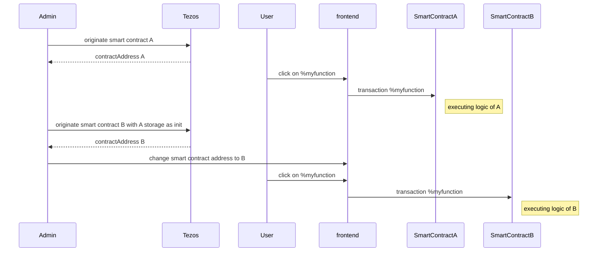
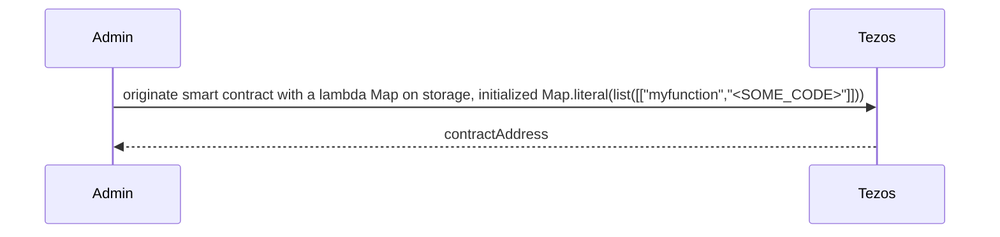
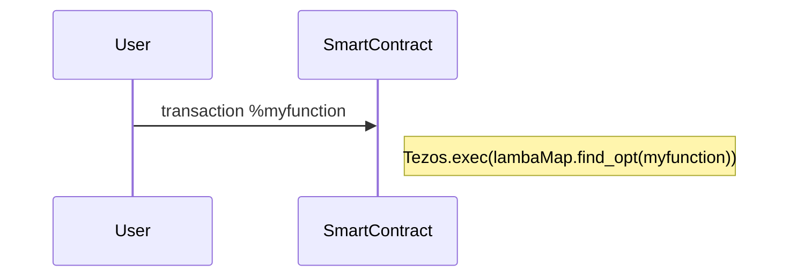
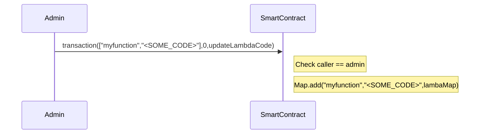
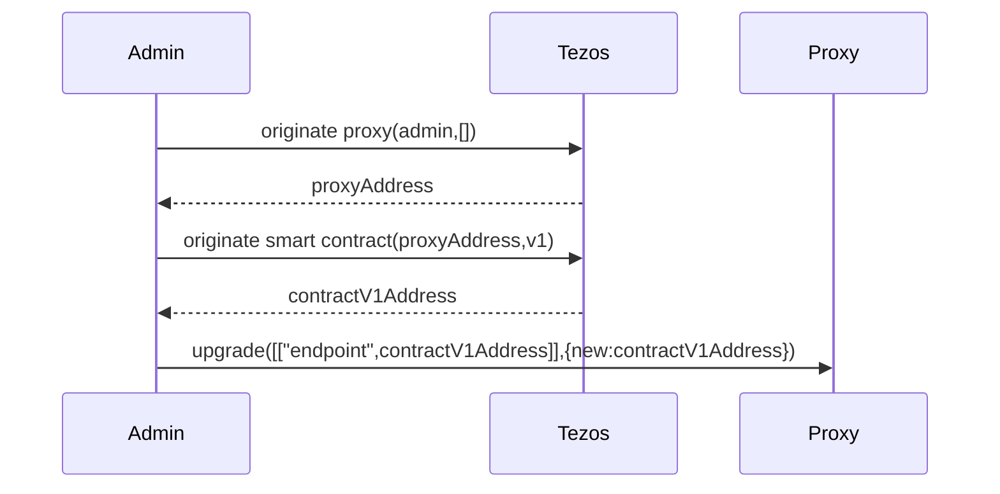
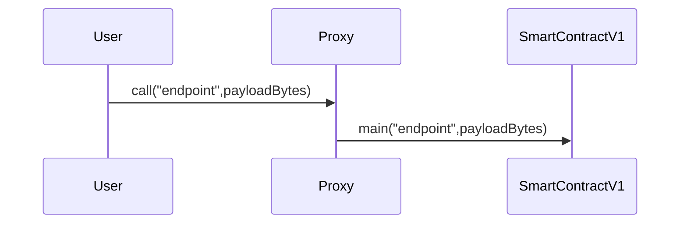
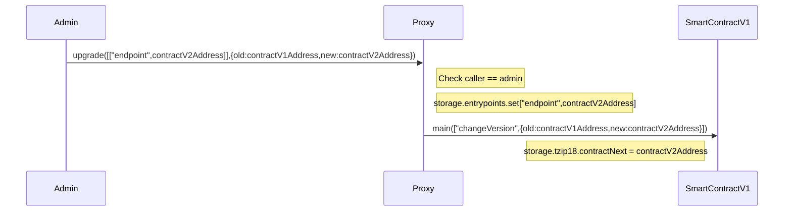

# Upgradable Poke game

Previously, you learned how to use tickets and don't mess up with it.
In this third session, you will enhance your skills on:

- Upgrading a smart contract with lambda function code.
- Upgrading a smart contract with proxy.

As you maybe know, smart contracts are immutable but in real life, applications are not and evolve. During the past several years, bugs and vulnerabilities in smart contracts caused millions of dollars to get stolen or lost forever. Such cases may even require manual intervention in blockchain operation to recover the funds.

Let's see some tricks that allow to upgrade a contract.

# Prerequisites

There is nothing more than you needed on first session: https://github.com/marigold-dev/training-dapp-1#memo-prerequisites.

Get the code from the session 3 or the solution [here](https://github.com/marigold-dev/training-dapp-3/tree/main/solution).

# Upgrades

As everyone knows, one feature of blockchain is to keep immutable code on a block. This allows transparency, traceability and trustlessness.

But application lifecycle implies to evolve and upgrade code to fix bug or bring functionalities. So, how to do it ?

> https://gitlab.com/tezos/tzip/-/blob/master/proposals/tzip-18/tzip-18.md

> Note: All below solutions break in a wait the fact that a smart contract is immutable. **Trust** preservation can be safe enough if the upgrade process has some security and authenticity around it. Like the first time an admin deploys a smart contract, any user should be able to trust the code reading it with free read access, the same should apply to the upgrade process (notification of new code version, admin identification, whitelisted auditor reports, ...). To resume, if you really want to avoid DEVOPS centralization, you are about to create a DAO with a voting process among some selected users/administrators in order to deploy the new version of the smart contract ... but let's simplify and talk here only about classical centralized admin deployment.

## Naive approach

One can deploy a new version of the smart contract and do a redirection to the new address on front end side.

Complete flow.



| Pros          | Cons                                                                                           |
| ------------- | ---------------------------------------------------------------------------------------------- |
| Easiest to do | Old contract remains active, so do bugs. Need to really get rid off it                         |
|               | Need to migrate old storage, can cost a lot of money or even be too big to copy at init time   |
|               | Need to sync/update frontend at each backend migration                                         |
|               | Lose reference to previous contract address, can lead to issues with other dependent contracts |

## Stored Lambda function

This time, the code will be on the storage and being executed at runtime.

Init.



Interaction.



Administration.



### Pros/Cons

| Pros                                                                                               | Cons                                                                                                               |
| -------------------------------------------------------------------------------------------------- | ------------------------------------------------------------------------------------------------------------------ |
| No more migration of code and storage. Update the lambda function code that is on existing storage | For the storage, all has to be stores as bytes PACKING/UNPACKING it so type checking is lost                       |
| keep same contract address                                                                         | IDE or tools do not work anymore on lambda code. Michelson does not protect us from some kinds of mistakes anymore |
|                                                                                                    | Unexpected changes can cause other contract callers to fail, Interface benefits is lost                            |
|                                                                                                    | Harder to audit and trace, can lead to really big security nd Trust issues                                         |
|                                                                                                    | Storing everything as bytes is limited to PACK-able types like nat, string, list, set, map                         |

### Implementation

Change the implementation of the function `pokeAndGetFeedback`. The feedback is now a lambda function on the storage.
It is required to:

- Add a new entrypoint to change the lambda code.
- Update the current entrypoint for calling the lambda.

1. Let's start with adding the lambda function definition of the storage.

   ```jsligo
   export type feedbackFunction = (oracleAddress: address) => string;

   export type storage = {
     pokeTraces: map<address, pokeMessage>,
     feedback: string,
     ticketOwnership: map<address, ticket<string>>, //ticket of claims
     feedbackFunction: feedbackFunction
   };
   ```

   Let's do minor changes as you have 1 additional field `feedbackFunction` on storage destructuring.

1. Edit the `PokeAndGetFeedback` function where the lambda `feedbackFunction(..)` is executed

   ```jsligo
   @no_mutation
   @entry
   const pokeAndGetFeedback = (oracleAddress: address, store: storage): return_ => {
     const { pokeTraces, feedback, ticketOwnership, feedbackFunction } = store;
     const [t, tom]: [option<ticket<string>>, map<address, ticket<string>>] =
       Map.get_and_update(
         Tezos.get_source(),
         None() as option<ticket<string>>,
         ticketOwnership
       );
     let feedbackMessage = {
       receiver: oracleAddress,
       feedback: feedbackFunction(oracleAddress)
     };
     return match(t) {
       when (None()):
         failwith("User does not have tickets => not allowed")
       when (Some(_t)):
         [
           list([]) as list<operation>,
           {
             feedback,
             pokeTraces: Map.add(Tezos.get_source(), feedbackMessage, pokeTraces),
             ticketOwnership: tom,
             feedbackFunction
           }
         ]
     }
   };
   ```

   Notice the line with `feedbackFunction(oracleAddress)` and call the lambda with the address parameter.

   The first time, the current code is injected to check that it still works, and then, modify the lambda code on the storage.

1. To modify the lambda function code, add an extra admin entrypoint `updateFeedbackFunction`.

   ```jsligo
   @entry
   const updateFeedbackFunction = (newCode: feedbackFunction, store: storage): return_ => {
     const { pokeTraces, feedback, ticketOwnership, feedbackFunction } = store;
     ignore(feedbackFunction);
     return [
       list([]),
       { pokeTraces, feedback, ticketOwnership, feedbackFunction: newCode }
     ]
   };
   ```

1. The storage definition is broken, fix all storage missing field warnings on `poke` and `init` functions.

   ```jsligo
   @entry
   const poke = (_: unit, store: storage): return_ => {
     const { pokeTraces, feedback, ticketOwnership, feedbackFunction } = store;
     const [t, tom]: [option<ticket<string>>, map<address, ticket<string>>] =
       Map.get_and_update(
         Tezos.get_source(),
         None() as option<ticket<string>>,
         ticketOwnership
       );
     return match(t) {
       when (None()):
         failwith("User does not have tickets => not allowed")
       when (Some(_t)):
         [
           list([]) as list<operation>,
           {
             feedback,
             pokeTraces: Map.add(
               Tezos.get_source(),
               { receiver: Tezos.get_self_address(), feedback: "" },
               pokeTraces
             ),
             ticketOwnership: tom,
             feedbackFunction
           }
         ]
     }
   };

   @entry
   const init = ([a, ticketCount]: [address, nat], store: storage): return_ => {
     const { pokeTraces, feedback, ticketOwnership, feedbackFunction } = store;
     if (ticketCount == (0 as nat)) {
       return [
         list([]) as list<operation>,
         { pokeTraces, feedback, ticketOwnership, feedbackFunction }
       ]
     } else {
       const t: ticket<string> =
         Option.unopt(Tezos.create_ticket("can_poke", ticketCount));
       return [
         list([]) as list<operation>,
         {
           pokeTraces,
           feedback,
           ticketOwnership: Map.add(a, t, ticketOwnership),
           feedbackFunction
         }
       ]
     }
   };
   ```

1. Change the initial storage with the old initial value of the lambda function (i.e calling a view to get a feedback).

   ```jsligo
   #import "pokeGame.jsligo" "Contract"

   const default_storage = {
       pokeTraces: Map.empty as map<address, Contract.pokeMessage>,
       feedback: "kiss",
       ticketOwnership: Map.empty as map<address, ticket<string>>, //ticket of claims
       feedbackFunction: (
           (oracleAddress: address): string => {
               return match(
                   Tezos.call_view("feedback", unit, oracleAddress) as
                       option<string>
               ) {
                   when (Some(feedback)):
                       feedback
                   when (None()):
                       failwith(
                           "Cannot find view feedback on given oracle address"
                       )
               };
           }
       )
   };
   ```

1. Compile and play with the CLI.

   ```bash
   npm i
   TAQ_LIGO_IMAGE=ligolang/ligo:1.1.0 taq compile pokeGame.jsligo
   ```

1. Redeploy to testnet

   ```bash
   taq deploy pokeGame.tz -e testing
   ```

   ```logs
   ┌─────────────┬──────────────────────────────────────┬──────────┬──────────────────┬────────────────────────────────┐
   │ Contract    │ Address                              │ Alias    │ Balance In Mutez │ Destination                    │
   ├─────────────┼──────────────────────────────────────┼──────────┼──────────────────┼────────────────────────────────┤
   │ pokeGame.tz │ KT1VjFawYQ4JeEEAVchqaYK1NmXCENm2ufer │ pokeGame │ 0                │ https://ghostnet.ecadinfra.com │
   └─────────────┴──────────────────────────────────────┴──────────┴──────────────────┴────────────────────────────────┘
   ```

1. Test the dApp frontend.

   Regenerate types and run the frontend.

   ```bash
   taq generate types ./app/src
   cd app
   yarn dev
   ```

1. Run the user sequence on the web page:

   1. Mint 1 ticket.
   1. wait for confirmation.
   1. poke a contract address.
   1. wait for confirmation.
   1. click on button to refresh the contract list.
      So far so good, you have the same result as previous training .

   Update the lambda function in background with the CLI though the new admin entrypoint. Return a fixed string this time, just for demo purpose and verify that the lambda executed is returning another output.

1. Edit the file `pokeGame.parameterList.jsligo`.

   ```jsligo
   #import "pokeGame.jsligo" "Contract"
   const default_parameter : parameter_of Contract = UpdateFeedbackFunction((_oracleAddress : address) : string => "YEAH!!!");
   ```

1. Compile all and call an init transaction.

   ```bash
   TAQ_LIGO_IMAGE=ligolang/ligo:1.1.0 taq compile pokeGame.jsligo
   taq call pokeGame --param pokeGame.parameter.default_parameter.tz -e testing
   ```

   ```logs
   ┌────────────────┬──────────────────────────────────────┬─────────────────────────────────────────┬────────────┬────────────────┬────────────────────────────────┐
   │ Contract Alias │ Contract Address                     │ Parameter                               │ Entrypoint │ Mutez Transfer │ Destination                    │
   ├────────────────┼──────────────────────────────────────┼─────────────────────────────────────────┼────────────┼────────────────┼────────────────────────────────┤
   │ pokeGame       │ KT1VjFawYQ4JeEEAVchqaYK1NmXCENm2ufer │ (Left { DROP ; PUSH string "YEAH!!!" }) │ default    │ 0              │ https://ghostnet.ecadinfra.com │
   │                │                                      │                                         │            │                │                                │
   └────────────────┴──────────────────────────────────────┴─────────────────────────────────────────┴────────────┴────────────────┴────────────────────────────────┘
   ```

1. Run the user sequence on the web page:

   1. Mint 1 ticket.
   1. Wait for confirmation.
   1. Poke a contract address.
   1. Wait for confirmation.
   1. Click on button to refresh the contract list.

   You see that the feedback has changed to `YEAH!!!`.

1. Optional: fix the units tests.

## Proxy pattern

The goal is to have a proxy contract maintaining the application lifecycle, it is an enhancement of previous naive solution.
Deploy a complete new smart contract, but this time, the end user is not interacting directly with this contract. Instead, the proxy becomes the default entrypoint and keep same facing address.

Init



Interaction



Administration



> Note: 2 location choices for the smart contract storage:
>
> - At proxy level: storage stays unique and immutable.
> - At end-contract level: storage is new at each new version and need to be migrated.

### Pros/Cons

| Pros                                                                      | Cons                                                                                                                                                    |
| ------------------------------------------------------------------------- | ------------------------------------------------------------------------------------------------------------------------------------------------------- |
| Migration is transparent for frontend                                     | smart contract code `Tezos.SENDER` always refers to the proxy, so you need to be careful                                                                |
| if the storage is unchanged, keep the storage at proxy level without cost | If storage changes, need to migrate storage from old contract to new contract and it costs money and having storage at proxy level is not more possible |
| keep same contract address                                                | If a contract interface changed, then re-originate the proxy                                                                                            |
|                                                                           | No all of types are compatible with PACKING/UNPACKING, and type checking is lost                                                                        |
|                                                                           | IDE or tools do not work anymore on lambda code. Michelson does not protect us from some kinds of mistakes anymore                                      |
|                                                                           | Unexpected changes can cause other contract callers to fail, Interface benefits are lost                                                                |
|                                                                           | Harder to audit and trace, can lead to really big security nd Trust issues                                                                              |
|                                                                           | Storing everything as bytes is limited to PACK-able types like nat, string, list, set, map                                                              |

### Implementation

#### Rewrite the smart contract to make it generic

1. Rename the file `pokeGame.jsligo` to `pokeGameLambda.jsligo` , as you can have a look on it later.

1. Remove pokeGame.parameterList.jsligo.

1. Get back the original version of `pokeGame.jsligo` from previous training as it is easier to start from here.

1. Create a new file `tzip18.jsligo`.

   ```bash
   taq create contract tzip18.jsligo
   ```

1. Edit the file.

   ```jsligo
   // Tzip 18 types
   export type tzip18 = {
     proxy: address,
     version: nat,
     contractPrevious: option<address>,
     contractNext: option<address>
   };
   ```

   This type is included on all smart contract storages to track the proxy address and the last contract version. It is used to block old smart contract instances to be called, and check who can call who.

1. Get back to `pokeGame.jsligo` and import this file on first line.

   ```jsligo
   #import "./tzip18.jsligo" "TZIP18"
   ```

1. Add the type on the storage definition.

   ```jsligo
   export type storage = {
     pokeTraces: map<address, pokeMessage>,
     feedback: string,
     ticketOwnership: map<address, ticket<string>>, //ticket of claims
     tzip18: TZIP18.tzip18
   };
   ```

1. Fix all missing field tzip18 on storage structure in the file.

   ```jsligo
   const poke = (
     _: { entrypointName: string, payload: bytes },
     [pokeTraces, feedback, ticketOwnership, tzip18]: [
       map<address, pokeMessage>,
       string,
       map<address, ticket<string>>,
       TZIP18.tzip18
     ]
   ): return_ => {
     //extract opt ticket from map

     const [t, tom]: [option<ticket<string>>, map<address, ticket<string>>] =
       Map.get_and_update(
         Tezos.get_source(),
         None() as option<ticket<string>>,
         ticketOwnership
       );
     return match(t) {
       when (None()):
         failwith("User does not have tickets => not allowed")
       when (Some(_t)):
         [
           list([]) as list<operation>,
           {
             //let t burn

             feedback,
             pokeTraces: Map.add(
               Tezos.get_source(),
               { receiver: Tezos.get_self_address(), feedback: "" },
               pokeTraces
             ),
             ticketOwnership: tom,
             tzip18,
           }
         ]
     };
   };

   @no_mutation
   const pokeAndGetFeedback = (
     oracleAddress: address,
     [pokeTraces, feedback, ticketOwnership, tzip18]: [
       map<address, pokeMessage>,
       string,
       map<address, ticket<string>>,
       TZIP18.tzip18
     ]
   ): return_ => {
     //extract opt ticket from map

     const [t, tom]: [option<ticket<string>>, map<address, ticket<string>>] =
       Map.get_and_update(
         Tezos.get_source(),
         None() as option<ticket<string>>,
         ticketOwnership
       );
     //Read the feedback view

     let feedbackOpt: option<bytes> =
       Tezos.call_view("getView", "feedback", oracleAddress);
     return match(t) {
       when (None()):
         failwith("User does not have tickets => not allowed")
       when (Some(_t)):
         match(feedbackOpt) {
           when (Some(f)):
             do {
               let feedbackMessage = {
                 receiver: oracleAddress,
                 feedback: Option.unopt(Bytes.unpack(f) as option<string>),
               };
               return [
                 list([]) as list<operation>,
                 {
                   feedback,
                   pokeTraces: Map.add(
                     Tezos.get_source(),
                     feedbackMessage,
                     pokeTraces
                   ),
                   ticketOwnership: tom,
                   tzip18,
                 }
               ]
             }
           when (None()):
             failwith("Cannot find view feedback on given oracle address")
         }
     };
   };

   const init = (
     [a, ticketCount]: [address, nat],
     [pokeTraces, feedback, ticketOwnership, tzip18]: [
       map<address, pokeMessage>,
       string,
       map<address, ticket<string>>,
       TZIP18.tzip18
     ]
   ): return_ => {
     return ticketCount == (0 as nat) ? [
         list([]) as list<operation>,
         { feedback, pokeTraces, ticketOwnership, tzip18 }
       ] : [
         list([]) as list<operation>,
         {
           feedback,
           pokeTraces,
           ticketOwnership: Map.add(
             a,
             Option.unopt(Tezos.create_ticket("can_poke", ticketCount)),
             ticketOwnership
           ),
           tzip18,
         }
       ]
   };
   ```

   The view call signature is different:

   - It returns an optional bytes.
   - Calling **getView** generic view exposed by the proxy.
   - Passing the view named **feedback** (to dispatch to the correct function once you reach the code that will be executed).
   - Finally, unpack the bytes result and cast it to string.

   With generic calls, a **unique** dispatch function has to be used and not multiple **@entry**.

1. Write a main function annotated with @entry.
   The parameter is a string representing the entrypoint name and some generic bytes that required to be cast later on.
   In a way, compiler checks are broken, so the code is to be well written and well cast as earliest as possible to mitigate risks.

   ```jsligo
   @entry
   export const main = (action: { entrypointName: string, payload: bytes }, store: storage): return_ => {
     //destructure the storage to avoid DUP

     const { pokeTraces, feedback, ticketOwnership, tzip18 } = store;
     const canBeCalled: bool =
       match(tzip18.contractNext) {
         when (None()):
           false // I am the last version, but I cannot be called directly (or is my proxy, see later)

         when (Some(contract)):
           do {
             if (Tezos.get_sender() == contract) {
               return true;
             } // I am not the last but a parent contract is calling me
             else {
               return false;
             }
           } // I am not the last version and a not-parent is trying to call me

       };
     if (Tezos.get_sender() != tzip18.proxy && ! canBeCalled) {
       return failwith("Only the proxy or contractNext can call this contract");
     };
     if (action.entrypointName == "Poke") {
       return poke(action, [pokeTraces, feedback, ticketOwnership, tzip18]);
     } else {
       if (action.entrypointName == "PokeAndGetFeedback") {
         return match(Bytes.unpack(action.payload) as option<address>) {
           when (None()):
             failwith("Cannot find the address parameter for PokeAndGetFeedback")
           when (Some(other)):
             pokeAndGetFeedback(
               other,
               [pokeTraces, feedback, ticketOwnership, tzip18]
             )
         };
       } else {
         if (action.entrypointName == "Init") {
           return match(Bytes.unpack(action.payload) as option<[address, nat]>) {
             when (None()):
               failwith("Cannot find the address parameter for changeVersion")
             when (Some(initParam)):
               init(
                 [initParam[0], initParam[1]],
                 [pokeTraces, feedback, ticketOwnership, tzip18]
               )
           };
         } else {
           if (action.entrypointName == "changeVersion") {
             return match(Bytes.unpack(action.payload) as option<address>) {
               when (None()):
                 failwith("Cannot find the address parameter for changeVersion")
               when (Some(other)):
                 changeVersion(
                   other,
                   [pokeTraces, feedback, ticketOwnership, tzip18]
                 )
             };
           } else {
             return failwith("Non-existant method");
           }
         }
       }
     }
   };
   ```

   - Start checking that only the proxy contract or the parent of this contract can call the main function. Enable this feature in case the future contract wants to run a migration _script_ itself, reading from children storage (looking at `tzip18.contractPrevious` field ).
   - With no more variant, the pattern matching is broken and `if...else` statement has be used instead.
   - When a payload is passed, unpack it and cast it with `(Bytes.unpack(action.payload) as option<MY_TYPE_HERE>)`. It means the caller and callee agree on payload structure for each endpoint.

1. Add the last missing function changing the version of this contract and make it obsolete (just before the main function).

```jsligo
/**
 * Function called by a parent contract or administrator to set the current version on an old contract
 **/

const changeVersion = (
  newAddress: address,
  [pokeTraces, feedback, ticketOwnership, tzip18]: [
    map<address, pokeMessage>,
    string,
    map<address, ticket<string>>,
    TZIP18.tzip18
  ]
): return_ => {
  return [
    list([]) as list<operation>,
    {
      pokeTraces,
      feedback,
      ticketOwnership,
      tzip18: { ...tzip18, contractNext: Some(newAddress) },
    }
  ]
};
```

11. Change the view to a generic one and do a `if...else` on `viewName` argument.

```jsligo
@view
const getView = (viewName: string, store: storage): bytes => {
  if (viewName == "feedback") {
    return Bytes.pack(store.feedback);
  } else return failwith("View " + viewName + " not found on this contract");
};
```

12. Change the initial storage.

> Note: for the moment, initialize the proxy address to a fake KT1 address because the proxy is not yet deployed.

```jsligo
#import "pokeGame.jsligo" "Contract"

const default_storage = {
    pokeTraces: Map.empty as map<address, Contract.pokeMessage>,
    feedback: "kiss",
    ticketOwnership: Map.empty as map<address, ticket<string>>, //ticket of claims
    tzip18: {
        proxy: "KT1LXkvAPGEtdFNfFrTyBEySJvQnKrsPn4vD" as address,
        version: 1 as nat,
        contractPrevious: None() as option<address>,
        contractNext: None() as option<address>
    }
};
```

13. Compile.

```bash
TAQ_LIGO_IMAGE=ligolang/ligo:1.1.0 taq compile pokeGame.jsligo
```

All good.

#### Write the unique proxy

1. Create a file `proxy.jsligo`.

   ```bash
   taq create contract proxy.jsligo
   ```

1. Define the storage and entrypoints on it.

   ```jsligo
   export type storage = {
     governance: address, //admins
     entrypoints: big_map<string, entrypointType> //interface schema map
   };

   type _return = [list<operation>, storage];
   ```

   The storage:

   - Holds a /or several admin.
   - Maintains the interface schema map for all underlying entrypoints.

   > Note on parameters: use @entry syntax, parameters is 2 functions.
   >
   > - **call**: forward any request to the right underlying entrypoint.
   > - **upgrade**: admin endpoint to update the interface schema map or change smart contract version.

1. Add our missing types just above.

   ```jsligo
   export type callContract = {
     entrypointName: string,
     payload: bytes
   };

   export type entrypointType = {
     method: string,
     addr: address
   };

   export type entrypointOperation = {
     name: string,
     isRemoved: bool,
     entrypoint: option<entrypointType>
   };

   export type changeVersion = {
     oldAddr: address,
     newAddr: address
   };
   ```

   - **callContract**: payload from user executing an entrypoint (name+payloadBytes).
   - **entrypointType**: payload to be able to call an underlying contract (name+address).
   - **entrypointOperation**: change the entrypoint interface map (new state of the map).
   - **changeVersion**: change the smart contract version (old/new addresses).

1. Add the `Call`entrypoint (simple forward). (Before main function).

   ```jsligo
   // the proxy function

   @entry
   const callContract = (param: callContract, store: storage): _return => {
     return match(Big_map.find_opt(param.entrypointName, store.entrypoints)) {
       when (None):
         failwith("No entrypoint found")
       when (Some(entry)):
         match(
           Tezos.get_contract_opt(entry.addr) as option<contract<callContract>>
         ) {
           when (None):
             failwith("No contract found at this address")
           when (Some(contract)):
             [
               list(
                 [
                   Tezos.transaction(
                     { entrypointName: entry.method, payload: param.payload },
                     Tezos.get_amount(),
                     contract
                   )
                 ]
               ) as list<operation>,
               store
             ]
         }
     }
   };
   ```

   It gets the entrypoint to call and the payload in bytes and just forward it to the right location.

1. Then, write the `upgrade` entrypoint. (Before main function).

   ```jsligo
   /**
   * Function for administrators to update entrypoints and change current contract version
   **/

   @entry
   const upgrade = (
     param: [list<entrypointOperation>, option<changeVersion>],
     store: storage
   ): _return => {
     if (Tezos.get_sender() != store.governance) {
       return failwith("Permission denied")
     };
     let [upgraded_ep_list, changeVersionOpt] = param;
     const update_storage = (
       l: list<entrypointOperation>,
       m: big_map<string, entrypointType>
     ): big_map<string, entrypointType> => {
       return match(l) {
         when ([]):
           m
         when ([x, ...xs]):
           do {
             let b: big_map<string, entrypointType> =
               match(x.entrypoint) {
                 when (None):
                   do {
                     if (x.isRemoved == true) {
                       return Big_map.remove(x.name, m)
                     } else {
                       return m
                     }
                   } //mean to remove or unchanged

                 when (Some(_ep)):
                   do {
                     //means to add new or unchanged

                     if (x.isRemoved == false) {
                       return match(x.entrypoint) {
                         when (None):
                           m
                         when (Some(c)):
                           Big_map.update(x.name, Some(c), m)
                       }
                     } else {
                       return m
                     }
                   }
               };
             return update_storage(xs, b)
           }
       }
     };
     //update the entrypoint interface map

     const new_entrypoints: big_map<string, entrypointType> =
       update_storage(upgraded_ep_list, store.entrypoints);
     //check if version needs to be changed

     return match(changeVersionOpt) {
       when (None):
         [list([]) as list<operation>, { ...store, entrypoints: new_entrypoints }]
       when (Some(change)):
         do {
           let op_change: operation =
             match(
               Tezos.get_contract_opt(change.oldAddr) as
                 option<contract<callContract>>
             ) {
               when (None):
                 failwith("No contract found at this address")
               when (Some(contract)):
                 do {
                   let amt = Tezos.get_amount();
                   let payload: address = change.newAddr;
                   return Tezos.transaction(
                     {
                       entrypointName: "changeVersion",
                       payload: Bytes.pack(payload)
                     },
                     amt,
                     contract
                   )
                 }
             };
           return [
             list([op_change]) as list<operation>,
             { ...store, entrypoints: new_entrypoints }
           ]
         }
     }
   };
   ```

   - It loops over the new interface schema to update and do so.
   - If a changeVersion is required, it calls the old contract to take the new version configuration (and it disables itself).

1. Last change is to expose any view from underlying contract, declare it at the end of the file.

```jsligo
@view
export const getView = (viewName: string, store: storage): bytes => {
  return match(Big_map.find_opt(viewName, store.entrypoints)) {
    when (None):
      failwith("View " + viewName + " not declared on this proxy")
    when (Some(ep)):
      Option.unopt(
        Tezos.call_view("getView", viewName, ep.addr) as option<bytes>
      )
  }
};
```

- Expose a generic view on the proxy and pass the name of the final function called on the underlying contract (as the smart contract view is not unreachable/hidden by the proxy contract).
- Search for an exposed view on the interface schema to retrieve the contract address, then call the view and return the result as an _exposed_ view.

7. Compile.

```bash
TAQ_LIGO_IMAGE=ligolang/ligo:1.1.0 taq compile proxy.jsligo
```

#### Deployment

1. Edit `proxy.storageList.jsligo` to this below ( **!!! be careful to point the _governance_ address to your taq default user account !!!**).

```jsligo
#include "proxy.jsligo"
const default_storage = {
  governance : "tz1VSUr8wwNhLAzempoch5d6hLRiTh8Cjcjb" as address, //admins
  entrypoints : Big_map.empty as big_map<string,entrypointType> //interface schema map
};
```

1. Compile and deploy it.

   ```bash
   TAQ_LIGO_IMAGE=ligolang/ligo:1.1.0 taq compile proxy.jsligo
   taq deploy proxy.tz -e testing
   ```

   ```logs
   ┌──────────┬──────────────────────────────────────┬───────┬──────────────────┬────────────────────────────────┐
   │ Contract │ Address                              │ Alias │ Balance In Mutez │ Destination                    │
   ├──────────┼──────────────────────────────────────┼───────┼──────────────────┼────────────────────────────────┤
   │ proxy.tz │ KT1BPoz3Yi8LPimxCiDvpmutbCNY8x3ghKyQ │ proxy │ 0                │ https://ghostnet.ecadinfra.com │
   └──────────┴──────────────────────────────────────┴───────┴──────────────────┴────────────────────────────────┘
   ```

   Keep this **proxy address**, as you need to report it below on `tzip18.proxy` field.

1. Deploy a smart contract V1. ( :warning: Change with the **proxy address** on the file `pokeGame.storageList.jsligo` like here below ).

   ```jsligo
   #import "pokeGame.jsligo" "Contract"

   const default_storage = {
       pokeTraces: Map.empty as map<address, Contract.pokeMessage>,
       feedback: "kiss",
       ticketOwnership: Map.empty as map<address, ticket<string>>, //ticket of claims
       tzip18: {
           proxy: "KT1BPoz3Yi8LPimxCiDvpmutbCNY8x3ghKyQ" as address,
           version: 1 as nat,
           contractPrevious: None() as option<address>,
           contractNext: None() as option<address>
       }
   };
   ```

1. Deploy the underlying V1 contract.

   ```bash
   TAQ_LIGO_IMAGE=ligolang/ligo:1.1.0 taq compile pokeGame.jsligo
   taq deploy pokeGame.tz -e testing
   ```

   ```logs
   ┌─────────────┬──────────────────────────────────────┬──────────┬──────────────────┬────────────────────────────────┐
   │ Contract    │ Address                              │ Alias    │ Balance In Mutez │ Destination                    │
   ├─────────────┼──────────────────────────────────────┼──────────┼──────────────────┼────────────────────────────────┤
   │ pokeGame.tz │ KT18ceGtUsNtQTk9smxQcaxAswRVkHDDKDgK │ pokeGame │ 0                │ https://ghostnet.ecadinfra.com │
   └─────────────┴──────────────────────────────────────┴──────────┴──────────────────┴────────────────────────────────┘
   ```

1. Tell the proxy that there is a first contract deployed with some interface.
   Edit the parameter file `proxy.parameterList.jsligo` (:warning: Change with the smart contract address on each command line on `addr` fields below :warning:).

   ```jsligo
   #import "proxy.jsligo" "Contract"

   const initProxyWithV1: parameter_of Contract =
       Upgrade(
           [
               list(
                   [
                       {
                           name: "Poke",
                           isRemoved: false,
                           entrypoint: Some(
                               {
                                   method: "Poke",
                                   addr: "KT18ceGtUsNtQTk9smxQcaxAswRVkHDDKDgK" as
                                       address
                               }
                           )
                       },
                       {
                           name: "PokeAndGetFeedback",
                           isRemoved: false,
                           entrypoint: Some(
                               {
                                   method: "PokeAndGetFeedback",
                                   addr: "KT18ceGtUsNtQTk9smxQcaxAswRVkHDDKDgK" as
                                       address
                               }
                           )
                       },
                       {
                           name: "Init",
                           isRemoved: false,
                           entrypoint: Some(
                               {
                                   method: "Init",
                                   addr: "KT18ceGtUsNtQTk9smxQcaxAswRVkHDDKDgK" as
                                       address
                               }
                           )
                       },
                       {
                           name: "changeVersion",
                           isRemoved: false,
                           entrypoint: Some(
                               {
                                   method: "changeVersion",
                                   addr: "KT18ceGtUsNtQTk9smxQcaxAswRVkHDDKDgK" as
                                       address
                               }
                           )
                       },
                       {
                           name: "feedback",
                           isRemoved: false,
                           entrypoint: Some(
                               {
                                   method: "feedback",
                                   addr: "KT18ceGtUsNtQTk9smxQcaxAswRVkHDDKDgK" as
                                       address
                               }
                           )
                       }
                   ]
               ) as list<Contract.entrypointOperation>,
               None() as option<Contract.changeVersion>
           ]
       );
   ```

1. Compile & Call it.

   ```bash
   TAQ_LIGO_IMAGE=ligolang/ligo:1.1.0 taq compile proxy.jsligo
   taq call proxy --param proxy.parameter.initProxyWithV1.tz -e testing
   ```

   Output:

   ```logs
   ┌────────────────┬──────────────────────────────────────┬───────────────────────────────────────────────────────────────────────────────────────────────────────┬────────────┬────────────────┬────────────────────────────────┐
   │ Contract Alias │ Contract Address                     │ Parameter                                                                                             │ Entrypoint │ Mutez Transfer │ Destination                    │
   ├────────────────┼──────────────────────────────────────┼───────────────────────────────────────────────────────────────────────────────────────────────────────┼────────────┼────────────────┼────────────────────────────────┤
   │ proxy          │ KT1BPoz3Yi8LPimxCiDvpmutbCNY8x3ghKyQ │ (Left (Pair { Pair "Poke" False (Some (Pair "Poke" "KT18ceGtUsNtQTk9smxQcaxAswRVkHDDKDgK")) ;         │ default    │ 0              │ https://ghostnet.ecadinfra.com │
   │                │                                      │               Pair "PokeAndGetFeedback"                                                               │            │                │                                │
   │                │                                      │                    False                                                                              │            │                │                                │
   │                │                                      │                    (Some (Pair "PokeAndGetFeedback" "KT18ceGtUsNtQTk9smxQcaxAswRVkHDDKDgK")) ;        │            │                │                                │
   │                │                                      │               Pair "Init" False (Some (Pair "Init" "KT18ceGtUsNtQTk9smxQcaxAswRVkHDDKDgK")) ;         │            │                │                                │
   │                │                                      │               Pair "changeVersion"                                                                    │            │                │                                │
   │                │                                      │                    False                                                                              │            │                │                                │
   │                │                                      │                    (Some (Pair "changeVersion" "KT18ceGtUsNtQTk9smxQcaxAswRVkHDDKDgK")) ;             │            │                │                                │
   │                │                                      │               Pair "feedback" False (Some (Pair "feedback" "KT18ceGtUsNtQTk9smxQcaxAswRVkHDDKDgK")) } │            │                │                                │
   │                │                                      │             None))                                                                                    │            │                │                                │
   │                │                                      │                                                                                                       │            │                │                                │
   └────────────────┴──────────────────────────────────────┴───────────────────────────────────────────────────────────────────────────────────────────────────────┴────────────┴────────────────┴────────────────────────────────┘
   ```

#### Update the frontend

1. Go on frontend side, recompile all and generate typescript classes.

   ```bash
   TAQ_LIGO_IMAGE=ligolang/ligo:1.1.0 taq compile pokeGame.jsligo
   TAQ_LIGO_IMAGE=ligolang/ligo:1.1.0 taq compile proxy.jsligo
   taq generate types ./app/src
   ```

1. Change the script to extract the proxy address instead of the contract one, edit `./app/package.json` and replace the line of script by:

   ```json
       "dev": "jq -r -f filter.jq ../.taq/testing-state.json > .env && vite",
   ```

1. Where you created a new file `filter.jq` with below content.

   ```bash
   echo '"VITE_CONTRACT_ADDRESS=" + last(.tasks[] | select(.task == "deploy" and .output[0].contract == "proxy.tz").output[0].address)' > ./app/filter.jq
   ```

1. Edit `./app/src/App.tsx` and change the contract address, display, etc ...

   ```typescript
   import { NetworkType } from '@airgap/beacon-types';
   import { BeaconWallet } from '@taquito/beacon-wallet';
   import { PackDataResponse } from '@taquito/rpc';
   import { MichelCodecPacker, TezosToolkit } from '@taquito/taquito';
   import * as api from '@tzkt/sdk-api';
   import { useEffect, useState } from 'react';
   import './App.css';
   import ConnectButton from './ConnectWallet';
   import DisconnectButton from './DisconnectWallet';
   import {
     Storage as ContractStorage,
     PokeGameWalletType,
   } from './pokeGame.types';
   import { Storage as ProxyStorage, ProxyWalletType } from './proxy.types';
   import { address, bytes } from './type-aliases';

   function App() {
     api.defaults.baseUrl = 'https://api.ghostnet.tzkt.io';

     const Tezos = new TezosToolkit('https://ghostnet.tezos.marigold.dev');
     const wallet = new BeaconWallet({
       name: 'Training',
       preferredNetwork: NetworkType.GHOSTNET,
     });
     Tezos.setWalletProvider(wallet);

     const [contracts, setContracts] = useState<Array<api.Contract>>([]);
     const [contractStorages, setContractStorages] = useState<
       Map<string, ProxyStorage & ContractStorage>
     >(new Map());

     const fetchContracts = () => {
       (async () => {
         const tzktcontracts: Array<api.Contract> =
           await api.contractsGetSimilar(
             import.meta.env.VITE_CONTRACT_ADDRESS,
             {
               includeStorage: true,
               sort: { desc: 'id' },
             }
           );
         setContracts(tzktcontracts);
         const taquitoContracts: Array<ProxyWalletType> = await Promise.all(
           tzktcontracts.map(
             async (tzktcontract) =>
               (await Tezos.wallet.at(tzktcontract.address!)) as ProxyWalletType
           )
         );
         const map = new Map<string, ProxyStorage & ContractStorage>();
         for (const c of taquitoContracts) {
           const s: ProxyStorage = await c.storage();
           try {
             let firstEp: { addr: address; method: string } | undefined =
               await s.entrypoints.get('Poke');

             if (firstEp) {
               let underlyingContract: PokeGameWalletType =
                 await Tezos.wallet.at('' + firstEp!.addr);
               map.set(c.address, {
                 ...s,
                 ...(await underlyingContract.storage()),
               });
             } else {
               console.log(
                 'proxy is not well configured ... for contract ' + c.address
               );
               continue;
             }
           } catch (error) {
             console.log(error);
             console.log(
               'final contract is not well configured ... for contract ' +
                 c.address
             );
           }
         }
         console.log('map', map);
         setContractStorages(map);
       })();
     };

     useEffect(() => {
       (async () => {
         const activeAccount = await wallet.client.getActiveAccount();
         if (activeAccount) {
           setUserAddress(activeAccount.address);
           const balance = await Tezos.tz.getBalance(activeAccount.address);
           setUserBalance(balance.toNumber());
         }
       })();
     }, []);

     const [userAddress, setUserAddress] = useState<string>('');
     const [userBalance, setUserBalance] = useState<number>(0);
     const [contractToPoke, setContractToPoke] = useState<string>('');
     //poke
     const poke = async (
       e: React.MouseEvent<HTMLButtonElement>,
       contract: api.Contract
     ) => {
       e.preventDefault();
       let c: ProxyWalletType = await Tezos.wallet.at('' + contract.address);
       try {
         console.log('contractToPoke', contractToPoke);

         const p = new MichelCodecPacker();
         let contractToPokeBytes: PackDataResponse = await p.packData({
           data: { string: contractToPoke },
           type: { prim: 'address' },
         });
         console.log('packed', contractToPokeBytes.packed);

         const op = await c.methods
           .callContract(
             'PokeAndGetFeedback',
             contractToPokeBytes.packed as bytes
           )
           .send();
         await op.confirmation();
         alert('Tx done');
       } catch (error: any) {
         console.log(error);
         console.table(`Error: ${JSON.stringify(error, null, 2)}`);
       }
     };

     //mint
     const mint = async (
       e: React.MouseEvent<HTMLButtonElement>,
       contract: api.Contract
     ) => {
       e.preventDefault();
       let c: ProxyWalletType = await Tezos.wallet.at('' + contract.address);
       try {
         console.log('contractToPoke', contractToPoke);
         const p = new MichelCodecPacker();
         let initBytes: PackDataResponse = await p.packData({
           data: {
             prim: 'Pair',
             args: [{ string: userAddress }, { int: '1' }],
           },
           type: { prim: 'Pair', args: [{ prim: 'address' }, { prim: 'nat' }] },
         });
         const op = await c.methods
           .callContract('Init', initBytes.packed as bytes)
           .send();
         await op.confirmation();
         alert('Tx done');
       } catch (error: any) {
         console.log(error);
         console.table(`Error: ${JSON.stringify(error, null, 2)}`);
       }
     };

     return (
       <div className="App">
         <header className="App-header">
           <ConnectButton
             Tezos={Tezos}
             setUserAddress={setUserAddress}
             setUserBalance={setUserBalance}
             wallet={wallet}
           />

           <DisconnectButton
             wallet={wallet}
             setUserAddress={setUserAddress}
             setUserBalance={setUserBalance}
           />

           <div>
             I am {userAddress} with {userBalance} mutez
           </div>

           <br />
           <div>
             <button onClick={fetchContracts}>Fetch contracts</button>
             <table>
               <thead>
                 <tr>
                   <th>address</th>
                   <th>trace "contract - feedback - user"</th>
                   <th>action</th>
                 </tr>
               </thead>
               <tbody>
                 {contracts.map((contract) => (
                   <tr>
                     <td style={{ borderStyle: 'dotted' }}>
                       {contract.address}
                     </td>
                     <td style={{ borderStyle: 'dotted' }}>
                       {contractStorages.get(contract.address!) !== undefined &&
                       contractStorages.get(contract.address!)!.pokeTraces
                         ? Array.from(
                             contractStorages
                               .get(contract.address!)!
                               .pokeTraces.entries()
                           ).map(
                             (e) =>
                               e[1].receiver +
                               ' ' +
                               e[1].feedback +
                               ' ' +
                               e[0] +
                               ','
                           )
                         : ''}
                     </td>
                     <td style={{ borderStyle: 'dotted' }}>
                       <input
                         type="text"
                         onChange={(e) => {
                           console.log('e', e.currentTarget.value);
                           setContractToPoke(e.currentTarget.value);
                         }}
                         placeholder="enter contract address here"
                       />
                       <button onClick={(e) => poke(e, contract)}>Poke</button>
                       <button onClick={(e) => mint(e, contract)}>
                         Mint 1 ticket
                       </button>
                     </td>
                   </tr>
                 ))}
               </tbody>
             </table>
           </div>
         </header>
       </div>
     );
   }

   export default App;
   ```

   - Contract address now is pointing to the new **proxy** address.
   - Merge the proxy and contract storage into `ProxyStorage&ContractStorage` type definition. Fetching the contracts is appending the storage of the underlying contract to the proxy storage.
   - The call to exposed entrypoint is altered. As all is generic, now on the proxy side there are only `await c.methods.callContract("my_entrypoint_name",my_packed_payload_bytes).send()` calls.

1. Run the frontend locally.

```bash
cd app
yarn dev
```

6. Do all the same actions as before through the proxy.

1. Login.
1. Refresh the contract list.
1. Mint 1 ticket.
1. Wait for confirmation popup.
1. Poke.
1. Wait for confirmation popup.
1. Refresh the contract list.

Deploy a new contract V2 and test it again.

> Note: Remember that the `storage.feedback` field cannot change on any deployed smart contract because there is no exposed method to update it.
> Let's change this value for the new contract instance, and call it `hello`.

7. Edit `pokeGame.storageList.jsligo` and add a new variable on it. Don't forget again to change `proxy` and `contractPrevious` by our own values !

```jsligo
const storageV2 = {
  pokeTraces: Map.empty as map<address, Contract.pokeMessage>,
  feedback: "hello",
  ticketOwnership: Map.empty as map<address, ticket<string>>,
  tzip18: {
    proxy: "KT1BPoz3Yi8LPimxCiDvpmutbCNY8x3ghKyQ" as address,
    version: 2 as nat,
    contractPrevious: Some(
      "KT18ceGtUsNtQTk9smxQcaxAswRVkHDDKDgK" as address
    ) as option<address>,
    contractNext: None() as option<address>,
  },
};
```

```bash
TAQ_LIGO_IMAGE=ligolang/ligo:1.1.0 taq compile pokeGame.jsligo
taq deploy pokeGame.tz -e testing --storage pokeGame.storage.storageV2.tz
```

```logs
┌─────────────┬──────────────────────────────────────┬──────────┬──────────────────┬────────────────────────────────┐
│ Contract    │ Address                              │ Alias    │ Balance In Mutez │ Destination                    │
├─────────────┼──────────────────────────────────────┼──────────┼──────────────────┼────────────────────────────────┤
│ pokeGame.tz │ KT1QXXwzRYwrvtDAJpT1jnxym86YbhzMHnKF │ pokeGame │ 0                │ https://ghostnet.ecadinfra.com │
└─────────────┴──────────────────────────────────────┴──────────┴──────────────────┴────────────────────────────────┘
```

8. Tell the proxy that there are new V2 entrypoints and remove the V1 ones.
   Add a new parameter variable on `proxy.parameterList.jsligo`. Don't forget to change the `addr` values with the new contract address just above.

```jsligo
const initProxyWithV2: parameter_of Contract =
    Upgrade(
        [
            list(
                [
                    {
                        name: "Poke",
                        isRemoved: false,
                        entrypoint: Some(
                            {
                                method: "Poke",
                                addr: "KT1QXXwzRYwrvtDAJpT1jnxym86YbhzMHnKF" as
                                    address
                            }
                        )
                    },
                    {
                        name: "PokeAndGetFeedback",
                        isRemoved: false,
                        entrypoint: Some(
                            {
                                method: "PokeAndGetFeedback",
                                addr: "KT1QXXwzRYwrvtDAJpT1jnxym86YbhzMHnKF" as
                                    address
                            }
                        )
                    },
                    {
                        name: "Init",
                        isRemoved: false,
                        entrypoint: Some(
                            {
                                method: "Init",
                                addr: "KT1QXXwzRYwrvtDAJpT1jnxym86YbhzMHnKF" as
                                    address
                            }
                        )
                    },
                    {
                        name: "changeVersion",
                        isRemoved: false,
                        entrypoint: Some(
                            {
                                method: "changeVersion",
                                addr: "KT1QXXwzRYwrvtDAJpT1jnxym86YbhzMHnKF" as
                                    address
                            }
                        )
                    },
                    {
                        name: "feedback",
                        isRemoved: false,
                        entrypoint: Some(
                            {
                                method: "feedback",
                                addr: "KT1QXXwzRYwrvtDAJpT1jnxym86YbhzMHnKF" as
                                    address
                            }
                        )
                    }
                ]
            ) as list<Contract.entrypointOperation>,
            None() as option<Contract.changeVersion>
        ]
    );
```

9. Call the proxy to do the changes.

```bash
TAQ_LIGO_IMAGE=ligolang/ligo:1.1.0 taq compile proxy.jsligo
taq call proxy --param proxy.parameter.initProxyWithV2.tz -e testing
```

10. Check the logs.

```logs
┌────────────────┬──────────────────────────────────────┬───────────────────────────────────────────────────────────────────────────────────────────────────────┬────────────┬────────────────┬────────────────────────────────┐
│ Contract Alias │ Contract Address                     │ Parameter                                                                                             │ Entrypoint │ Mutez Transfer │ Destination                    │
├────────────────┼──────────────────────────────────────┼───────────────────────────────────────────────────────────────────────────────────────────────────────┼────────────┼────────────────┼────────────────────────────────┤
│ proxy          │ KT1BPoz3Yi8LPimxCiDvpmutbCNY8x3ghKyQ │ (Left (Pair { Pair "Poke" False (Some (Pair "Poke" "KT1QXXwzRYwrvtDAJpT1jnxym86YbhzMHnKF")) ;         │ default    │ 0              │ https://ghostnet.ecadinfra.com │
│                │                                      │               Pair "PokeAndGetFeedback"                                                               │            │                │                                │
│                │                                      │                    False                                                                              │            │                │                                │
│                │                                      │                    (Some (Pair "PokeAndGetFeedback" "KT1QXXwzRYwrvtDAJpT1jnxym86YbhzMHnKF")) ;        │            │                │                                │
│                │                                      │               Pair "Init" False (Some (Pair "Init" "KT1QXXwzRYwrvtDAJpT1jnxym86YbhzMHnKF")) ;         │            │                │                                │
│                │                                      │               Pair "changeVersion"                                                                    │            │                │                                │
│                │                                      │                    False                                                                              │            │                │                                │
│                │                                      │                    (Some (Pair "changeVersion" "KT1QXXwzRYwrvtDAJpT1jnxym86YbhzMHnKF")) ;             │            │                │                                │
│                │                                      │               Pair "feedback" False (Some (Pair "feedback" "KT1QXXwzRYwrvtDAJpT1jnxym86YbhzMHnKF")) } │            │                │                                │
│                │                                      │             None))                                                                                    │            │                │                                │
│                │                                      │                                                                                                       │            │                │                                │
└────────────────┴──────────────────────────────────────┴───────────────────────────────────────────────────────────────────────────────────────────────────────┴────────────┴────────────────┴────────────────────────────────┘
```

11. Back to the web app, test the flow again:

1. Refresh the contract list.
1. Mint 1 ticket.
1. Wait for confirmation popup.
1. Poke.
1. Wait for confirmation popup.
1. Refresh the contract list.

Now, the proxy is calling the contract V2 and should return `hello` on the traces and no more `kiss`.

#### Last part is to set the old smart contract as obsolete

1. Add a new parameter on `proxy.parameterList.jsligo` to force change of version on old contract (:warning: replace below with your own addresses for V1 ad V2).

```jsligo
const changeVersionV1ToV2: parameter_of Contract =
    Upgrade(
        [
            list([]) as list<Contract.entrypointOperation>,
            Some(
                {
                    oldAddr: "KT18ceGtUsNtQTk9smxQcaxAswRVkHDDKDgK" as address,
                    newAddr: "KT1QXXwzRYwrvtDAJpT1jnxym86YbhzMHnKF" as address
                }
            ) as option<Contract.changeVersion>
        ]
    );
```

1. Compile.

   ```bash
   TAQ_LIGO_IMAGE=ligolang/ligo:1.1.0 taq compile proxy.jsligo
   taq call proxy --param proxy.parameter.changeVersionV1ToV2.tz -e testing
   ```

1. Check logs.

   ```logs
   ┌────────────────┬──────────────────────────────────────┬───────────────────────────────────────────────────────────────────────────────────────────────────────────┬────────────┬────────────────┬────────────────────────────────┐
   │ Contract Alias │ Contract Address                     │ Parameter                                                                                                 │ Entrypoint │ Mutez Transfer │ Destination                    │
   ├────────────────┼──────────────────────────────────────┼───────────────────────────────────────────────────────────────────────────────────────────────────────────┼────────────┼────────────────┼────────────────────────────────┤
   │ proxy          │ KT1BPoz3Yi8LPimxCiDvpmutbCNY8x3ghKyQ │ (Left (Pair {}                                                                                            │ default    │ 0              │ https://ghostnet.ecadinfra.com │
   │                │                                      │             (Some (Pair "KT18ceGtUsNtQTk9smxQcaxAswRVkHDDKDgK" "KT1QXXwzRYwrvtDAJpT1jnxym86YbhzMHnKF")))) │            │                │                                │
   │                │                                      │                                                                                                           │            │                │                                │
   └────────────────┴──────────────────────────────────────┴───────────────────────────────────────────────────────────────────────────────────────────────────────────┴────────────┴────────────────┴────────────────────────────────┘
   ```

1. Check on an indexer that the V1 `storage.tzip18.contractNext` is pointing to the next version address V2: [old V1 contract storage](https://ghostnet.tzkt.io/KT18ceGtUsNtQTk9smxQcaxAswRVkHDDKDgK/storage/).

   This ends the proxy pattern implementation. The old contract is no more "runnable" and the proxy is pointing to the last version.

## Alternative: Composability

Managing a monolithic smart contract like a microservice can reduce the problem, on the other side it increases complexity and application lifecycle on OPS side.

That's your tradeoff.

## Summary

Now, you are able to upgrade deployed contracts.
