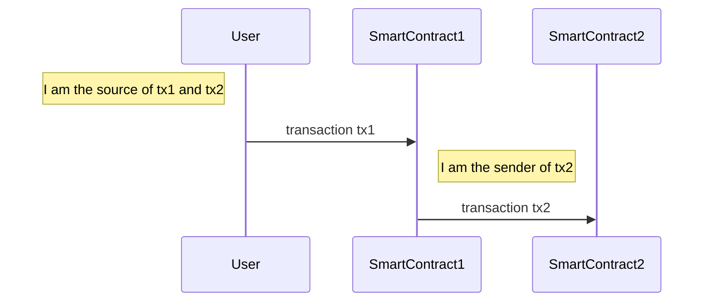

> Note: clone this [project](https://github.com/marigold-dev/training-security-1.git) for compiling and testing this tutorial.

Programming errors in web3 are mistakes or bugs that occur when writing smart contracts.

## Bugs

Writing Michelson code requires careful attention to detail and rigorous testing. If the code contains errors or inconsistencies, it may result in a failed transaction that consumes gas and storage fees. Therefore, it is advisable to use high-level languages that compile to Michelson, such as LIGO, and to verify the generated code before deploying it on the node.

For example, LIGO uses the Option type to safely work with values that may or may not exist.
If you subtract two tez or mutez variables, the result may be a negative number, which is not valid for the tez and mutez types.
For this reason, LIGO requires you to wrap the result in an Option type, even if you are confident that the result is a positive number, as in this example:

```ligolang
option<tez> = 0mutez - 1mutez;
```

In the source code `.contracts/1-bugs.jsligo`, we have also a subtraction returning an optional value:

```ligolang
    match(store - delta) {
```

Compile the code and watch the generated Michelson code:

```bash
taq init
taq compile 1-bugs.jsligo
more ./artifacts/1-bugs.tz
```

Line 6 of the compiled Michelson uses the `SUB_MUTEZ` instruction to subtract the two values.
Next, it uses the `IF_NONE` instruction to check whether the subtraction instruction returned a result.
If it did, it returns the number.
LIGO returns a compilation error if you forget to manage the optional value and try to use the result directly.

Run the code for the decrement of 0 by 1. 0 is the default value of the storage in the **1-bugs.storageList.jsligo** file. 1 is the parameter passed on the simulation in the **1-bugs.parameterList.jsligo** file.

```bash
taq simulate 1-bugs.tz --param 1-bugs.parameter.default_parameter.tz
```

All goes well; if there is an error on the subtraction, it is caught and returns an unchanged value.

Modify directly the Michelson file **./artifacts/1-bugs.tz** to not check the diff, as in the following code. Using **SUB** will not do specific checks for mutez and will not wrap it into an optional value.

```michelson
{ parameter (or (unit %reset) (or (mutez %decrement) (mutez %increment))) ;
  storage mutez ;
  code { UNPAIR ;
         IF_LEFT
           { DROP 2 ; PUSH mutez 0 }
           { IF_LEFT {  SWAP ; SUB  } { ADD } } ;
         NIL operation ;
         PAIR } }
```

Run it again:

```bash
taq simulate 1-bugs.tz --param 1-bugs.parameter.default_parameter.tz
```

This time the operation returns an error:

```logs
Underflowing subtraction of 0 tez and 0.000001 tez
```

In this way, using the LIGO compiler instead of coding Michelson directly helps you avoid problems.

&rarr; **SOLUTION**: Use the LIGO compiler to prevent runtime errors.

## Rounding issues

Michelson does not support floating point numbers, so rounding issues after division can happen if it is not done carefully. This can cause a smart contract to halt in some situations.

Let's take an example of the division of 101 by 4. In the file `2-rounding.jsligo` we have 2 users who would like to redeem the contract balance, with the user Alice receiving 3/4 and user Bob receiving 1/4. The contract calculates Alice's amount as the total minus 1/4 and Bob's amount as the total minus 3/4. Due to rounding, the total amount to withdraw from the contract can exceed the contract balance.

Run the following code:

```bash
taq compile 2-rounding.jsligo
taq simulate 2-rounding.tz --param 2-rounding.parameter.default_parameter.tz
```

It will fail because the result is negative. Alice will have 101-25=76 and Bob 101-(3\*25)=26, so the total to redeem is 102, which is greater than the initial 101.

```logs
script reached FAILWITH instruction
with "It is a failure !!!"
```

&rarr; **SOLUTION**: Change the way to do the operation to not be influenced by the rounding effect. Calculate the first value and use the rest for the second user.

Change the line for bob from this code:

```ligolang
const bob = s - (3n * quotient);
```

To this code:

```ligolang
const bob = s - alice;
```

Recompile and run the code:

```bash
taq compile 2-rounding.jsligo
taq simulate 2-rounding.tz --param 2-rounding.parameter.default_parameter.tz
```

All good now. =)

## Unsecure bitwise operations

A bitwise operation is a type of computation that operates on the individual bits of a binary number. A bitwise shift moves the bits of the operand to the left or right by a certain number of positions, filling the vacated bits with zeros.

However, there is a caveat: if the shift amount is too large, it can cause an overflow, which means that some bits are lost or added beyond the expected size of the input. This can lead to unexpected results or errors in the execution of the contract in Michelson.

Run our two examples shifting to left and right:

```bash
taq compile 3-bitwise.jsligo
taq simulate 3-bitwise.tz --param 3-bitwise.parameter.shiftLeftOneNat.tz
taq simulate 3-bitwise.tz --param 3-bitwise.parameter.shiftRight257times.tz
```

- The first example shifts 2n (0x0010) one time to the left, so it gives 4n (0x0100)
- The second example shifts 2n (0x0010) 257 times to the right. Because the limit is 256 shifts, it produces the error `unexpected arithmetic overflow`.

&rarr; **SOLUTION**: To avoid this, check the size of the input and the shift amount before applying the bitwise instructions. Here you should check if the number of shifts is less than or equal to 256; otherwise, you raise an error.

## Sender vs Source confusion

When a transaction is sent by a user, it can create other transactions on other smart contracts. Depending on the transaction, the address that initiated the original transaction (the _source_) could be different from the direct sender of the additional transactions (the _sender_).



In this example, transaction tx2 on SmartContract2 has:

- The **User** as the source
- The **SmartContract1** as the sender

**Man-in-the-middle attack**: The victim contract is checking the source `Tezos.get_source()` to give access to an endpoint. If we have a phishing contract in the middle, it can call the endpoint while appearing to be the authorized caller. In this case, it can even grab some money in addition to the malicious action.

Run the following test:

```bash
taq test 4-manInTheMiddleTest.jsligo
```

```logs
"Successfully hacked the victim and grab it money !!!"
🎉 All tests passed 🎉
```

&rarr; **SOLUTION**: Fix the code on the file `4-manInTheMiddleVictim.jsligo`, replacing `Tezos.get_source()` by `Tezos.get_sender()`.

Run it again:

```bash
taq test 4-manInTheMiddleTest.jsligo
```

```logs
Failwith: "You are not the admin to do this action"
Trace:
File "contracts/4-manInTheMiddleTest.jsligo", line 51, character 2 to line 59, character 3 ,
File "contracts/4-manInTheMiddleTest.jsligo", line 51, character 2 to line 59, character 3 ,
File "contracts/4-manInTheMiddleTest.jsligo", line 69, characters 17-24

===
┌─────────────────────────────┬──────────────────────┐
│ Contract │ Test Results │
├─────────────────────────────┼──────────────────────┤
│ 4-manInTheMiddleTest.jsligo │ Some tests failed :( │
└─────────────────────────────┴──────────────────────┘
```

> Note: On some specific cases it is important to authorize an intermediary contract to communicate with our contract. We should not always check the source as the default behavior for rejection

## Library updates

This is a DevOps issue. If a continuous integration pipeline recompiles the code before deploying a new version and there are dependencies to fetch, it's possible that the new behavior will not be compatible with your code logic and bring new security flaws.

&rarr; **SOLUTION**: Do more unit tests and publish CI test reports.

## Private data

One of the most important security considerations for smart contract developers is to avoid storing any sensitive or confidential information on the contract storage. This is because the contract storage is public and immutable, meaning that anyone can read its contents and those contents cannot be erased or modified. Therefore, any secret value, such as a private key, a password, or a personal identification number, should never be stored on the contract storage. Doing so exposes the secret value to potential attackers and compromises the security and privacy of the contract and its users.

&rarr; **SOLUTION**: Instead, secret values should be stored off-chain, such as in a secure database or a hardware wallet, and only communicated to the contract when necessary using encryption with the commit-reveal pattern or zero-knowledge proofs.

## Predictable information used as a random value

Due to the deterministic nature of blockchain execution, it is not possible to generate random numbers or values within a smart contract. This means that any logic that relies on randomness, such as games, lotteries, or auctions, cannot be implemented securely and fairly on a blockchain. Therefore, smart contract developers need to find alternative ways to introduce randomness into their applications, such as using external sources of randomness (oracles) or cryptographic techniques (commit-reveal schemes).

&rarr; **SOLUTION**:

- Use block timestamp: This approach has a low cost but also a high risk of being compromised, as the time parameter is too coarse and can be easily estimated based on the average block time.
- Use contract origination address: This approach has a low cost but also a high risk of being compromised, because it is composed of the hash of the operation concatenated with an origination index.
- Multi-participant random seed: One possible way to generate a multi-participant random seed is to ask each participant to submit a random number in a secure and verifiable way. This can be done using a commit-reveal scheme, where each participant first commits to their number by sending a hash of it and then reveals it later by sending the actual number. The hash function ensures that the participants cannot change their numbers after committing, and the reveal phase allows everyone to verify that the numbers match the hashes. The final seed can be computed by combining all the revealed numbers using some deterministic function, such as XOR or modular addition.
  However, this method has some drawbacks, such as requiring two rounds of communication and being vulnerable to a locked situation, where some participants do not reveal their numbers and prevent the seed from being generated. To avoid this, there should be some incentive mechanism or timeout mechanism to ensure that everyone reveals their numbers in time, or else they are penalized or excluded from the seed generation.
- Good randomness oracle: Creating a good off-chain random Oracle is not easy, as it requires a way to prove that the numbers are indeed random and not manipulated by anyone. One possible solution is to use a verifiable random function (VRF), which is a cryptographic algorithm that generates a random output from an input and a secret key. It produces a proof that the output was correctly computed. The proof can be verified by anyone who knows the input and the public key, but not the secret key. Chainlink is a decentralized network of Oracles that offers a VRF-based randomness Oracle for smart contracts. It claims to be one of the few, if not the only reasonably good available randomness oracle on the market. However, it has some limitations, such as being only compatible with Ethereum. Moreover, it still relies on the trustworthiness of a third party, namely the Chainlink node operators that hold the secret keys and generate the random numbers and proofs.

## Blocked state

One of the possible scenarios in a blockchain smart contract is to have a blocked state where the contract execution is paused until a certain condition is met. For example, a contract that implements a simple escrow service might have a blocked state where the seller has to confirm the delivery of the goods before the buyer can release the payment. This way, the contract ensures that both parties are satisfied with the transaction and no one can cheat or withdraw from the agreement.

Another example is in the tutorial [Create a mobile game](../mobile). The contract in this tutorial is blocked while the players make their decisions. However, if one of the players does not reveal their choice within 10 minutes, the other player can claim a resolution and win the game by calling an entrypoint on the contract. This way, the contract is not stuck indefinitely and the honest player is rewarded.

&rarr; **SOLUTION**:

- Define clear and objective rules for entering and exiting the blocked state, as well as for handling exceptions and disputes.
- Use timeouts or deadlines to limit the duration of the blocked state and avoid indefinite waiting or deadlock situations.
- Implement incentives or penalties to encourage or discourage certain behaviors or actions by the participants during the blocked state.
- Provide feedback and notifications to the participants about the status and progress of the contract during the blocked state.
- Use external oracles or trusted third parties to verify or arbitrate the condition that triggers the blocked state, if necessary.

---

Go to [Part 2: Leaks](./part-2).
