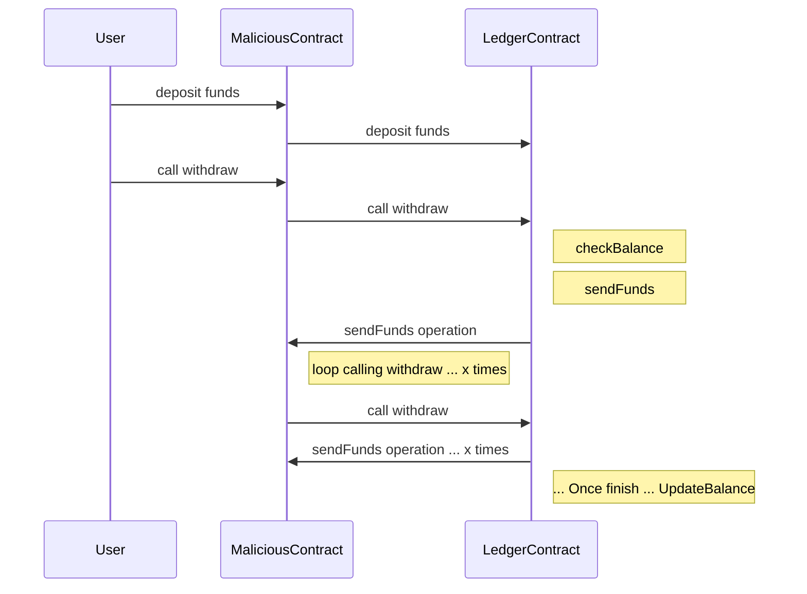
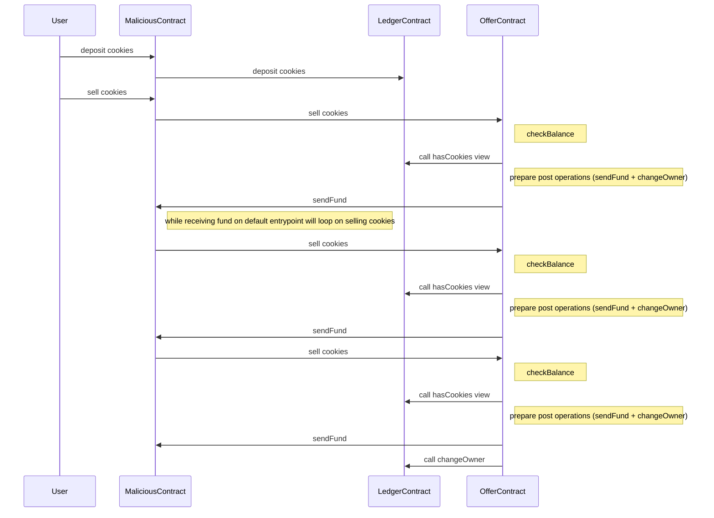

> Note: clone this [project](https://github.com/marigold-dev/training-security-2.git) for compiling and testing this tutorial.

## Replay attack

A replay attack on a smart contract is a type of security vulnerability that allows an attacker to reuse a signed valid transaction multiple times. We saw in the previous part how to do off-chain replay attacks, but it is also possible to do on-chain replay attacks.
Even though Tezos prevents this kind of attack, you can try it by sending the same operation several times.

Compile and simulate the replay attack:

```bash
taq init
taq compile 1-replay.jsligo
taq simulate 1-replay.tz --param=1-replay.parameter.parameter.tz
```

The simulation will tell you that several internal transactions will be executed.
But if you deploy the code and try to execute it, it throws an error:

```bash
taq deploy 1-replay.tz --mutez 1000 -e testing

taq transfer KT1VMt7t4CboRP6jYBUdBQowHb4NR1UtmDrz -e testing
```

Tezos detect the flaw and returns this error:

```logs
  "message": "(transaction) proto.017-PtNairob.internal_operation_replay"
```

## Memory overflow

Memory overflow is a kind of attack that overloads the memory of a smart contract resulting in making this contract unusable. Even simply loading the data into memory and deserializing it at the beginning of the call could use so much gas that any call to the contract would fail. All the funds would be forever locked into the contract.

Here is the list of dangerous types to use carefully:

- Integers and nats: they can be increased to an arbitrarily large value
- Strings: they have no limit on their lengths
- Lists, sets, maps: they can contain an arbitrary number of items

&rarr; **SOLUTION**:

- Ask the user to pay a minimum tez for each call
- Set a threshold limit
- Store data in a big_map
- Avoid unnecessary on-chain computation that can be done off-chain. For example, do not loop on-chain; instead, update a part of a map

Example with the current FA1.2 implementation: https://inference.ag/blog/2023-10-09-FA12_spenders/

You can have a look at the LIGO implementation of FA1.2 on the LIGO registry [here](https://packages.ligolang.org/package/ligo_fa1.2)

The code follows the standard but you can see that the [Allowance type is a map](https://github.com/frankhillard/ligoFA12/blob/main/lib/asset/allowance.mligo#L3C8-L3C8). It would have been better to change the standard and use a `big_map` instead of a `map`. If you implement the standard differently, then your smart contract storage definition and entrypoint signatures will not match anymore and will not be supported by other platforms.

## Re-entrancy

These attacks allow an attacker to repeatedly call a contract function in a way that drains the contract’s resources, leading to a denial of service (DoS) attack.

One of the most well-known examples of a re-entrancy attack occurred in 2016 when an attacker exploited a vulnerability in the DAO (Decentralized Autonomous Organization) contract on the Ethereum blockchain. But this popular hack is still actively used:

- Uniswap/Lendf.Me hacks (April 2020) – $25 mln, attacked by a hacker using a re-entrancy.
- The BurgerSwap hack (May 2021) – $7.2 mln, because of a fake token contract and a re-entrancy exploit.
- The SURGEBNB hack (August 2021) – $4 mln, seems to be a re-entrancy-based price manipulation attack.
- CREAM FINANCE hack (August 2021) – $18.8 mln, re-entrancy vulnerability allowed the exploiter for the second borrow.
- Siren protocol hack (September 2021) – $3.5 mln, AMM pools were exploited through re-entrancy attack.

This kind of attack is quite simple to put in place with Solidity because of the way it works.

Consider this scenario:



Why is this scenario possible on Solidity?
In Solidity, when a smart contract calls another smart contract, that operation runs immediately and synchronously.
The original smart contract pauses, the other smart contract runs, and then the original smart contract resumes.
If someone calls the original smart contract multiple times very quickly, they can generate multiple operations before the original smart contract updates its state.
In the example in the previous diagram, a user may be able to run many withdraw operations and drain more than the developer expected.

Why is this scenario not possible on Tezos?
The transaction mempool queue is processed in sequence.
When a transaction is processed and involves another smart contract call, the new operation is pushed on the queue and is executed after the current operation ends and updates its state.

Let's implement a more complex scenario where the OfferContract and LedgerContract are separated. The OfferContract will naively send the money back to MaliciousContract because it relies on the **not yet modified** state of the LedgerContract. There are two operations and the modification of the state will come in second position.



The issue here is clearly that we send money without updating the state first.

&rarr; **SOLUTION**:

- Mutex safeguard: To prevent the contract from generating multiple internal operations, we can add a Mutual Exclusive semaphore Boolean named `isRunning` that is true when an operation is running. This variable locks the contract while the full transaction flow runs.

  1. Check the isRunning is false
  2. Set isRunning to true
  3. Do logic code ...
  4. Create a last operation transaction to reset the boolean to false

- Check-and-send pattern: Principle of separating state changes from external contract interactions. First, update the contract’s state, then interact with other contracts.

Compile and run the hack test first:

```bash
taq test 3-reentrancyTest.jsligo
```

The logs seem to be fine, but it is hard to guess the internal transactions and to separate the fees from the hack on the attacker's balance.

```logs
┌─────────────────────────┬─────────────────────────────────────────────┐
│ Contract                │ Test Results                                │
├─────────────────────────┼─────────────────────────────────────────────┤
│ 3-reentrancyTest.jsligo │ "ledgerContract"                            │
│                         │ KT1LQyTHEZeaecRj7hWgkzPEBD6vMEKXYzoo(None)  │
│                         │ "offerContract"                             │
│                         │ KT1M4nPCej4va4Q2iMPX2FKt8xLw5cfGjBv9(None)  │
│                         │ "maliciousContract"                         │
│                         │ KT1B7RgF6j7UpAybpdfxhLCp7hf41pNFcxyS(None)  │
│                         │ "admin initialize cookies to malicious KT1" │
│                         │ Success (1299n)                             │
│                         │ "COOKIES OWNERS"                            │
│                         │ {KT1B7RgF6j7UpAybpdfxhLCp7hf41pNFcxyS}      │
│                         │ "BALANCE OF SENDER"                         │
│                         │ 3799985579750mutez                          │
│                         │ Success (1798n)                             │
│                         │ "AFTER RUN - BALANCE OF SENDER"             │
│                         │ 3799984579749mutez                          │
│                         │ {KT1LQyTHEZeaecRj7hWgkzPEBD6vMEKXYzoo}      │
│                         │ "END RUN - BALANCE OF SENDER"               │
│                         │ 3799984579749mutez                          │
│                         │ {KT1LQyTHEZeaecRj7hWgkzPEBD6vMEKXYzoo}      │
│                         │ Everything at the top-level was executed.   │
│                         │ - testReentrancy exited with value true.    │
│                         │                                             │
│                         │ 🎉 All tests passed 🎉                      │
└─────────────────────────┴─────────────────────────────────────────────┘
```

To have a better visualization of the hack, the contract should be deployed.

Compile the first contract, the Ledger contract, and deploy it:

```bash
taq compile 3-reentrancyLedgerContract.jsligo
taq deploy 3-reentrancyLedgerContract.tz -e testing
```

Copy the contract address, in my case `KT1BJZfhC459WqCVJzPmu3vJSWFFkvyi9k1u`, and paste it in the file `3-reentrancyOfferContract.storageList.jsligo`.

Compile and deploy the second contract, the Offer contract, putting some money on the contract for the thieves:

```bash
taq compile 3-reentrancyOfferContract.jsligo
taq deploy 3-reentrancyOfferContract.tz -e testing --mutez 10000000
```

Copy the contract address, in my case `KT1CHJgXEdBPktNNPGTDaL8XEAzJV9fjSkrZ`, and paste it in the file `3-reentrancyMaliciousContract.storageList.jsligo`.

Compile and deploy the last contract, the Malicious contract which will loop and steal the funds of the Offer contract:

```bash
taq compile 3-reentrancyMaliciousContract.jsligo
taq deploy 3-reentrancyMaliciousContract.tz -e testing
```

Copy the contract address, in my case `KT1NKLZE9HkGJxjopowLqxA4pswutgMrrXyE`, and initialize the Ledger contract as the Malicious contract as some cookies on its storage. Paste the value in the file `3-reentrancyLedgerContract.parameterList.jsligo`.

When you are done, compile the Ledger contracts and call them with this parameter:

```bash
taq compile 3-reentrancyLedgerContract.jsligo
taq call 3-reentrancyLedgerContract --param 3-reentrancyLedgerContract.parameter.default_parameter.tz -e testing
```

Context is ready:

- The Malicious contract has cookies on the Ledger contract
- All deployed contract points to the correct addresses

Now the Malicious contract will try to steal funds from the Offer contract. Run the command to start the attack on the transaction flow:

```bash
octez-client transfer 0 from alice to KT1NKLZE9HkGJxjopowLqxA4pswutgMrrXyE --entrypoint attack --arg 'Unit' --burn-cap 1
```

Here you can see the result on the Ghostnet: https://ghostnet.tzkt.io/KT1NKLZE9HkGJxjopowLqxA4pswutgMrrXyE/operations/

3 refunds will be emitted instead of one.

&rarr; **SOLUTION**: On the `3-reentrancyOfferContract.jsligo` file, line 34, swap the order of operation execution from this:

```jsligo
return [list([opTx, opChangeOwner]), s];
```

to this:

```jsligo
return [list([opChangeOwner,opTx]), s];
```

Then rerun the scenario from scratch redeploying the contracts. It should be impossible to run the attack, because the transaction will fail with this message:

```logs
"message":"user do not have cookies"
```

- Authorize withdraw transfer only to a user account: Because the user wallet cannot do callback loops, it solves the issue but this solution is not always feasible and limiting. To check if an address is a user account, verify that the sender and source are equal.

- Audit External Contract calls: This is very hard to check, for example on withdrawal for a token transfer, any contract can receive funds.

- Call third-party security experts or employ automated security tools: If you are not sure about your code, they will identify weaknesses and validate the contract’s security measures.

## Overflow

Manipulating arithmetic operations can lead to overflows and underflows.

- On Solidity: SafeMath is a library in Solidity that was designed to provide safe mathematical operations. It prevents overflow and underflow errors when working with unsigned integers (uint), which can lead to unexpected behavior in smart contracts. However, since Solidity v0.8.0, this library has been made obsolete as the language itself starts to include internal checking.

- On LIGO: For the nat, int, and timestamp types, the Michelson interpreter uses arbitrary-precision arithmetic provided by the [OCaml Zarith library](https://github.com/ocaml/Zarith). This means that their size is only limited by gas or storage limits. You can store huge numbers in a contract without reaching the limit. However, in LIGO, an overflow will cause the contract to fail.

&rarr; **SOLUTION**:

- For large tez values, do operations with int or nat types, which have larger memory values.
- There is no other solution than using types with larger values because the default behavior is to reject the transaction in case of overflow.

> Do not confuse the OCaml Zarith library with the [Ligo MathLib library](https://packages.ligolang.org/package/@ligo/math-lib), which provides manipulation of floats and rationals instead of using basic types.

Go to [Part 3: User trust & management](./part-3).
