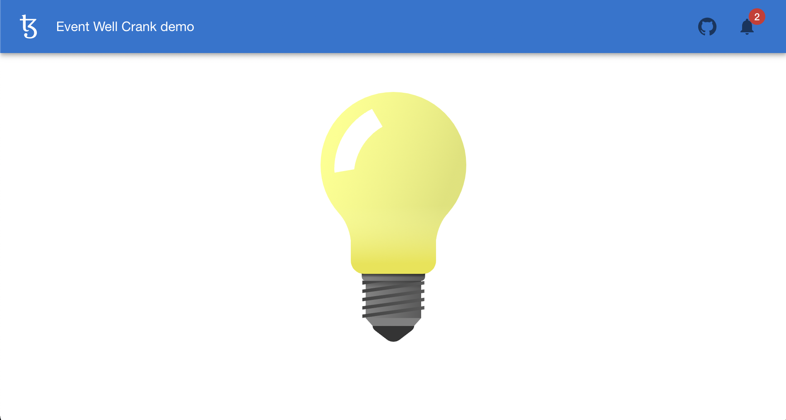
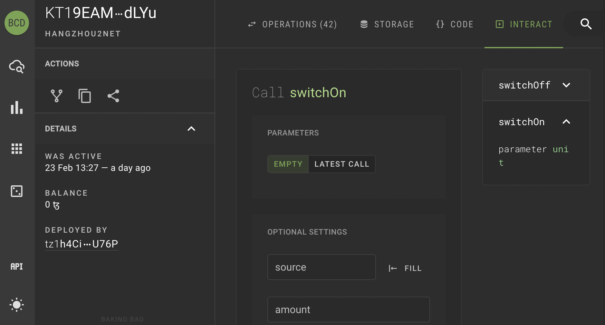

The *Bulb* demo presented here illustrates how to integrate the crank process in a typescript [React](https://reactjs.org/) Dapp.

:::info
The source code of the example is available [here](https://github.com/completium/bulb-event-demo)
:::

The bulb demo is live at this [address](https://completium.github.io/bulb-event-demo/).



## Bulb contract

The bulb is switched on/off by receiving events from the bulb contract. The contract is designed as a simplistic state machine with *On* and *Off* states. Two events `SwitchedOn` and `SwitchedOff` are defined and emitted respectively by `switchOn` and `switchOff` entrypoints:

```archetype
archetype bulb

states = | On | Off

event SwitchedOn {}

event SwitchedOff {}

transition switchOn() {
  from Off to On
  with effect { emit<SwitchedOn>({}) }
}

transition switchOff() {
  from On to Off
  with effect { emit<SwitchedOff>({}) }
}
```
The bulb contract has been deployed on Ithacanet and its address is `KT1PKQ76kR1nZSvu5YN41r7GjYcAqGQSrLxg` . Click [here](https://better-call.dev/ithacanet/KT1PKQ76kR1nZSvu5YN41r7GjYcAqGQSrLxg/operations) to view it on Better Call Dev indexer.

## Switch on/off

Use the [*Interact*](https://better-call.dev/ithacanet/KT1PKQ76kR1nZSvu5YN41r7GjYcAqGQSrLxg/interact) tab in Better Call Dev to switch the bulb on and off.



:::info
You cannot switch on (off) a bulb already on (off). You then get the error `A FAILWITH instruction was reached with InvalidState`.

Hence switch the bulb off (on) first. The event will appear in the event notification anyway.
:::