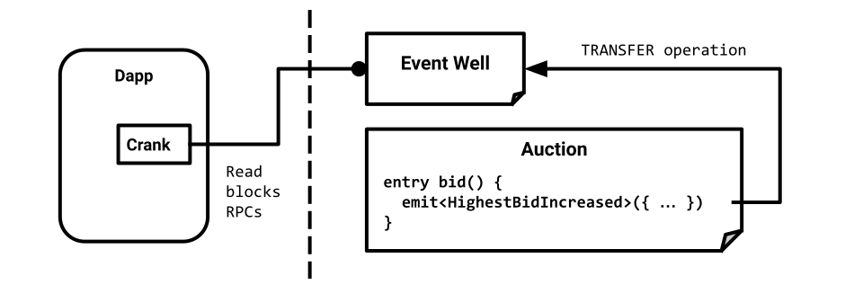

Archetype provides a seamless way to work with contract events.

## Emit

Archetype defines events with the `event` keyword declaration. An event may possess several fields, like a record.

For example the following declares the `HighestBidIncreased` event with two fields `bidder` and `amount`:

```archetype
event HighestBidIncreased {
  bidder : address;
  amount : tez
}
```

Use `emit` instruction to emit an event:

```archetype
entry bid() {
  (* ... *)
  if transferred > highestbid then begin
    highestbid := transferred;
    emit<HighestBidIncreased>({ source; transferred })
  end
}
```

## Receive

The [Crank](https://www.npmjs.com/package/@completium/event-well-crank) TS package receives events from contracts and executes event handler functions.

For example, the `handleHBI` function below is executed when a `HighestBidIncreased` event is emitted by the contract:

```typescript
import { startCrank } from '@completium/event-well-crank'
import { HighestBidIncreased, register_HighestBidIncreased } from './bid-bindings.ts'

const contract = "KT1..." // address of the emitter contract

const handleHBI = (hbi : HighestBidIncreased) => {
  // ...
  console.log(`${hbi.bidder} is now the highest bid bidder.`)
}

// register Handler
register_HighestBidIncreased(contract, handleHBI);

// Start crank
await startCrank();
```

The `HighestBidIncreased` type and `register_HighestBidIncreased` function are bindings code generated by completium CLI:
```bash
$ completium-cli generate bindings-ts bid.arl > bid-bindings.ts
```

## Event Well

The event mecanism relies on a contract called *event well*. The `emit` instruction sends an operation to the event well, and the crank process monitors incoming well operations:



The well contract is deployed on the mainnet and testnets:

| Network | Well address |
| -- | -- |
| mainnet | `KT19ij2bHXkhMALzoTZCG88FWgAHRR21247v` |
| ghostnet | `KT1ReVgfaUqHzWWiNRfPXQxf7TaBLVbxrztw` |
| jakartanet | `KT1HchD9HwAWLffYitWvPiKEKJGvyZYRWNWh` |
| hangzhounet | `KT1Aho6K97CKApDSCxXEzvP14qd1qTHhF4uH` |

Its source code is available [here](https://github.com/completium/event-well-contract) and reproduced below:

```archetype
archetype event_well
with metadata "ipfs://QmeujYaXRZtLPHo6bH17VnEFPmkKo9tLcurfNCA7fXvU7Q"

variable u : unit = Unit

entry %event(arg : bytes) {}
```

## Cost

The cost of event emission depends on the quantity of data emitted.