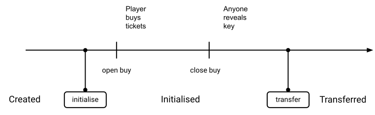

:::warning
A vulnerability in the timelock cryptographic primitive was discovered. The instruction will be deprecated by protocol Lima to prevent origination of new contracts using it. A safer version of timelock will come in a future procotol.
:::

This section presents the Archetype version of a _raffle_ contract, inspired by the version presented for other languages ([Ligo](/ligo/write-contract-ligo/raffle-contract#raffle-smart-contract), [Smartpy](/smartpy/write-contract-smartpy#about-the-raffle-contract)). The difference is that it uses the [timelock](https://tezos.gitlab.io/alpha/timelock.html?highlight=timelock) feature to securize the winning ticket picking process.

A raffle is a gambling game, where players buy tickets; a winning ticket is _randomly_ picked and its owner gets the jackpot prize.

The [Michelson](/michelson) language does **not** provide an instruction to generate a random number. We can't use the current date (value of `now`) as a source of randomness either. Indeed, bakers have some control on this value for the blocks they produce, and could therefore influence the result.

:::info
The source code of the raffle contract is available in this [repository](https://gitlab.com/completium/archetype-raffle).
:::

## Picking the winning ticket

The winning ticket _id_ is obtained as the remainder of the euclidean division of an arbitraly large number, called here the _raffle key_, by the number of ticket buyers, called here _players_. For example, if the raffle key is 2022, and the number of raffle players is 87, then the winning ticket id is 21 (typically the 21st ticket).

The constraint is that this raffle key must not be known by anyone, nor the players or even the admin. Indeed if someone knows in advance the raffle key, it is then possible to influence the outcome of the game by buying tickets until one of them is the winning one (there is only one ticket per address, but someone can have several addresses). As a consequence:
* the _raffle key_ cannot be simply stored in the contract.
* the _raffle key_ cannot be a secret that only the admin knows (for the reason above), and that the admin would pass to the contract when it is time to announce the winner. Indeed, the admin could disappear, and no winner would ever be announced.

For the admin not to be the only one to know the key, each player must possess a part of the key (called here _partial key_), such that the raffle key is the sum of each player's partial key. For the player's partial key not to be known by the other players, it must be _cyphered_ by the player. When it comes to selecting the winning ticket, the user is required to _reveal_ its key for the contract to compute the raffle key.

However, a player could influence the outcome by not revealing the partial key. It is then necessary that the encrypted partial key can be _decrypted_ by anyone at some time. A reward is sent to the account that reveals a key.

The [timelock](https://tezos.gitlab.io/alpha/timelock.html?highlight=timelock) encryption feature of the Michelson `chest` data type provides the required property: a _timelocked_ value is encrypted strongly enough that even the most powerful computer will take more than a certain amount of time to crack it, but weakly enough that given a bit more time, any decent computer will manage to crack it. That is to say that, beyond a certain amount of time, the value may be considered public.

## Raffle storage

The contract is originated with the following parameters:
* `owner` is the address of the contract administrator
* `jackpot` is the prize in tez
* `ticket_price` is the price in tez of a ticket

```archetype
archetype raffle(
  owner        : address,
  jackpot      : tez,
  ticket_price : tez)
```

### State
The contract holds:
* a state with 3 possible values:
  * `Created` is the initial state during which tickets cannot be bought yet
  * `Initialised` is the state when the administrator initialises the raffle
  * `Transferred` is the state when prize has been transferred to the winner
```archetype
states =
| Created initial
| Initialised
| Transferred
```
* the open date beyond which tickets can be bought, initialized to `none`
* the date beyond which tickets cannot be bought, initialized to `none`
```archetype
variable open_buy      : option<date> = none
variable close_buy     : option<date> = none
```

The schema below illustrates the periods defined by these dates, and the contract's states:


### Other
The contract also holds:
* the reveal fee, initialized to `none`:
```archetype
variable reveal_fee : option<rational> = none
```
* the time used to generate the timelocked value of the raffle key (it should be high enough to be compliant with the close date), initialized to `none`:
```archetype
variable chest_time : option<nat> = none
```

* a collection that will contain the addresses of all players and their raffle key:
```archetype
asset player {
  id                 : address;
  locked_raffle_key  : chest;        (* partial key *)
  revealed           : bool = false;
}
```

* the raffle key, updated when a player's partial key is revealed:
```archetype
variable raffle_key  : nat = 0
```

## Entrypoints

### `initialise`

The `initialise` entrypoint is called by the contract admin (called "_owner_") to set the main raffle parameters:
* _open buy_ is the date beyond which players can buy ticket
* _close buy_ is the date beyond which players cannot buy ticket
* _chest time_ is the difficulty to break players' partial raffle key encryption
* _reveal fee_ the pourcentage of ticket price transferred when revealing a player's raffle key

:::info
Currently you may count from a chest time of 500&nbsp;000 per second on a standard computer, to a chest time value of 500&nbsp;000&nbsp;000 per second on dedicated hardware.
:::

It requires that:
* the open and close dates be consistent
* the reveal fee be equal to or less than 1
* the transferred amount of tez be equal to the `jackpot` storage value

It transitions from `Created` state to `Initialised`, and sets the raffle parameters.

```archetype
transition initialise(ob : date, cb : date, t : nat, rf : rational) {
  called by owner
  require {
    r0 : now <= ob < cb         otherwise "INVALID_OPEN_CLOSE_BUY";
    r2 : rf <= 1                otherwise "INVALID_REVEAL_FEE";
    r3 : transferred = jackpot  otherwise "INVALID_AMOUNT"
  }
  from Created to Initialised
  with effect {
    open_buy      := some(ob);
    close_buy     := some(cb);
    chest_time    := some(t);
    reveal_fee    := some(rf)
  }
}
```

### `buy`

The `buy` entrypoint may be called by anyone to buy a ticket. The player must transfer the encrypted value of the partial raffle key, so that the partial key value may be potentially publically known when it comes to declaring the winner ticket.

It requires that:
* the contract be in `Initialised` state
* the transferred amount of tez be equal to the ticket price
* the close date not be reached

It records the caller's address in the `player` collection.

```archetype
entry buy (lrk : chest) {
  state is Initialised
  require {
    r4 : transferred = ticket_price                     otherwise "INVALID_TICKET_PRICE";
    r5 : opt_get(open_buy) < now < opt_get(close_buy)   otherwise "RAFFLE_CLOSED"
  }
  effect { player.add({ id = caller; locked_raffle_key = lrk }) }
}
```
:::info
Note that the `add` method _fails_ with `(Pair "KeyExists" "player")` if the caller is already in the collection.
:::

### `reveal`

The `reveal` entry point may be called by anyone to reveal a player's _partial_ key and contribute to the computation of the raffle key. The caller receives a percentage of the ticket price as a reward.

It requires that:
* the contract be in `Initialised` state
* the date is valid is beyond `close_buy`

```archetype
entry reveal(addr : address, k : chest_key) {
  state is Initialised
  require {
    r6 : opt_get(close_buy) < now   otherwise "RAFFLE_OPEN";
    r7 : not player[addr].revealed  otherwise "PLAYER_ALREADY_REVEALED"
  }
  effect {
    match open_chest(k, player[addr].locked_raffle_key, opt_get(chest_time)) with
    | left (unlocked) ->
      match unpack<nat>(unlocked) with
      | some(partial_key) ->
        raffle_key += partial_key;
        player[addr].revealed := true
      | none -> player.remove(addr)
      end
    | right(open_error) ->
      if open_error then fail("INVALID_CHEST_KEY")
      else player.remove(addr)
    end;
    transfer (opt_get(reveal_fee) * ticket_price) to caller;
  }
}
```
Note that the player `addr` may be removed in 2 situations:
1. the chest key opens the chest but is unable to decypher the content; this is the case if for example the chest was not generated with the correct chest time value
2. the chest is decyphered properly, but it does not contain an integer value

Note at last that in all cases, the caller is rewarded for the chest key when it is valid.

### `transfer`

When all players have been revealed, anyone can call the `transfer` entrypoint to transfer the jackpot to the the winning ticket. It transitions to `Transferred` state:
```archetype
transition %transfer() {
  require {
    r8: player.select(the.revealed).count() = player.count() otherwise "EXISTS_NOT_REVEALED"
  }
  from Initialised to Transferred
  with effect {
    transfer balance to player.nth(raffle_key % player.count());
  }
}
```

