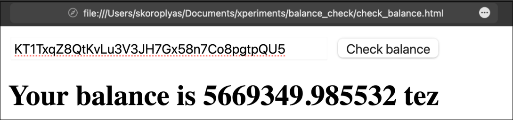
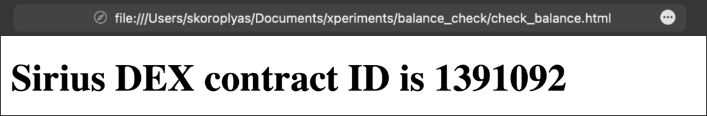
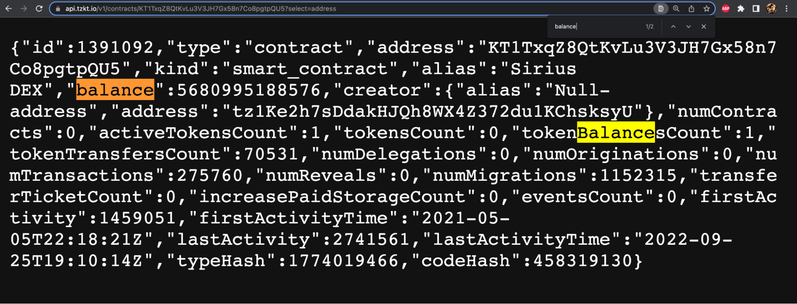

:::info Authors
This content was created by [Tezos Ukraine](https://tezos.org.ua/en) under MIT Licence, and integrated on OpenTezos by Nomadic Labs. The original version can be found [here](https://indexers.tezos.org.ua/) in multiple languages.
:::

# How to Use the TzKT API in a Simple Project on Tezos

In the previous lessons, we talked about how indexers work and showed a couple of examples. Now let's explain how to use them for real-life tasks. First, let's make a simple website for displaying the balance of an address, then a more complex dashboard for displaying liquidity baking data and calculating indicators.

We will use public TzKT and JavaScript with the jQuery library in our examples. Nothing complicated, just one HTML file with a script.

## Displaying Address Balance Using the TzKT Public Indexer

The most popular use case for blockchain explorers and indexers is to check the balance of different tokens for a given address. It is convenient when storing cryptocurrencies in a cold wallet: you do not need to connect it to the network again, thus endangering the funds.

We will make a simple page where users can enter their addresses and check the balance in tez. Then we will add the display of token balances and some other information. To do this, we will use the TzKT API.

First, let's create an empty HTML file in VS Code (you may use another editor, of course) and add the essential elements: doctype, head, title, and body.

We will use AJAX and the jQuery library to request data via the API and process it. Incorporating a library is simple: just provide a link to it in the script element.

Let's get the balance of our address via AJAX. 

First, we added the $(document).ready() command. It ensures the page is loaded before the scripts are processed.

Then we wrote a request to TzKT using AJAX: in "URL,” the request link to get the balance; in "type," the type of the GET request to get information; and in "success," the function that will process the response. 

In the function, we will declare the variable balance, assign the value of the answer (data), and immediately divide it by a million. You must do this because the indexer returns the balance in mutez, millionths of tez.

To use the balance variable in HTML, you need to assign an internal id to this variable. Let's do this with the document.getElementById method.

In the end, we will add a h2 element, in which we will display the balance. To display the variable's value, we use the span element and the id previously assigned to the balance variable.

Let's open the page and check the result.

### Adding a button and field to check specific address balance

AJAX now sends an API request as soon as the page loads. Let's add a button, pressing which will launch the request.

To do this, wrap the h2 in a div element and make it hidden with the style="display:none" parameter.

Let's create a button and add a call to the check function to it, in which we will place the entire request code. At the end of the function, add a change in the display style of the div to a visible block. 

Now we need to add a field for entering the user's address and tweak the check() function to insert it into the API request.

To do this, we did the following: 

1. Added the address parameter to the check() function.
2. Changed the value of the "URL" field. When run, the script will make a valid API request using the received address.
3. Added a field for entering an address with an id.
4. Changed the button's code so that pressing it would launch the check() function and pass the entered address to it.

Now you can enter any address and, by pressing the button, get its balance in tez.

Experiment: take [the code of this page](https://gist.github.com/pavelTU/e48c71d09ff5dcfb5343699d485760d9), paste it into an empty HTML file and open it in a browser. 

This is a simple example: the TzKT API returns the user's balance as JSON with only one number. The answer does not even need to be further processed: everything works as it is.

When solving real-life cases, however, you will have to work with JSON arrays and carefully read API responses to select the necessary data. The next chapter explores this matter further.

## Displaying liquidity baking statistics 

That contract with 5 million tez is [Sirius DEX](https://siriustoken.io/), better known as liquidity baking. Here is its [contract on TzKT explorer](https://tzkt.io/KT1TxqZ8QtKvLu3V3JH7Gx58n7Co8pgtpQU5/operations/). 

Liquidity Baking is Tezos' unique DeFi protocol. Users contribute tez and tzBTC to it to provide liquidity for the exchange, and the Tezos network itself adds another 2.5 tez to the pool in each block. Thus, the balances of liquidity providers in this pool are constantly growing. 

Since all liquidity backing data is stored on-chain, we can get it using API requests to public indexers and then calculate the annual yield and other helpful information.

First, we are interested in the balance of Sirius DEX, particularly how much the contract has tez and tzBTC. We will receive these numbers from the indexer. 

We need to calculate how much tez the protocol subsidies per year. Here you can calculate the number of seconds in a year, divide this value by the average block creation time—30 seconds—and multiply by one subsidy.

It remains to find out the current value of assets in Sirius DEX and the value of subsidized tez for the year and divide these values​​​​, which would be the annual return or APY.

We are starting a new page. First, let's try to get something simple, like the Sirius DEX internal contract id in the TzKT database.

Let's copy the code of the first example and remove the button and the field for entering the address from it. Let's replace the API request URL with https://api.tzkt.io/v1/contracts/KT1TxqZ8QtKvLu3V3JH7Gx58n7Co8pgtpQU5 to get information about the contract from the indexer.

Now it’s time to change the function for data processing. To get specific values, you need to specify the key. In our case, the key is id, and requesting a value using this key will look like var contractId = data.id.

Ultimately, we assign an internal ID, "contractId", to the corresponding HTML element and display it on the page in the h2 element.

  
We made sure everything worked, so now we can get the data we need: tez and tzBTC balances.

First, we should examine TzKT's response to our API request. It has a balance field in tez, so we can get it without changing the request.

Now, assign the value from the received array to the balanceInTez variable by the balance key.

Now we need to get the amount of tzBTC. Let's examine the storage of the liquidity backing contract on TzKT: it shows the amount of tzBTC under the tokenPool key. You can access it by requesting the contents of the storage. 

Now we should create another AJAX request. In the URL, we specify the API request for the storage content and assign the value of the corresponding entry, tokenPool, to the balanceInTZBTC variable.

On the page, we will display the balance in tzBTC.

Now it’s time to calculate the subsidies for the year. The average year has 31,556,926 seconds. We divide this value by the block creation time and multiply it by the subsidy amount.

We can get the block creation time and subsidy amount from TzKT at https://api.tzkt.io/v1/protocols/current. They will be referred to as timeBetweenBlocks and lbSubsidy in the response.

So, we need to get data from two API requests in one function and use it for calculations. But as the variables are local and can't be used in other functions, we need to use nested functions:

1. Get the number of tez.
2. Write them to a variable.
3. Call the function to calculate annual percentage yield(APY) and pass it the number of tez as an argument.
4. In the APY function, get the necessary data and make calculations.
5. Write the results to variables and assign an ID.
6. Return to the first AJAX function and add a variable ID assignment at the end with the amount of tez.

First, let's add a call to the checkTimeAndSubsidy function to the function to get the Sirius DEX balance in tez.

Below, we will declare the same function and add an AJAX call to request protocol data from TzKT.

 
We should assign three new variables: 

- secondsInYear: the average number of seconds in a year, in fact, a constant.
- timeBetweenBlocks: block creation time.
- lbSubsidy: Sirius DEX pool subsidy in mutez. We divide it by a million to get the value in tez instead of mutez.

We now have all the data to calculate the annual subsidy and APY liquidity backing.

Now we can calculate the necessary values by creating the variables yearlySubsidy and APY. 

To calculate APY, it is not necessary to obtain asset prices. At any given moment, the value of all tez in the pool equals the value of all tzBTC. To simplify APY calculation, we assume that the user adds to the liquidity pool not tez and tzBTC, but twice as much tez. His APY would be a share of the yearly subsidy divided by the liquidity he provided. Roughly speaking, APY = yearlySubsidy / (balanceInTez × 2) × 100%.

It’s now possible to give the annual amount of subsidies and APY internal ID values, and add them to the page. 

[Example code on Github](https://gist.github.com/pavelTU/5a56c940952f01e838a3ca98215eab15).

## Homework

Try to calculate the value of tez in the Sirius DEX liquidity pool. 

1. Find a smart contract of any liquidity pool with a stablecoin against tez: tez/USDt, tez/kUSD, or tez/uUSD.
2. Get the number of tokens in the pool using an API request.
3. Divide the number of tez by the number of stablecoins to find the price of tez.
4. Multiply the number of tez in the Sirius DEX pool by the resulting exchange rate.
5. Add the result to the appropriate line.

### Answers

First, check [the tez/kUSD contract](https://tzkt.io/KT1K4EwTpbvYN9agJdjpyJm4ZZdhpUNKB3F6/storage/) on an exchange on TzKT. Then examine the storage and find the necessary keys: tez_pool is the amount of tez, and token_pool stands for the amount of kUSD. 

 
And we need to remember that the token's amount in the contract's storage is a natural number. And to display the actual amount of tokens, we need to divide that nat by the corresponding number of decimals written in the contract's metadata. For example, kUSD has 18 zeros after the decimal point, and when we get raw token amount data, we need to divide it by 10^18 to get the actual amount.

Since we need to know the number of tez in the pool to calculate the cost of all tez, we need to use nested functions. After receiving the balanceInTez variable, we call the checkValueOfTez function with the balanceInTez argument. In this function, we use AJAX to get data from the tez/kUSD pool (remember to divide the number of tokens depending on the required number of zeros!)

Next, we calculate the price of one tez and the cost of all tez in the pool. At the end, we will add the readableValue variable: using the toLocaleString () method, we will add comma separators to the number.

As a result, we get the cost of all tez in the Sirius DEX pool, which we get completely from on-chain data.

