:::info Authors
This content was created by [Tezos Ukraine](https://tezos.org.ua/en) under MIT Licence, and integrated on OpenTezos by Nomadic Labs. The original version can be found [here](https://indexers.tezos.org.ua/) in multiple languages.
:::

# How to Use DipDup and Dappetizer on Tezos

[DipDup](https://dipdup.io/) and [Dappetizer](https://dappetizer.dev/) are frameworks for creating custom selective indexers for working with complex contracts and decentralized applications, connecting analytics, getting data from IPFS, and much more. The main difference is that when using DipDup, you will be writing your indexing code in Python, and when using Dappetizer, you will be writing TypeScript or JavaScript.

Selective indexers are software fetching and storing the requested on-chain data in a local database. They are much more challenging than public indexers because the developer must write the indexing logic by themselves: which data to fetch, how to process it, how to store it, etc.

But selective indexers have two advantages. First, they use hardly any resources because they only store what you tell them. Second, they allow you to work with databases more flexibly. For instance, write down token amounts with correct decimal points. We shall show how to use it through a real-life example below.

## What it’s all about

As DipDup and Dappetizer are harder to set up, we will index a simple contract and perform a simple query. We chose tzBTC—wrapped Bitcoin on Tezos as a FA1.2 token.

We will install each indexer and create an empty project. Then we will set it up to index what we need, for example, tzBTC holders' balances from storage or tzBTC transactions from the “transfer” entry point. And in the end, we will process the data and display it on a simple webpage.

## DipDup

### Installing and configuring DipDup

DipDup only works on Unix systems: macOS and Linux distributions. If you have Windows, use WSL or Linux in dual boot.

First, you need to install the [Python environment](https://www.python.org/downloads/) in any convenient way. Then open a terminal and install DipDup using the command:

```
python -c "$(curl -sSL https://dipdup.io/install.py)"
```

If you have macOS 12 or higher, replace python with python3.

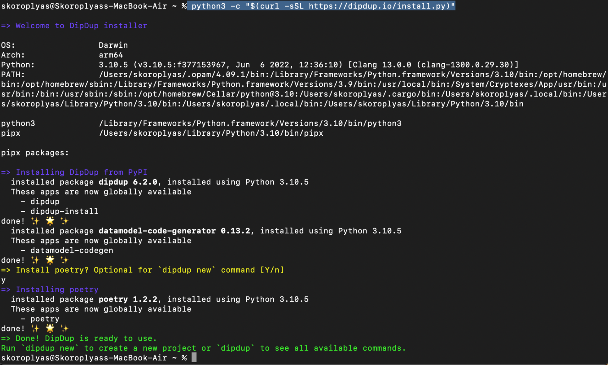

### Creating a project in DipDup

Now let's start configuring DipDup. First, let's create a folder in which we will create a project and go to it in the terminal. Then run the dipdup new command to create a new project.

For example, let's index the contract of the tzBTC token since it is simple, and the creation of the indexer will not take much time. To do this, when choosing a configuration template, we will take the tzBTC option.


Next, you need to fill in information about the project: name, version, owner, select a database, and all that. In the end, DipDup will independently generate the structure and necessary files for the project.


### Indexer configuration 

The dipdup.yaml file will appear in the project folder. Its structure is as follows:

- Spec and package are data about DipDup itself.
- Database: settings of the database. By default, it’s SQLite, but you can connect PostgreSQL
- Contracts: the name of the contract, its address, and typename for further use in the code.
- Datasources: data sources for indexing. By default, it’s TzKT, but you can add APIs from other websites for data, crypto exchanges for price quotes, or IPFS for NFTs;
- Indexes: a list of indexes that DipDup will create and use. In our case, we will collect information about tzBTC holders.
- Templates: schemes of operations to be indexed. Inside there are handlers, which are instructions on how tzBTC should process entry points calls: which data to fetch and where to store it. On a side note, `<datasource>` and `<contract>` refer to "contract" and "datasource" keys inside the "indexes" dictionary. 

The most important thing here is templates. In these modules, we specify the entry points that need to be indexed: for on_transfer data, we need to check operations with the transfer entry point, and for on_mint it’s operations with mint. This is important because there will be no direct references to entry points or contracts in the handler code, and this feature can raise questions like “Where does the data come from?”.

In this example, we will be checking tzBTC holders' balances. They change when the transfer and mint entry points are called, so we specify two handlers by entry point names — on_mint and on_transfer.

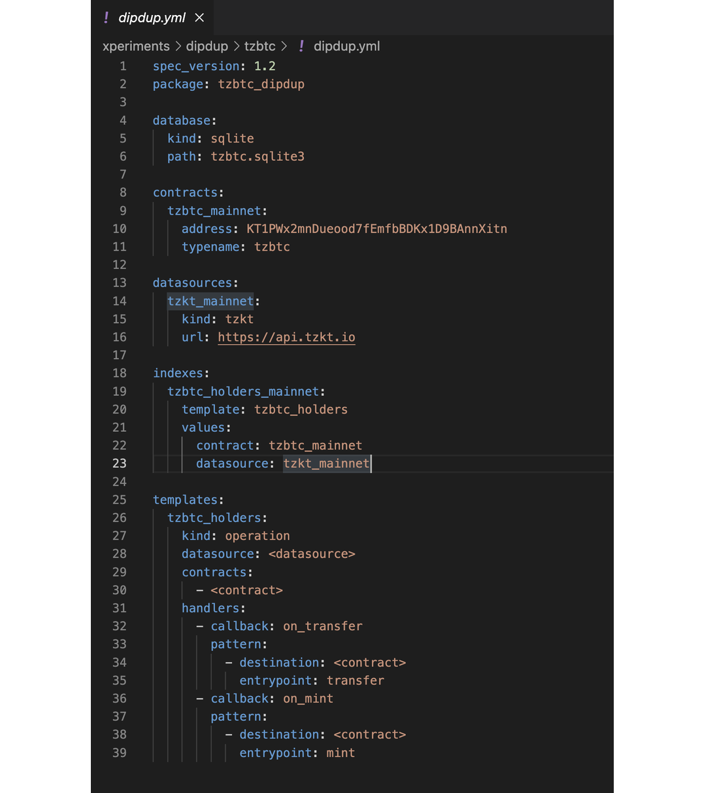


Check [DipDup Config Documentation](https://docs.dipdup.io/getting-started/creating-config) to learn more about all available options.

### Models and data handlers

Next, you need to create indexes, schemas, models, and handlers. To do this, go to the tzbtc folder in the terminal and execute the command:

```
dipdup init
```


DipDup will create several files — models and handlers — that describe working with the database and indexing on-chain data, and we need to modify them to set up the indexing process.

The first file is models.py. It stores data models, roughly speaking, descriptions of tables and columns in the database. In the Holder model, we will declare several types of columns:

- an address with a length of 36 characters.
- balance and turnover in numerical format while specifying eight decimal places (decimal_places).
- the number of transactions.
- last activity time.

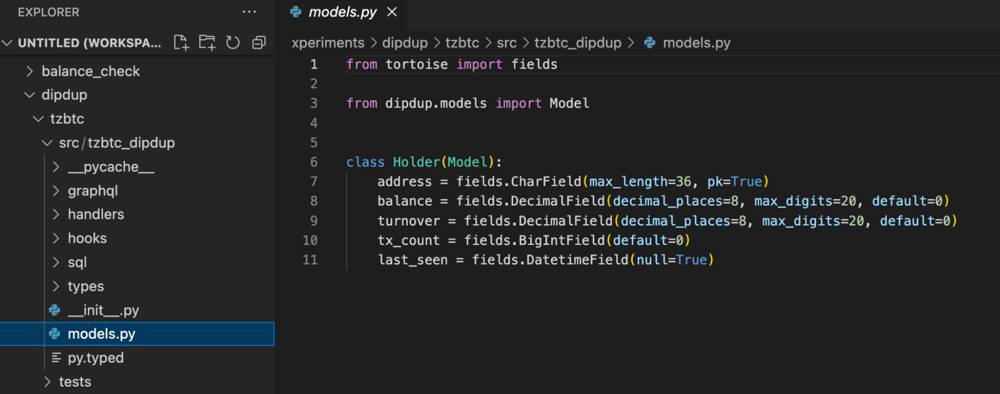

The handlers are instructions on how the DipDup will process on-chain data when a tzBTC contract entry point call occurs. The handlers folder stores handlers for storage and calls to the tzBTC contract entry points.  

The first helper is on_balance_update. It will be called after each operation that will change the balances of the tzBTC holders, minting and transferring tokens in our case, and will update corresponding balances in our database.

In it, we declared the on_balance_update function, to which we will pass three parameters:

- address: the address of the holder.
- balance_update: the amount of the holder's balance change.
- timestamp: operation time.

The function will first check if there is such a holder address in the database and then either create a new row and write the new holder or update the old record.  


The second handler, on_mint, will be called when the mint entry point of the tzBTC contract is called. It will read the mint entry point call parameters and then call the on_balance_update function to update the records in the database.


IMPORTANT: in the “amount” variable, we save the "mint.parameter.value" value, which we take from the mint entry point’s call parameters.

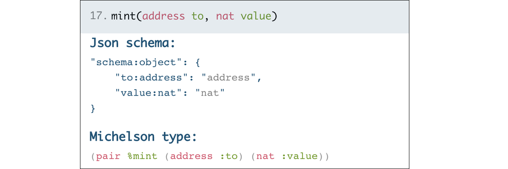

Similarly, we take the address of the recipient of fresh tokens: "address = mint.parameter.to";

The third handler – on_transfer – deals with transactions, that is, operations with the transfer entry point. It is more complex. First, you need to compare the sender and recipient addresses. If they match, the holders' balances have not changed, and the database should not be updated. Secondly, the transfer of tokens means a change in the balances of the sender and recipient. Therefore, the on_balance_update function must be called twice for each address while subtracting the transaction amount from the sender's balance and adding it to the recipient's balance.


As in the on_mint handler, we get on-chain data from the call parameters of the transfer entry point: sender address from_, recipient address to, and transfer amount value.

### Running the indexer
In the terminal, run the following command:

```
dipdup run
```

DipDup will start downloading the required data from the TzKT public API. Upon completion, it will begin processing new blocks.


### Connecting a database to a project

Let's make a project similar to the one in the previous lesson. Back then, we displayed NFT collateralized loan offers and generated links to the NFTs. 

Let's create a tzbtc_dipdup.php file in the tzbtc_dipupd folder and then connect it to the database first. By default, DipDup suggests you use [SQLite](https://www.sqlite.org/index.html). Connecting to it is slightly different from Postgres: you need to specify the full path to the database file, but you do not need to set the username, password, and port.

In the `$db_dir` variable, we specify the path to the database on the hard disk, and in `$db_handle` - the `new PDO($db_dir)` database connection method. 

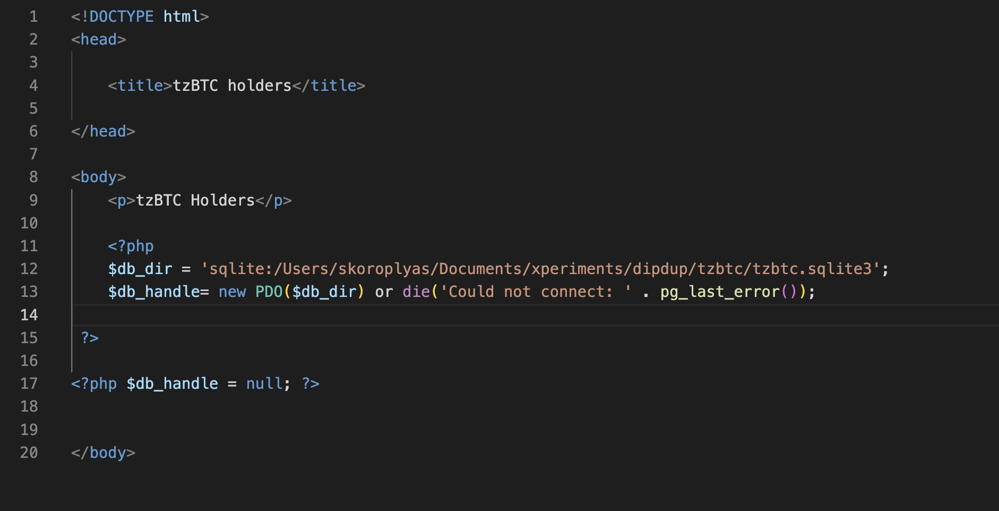

Then we will write a SQL query in which we select all addresses and balances of tzBTC holders with a non-zero balance and sorting in ascending order. To know exactly what tables you have in the database and how to reach them in SQL query, you can install [SQLite Browser](https://sqlitebrowser.org/) with GUI and check what's inside.


We use the iteration function forEach to sequentially get user addresses and balances from $row and then show them on the page.


Then we close the connection to the database with the `$db_handle = null` command.

In the terminal, go to the folder with `tzbtc_dipdup.php` and start the PHP server with the command:

```
php -S localhost:8000 
```


In the browser, open the page at http://localhost:8000/tzbtc_dipdup.php


Since we already divided the balance by 10^8 when writing transaction handlers and minting tzBTC, they are displayed in the database with the correct number of decimal places.

## Installing and configuring Dappetizer

With Dappetizer, we will index the same tzBTC contract, but this time we will display the most recent tzBTC transfers. To do this, we will index its "transfer" entry point and write to the database data about each transaction's sender, receiver, and transfer amount.   

First, install [Node.js](https://nodejs.org/) to work with the npm package manager. Then we will create a folder for the project and install Dappetizer there. The easiest way to do everything is from the terminal:

```
	mkdir dappetizer
	cd dappetizer
	npm install @tezos-dappetizer/cli
```

Check if the installation was successful with the version check command:

```
	npx dappetizer --version
```


Now initialize a new project with the tzBTC name and contract address:

```
npx dappetizer init - -contractName=tzBTC KT1PWx2mnDueood7fEmfbBDKx1D9BAnnXitn
```

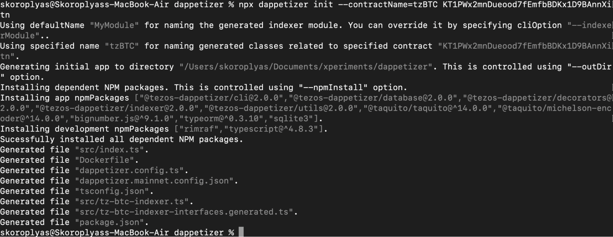

The Dappetizer will create the necessary files in the project folder. Among them are four main ones you will need to work with: 

- dappetizer.config.ts: parameters to connect to a database.
- index.ts: main indexing module, we will import our indexer config there.
- tz-btc-indexer.ts: indexing logic of tzBTC contract. Dappetizer generates a list with templates for all entry points of the specified contract, and we need to delete unused ones and write our handler logic in the indexTransfer method.
- entities.ts: it doesn't exist yet, as we need to create it ourselves and write in it names and types of tables and columns that will store our data.

dappetizer.config.ts contains parameters for connecting to the database. Dappetizer uses SQLite by default, but PostgreSQL is fine, too.

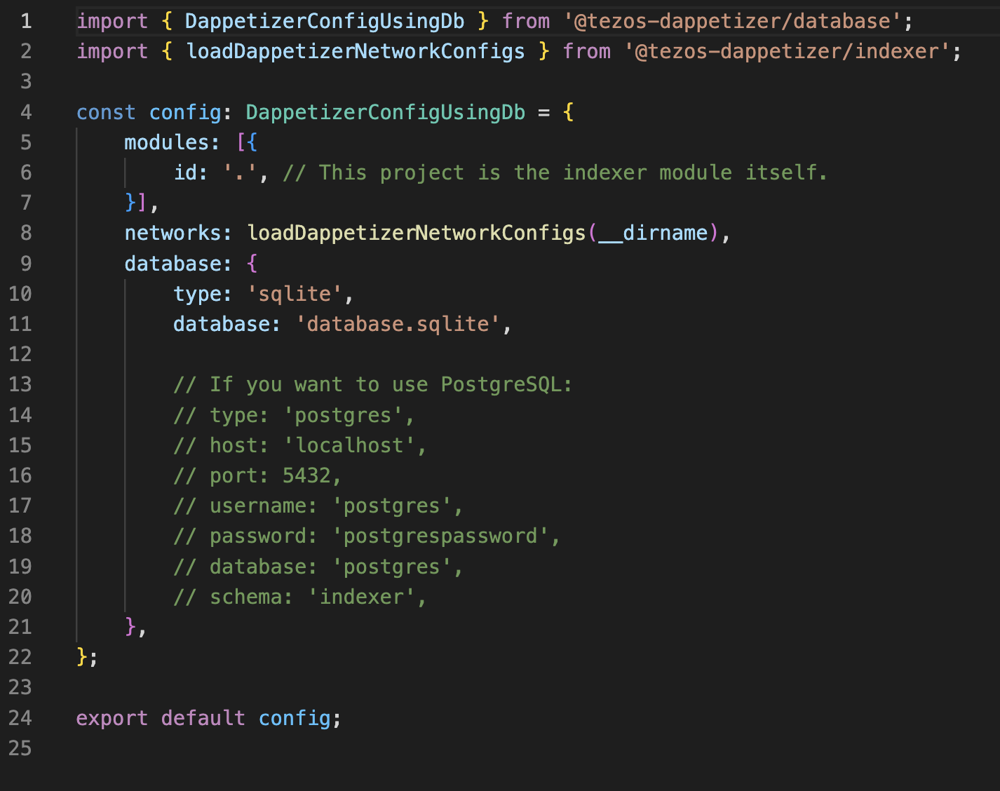

You need to create entities.ts and specify the class (table) and database columns. We will record transactions with the tzBTC token, creating a transaction class with columns id (internal id in the database), sender, receiver, and amount.

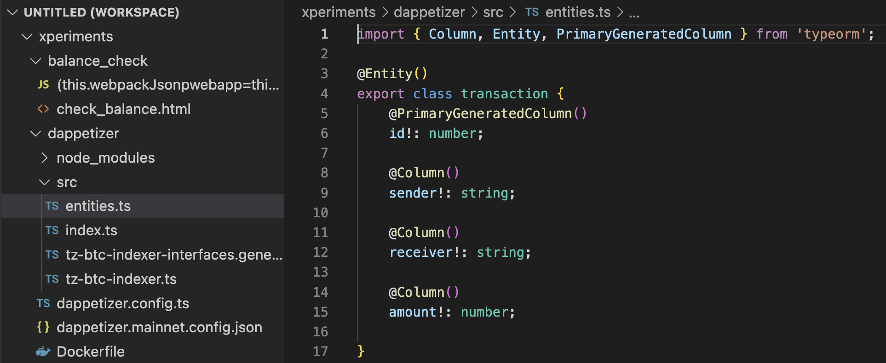

The src folder contains tz-btc-indexer.ts, in which Dappetizer will generate functions for indexing all entry points of the specified contract. In the code of the corresponding entry point, you need to describe the indexing logic: which entry point call parameter to write to the database.


In tzBTC, the entry point for sending tokens is called transfer. Accordingly, we will find the code for this entry point and add logic to it:

- at the beginning, we import the Transaction class to use it to write data;
- in the indexTransfer function, we describe the indexing logic: create a tzBTCtransfer constant, in which we write the sender and recipient addresses, as well as the transaction volume;
- at the end of the indexTransfer function, we will call the insert function to write the contents of tzBTCtransfer to the database.

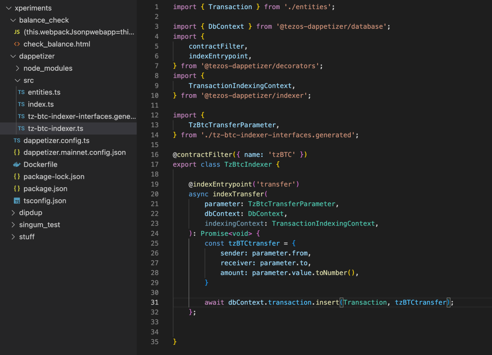

Now we need to add the Transaction model to the index.ts module. To do this, we import Transaction from the entities.ts file and add Transaction to the dbEntities array.


### Starting the indexer

In the terminal, go to the project folder and execute the command to build the project:

```
npm run build
```

Then start indexing:

```
npx dappetizer start
```

Dappetizer will begin indexing the blocks and writing data to the database.


### Connecting the database to the project

Let's make a page similar to the DipDup project. Let's create a tzbtc_dappetizer.php file and describe the page structure in it. Since we are using the same SQLite database, we can directly copy the code from the DipDup project. You only need to change the path to the database, the SQL query, and the function for displaying data.

In our example, we use SQL query to select sender, receiver and amount fields from the "transaction" table and then sort them by internal id, so the most recent ones (with a higher id value) will be displayed first.

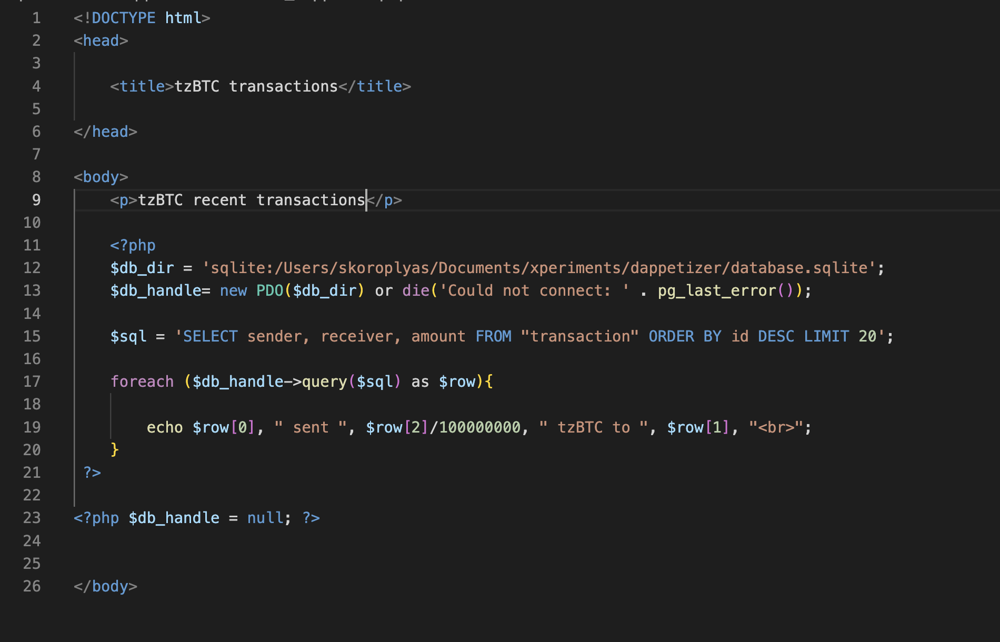

Let's start the PHP server in the Dappetizer folder and open the page in the browser:


## Homework

Calculate the total volume of tzBTC transactions for the indexed period. Hint: it's better to work with ready-made data rather than with what you add.

### Answers

Working with indexers is closely related to databases and SQL queries. To develop an application, you must learn SQL!

In the DipDup example, we considered the volume (turnover) by adding the volume of the indexed transaction to the previous turnover value. Still, using the SUM() SQL command is easier to avoid bloating the database.

Open the tzbtc_dappetizer file and create a `$sql_sum` SQL query with `SELECT SUM(amount) FROM "transaction"`:


Then add a `query($sql_sum)` function to query the database and output the value to the page.

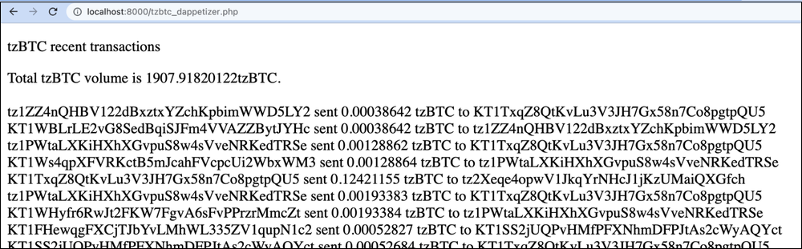
