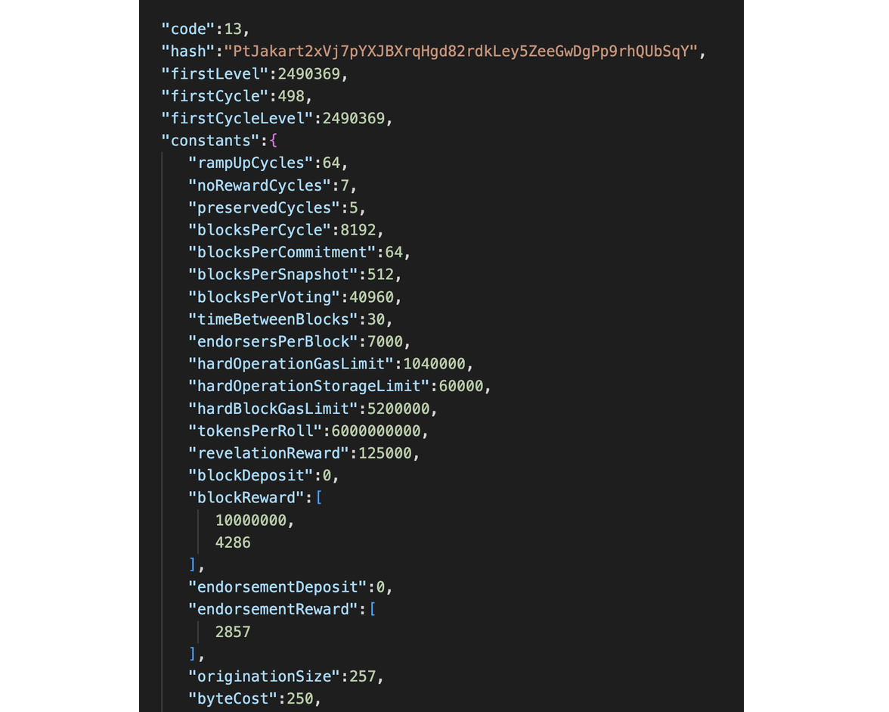
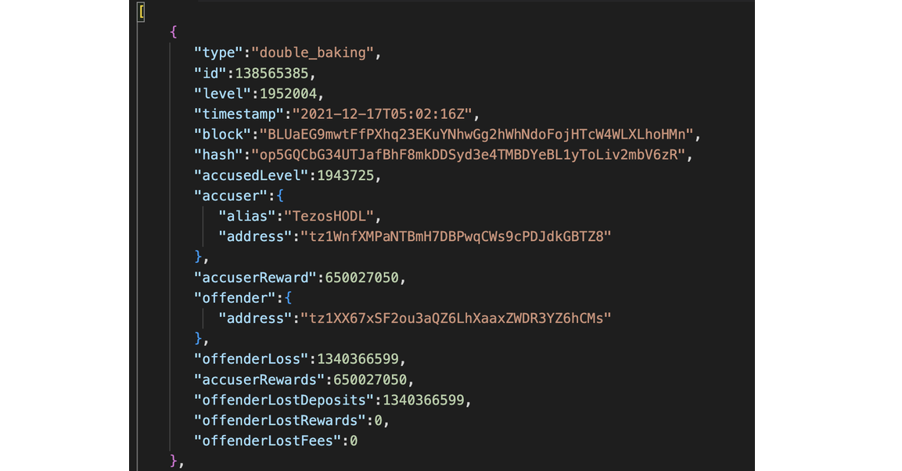
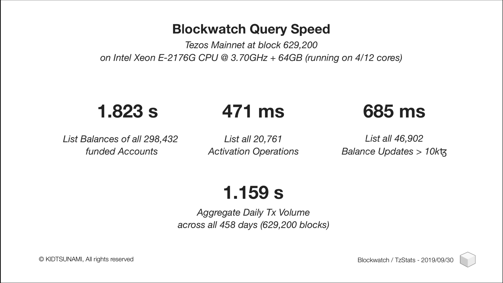
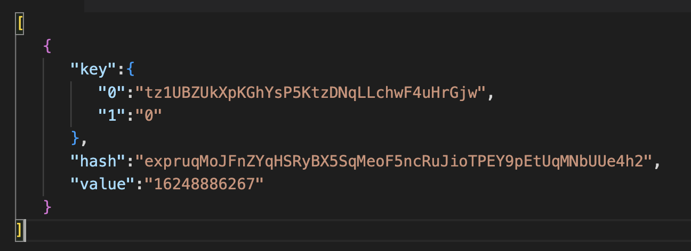
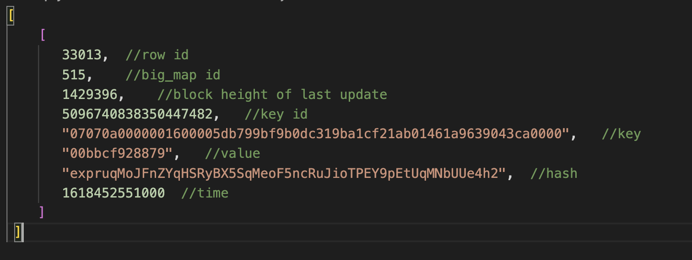
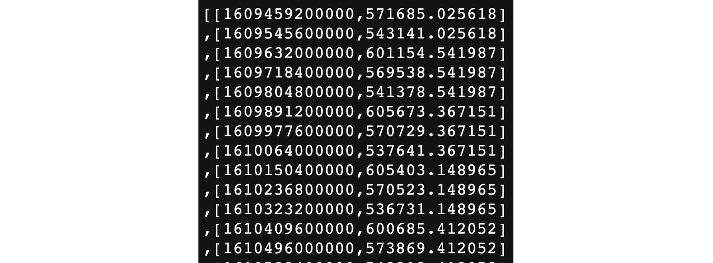

:::info Authors
This content was created by [Tezos Ukraine](https://tezos.org.ua/en) under MIT Licence, and integrated on OpenTezos by Nomadic Labs. The original version can be found [here](https://indexers.tezos.org.ua/) in multiple languages.
:::

Tezos ecosystem teams have developed about a dozen blockchain indexers. Conventionally, they can be placed into two categories:

- Full: they index the entire blockchain. Blockchain explorers and dApps that might benefit from storing all valuable data in-house use them.
- Selective: indexes only the specified addresses and smart contracts. Blockchain applications use them.

We contacted MadFish Solutions, Kukai Wallet, Plenty DeFi, youves, and other Tezos developers to find out which indexers they use. They often use TzIndex, TzKT and Que Pasa, and the DipDup framework to create their own selective indexers. 

In subsequent lessons, we will look closely at using indexers in a project and working with public TzKT API and the most popular selective indexers. It includes the simple Que Pasa, a more advanced DipDup, and the new exciting indexer Dappetizer.

## Which indexer does what?

With TzKT and TzStats (TzIndex, if self-hosted), you can get any on-chain data from Tezos: from what Octez version a particular baker uses to big_map content of a specific smart contract. Still, they have some differences:

- TzKT API supports different filters and sorting responses by values of a selected column. For example, you can sort specific token holders by their balances.
- TzStats API doesn't support advanced sorting, and you have to do this on the client side. But TzStats has its unique feature: Time Series API, which allows developers to get historical data about balances, network stats, tez supply, and other things aggregated by selected time. It is helpful for analytics.

With Que Pasa and DipDup, you only can get data about smart contracts, but with Dappetizer, you may also get raw data from blocks.

## Terminology and some technical details

In the previous lesson we explained databases and indexes using books and talked about indexers in general. Now we will use the generally accepted terminology for describing databases and indexing:

- Field: a cell in the database. Example: transaction amount, sender address, block level.
- Row: a collection of cells in the database aligned horizontally. For example, a row about one particular transaction may have cells with the transaction's hash, sender and recipient addresses, amount, and other transaction data.
- Column: a collection of cells aligned vertically with data of the same type. For example, the “transaction amount” column will only contain cells with transaction amounts.
- Database schema or data model: a description of the structure of the tables and relations between data in them. 

The task of a blockchain indexer is not just to enter data from blocks into a table and create indexes but to create such a scheme to optimize database performance, the volume of indexes, and the number of possible queries. For example, it is unlikely that someone will look for an operation by the amount of transaction fees, so public indexers do not use such an index.

## Public and self-hosted indexers

In terms of the hosting place, indexers can be public and self-hosted. The public indexer is hosted by a third party and provides universal access, while the developer runs the self-hosted indexer on their own machine.

Public APIs can be used for experimentation and testing, but it is better to clone the indexer and run it on your machine to run the application (self-hosted). 

Firstly, when using a self-hosted indexer, the developer can get data faster and not wait in the queue if the public API is overloaded. TzStats and TzKT both warn in their API agreement that they may restrict applications that send requests too frequently.

Secondly, the self-hosted indexer can be modified to suit the project's tasks. The selective indexers, Que Pasa, DipDup, and Dappetizer, will store and index only the data that the developer specifies. The work of the full indexers TzKT and TzIndex can be configured through a database management system like PostgreSQL.

Thirdly, developers of public API blockchain explorers update them and may change the request or response schemes. When using public indexers, you must keep track of updates and adapt to them.

Also, some people might not trust dApp developers because of the risk that said dApp tampers with data in some way. In this case, the user might run their indexer and verify displayed data or request the required data from a public API indexer.

## The TzKT Indexer

The [TzKT indexer](https://github.com/baking-bad/tzkt) was developed by the Baking Bad team. [TzKT.io](http://TzKT.io) uses it.

TzKT works as described below: 

1. TzKT checks the last block in its PostgreSQL database and checks it against the last block in Tezos.
2. If the last block in Tezos is not yet in the database, TzKT checks its validity.
3. If the block is valid, the indexer recognizes the data in the block according to predetermined data models and then adds them to the database. Each type of on-chain data is handled by separate instructions and added to the database in separate operations.  If the blockchain reorganizes, the indexer automatically rolls back the affected rows without messing up the database structure. 
4. PostgreSQL accepts commits and updates shared database indexes. 
5. The TzKT API module executes database queries.

In addition to the usual indexing of all information from the block, TzKT has several additional features:

- Assigning identifiers to tokens, which simplifies their search.
- Real-time updates — TzKT supports the WebSocket API and can receive information about new transactions, contract calls and other operations in the Tezos network in real time.
- Automatic validation of received blocks against a “standard” to be sure that the indexer handles received data correctly and there are no unexpected values;
- The ability to download a database snapshot and use it to quickly launch an indexer instead of indexing the blockchain from scratch.
- Indexing tokens and off-chain metadata from IPFS. TzKT recognizes token smart contracts by big_map with the ledger structure described in TZIP-12. 

**Licensing:** Baking Bad allows you to use the public API or self-host TzKT for free in projects, but with the addition of the "Powered by TzKT" disclaimer.

To optimize API performance, developers use horizontal scaling. They replicate the database so that queries from different sources get data from copies of the same database.

You need a machine with 4 GB of RAM or more to run the indexer. The more RAM, the more space can be allocated for data caching to speed up data retrieval. Like indexes, caching can be configured: disable altogether, reduce, or increase their size for a particular data type.

A database snapshot takes up 60 GB, and together with all the indexes, TzKT can use 300-400 GB. So it's best to run TzKT on a machine with a 500 GB or 1 TB hard drive.

### What data you can get

- Head: indexer status: current network, last indexed block, last timestamp.
- Protocol: information about all versions of the Tezos protocol: first and last block levels, block creation time, gas limit, endorsement slots, etc.
- Voting: proposals, addresses of voted bakers, and voting periods.
- Tezos cycles: start and end levels, total staking, and total delegators.
- Delegates: information on a specific delegate like their balance, activation level, number of delegators.
- Rewards for baking and delegation per cycle, software used by nodes.
- Accounts: balances and metadata of addresses, date of last activity, delegation and other information.
- Bigmap: information about bigmap, keys, values, key updates and historical values;
- Blocks: the full content of blocks with different sorting options, for example, by the volume of transaction fees.
- Smart contracts: code, description, state and storage scheme, bigmaps of the contract.
- Operations: transactions, delegation, account activations, as well as operations with rollups, double baking attempts, making offers, and others.
- Tezos quotes for fiat currencies and cryptocurrencies from CoinGecko.
- Global constants.
- Network statistics for the specified period.

### Usage examples

[The largest kUSD transaction](https://api.tzkt.io/v1/tokens/transfers?token.contract=KT1K9gCRgaLRFKTErYt1wVxA3Frb9FjasjTV&limit=1&sort.desc=amount) is $1.17 million! 

The query is as follows: [https://api.tzkt.io/v1/tokens/transfers?token.contract=KT1K9gCRgaLRFKTErYt1wVxA3Frb9FjasjTV&limit=1&sort.desc=amount](https://api.tzkt.io/v1/tokens/transfers?token.contract=KT1K9gCRgaLRFKTErYt1wVxA3Frb9FjasjTV&limit=1&sort.desc=amount)

First, we query the /tokens/transfers/ table. Then we apply filters: token.contract with kUSD contract address, limit=1 to shorten the result to one row, and sort.desc=amount to get the answer with the biggest “amount” value.

[Data about all Tezos protocols](https://api.tzkt.io/v1/protocols/): first protocol block, block endorsement slots, byte cost, and other parameters.

This is a simple query to /protocols/ table — [https://api.tzkt.io/v1/protocols/](https://api.tzkt.io/v1/protocols/)

[Last attempts at double baking.](https://api.tzkt.io/v1/operations/double_baking?limit=5&sort.desc=level)

Slightly complex query — [https://api.tzkt.io/v1/operations/double_baking?limit=5&sort.desc=level](https://api.tzkt.io/v1/operations/double_baking?limit=5&sort.desc=level)

We query the /operations/double_baking/ table and apply limit and sort filters to get the five latest operations.

## The TzIndex Indexer

[TzIndex](https://github.com/blockwatch-cc/tzindex) (also known as Blockwatch) Tezos Indexer was developed by the Blockwatch Data analytics company and used in the [TzStats explorer](https://tzstats.com/).

The main feature of TzIndex is a custom column database that stores information in columns instead of rows. According to the developers, this solution can better handle complex analytical queries and data acquisition. 

In the first lesson, we mentioned that the performance of modern databases is not limited by the machine's computing power but by the speed of reading from the disk. Now let's explain this in more detail.

Regular databases like PostgreSQL store field names in columns and records in rows.

On a hard disk, this table would look like this:

[Book1, The Call of Cthulhu, Lovecraft, 1928], [Book3, The Lord of the Rings, Tolkien, 1954], [The Adventures of Tom Sawyer, Mark Twain, 1876]

Databases are forced to read the entire row, even if only one field is to be retrieved from the whole row. This is because the data on the disk is stored in clusters, or in square brackets, in our example. To read the desired entry, the computer must boot the entire cluster. If the required fields are stored in different clusters, you will have to load these clusters fully.

We want to retrieve the publication dates of all books from the database to determine the most productive year. The search will look like this: the DBMS will take the first row, read the records in the row sequentially, find the date, then go to the second row, read the records sequentially, and so on. 

Column bases take into account the peculiarities of physical data storage, and solve the problem by rotating tables by 90°: they store field names in rows, and data in columns.

On a hard drive, this table looks like this:

[Book Name, The Call of Cthulhu, The Lord of the Rings, The Adventures of Tom Sawyer], [Book Author, Lovecraft, Tolkien, Mark Twain], [Publication Year, 1928, 1954, 1876].

If we query the publication dates of the books, then the column database only reads one row and returns the required dates.

As a result, the column database will perform complex queries 2-10 times faster than a regular row database. The developers of TzIndex in the blog give the exact speed of different query execution by their custom-made columnar database. 

 

But there's a nuance: TzIndex can sort results only by row_id value, so developers have to do sorting on their side. 

Developers can run TzIndex on their machine or use the indexes via the TzStats API. For TzIndex to work, in addition to a fast hard drive, you need at least 8 GB of RAM and a dual-core processor. However, the more memory and cores, the faster the indexer will work.

TzIndex can work in three modes:

- Light—indexes all on-chain operations, except for those related to baking: endorsements, nonce expansion, propositions, voting, and others. Suitable for the backend of most decentralized applications. The database is 32 GB at the time of writing;
- Full—indexes all transactions, including baking. Suitable for all blockchain applications, especially those that work with backing data. The database is 38-40 GB;
- Validate—when indexing each block, it checks the updated balances of users and the states of smart contracts with the data of the archive node before adding them to the database. Also, at the end of the Tezos cycle, the indexer reconciles all balances in the database. The mode is needed to make sure that the data is correct.

**Licensing:** Light mode and TzStats API are free for non-commercial projects. You need to buy a subscription to use them for profit or to self-host TzIndex in Full- and Validate-modes.

TzIndex supports several endpoints of API requests:

Explorer—detailed information about the object with descriptions. For example, when requesting the values ​​of a particular big_map, TzIndex will return the information in readable JSON. Suitable for getting specific values ​​on demand, such as displaying user balances in an app.

For example, let's fetch some balances of hDAO token holders but directly from the contract's bigmap "Ledger" with an id value of "515". limit=1 and order=desc means that we will get only one result with biggest row_id value (remember about sorting by row_id only?).

https://api.tzstats.com/explorer/bigmap/515/values?limit=1&order=desc

 

Table—information from the indexer table. It is less human-readable because it doesn't include field names, but it is better for requesting a large amount of the same type of data, as the response volume is smaller. 

We fetch the same bigmap "Ledger" from hDAO smart contract with the same parameters: one result limit and descending order.

https://api.tzstats.com/tables/bigmap_values?bigmap_id=515&limit=1&order=desc

Time series: historical data of balances, transactions, tez issuances, and other values. Suitable for charting and analytics, like displaying address balance changes. For example, let's query the time series of the balance of a random address.

We need to specify the start date, time intervals for data aggregation with collapse argument, and the address. In this example, the query is as follows:

- Start_date: the year 2021, basically 1 January 00:01.
- Collapse: 1d, so each row will have data for each day of the period.
- Address: just a random address.

https://api.tzstats.com/series/balance?start_date=2021&collapse=1d&address=tz2TSvNTh2epDMhZHrw73nV9piBX7kLZ9K9m

First number is the timestamp in milliseconds, second with dot—balance in tez.

### What data you can get

- Head: indexer status: current network, last indexed block, the last timestamp.
- Protocol: information about all versions of the Tezos protocol: first and last block levels, block creation time, gas limit, endorsment slots, etc.
- Voting: proposals, addresses of voted bakers, voting periods.
- Tezos cycles: start and end levels, total staking, total delegators.
- Delegates: information about a specific delegate like his balance, activation level, number of delegators.
- Rewards for baking and delegation per cycle, software used by nodes.
- Accounts: balances and metadata of addresses, date of last activity, delegation and other information.
- Bigmaps: information about bigmap, keys, values, key updates and historical values.
- Blocks: the full content of blocks with different sorting options, for example, by the volume of transaction fees.
- Smart contracts: code, description, state and storage scheme, bigmaps of the contract.
- Operations: transactions, delegation, account activations, as well as operations with rollups, double baking attempts, making offers, and others.
- Global constants.
- Network statistics for the specified period.
- Tez exchange rates to the most popular cryptocurrencies from exchanges like Binance, Kraken, HitBTC and other.

### Usage examples

1. [Get the USDT balance of a specific address](https://api.tzstats.com/explorer/bigmap/198031/tz1ikXyFshCCcV3KDajvhnY4F9fmxV2F6bTy,0) by requesting the big_map Ledger value of the USDT contract (id 198031) by address key and token id 0. 

2. [Get information about trading tez to BTC on Binance](https://api.tzstats.com/markets/tickers) 

3. [Get data on the current emission of tez for the specified period](https://api.tzstats.com/series/supply?start_date=today&collapse=1d): the number of tokens in circulation, created by tez to reward bakers, burning to pay for storage, and other numbers.

## The Que Pasa Indexer

[Que Pasa](https://github.com/tzConnectBerlin/que-pasa) is a selective Rust smart contract indexer. Rick Klomp and John Newby of TzConnect developed it. 

Unlike TzIndex and TzKT, Que Pasa only works in self-hosted mode. The main feature is low CPU and RAM requirements. You can use an old laptop or Raspberry Pi. 

Que Pasa writes everything from the state of the specified smart contracts to the PostgreSQL database: a list of operations with every entry point, all storage records, bigmap contents, etc. The user doesn't have to implement handlers or rules to process blockchain data — Que Pasa does it automatically.

The developers have added an option using Better Call Dev to save time when indexing a contract for the first time. If enabled, Que Pasa will query Better Call Dev, a specific blockchain explorer, to view detailed information about smart contracts and operations for the block levels where the state of the specified contract has changed and only index them.

But with Que Pasa, you can only get calls and the state of the contract store. You can't get data about blocks, baking, endorsement, user balances in tez, etc. 

**Licensing**: Que Pasa is published under an MIT license. It means it’s free to use in commercial projects.

## The DipDup Indexer

[DipDup](https://dipdup.io/) is a framework for creating selective indexers using Python and getting data about smart contract calls and their parameters and the state of contracts. The Baking Bad team developed it.

DipDup only works in self-hosted mode on a local machine or in Docker. By default, the indexer receives on-chain data from the TzKT API, but the user can connect any sources: third-party APIs, RPC nodes, resources on IPFS, and others. 

Unlike Que Pasa, in which you only need to specify the smart contract address and the Tezos RPC node for configuration, in DipDup, you need to write the logic for processing data and to enter it into the database yourself. DipDup supports Hasura GraphQL for creating API endpoints. 

**Licensing**: Baking Bad has published DipDup under the MIT license. It can be used for free in commercial projects.

## The Dappetizer Indexer

[Dappetizer](https://dappetizer.dev/) is a framework for creating selective indexers using JavaScript or TypeScript. Like DipDup, the user needs to independently describe the logic of indexing data and entering it into the database. But unlike DipDup, Dappetizer can index smart contract calls and storage changes and operations in blocks like updating tez balances.

Dappetizer has to run in a self-hosted mode on a local machine or in Docker. The indexer only receives data from the RPC node, so indexing a popular contract can take several hours.

Dappetizer supports Hasura GraphQL for API data transfer.

**Licensing:** Dappetizer is published under the MIT license. It is free to use in any project.

## Homework

See indexer documentation:

- [TzIndex](https://tzstats.com/docs/api).
- [TzKT](https://api.tzkt.io/).

**Think about what applications will need public APIs and for what tasks it is worth running an indexer on your machine.**

Public APIs can be used to display on-chain data like user balances or for simple analytics like liquidity provider earnings calculations. 

For complex analytics, such as creating charts with historical prices of tokens based on data from several pools, it is better to host the indexer and optimize the database for the necessary queries.

Now that you know the differences between public, self-hosted full, and selective indexers, consider which type of indexer is the best for each of these dApps: 

- Simple blockchain explorer to view tez and tokens balances.
- Complex blockchain explorer with built-in analytic tools for baking, detailed smart-contracts.
- Tezos wallet with tokens, NFTs and transaction history.
- Liquidity router, which chooses the best swap routes in liquidity pools.
- NFT showcase, which shows the latest NFTs minted on the selected NFT marketplace.

### Answers

To make a simple blockchain explorer with tez and token balances, you may use any Tezos indexer, but not Que Pasa, because it works only with smart contracts and not tez balances.

To develop a complex blockchain explorer, you will have to self-host a full indexer because there will be an enormous amount of data you need to store and process. Public APIs would not be enough to deliver all of it.

To make a simple wallet, it will be enough to use a public API to query tez, tokens, and NFT balances and their metadata. But to make the wallet more secure and trustworthy, you might have to run your own full indexer.

For a liquidity router, it would be enough to use a selective indexer, which will index liquidity pools' smart contracts storage and calculate execution prices and slippage based on pool balances.

For the NFT showcase, you might use public API or a simple selective indexer like Que Pasa because there will be only a small variety of data to query and process.