:::info Authors
This content was created by [Tezos Ukraine](https://tezos.org.ua/en) under MIT Licence, and integrated on OpenTezos by Nomadic Labs. The original version can be found [here](https://indexers.tezos.org.ua/) in multiple languages.
:::

# How to Use Que Pasa in a Simple Project

The previous tutorial showed how to get and use on-chain data from the TzKT public indexer. This is an easy but only partially secure way: developers of a public indexer can change API requests, limit the number of requests per second, temporarily stop providing information due to technical problems, or even provide invalid data.

This tutorial will show you how to host an indexer on your machine or server so you don't depend on third parties. We will use the selective indexer Que Pasa and the PostgreSQL database for our examples.

## What it’s all about

We will index Signum smart contract and use data from its storage to display various information. Signum is an NFT lending service where users take loans in tez collateralized by their NFTs. 

In this example, we will select and display sorted data, like the last offered loans, approved loans, and links to the NFTs in collateral.

The process of doing a project like this is simple:

1. Decide what you want to achieve, for example, to display the last offered loans.
2. Check which smart contracts store the data you need. Signum works with [only one contract](https://tzkt.io/KT1CXwDvsxboyXuX77ohut9KmoVfwuD4A8FK/operations/), so that it will be simple.
3. Explore the contract's storage, especially big_maps. For example, in the [Signum contract](https://tzkt.io/KT1CXwDvsxboyXuX77ohut9KmoVfwuD4A8FK/storage/) there is the big_map "offers", where all loan offers are stored. Also, it includes a nested list "object" with info about the NFT in collateral.

4. Index the smart contract storage.
5. Check the database structure and plan how you will query the needed data.
6. Build the project.

## Installing and configuring PostgreSQL and Que Pasa

Go to the [PostgreSQL website](https://www.postgresql.org/download/) and download the version for your OS. The installer will ask you to select a folder for installation and create a password for the Postgres admin user. Remember this password.

After installation, several Postgre-related applications will appear on the computer. We will need pgAdmin, a graphical interface for working with databases, and SQL Shell, a shortcut for working with PostgreSQL in the terminal. 


To get started with PostgreSQL, open the SQL Shell. The terminal will ask for parameters for connecting to the database: server address, database name, connection port, username, and password. Press Enter four times, then enter the password you set during installation.

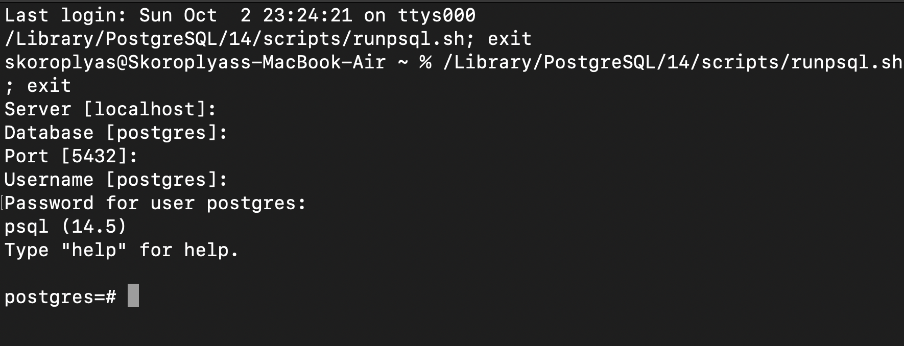

Now you need to install Que Pasa. The first step is to install [Rust and Cargo](https://doc.rust-lang.org/cargo/getting-started/installation.html); just follow the instructions. The second is building Que Pasa from the source. You need to run the following commands in the terminal:

```
git clone https://github.com/tzConnectBerlin/que-pasa.git
cd que-pasa
cargo install --path .
```

It remains to configure Que Pasa and PostgreSQL: 

1. Create a new database in Postgres to store data and indexes.
2. Connect Que Pasa to the created database.
3. Specify the HTTP address of the node from which Que Pasa will receive on-chain data.
4. Specify addresses of smart contracts for indexing. 

## Creating a new database

Open the SQL shell as described above, connect to the default database (see the [tutorial](https://www.tutorialsteacher.com/postgresql/connect-to-postgresql-database)), and enter the password. Then run the

```
CREATE DATABASE liquidity;
```

The terminal will return the `CREATE DATABASE` response. Then run the `\l` command to check the result. The new liquidity database should appear at the top of the list.

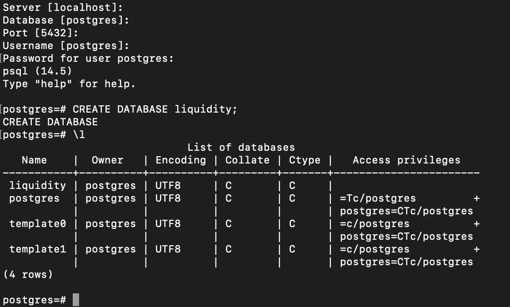

The Access Privileges column opposite the liquidity database is empty, so you need to give the postgres (or the username you picked) user the right to work with it. To do this, run the command:

```
GRANT ALL PRIVILEGES ON DATABASE "liquidity" to postgres;
```


## Connecting a database to Que Pasa

Open a terminal and navigate to the folder where Que Pasa is installed. This can be done with the cd ~/que-pasa command in the Unix environment.

Run the following commands in the terminal while in the folder.

First, to create config file we use touch and cat commands to create a new .env file and check if it contains something: 

```
touch .env
cat .env
```

Then we create an environmental variable for RPC node URL, from which Que Pasa will be getting on-chain data:

```
export NODE_URL=https://mainnet.tezos.marigold.dev/
```

Then we create another environmental variable with config, which Que Pasa will use to connect to the database:

```
export DATABASE_URL="host=localhost dbname=liquidity user=postgres password=1234 port=5432"
```

Now you can run the indexer with `que-pasa` command to see if everything works. If you get the error "zero contracts to index," everything is fine.

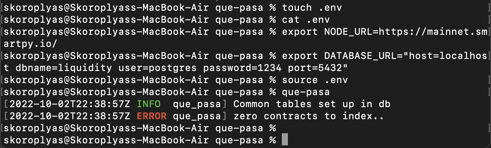

## Adding contracts for indexing

In the Que Pasa folder, open the settings.yaml file and type the contract name and its address. For this project, we will index only one contract, but you can put multiple contracts there.

In the "name" field, write "Liquidity", in the "address" field - the address "KT1TxqZ8QtKvLu3V3JH7Gx58n7Co8pgtpQU5".

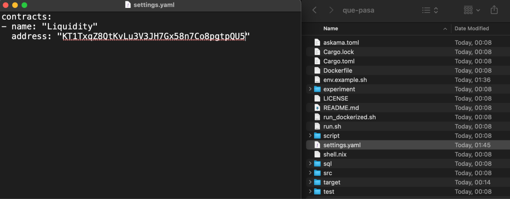

## Starting Indexing

In the terminal from which you were working with Que Pasa, run the following command:

```
que-pasa --contract-settings settings.yaml
```

Que Pasa will start storing operations with a specified contract from the most recent block to the genesis one. It automatically converts everything in the contract's storage into tables: simple types, lists, maps, big maps, and others. You just need to examine the database tables to find what you need to use in the project. 

Also, Que Pasa tells Postgres to automatically create basic b-tree indexes for every table, so querying data from tables is fast by default. You can create additional indexes for columns in psql shell or PgAdmin.

Complete indexing of data from all blocks can take several hours or even days. We will only use the data from a few thousand of the most current blocks, so indexing can be interrupted by pressing Ctrl+C. But when indexing is interrupted, Que Pasa will no longer process new blocks. So if you want to use Que Pasa in your project, ensure it will index the complete history and continue fetching new blocks—don't close the terminal, and don't interrupt the working process.


## Viewing the contents of a database

What should we do with all the data we have indexed? First, we need to know what we have; to do this, we need to check the tables and their contents. 

Postgres uses the \d command and its derivatives to view the contents of tables in a database. Let's try to do it. First, connect to the liquidity database with \c liquidity, then execute \d.


We get the error "Did not find any relations". This error occurs because of an incorrectly configured table and schema search path. Set it up with the command:

```
ALTER ROLE postgres IN DATABASE liquidity SET search_path TO "Liquidity";
```

This will force Postgres to look up data in the liquidity database using the "Liquidity" schema. Sounds complicated, but in the end, \d will display all tables and their relationships.

Que Pasa created a separate table for each entry point, storage, and big_maps nested in storage. In "entry.*" tables, we have all calls and their parameters made to that entry point, and in "storage.*" ones — storage content. 

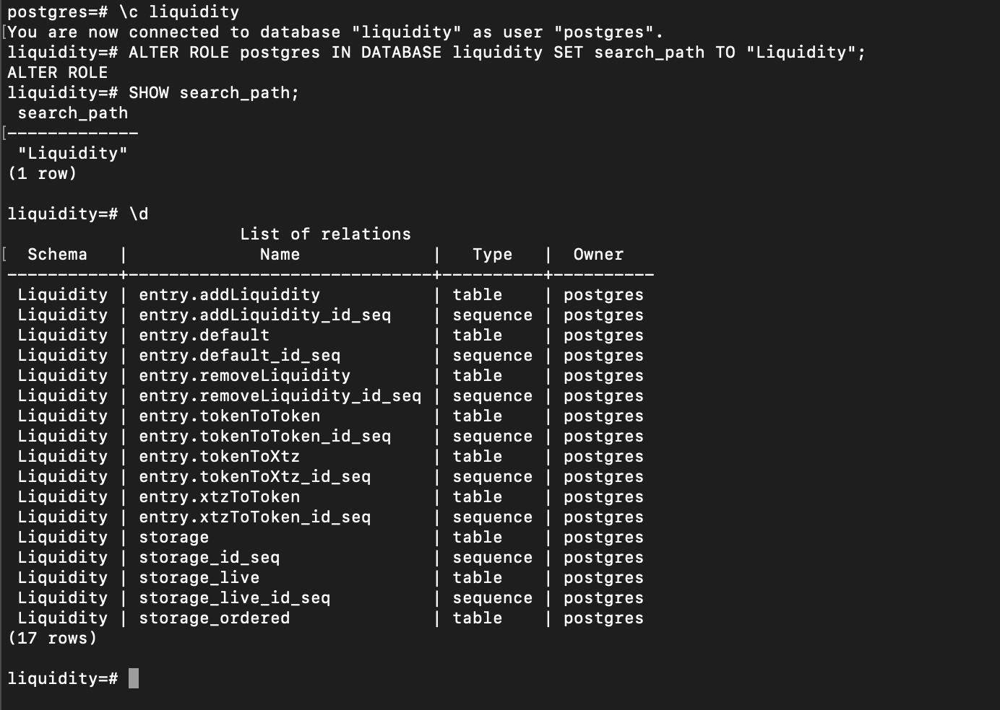
   
You can use the select * from "table_name". For example, let's get transactions for adding liquidity to Sirius DEX:

```
select * from "entry.addLiquidity";
```


Let's examine the table's contents. Columns like "owner" and "minLqMinted" are self-explanatory, but there are two more columns:

- tx_context_id: it is the internal id for the operation included in a particular contract call. For example, if the user batches two transactions into one, they will have the same tx_context_id.
- Id: it is the internal id for the particular operation. Each row in a database table will have a unique id value.

## Full contract indexing and _live

Full indexing of all smart contract transactions may take several days. So for the following example, we will use the contract of the NFT-lending service Signum. This dApp lets users take loans in tez using their NFTs as collateral. We can index its contract storage and entry points calls and then use SQL to filter contents, for example, to show the biggest approved loans or offers with the highest APY for lenders and even generate links to collateralized NFTs.

One more reason we have chosen Signum is that the team deployed it a few days before writing this tutorial, and Que Pasa will fully index it in a few minutes.

To switch to Signum, you need to replace the database name and contract address KT1CXwDvsxboyXuX77ohut9KmoVfwuD4A8FK in the settings.yaml file.

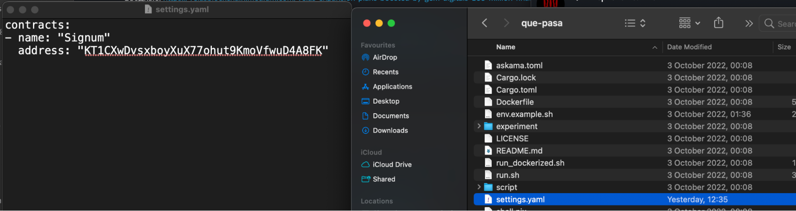

Then, in the terminal with Que Pasa, start indexing the contract with the command:

```
que-pasa --contract-settings settings.yaml
```

When the indexer finishes reading information from old blocks, it will synchronize with the network and start downloading and processing new blocks.


Now let's go back to the database and look at the tables. First, change the search path with the command `ALTER ROLE postgres IN DATABASE liquidity SET search_path TO "Signum"`. Then open the list of tables with the \d.


As you can see, there are tables for each entry point, storage, and storage's big maps. But storage* tables have duplicates of different endings and purposes: 

- just storage: a table with all the data from the previous blocks.
- storage_live: a table with only data from the last block only, the current state of the smart contract.
- storage_ordered: a table with the rows sorted in sequence by the Tezos execution order.
- storage_id_seq: service table with the id of the first row.

So for example, in "storage.offers" is stored data about all loan offers published on Signum, and in "storage.offers_live" there is data only about actual offers, which are currently stored in the Signum contract.

In our tutorial, we will use two tables; "storage_live" and "storage.offers.collateral". The first one contains data about all offers written in the Signum contract, like borrower address and loan amount. The second is a list will data about offered NFTs related to offers via internal IDs. 

To see the current state of a repository or a big_map within it, you need to use _live tables. To get data for previous blocks - with regular tables. For example, the command select * from storage_live; will return the state of the contract storage, the level of the current block, and the time the block was included in the blockchain (level_timestamp).


## Connecting Postgres to the site to request data

To request data, we will use a PHP server on the local machine.

First, you need to install PHP according to the instructions. Then create a folder in which we will store the script to display data from Signum, for example, signum_test. After that, open a terminal, go to the folder and run the command:

```
php -S localhost:8000
```

The command will start the local PHP server. You can already go to it using the link http://localhost:8000/

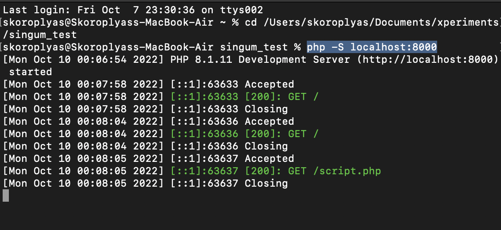

Lines with timestamps display requests and responses to the server.

Now you can start working on the page. Let's create a signum.php file in the folder and start writing the code. First - the basics: head, body, page name, and text for the test.

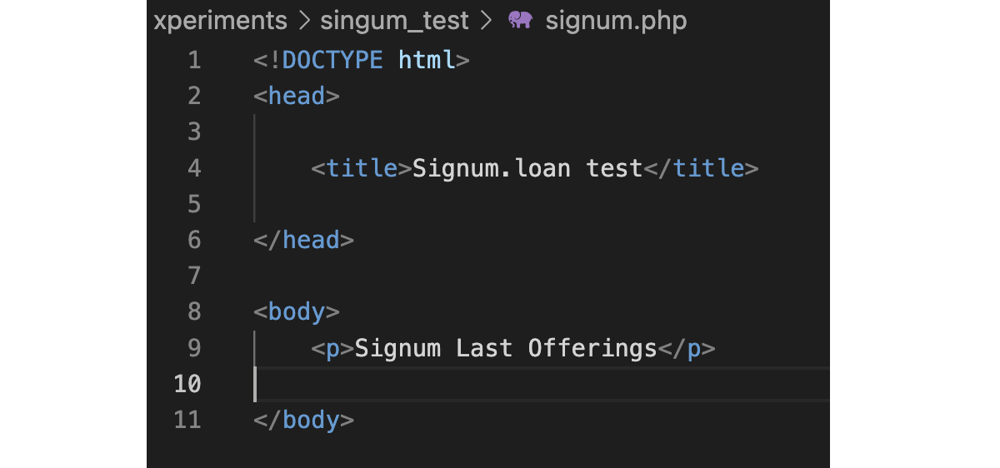

Let's save the script in the signum_test folder and go to it in the browser using the link http://localhost:8000/signum.php.


Let's connect to the database. To do this, we set the variables $dbhost, $dbname, $dbuser, and $dbpass with the appropriate values: localhost address, database name, postgres username, and password.

Let's create the $dbconn variable, through which we will manage the connection. First, we will execute the pg_connect() function to connect to PostgreSQL with user data and add the or die() function to catch errors. Finally, we add another PHP snippet to disconnect from PostgreSQL when the page is done loading.


Let's reload the signum.php page. If there are no errors, everything is fine.

Before requesting data from the database, let's examine the Signum contract store and choose what exactly we will request. The storage.offers table stores data about borrowers' applications: loan amount (amount), loan interest (premium), loan repayment period (deadline), and addresses of the borrower and lender. For example, let's request the loan amounts of several applications.

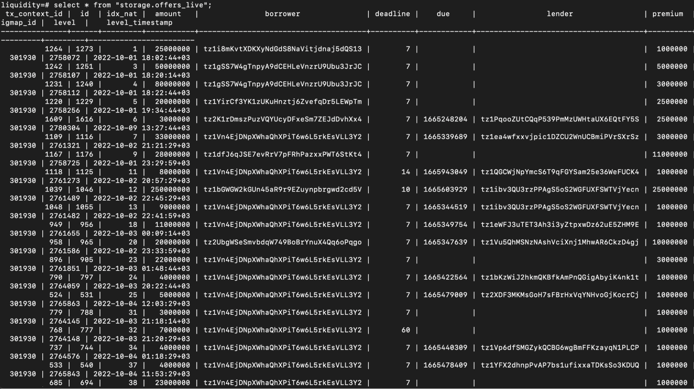

To do this, add an SQL query to the script: 

```
SELECT "amount" FROM "storage.offers_live" WHERE "amount" IS NOT NULL LIMIT 10
```

The command means the following:

- `SELECT "amount"` — get records from the amount column.
- `FROM "storage.offers_live"` - ​​pointer to the storage.offers_live table.
- `WHERE "amount" IS NOT NULL` - the condition that the selected row must contain the amount value.
- `LIMIT 10` - limit the result to only 10 values.

Let's assign this query to the $sql variable. Then we execute the function for this query - $result = pg_query(). We will pass two parameters to pg_query(): $dbconn with the configuration for connecting to the database and $sql with the query itself. 

Let's see the result at the end. Since pg_query() will return the data as a series, we use a while loop and the pg_fetch_array() function to fetch all the elements into an array and display them individually. First, assign to the $row variable the result of the pg_fetch_array() function execution on the final result. Then, in a loop, we will output each element of the $row["amount"] array using the echo command and separate the elements with a comma and a space (", ").

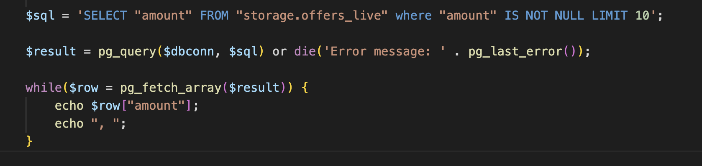

Let's check what happened. To do this, reload the page.


Let's complicate the request. We may receive data on loans that the borrower has already approved. To do this, add a `WHERE "amount" IS NOT NULL AND "lender" IS NOT NULL` filter.

We also calculate the profit of creditors in annual percentages (APR). To do this, we need to get the loan amount, the percentage for using the funds (premium), and the loan term (deadline). 

As a result, we will make the following query:


Result:


Let's arrange the result in a more readable table. To do this, we will use the HTML-element `<table>`. Let's divide the amount and premium by 1000000 to show the usual amount of tez since the blockchain stores the balances in millionths of tez - mutez.  

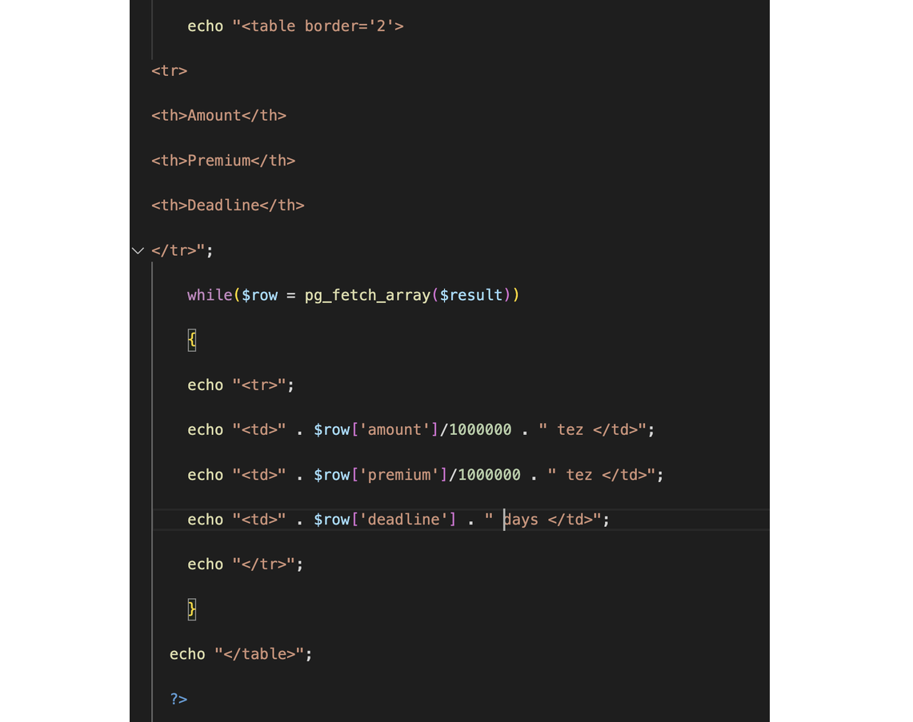

The result will be a sign:


Now let's calculate the APR of loans. To do this, add the "Lender's APR" column to the table and the APR calculation formula to the while loop. Assign variables for each iteration: $p is the premium, $a is the loan amount, $d is the loan repayment period, $dd is the ratio of the loan period to the number of days in a year, $apr is the APR value according to the formula. 

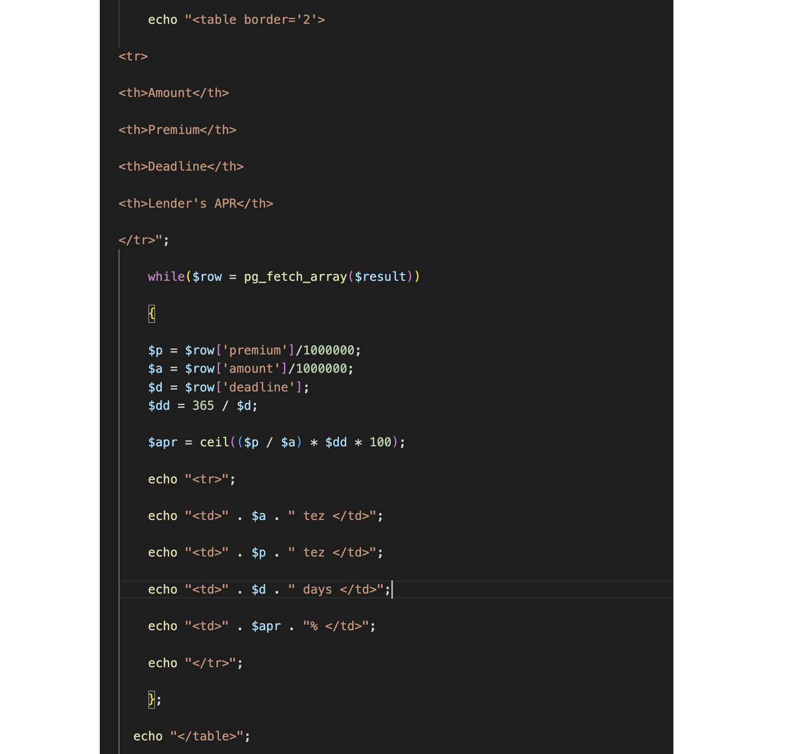

Let's reload the page to see the result.

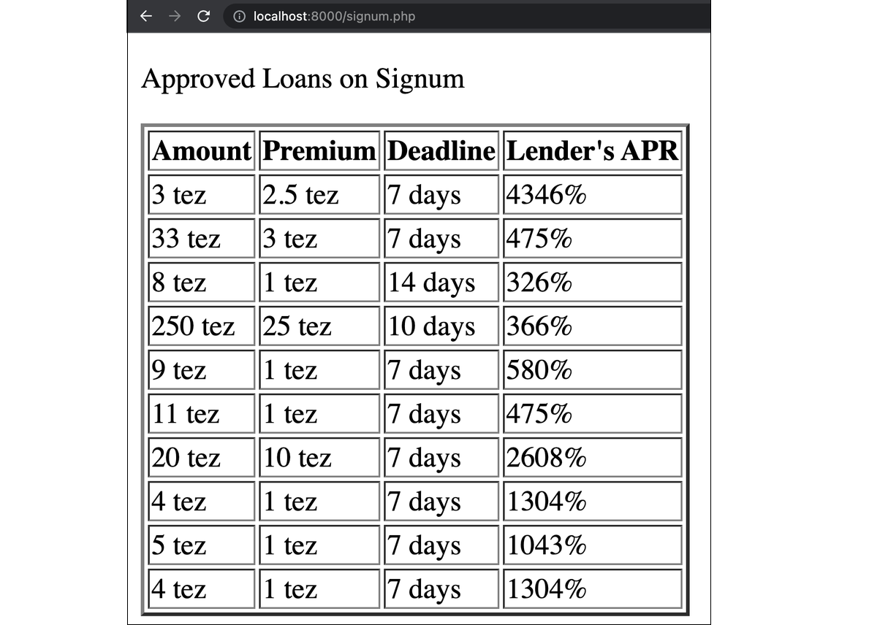

Now you can experiment. For example, change the filter in the SQL query to get data on the most prominent active orders:

```
SELECT "amount", "premium", "deadline" FROM "storage.offers_live" WHERE "amount" IS NOT NULL AND "lender" IS NULL ORDER BY "amount" DESC LIMIT 10
```


Now let's try to use the relational database as intended: take related data from two tables by rows internal id. 

The contract database has a storage.offers.collateral table storing the addresses of contracts and Token IDs of collateralized NFTs. We can use the internal id (tx_context_id value) from the storage.offers table to find their corresponding rows in the storage.offers.collateral table. And then, knowing the address and Token ID, we can generate a link to the token in the TzKT or Objkt.com browser.

So, in the first SQL query, we need to get tx_context_id to use these values ​​in a request against the storage.offers.collateral table.

Let's add "tx_context_id" to the request. 


In the while loop, add the $id variable, to which we will assign the value tx_context_id. Then we will write a $sql2 SQL query that will request the contract address and token id from the storage.offers.collateral table with the same tx_context_id values ​​that we got from the first query. In the end, we execute the query with the pg_query() function and write it to the $row2 variable.

It is not a best practice to use several SQL queries, as it could be done using JOIN, but we decided to keep it simple for this example.
 
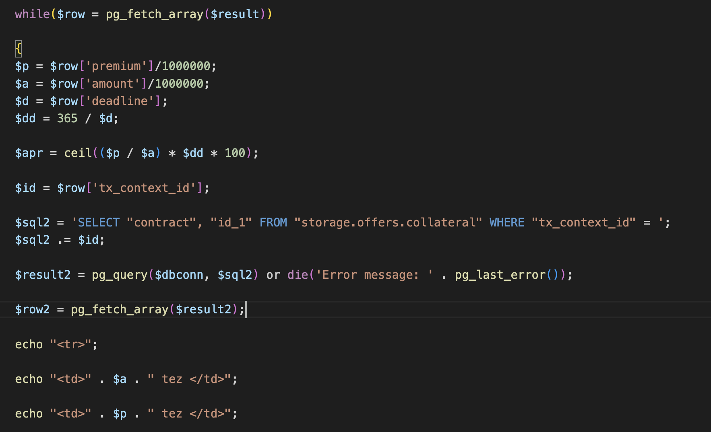

Finally, let's add the "Link to Token" column to the table, and below the function, add a line with a link to TzKT. The structure is as follows:

`tzkt.io/ + contract address + /tokens/ + token id + /transfers`

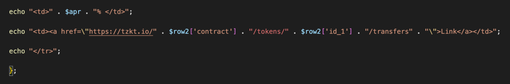

Let's save the page and check the result.

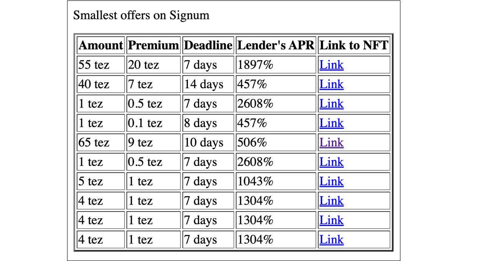

Following the link, we will go to the history of operations of tokens on TzKT, among which there will be an operation with the Signum contract.


[Script code on Gist.](https://gist.github.com/pavelTU/d59fab088a6237878447bd3d1ecdea65)

## Homework

1. Change the link to TzKT in the table to a link to Objkt.com. To do this, study the structure of the NFT link on Objkt.com and edit the link in the table.
2. Sort the first SQL query by loan amount, from highest to lowest.

## Answers

The NFT link on Objkt.com is simple: it consists of objkt.com/asssets/, contract address, and token id. 

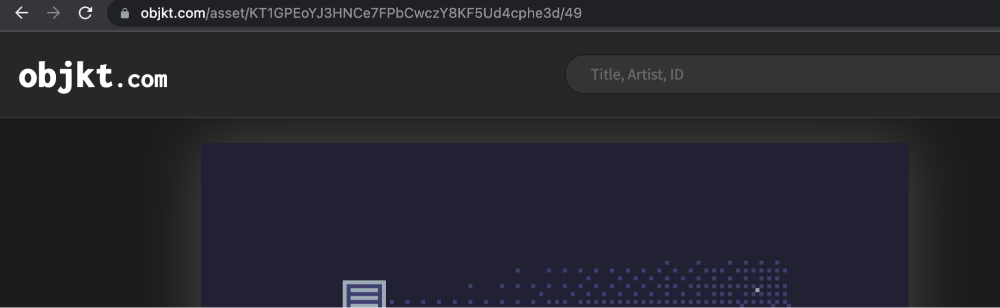

Let's replace the link in the table with this one.

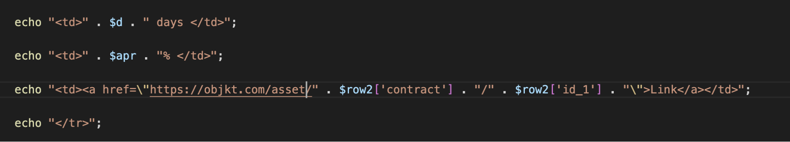

Then, add an `ORDER BY "amount" DESC` filter in the SQL query.


