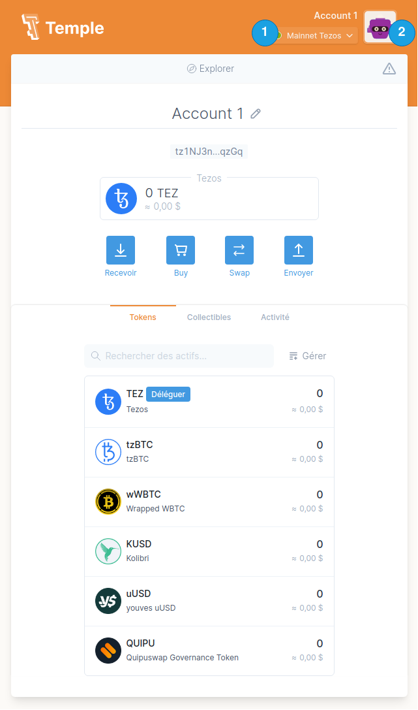
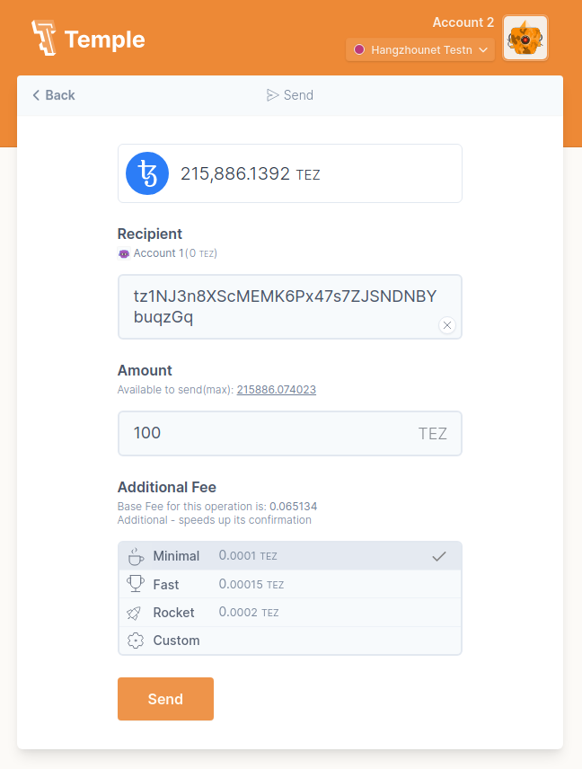
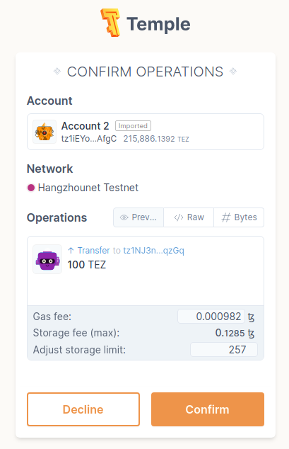

Dapp users need to sign transactions on the Dapp without disclosing their private keys. They want to be able to securely store their private keys, easily use and manage their addresses, and easily use the different Dapps. All of this can be performed by **wallets**. These can be desktop applications, browser extensions, hardware dongles or smart contracts themselves.

In the case of Dapps, the best option is to opt for a browser wallet. These are easy to find and to install. They provide developers with a library that can be used in their Dapp to connect with the user wallet.

The most common wallets are:

- [Temple](https://templewallet.com/download/)
- [AirGap](https://airgap.it/)
- [Galleon](https://cryptonomic.tech/galleon.html)
- [Kukai](https://wallet.kukai.app/)
- [Spire](https://spirewallet.com/)
- [Umami](https://umamiwallet.com)

In this chapter, we will use the _Temple Wallet_ as an example, developed and maintained by _Madfish solutions_. This first part is a tutorial about how to install and use the wallet.

## Installation

The _Temple wallet_ browser extension can be downloaded from [templewallet.com](https://templewallet.com/download).

Choose your browser and add _Temple_ to your extensions. You will have the choice to import an existing wallet, or to create a new one.

Let's create a new wallet, choose a password and save the mnemonic phrase.

You'll get to the main page:



## Fund the account

You can use the faucets available at [teztnets.xyz](https://teztnets.xyz/) to request fund on any available testnet.

## Send a transaction

Now that you have an account with some funds from the faucet, let's send some of them to our first account. Click on "Send".



You can send funds to any address by manually filling the recipient, or you can choose from one of your addresses by clicking on the list that appears when you click in the text box.

Send 100 Tez (or another amount) to your first account. A confirmation page will pop up. You can review some information on this page: transaction amount, receiver and fees.



All the transaction information can be found under the "Raw" tab:

```json
{
  "branch": "BMLSNShUV2Q9AT55bbSaSkXqTgGFQb6Fx96ASM2waJEAocf5QeY",
  "contents": [
    {
      "kind": "reveal",
      "source": "tz1iEYotczM1u2Vny9C3ouT6PEziLLeKAfgC",
      "fee": "982",
      "counter": "3687196",
      "gas_limit": "1100",
      "storage_limit": "0",
      "public_key": "edpkueF8F6SUUuUgHttJQ5yL1HmZZyajE9yryKwmbksNK5yE4RW159"
    },
    {
      "kind": "transaction",
      "source": "tz1iEYotczM1u2Vny9C3ouT6PEziLLeKAfgC",
      "fee": "608",
      "counter": "3687197",
      "gas_limit": "1520",
      "storage_limit": "257",
      "amount": "100000000",
      "destination": "tz1NJ3n8XScMEMK6Px47s7ZJSNDNBYbuqzGq"
    }
  ]
}
```

Once the transaction is confirmed, you can switch to your first account (by clicking on the top-right thumbnail) and observe that your account balance has indeed increased to 100 Tez.

## Conclusion

_Temple_ is a user-friendly wallet for Tezos. Within a few clicks, a transaction can be sent to any address. Another benefit of using a wallet is the possibility to interact directly with Dapps. This will be detailed in the next chapter.
