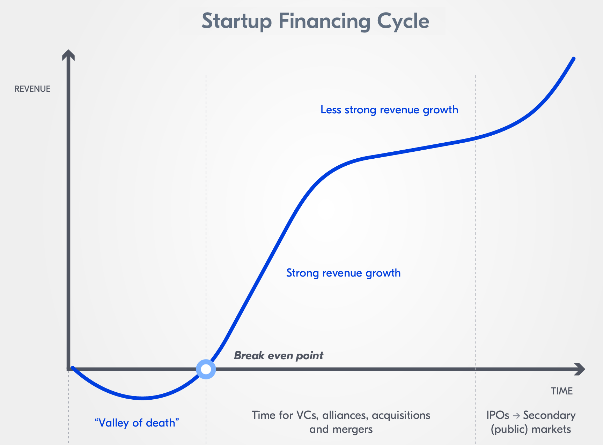
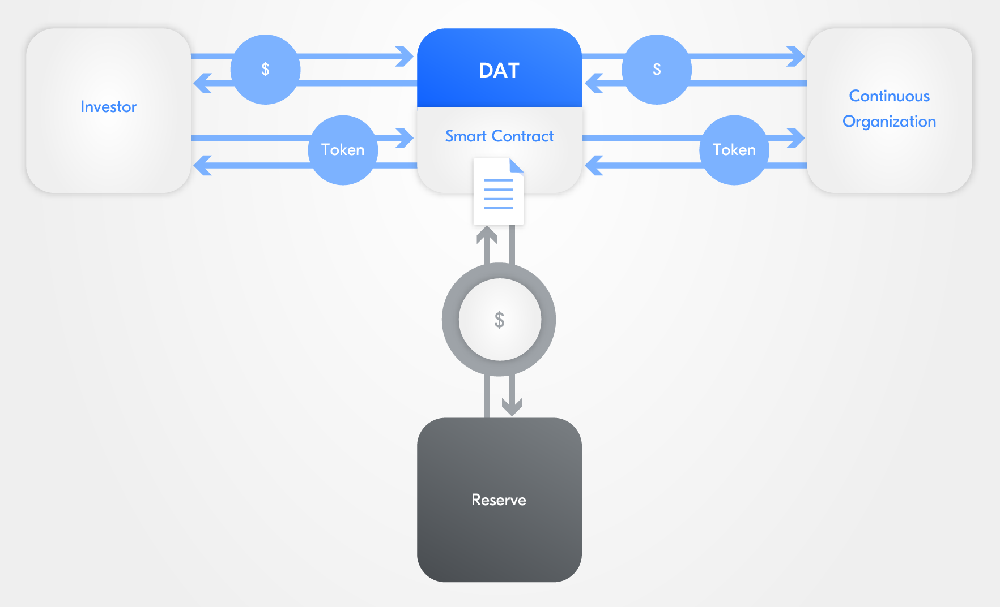
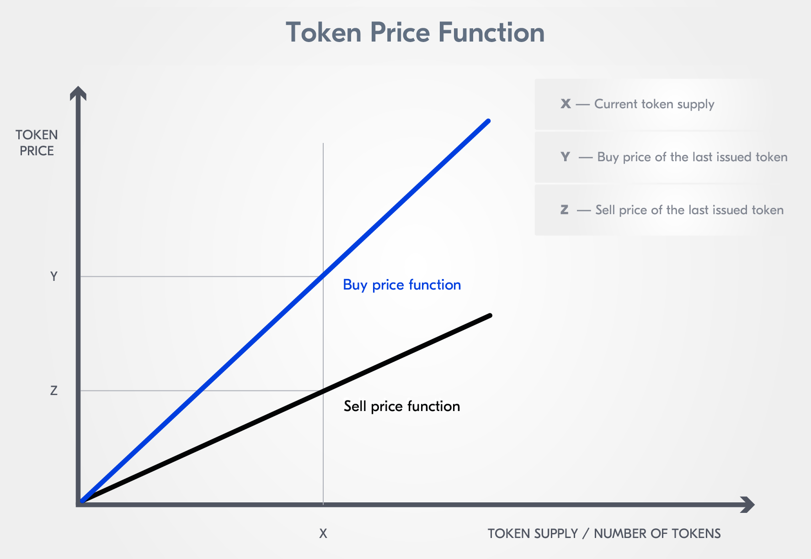

:::info Authors
This content was created by [B9Lab](https://tezos.b9lab.com/) under MIT Licence. It was then adapted and integrated by Nomadic Labs.
:::

Startups in the blockchain space use the technology to help raise capital and fund their business growth. The proliferation of initial coin offerings (ICOs) was followed by security token offerings (STOs) and a number of other asset-raising ideas. The majority of blockchain-based asset "offerings" partially mirrored initial public offerings (IPOs) in traditional financial markets, where companies "go public" and list their stock on exchanges, creating public equity. There are many significant differences between IPOs and even the most respectable ICOs, including questions of regulation and ownership, but that is a discussion for another time.

A great deal of early funding for blockchain startups still comes through the same route as for other non-blockchain startups: private equity. In the very early stages, investment often comes from friends and family, and so-called angel investors. As the company matures, the founders may look to professional investors at venture capital firms and funds as a source of capital. All these types of investment are predominantly exchanged for equity in a company, i.e. a representation of the value of the investor's stake by owning a portion of a company's shares.

The early-stage funding phase of seed rounds and more formal venture capital funding series is ripe for innovation and disruption. The **Rolling Simple Agreement for Future Equity (Rolling SAFE)** is such a blockchain-based innovation, focused primarily on early funding for a startup. The seeding round is typically the very first time an entrepreneur will look externally to fund their new project.

## Raising capital - Funding mechanisms and startup financing cycles

It is no secret that many startups fail due to cash flow issues or a lack of capital in general. A company looking for an injection of capital to fund startup costs can either explore taking on debt (through bank loans, capital markets, or other debt instruments) or issue equity in exchange for investment from for example venture capitalists. Let us take a look at raising capital through private equity using the venture capital route.

When starting a new venture, the revenue brought in by sales often does not cover the cost of starting and running the venture, never mind actually creating a profit (i.e. net income). So startups seek capital from other sources, one of them being investment from external entities in a seeding round.

:::info
Wonder why it is called **seed round** and you gather seed capital? The business is only a seed, it is not yet a fully grown company. A seed round is like the planting of a tree, the seed will not grow overnight into a massive oak but planting the seed is the first step.
:::

Broadly speaking, a startup would look for funding from friends, family, and angel investors during the "valley of death" stage, where revenue (if there is any at all) does not cover costs. This is the seed round, where a company founder can get funding based on a great idea and a compelling business plan. Naturally, investing at this stage is likely to be the riskiest as the investor may not be able to see an already existing product or service to evaluate its likelihood of success.

As soon as the company has reached break-even, and can demonstrate product-market fit and traction, it is more attractive to professional investors, be it venture capital funds, investment banks, sovereign wealth funds, or other more formal pools of capital - for the sake of expediency, we are going to call these collectively venture capital (VC) firms, even though that is not strictly true.

VC firms are most interested in investing when they can see a working business and can evaluate the likelihood of exponential growth in future revenues. It is at this point that a company would look to raise money in a series of formal funding rounds, typically, series A, B, and C rounds. As with seed investing, investors in series A, B, and C will expect some form of partial ownership of the company, usually through equity. However, in these later rounds of funding investors have a working company to evaluate and so are seen to be taking progressively less risk. This means that the amount of equity they can expect in return for an investment decreases. An investor investing &#36;100,000 in the seed round can expect much more equity in return than an investor who invested &#36;100,000 after a year of successful trading.

Each series, in theory, relates to a different stage in the company's development - and a different issue of shares, but more about this later. Of course, in reality, the lines between the different stages are blurry and the stage of the company may not match exactly, but these are the broad bands for the stages:

* **Series A:** Investors are not just looking for great ideas, but rather for companies with great ideas and a strong strategy for turning that idea into a successful, revenue-making business;
* **Series B:** Is focused on expanding market reach as companies looking to raise at this stage will have developed substantial user bases and have proven to investors that they are prepared for success on a larger scale. Series B funding is used to grow the company so that it can meet higher levels of demand;
* **Series C:** Done for additional funding to help an already successful company develop new products, expand into new markets, or even acquire other companies. Series C funding is focused on scaling the company, growing as quickly and as successfully as possible. Companies engaging in series C funding should have established, strong customer bases, revenue streams, and proven histories of growth.

Some companies can go on to series D and even series E rounds. For the most part, though, companies gaining up to hundreds of millions of dollars in funding through series C rounds can develop on a global scale. Many of these companies use series C funding to help boost their valuation in anticipation of an IPO.

Now that we have covered the broad scope of venture capital and the various rounds of asset raising for new businesses, it is time to look at the mechanisms that are used to deliver the funds from the investor to the company. Let us look at convertible notes and common and preference shares, also known as preferred stock. In the next section, we will move on to SAFEs and finally Rolling SAFEs.

### Convertible notes

In the very early stages of a company's life, especially at the seed round stage, when it is an idea and a business plan, it is quite hard to put a value on the company. Thus, it is tricky to work out how much equity a company founder should give away in return for an investment. The founder, filled with the vision and passion for the company's success, is likely to have a very different conception of what their company is worth versus an investor. This is where a convertible note can help both parties agree.

A **convertible note** is *a debt instrument*. It is a way for a startup company to borrow money, normally with a lower interest rate than they could get at a bank - if they could get a loan at all. For the investor, there is the bonus of being able to convert their debt into equity, normally preferred stock. This conversion typically takes place at the same time as the series A round. At this point, the valuation of the company is much clearer as there are far more data points than when the initial investment was made.

As it is still a debt instrument, the company will need to pay interest and pay back the principal (i.e. the original loan) at the maturity of the note. This is the case if the event that triggers conversion has not happened before the maturity date, the event normally being the series A round.

As with all private deals, there are differences from note to note, and we are covering the ideas in general rather than specifics. However, there are **four key variables** in a convertible note that you should look out for:

* **Discount rate:** The discount the investor receives relative to investors in the subsequent financing round, usually series A. The discount compensates the investor for taking on the risk of investing early. For example, if a series A investor can buy a share for &#36;10 with a discount rate of 20%, the note holder would be able to convert their investment at the equivalent value of &#36;8 a share. Discount rates can be anything from 10% to 40% or occasionally more. Most often they are set at around 20%;
* **Valuation cap:** It effectively caps the price at which an investor will convert their note. In the example above, if the note had a cap of &#36;5 a share, that would be the conversion price instead of &#36;8 a share at the 20% discount rate. Valuation caps are usually quoted as the valuation of the whole company rather than on a share-by-share basis. To extend the example above, the note could have a valuation cap of &#36;5 million with the company having a pre-money valuation of &#36;10 million - we will discuss pre- and post-money below;
* **Interest rate:** The convertible note is a debt instrument, so it will more often than not accrue interest. As opposed to being paid back during the note's lifetime the interest normally accrues to the principal invested, i.e. the number of shares issued is increased on conversion. Interest rates are often within the 2% to 8% range;
* **Maturity date:** The date on which the company will have to repay the interest and the principal to the investor if the note has not been converted.

### A share issue

As we have previously stated, investors often expect to receive stock for investing money in a startup company. For an early-stage investor, **preferred stock** is the preferred option. Here we are going to discuss the role that equity/stock/shares play in the early stage of the company.

Equity is lowest in a company's capital structure, below any debt the company might have. This means that in the event of the company going bankrupt, equity holders are paid out last and probably receive very little. This is because all the creditors above them in the capital structure are paid out first.

<!-- Add a sentence to bridge the thought between equity and stock types for those that don't know anything at all about financial instruments -->

There are lots of types of debt and equity, but we are going to focus on the two most common types of equity: **common (ordinary) stock** and **preferred stock**. First, we are going to look at common stock to then contrast it with preferred stock and explore why an early-stage investor would prefer preferred stock.

The vast majority of stock is issued as **common stock**. When people talk about stock, they are normally referring to common stock. A large chunk of common stock is issued by a company through an IPO when the company "goes public" and is listed on a stock exchange. Common stock is lowest in the capital structure and because it is the last to get paid in the event of bankruptcy it has the most associated risk. However, common stockholders also have the potential for the most reward in capital gains (when the stock increases in value) and through a claim on profits (when the profits of the company are distributed to shareholders through dividends). Common stockholders are also able to vote on important company decisions, i.e. have governing rights.

**Preferred stock** is above common stock in a company's capital structure, meaning holders have priority over the company's income and are paid dividends before common stockholders. However, preferred stock may not confer voting rights like common stock. The preferred stock issued in VC rounds often has different control rights, for example, a board seat or veto rights.

Preferred stock often has a guaranteed dividend yield while common stock has variable and never guaranteed dividends.

:::info
To calculate the dividend yield, the preferred stock also has a par value, like a bond. Say the stock had a par value of &#36;25 and a dividend yield of 5%, the company would have to pay the holder &#36;1.25 a year. If the company misses a dividend payment, it must first pay the arrears to the preferred stockholders before paying out to common shareholders.
:::

Preferred shares often have a callability feature, which allows the company to redeem the shares after a predetermined time, often at a high premium to the original purchase price. Also, they can often be converted to a fixed number of common shares.

The terms of preferred stock, issued in a private round, can be negotiated between the investor (or group of investors) and the company, and thus, can vary. The stock is issued in series, series A, series B, etc. - which is why the funding rounds are called series A, series B, etc.

Each series has a defined number of shares that the company is prepared to issue in exchange for a defined investment amount. Each round will have its own set of terms; generally speaking, the later the round the less favorable the terms for the investor as the perceived risk is reduced over time.

Equally, the preferred stock is likely to have anti-dilution provisions, which are clauses designed to protect the investor's ownership percentage in the company. Percentage ownership is maintained by linking preferred shares to a number of common shares. If a company issues more common stock, say in an IPO, the number of common shares that a preferred share can convert to also increases, meaning that the preferred shareholder's percentage ownership of the company remains the same. This is not the case for common share ownership, which is diluted as other common shares are issued - so to say, common shareholders have the same slice of the pie, but now have more claims on the slice. As early-stage investors invest before the IPO, it is preferable to hold preference shares.

:::info
The possible conversion of preference share to common stock is one of the key ways an early-stage investor can exit their investment. At an IPO, it is likely the investor will be able to convert their preferred stock for a certain number of common stock and then sell that stock on an exchange.
:::

As you can imagine, the various **exit strategies** for an investor are an important part of the decision to invest in the first place. Investors often look for a company that has a clear path to exit in **one of three ways**:

* Through a "trade sale", by being attractive to competitors and therefore becoming a candidate for a merger or acquisition,
* By building a company's value to attract a different type of investors in the secondary buyout market, e.g. another private equity firm that can take the business to the next level, or
* Through an IPO.

## SAFE, a precursor to Rolling SAFEs

A **Simple Agreement for Future Equity** (SAFE) was designed as a more simple replacement for [convertible notes](#convertible-notes). It can be defined as *an agreement between a company/the issuer and investors providing the latter with rights to the company's future equity*. A SAFE is a convertible security: an investor provides a company with funding to in the future be able to convert their investment into ownership in the company.

When an investor invests in a company using a SAFE, they exchange their capital for the right to future equity in the company at a triggering event - both SAFEs and convertible notes are also used for later-stage bridge finance, but that is not relevant in this context.

Similar to convertible notes, a SAFE postpones the problem of company valuation until a later date when the equity is transferred to the investor at the triggering event. Valuing a company at a very early stage is difficult, especially if it is just some founders, an idea, and a business plan. Postponing the valuation until there are more data points is a logical way to solve the problem.

Let us get **triggering events** out of the way. A triggering event is normally either when a priced round of investment occurs, like a series A round, or a liquidity event occurs, like the company getting bought by a competitor. The key is that the event includes the striking of a price. If the company is in a position to raise funds in a formal series round, there must be some consensus on the company valuation. The same applies if the company is bought. As we now have a consensus on the company valuation and with it the price, the SAFE can convert to equity or be bought out at an agreed rate.

SAFEs were created by [Y Combinator](https://www.ycombinator.com/documents/) in 2013 to simplify the early-stage asset-raising process. The SAFE was a short document with little space for negotiation other than key areas that were set out. SAFEs have evolved since 2013 and can now have almost as many moving parts as a convertible note. However, certain differences between both remain true:

* A SAFE is not a debt instrument, the company does not need to pay back the principal, and it does not accrue interest;
* A SAFE does not have a maturity date, meaning there is no need to arrange extensions if the triggering event has not been reached.

The key, most common areas for negotiation in a SAFE are the discount rate, the valuation cap, pro-rata rights, and the Most Favoured Nation clause. A SAFE can have a combination of any of them or all of them:

* **Discount rate:** The discount the investor receives relative to investors in a subsequent financing round, usually series A. This discount compensates the investor for taking on the risk of investing early. For example, if a series A investor can buy a share for &#36;10, the SAFE holder with a discount rate of 20% would be able to convert their investment at the equivalent value of &#36;8 a share. Discount rates can be anything from 10% to 30% or occasionally more, most often they are around 20%;
* **Valuation cap:** Effectively caps the price at which an investor will convert their SAFE. In the example above, if the SAFE had the equivalent of a &#36;5-a-share cap, that would be the conversion price, instead of &#36;8 at a 20% discount rate. If a SAFE has both a valuation cap and a discount rate, the investor can choose which to exercise. Logically an investor will choose the lowest price. Valuation caps are usually quoted as the valuation of the whole company than on a share-by-share basis. To extend the example above, the SAFE could have a valuation cap of &#36;5 million with the company having a pre-money valuation of &#36;10 million;
* **Pro-rata rights, or participation rights:** Allow the investor to invest additional funds to maintain their ownership percentage during rounds after their equity was converted. To again extend the example above, the company decides to do another financing round in a series B. The investor converted at &#36;5 a share in series A because of the valuation cap. The SAFE now allows investors to buy more shares in series B at the series B price, let us say at &#36;15, up to an amount that keeps their ownership of the company at the same percentage - this was an automatic clause in the original 2013 SAFEs, but is now more commonly a negotiated side note;
* **Most favored nation clause (MFN):** An MFN simply means that no other investor can have better terms than the ones set out in the SAFE with the MFN clause. They can have the same terms, just not better (e.g. a lower valuation cap or higher discount rate). This rewards the original SAFE investor for taking an early risk - MFN clauses can not be applied retroactively, i.e. a series B investor cannot ask for an MFN clause that affects a series A investor.

The original SAFEs conceived in 2013 were formally updated by Y Combinator in 2018. Admittedly, SAFEs are an open resource so they have been modified extensively over time. The new versions created in the update aimed at capturing the most common modifications. When it comes to the size of the return expected by an investor and therefore, the amount given up by the company, the **most consequential change was moving the valuation cap from pre-money to post-money**. In other words, the pre-money valuation cap was intended to show the value of the company before the SAFE converted to equity, whilst the new SAFEs value the company after the SAFE has been converted, so to say post-money.

The importance of the change from pre- to post-money valuation is best outlined with an example. Let us assume a pre-money valuation cap of &#36;1 million and that the SAFE investors invested &#36;200,000. The post-money valuation would be &#36;1.2 million following the conversion of the SAFE. Using simple math, this SAFE would effectively purchase 16.67% of the company (&#36;200,000.00/&#36;1.2 million).

:::info
These conversion percentages are typically a best guess and do not account for other variables that come into play like option pool increases, previous investments using other mechanisms, subsequent SAFEs, etc.
:::

This is straightforward if you only had one investor or if all investors invested at the same time. However, if you have a number of SAFEs, sold at different times, with different valuation caps, it is difficult to work out what an investor's final equity stake will be. Using the same math as above, if an additional &#36;300,000 of SAFEs were issued, the post-money valuation would be &#36;1.5 million. The initial &#36;200,000 would now be worth 13.33% (&#36;200,000/&#36;1.5 million).

In essence, future SAFE purchasers are diluting previous SAFE investors and ultimately defeating one of the core tenants of SAFEs: transparency. Equally, the previous SAFE made it somewhat difficult for new investors to ascertain what they were purchasing and unsure of their ultimate equity percentage.

This problem is simply solved by using a post-money valuation cap. Investors have a much better idea of the outcome of their investment, assuming conversion at the valuation cap and not the discount rate. Investors are less likely to be subject to unanticipated dilution by using a post-money valuation. As an example, using a post-money valuation cap, if the valuation cap was &#36;1 million and an investment of &#36;200,000 was made, the investors now know that this would be equal to 20% (&#36;200,000/&#36;1 million). If a future investor comes in for &#36;300,000, unlike the original example, it would not dilute the first investor.

## What is a rolling SAFE?

Raising money can be tedious and can consume a lot of time and energy for founders. A successful startup may have to go back to investors for additional funding to keep growing, sometimes several times over a short period of time. Founders have a new tool at their disposal to raise capital. One that makes the process easier is even better.

<!-- I would recommend connecting the two sentences "A successful startup may have to go back to investors for additional funding to keep growing, sometimes several times over a short period of time." and "Founders have a new tool at their disposal to raise capital. One that makes the process easier is even better." Right now they are quite disconnected, which makes the flow uneasy. -->

Just as in its time, the classic Simple Agreement for Future Equity (SAFE) supplanted the convertible note, the Rolling SAFE is intended to be an upgrade to SAFEs. It uses blockchain technology and tokenization to programmatically control the offering process of so-called programmable equity and offer transparency. It automates some of the SAFE mechanisms and replaces others. It also helps founders to promote their raise directly to their community through their website.

<!-- How is a Rolling SAFE upgrading a classic SAFE? How does it exactly use blockchain technology - I would already hint at the role of the smart contract, so that it doesn't drop out of nowhere two paragraphs later and because not everyone reads an expandable. Same applies to the treasury/reserve term. -->

:::info Programmable equity (PEQ) and Decentralized autonomous trust (DAT)

Programmable equity (PEQ) is a term used when smart contract(s) tokenize and control part (or the entirety) of a company's equity. This programmable enforcement of ownership and trading restrictions allows for greater flexibility in automating issuance, the calculation of pricing, and the transfer of existing or future ownership of a company's capital.

This smart contract is sometimes called **decentralized autonomous trust (DAT)** and the treasury is the DAT plus the money it controls, i.e. the **reserve**.

<!-- We talk about the treasury as such only once. I would recommend deleting all mentions of treasury and just sticking to reserve - should only affect this sentence - to reduce the potential for misunderstandings. -->

:::

<!-- I would recommend first explaining at least briefly what a Rolling SAFE is before talking about a comparison with a SAFE or convertible note. Right now, the reader has to believe the arguments without having a clear picture of all instruments in his/her head. -->

A Rolling SAFE is designed to simplify the asset-raising process in comparison with a traditional SAFE or a [convertible note](#convertible-notes). However, both, traditional SAFEs and convertible notes, are usually used to facilitate a seed round - the triggering event often being a series A raise. In theory, a founder could use a Rolling SAFE to take care of the entire venture capital asset-raising process. The founder simply sets the triggering event as any of the classic exit strategies normally looked for by an investor: a trade sale, secondary market buyout, or IPO.

<!-- Is it really taking care of the entire VC asset-raising process? Isn't the whole point to not have to rely on VC but having an offering open to anyone (opening up new liquidity markets as well as faster liquidity)? -->

A Rolling SAFE can stay open continuously for investment using clearly and transparently stated terms. This means anyone can invest at any time. The company no longer needs to either raise capital in multiple rounds or renegotiate multiple SAFEs. As the Rolling SAFE is governed by a smart contract, it can automatically change predetermined parameters as funds flow into its treasury effectively changing the implied valuation of the company over time. As more capital is raised, the company valuation increases automatically, benefitting early investors.

<!-- Here: "The company no longer needs to either raise capital in multiple rounds or renegotiate multiple SAFEs." I recommend making it even more general and not to limit it just to multiple SAFEs but renegotiating the terms of funding maybe. -->

## Rolling SAFE properties

Thanks to the use of bonding curves, a Rolling SAFE can have the following properties:

* **Unlimited token supply:** There is no theoretical limit to the number of Rolling SAFE tokens that can be minted, i.e. generated;
* **Predictable:** The buy and sell prices of Rolling SAFE tokens increase and decrease in line with the number of Rolling SAFE tokens minted or burned;
* **Linear:** The price of the second Rolling SAFE token minted (the value `n`) is less than the third Rolling SAFE token minted (i.e. `n+1`) and more than the first Rolling SAFE token minted (i.e. `n-1`);
* **Liquid:** Rolling SAFE tokens can be immediately bought or sold at any time. After the lock-up period expires, the bonding curve acts as an automated market maker. The smart contract (i.e. DAT) acts as the counterparty for the transaction and needs to always hold enough in the reserve to buy Rolling SAFE tokens back.

<!-- In regard to the bullet point "linear": I believe we should change it to the sell price because the buy price is constant as long as the MFG is not met. -->

The Rolling SAFE also has the provision to reward key stakeholders. Founders can reserve an equity allocation for users, customers, partners, employees, community members, etc. This can all be done under the Rolling SAFE rather than having to create and administer a separate scheme.

### Why would an investor be interested to invest in a startup via a Rolling SAFE?

Here we meet the two main categories of investors: individual investors (angels, friends, and family) and venture capital (VC) firms.

**Individual investors** are accustomed to sourcing their investments through word of mouth, email lists, crowdfunding platforms, or angel networks. They might find a natural advantage with the Rolling SAFE as they can have access to it from the moment they encounter the company's capital raising website. At this point, they can start doing their due diligence with the information provided by the startup, and quickly decide if they want to invest or not. The discovery process and investment opportunity are bundled together making the overall process smooth and straightforward.

For **VC firms**, who need to report to their investors and who usually manage larger portfolios of investments, a benefit comes from a new function offered by the Rolling SAFE: the secondary market. By providing liquidity for this type of investment it allows VC firms to revisit regularly which companies to keep, remove, or add to their portfolio. This allows VC firms to efficiently redeploy capital and maintain their risk/reward ratios.

<!-- Is it really a function to be able to sell and buy tokens in a secondary market? Or is it more of a functionality/option to further grow your ROI? -->

:::warning Warning
**Local tax and securities regulations** are key elements to investigate for any startup looking into issuing a Rolling SAFE. **No startup should use this type of instrument before receiving comprehensive legal advice.**
:::

## Stages in a Rolling SAFE

For ease, a Rolling SAFE's lifecycle can be split into four stages:

* Initialization,
* Pre-Minimum Funding Goal (MFG),
* Post-MFG, and
* Termination.

Let us now have a closer look at the different stages of a Rolling SAFE.

### Initialization

During the initialization, the issuer (i.e. the company) decides on the terms of the offering by **defining a few key parameters**:

* The initial valuation, which is effectively a valuation floor - the minimum amount the issuer is prepared to value the company (post-money) to accept an investment,
* The percentage of the company's equity it would like to offer to external investors,
* The initial price per Rolling SAFE token, and therefore, the number of Rolling SAFE tokens the company wants to issue,
* A ticker name to the Rolling SAFE token (e.g. "TZM"),
* A target minimum amount of capital to be raised, the minimum funding goal (MFG),
* The portion of funds raised that will be kept in the reserve and its currency denomination (i.e. base currency), usually a stablecoin,
* The length of the lock-up period, so to say the minimum period the investor must hold their Rolling SAFE tokens before being allowed to sell them via a secondary market,
* The minimum investment amount the company is prepared to take from a single investor, and
* The termination event list, which normally includes an IPO, sale, and bankruptcy.

:::tip
The base currency is usually a stablecoin, e.g. a [wrapped USDC (wUSDC)](https://app.tzwrap.com/wrap) or a chain native stablecoin like [Lugh (EURL)](https://www.lugh.io/).
:::

### Pre-MFG

The issuer set a target amount of capital to be raised, a minimum funding goal (MFG). As long as this target is not met the Rolling SAFE remains in the Pre-MFG stage. In this phase, **all Rolling SAFE tokens are offered at the same price** (i.e. the initial price) and all stablebcoins received through the Rolling SAFE token sale are escrowed by the DAT.

<!-- Scenario not included: What if an investor wants to redeem their investment pre-MFG? Of course, it is not incentivized but can happen. I would recommend including a short explanation here or it seems like you are locked in with your investment as long as the MFG isn't reached, which I believe sounds rather like disincentivizing early investors but a Rolling SAFE should do the opposite. -->

:::info
Before reaching the MFG, the offering can be canceled by the company at any time and investors get their money back.
:::

<!-- How? This is rather a very brief HighlightBox. -->

### Post-MFG

Once the MFG is reached, the offering can **no longer be canceled but only closed** (i.e. terminated) by a liquidity or dissolution event.

A defined portion of the stablecoins moves into the reserve and the other portion goes to the company to run the business. Typically, the reserve holds a large proportion of the stablecoins. Crucially, **the Rolling SAFE token price is no longer fixed** but is now determined by a **bonding curve**.

:::info What is a bonding curve?
The core concept of a bonding curve is relatively straightforward: buy and sell prices of a token are determined by its token supply. The more tokens are put into circulation (minted and not burned), the higher the token price. This means that when five tokens have been issued and a sixth is issued, the price increases. If you burn one of the six tokens, the price would decrease for all of them.

The bonding curves allow for a fixed and predetermined price discovery mechanism implemented in the smart contract and controlled by the smart contract's functions (`buy()`, `burn()`, `sell()`, `pay()`) and the size of its reserve.

<!-- I would recommend deleting the functions in pharentheses as you address them later and just mentioning it is linked to the functions of the smart contract and the reserve size. -->

Different types of bonding curves exist (Sigmoid and linear bonding curves), but we will not enter into more details here. What you can keep in mind is that the choice of one bonding curve over another influences the incentive for early or late investors.
:::

<!-- I would strongly discourage introducing something like a Sigmoid bonding curve in just a pharentheses. This would require an expandable or further explanation. Why even mention that there are different types? I would strongly recommend focusing on explaining the bonding curve for the Rolling SAFE instead. If you want to keep it, then you should elaborate on how the incentive changes for different types and why. -->

During this phase, investors can buy and sell their Rolling SAFE tokens. The buy and sell price of the Rolling SAFE tokens are calculated automatically with the bonding curve. The **post-MFG buy price** is based on a function of the number of Rolling SAFE tokens issued; as more Rolling SAFE tokens are issued, the implied valuation (i.e.) increases.

<!-- Here I would rather recommend using the image for the buy function and moving this image to where linear price development is discussed. -->

In our [Rolling SAFE sample smart contract](/defi/rolling-safe/smart-contract):

* The `buy()` function implements a linear relationship between the buy price and the number of Rolling SAFE tokens, and
* The sell price is determined by the value of the stablecoins in the reserve. If an investor sells their Rolling SAFE token back to the DAT, they receive a commensurate portion of the stablecoins in the reserve.

<!-- But we don't use stablecoins? -->

While the offering is active, investors can buy and sell Rolling SAFE tokens to others or sell them directly back to the DAT.

<!-- The last part is especially important for investors and the pre-MFG phase if I'm not mistaken, please see comment in line 109. -->

### Termination

Rolling SAFEs are closed either due to a liquidity or a dissolution event. For example, when the company is sold or goes public with an IPO, the liquidity event leads to the offering ending and investors being entitled to receive the proceeds of the sale in stablecoins, which is equivalent to the equity value represented by the investor's Rolling SAFE token holding at the time of the sale. Importantly, investors do not receive company equity but the proceeds of the equity, investors never actually hold the company equity for regulatory reasons.

To officially terminate a Rolling SAFE in case of a liquidity event, a number of things need to happen:

* The issuer pays an **exit fee** to the DAT. The exit fee is equal to the current issuance price of Rolling SAFE tokens multiplied by the number of outstanding Rolling SAFE tokens, minus the value of the stablecoins held in reserve by the DAT;
* The DAT then buys back the Rolling SAFE tokens with the stablecoins from the exit fee and the reserve. Which, of course, equals the current issuance price of the Rolling SAFE tokens.

A **dissolution event** is one where the company ceases trading and is wound up, either voluntarily or involuntarily. Depending on the assets still available in the company, the maximum amount an investor can expect is the purchase price of their Rolling SAFE tokens, while the minimum is nothing. The investors have a claim on a par with any other SAFEs and/or preferred stock.

<!-- "* The DAT then buys back the Rolling SAFE tokens with the stablecoins from the exit fee and the reserve. Which, of course, equals the current issuance price of the Rolling SAFE tokens;" -> What equals the current price? Please specify. -->

## Functions of a Rolling SAFE

The Rolling SAFE has **three key functions** that govern the buy and sell price: `buy()`, `sell()` and `burn()`.

The **`buy()` function** is called by the investor to buy the Rolling SAFE Tokens from the DAT. The DAT issues new Rolling SAFE tokens in proportion to the investment amount received. The DAT keeps a portion of the funds in the reserve.

The **`sell()` function** is called by the investor to sell their Rolling SAFE tokens. The DAT burns them and sends back the corresponding amount of stablecoins held by the reserve to the investor as payment.

The **`burn()` function** burns tokens. These burned Rolling SAFE tokens become unusable and their value is redistributed among the remaining investors through a Rolling SAFE token price increase. As burning tokens does not technically destroy them, the total amount of tokens issued is not affected.

<!-- What do you mean by "through a Rolling SAFE token price increase"? Please elaborate -->

:::info
In blockchain, coin or token burning is not an unusual thing. Burning is done to take tokens out of circulation. Often this happens by sending a token intentionally to an unusable wallet address (i.e. burn address). The address is unusable because it cannot be accessed by or assigned to anyone.

**Note:** Since in our [sample smart contract](/defi/rolling-safe/smart-contract), the issuer mints its Rolling SAFE tokens, there is no need for a burn address.
:::

## Further reading

* [Fairmint Inc. (2021): A New Era of High Resolution Fundraising - The Rolling SAFE](https://blog.fairmint.co/a-new-era-of-high-resolution-fundraising-the-rolling-safe-1fb67eee68ab)
* [Fairmint Inc.: Rolling SAFE](https://www.rollingsafe.co/)
* [Fairmint Inc.: Template for a Continuous Agreement for Future Equity](https://fairmint-documents.s3.amazonaws.com/CAFE/CAFE+Template.docx)
* [FundersClub: What is a SAFE?](https://fundersclub.com/learn/safe-primer/safe-primer/safe/)
* [Paul Graham (2010): High Resolution Fundraising](http://www.paulgraham.com/hiresfund.html)
* [Thomson Reuters - Practical Law: Convertibel Note](https://uk.practicallaw.thomsonreuters.com/w-001-0681?originationContext=document&transitionType=DocumentItem&contextData=(sc.Default)&ppcid=2c2d9a07999349da8102457708057fb3)
* [Thomson Reuters - Practical Law: Simple Agreement for Future Equity (SAFE)](https://uk.practicallaw.thomsonreuters.com/w-001-0673?transitionType=Default&contextData=(sc.Default)&firstPage=true)
* [Y Combinator: SAFE Financing Documents](https://www.ycombinator.com/documents/)
* [Y Combinator: Understanding SAFEs and Priced Equity Rounds](https://www.ycombinator.com/library/6m-understanding-safes-and-priced-equity-rounds)
* [Celia Wan (2020): DeFi Start-up Launches Platform That Lets People Invest in Start-up Revenue Instead of Equity](https://www.theblockcrypto.com/post/55189/defi-startup-launches-platform-that-lets-people-invest-in-startup-revenue-instead-of-equity)
* [Cooper Turley (2020): Introducing Continuous Security Offerings by Fairmint](https://defirate.com/introducing-fairmint/)
* [Joshua Stoner (2020): Fairmint Launches with High Hopes for the 'Continuous Securities Offering (CSO)''](https://www.securities.io/fairmint-launches-with-high-hopes-for-the-continuous-securities-offering-cso/)
* [Marko Vidrih (2020): Continuous Security Offering (CSO) — A New Type of Financing](https://medium.com/the-capital/continuous-security-offering-cso-a-new-type-of-financing-79bf08b3b881)
* [Thibauld Favre (2019): Continuous Organizations Whitepaper](https://github.com/C-ORG/whitepaper)
* [Thibauld Favre (2020): Introducing the Continuous Securities Offering Handbook](https://medium.com/@thibauld/introducing-the-continuous-securities-offering-handbook-724b6e889296)
