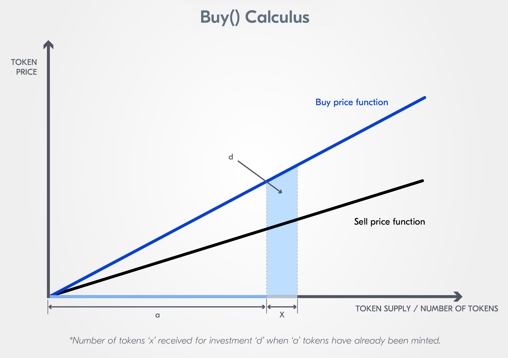
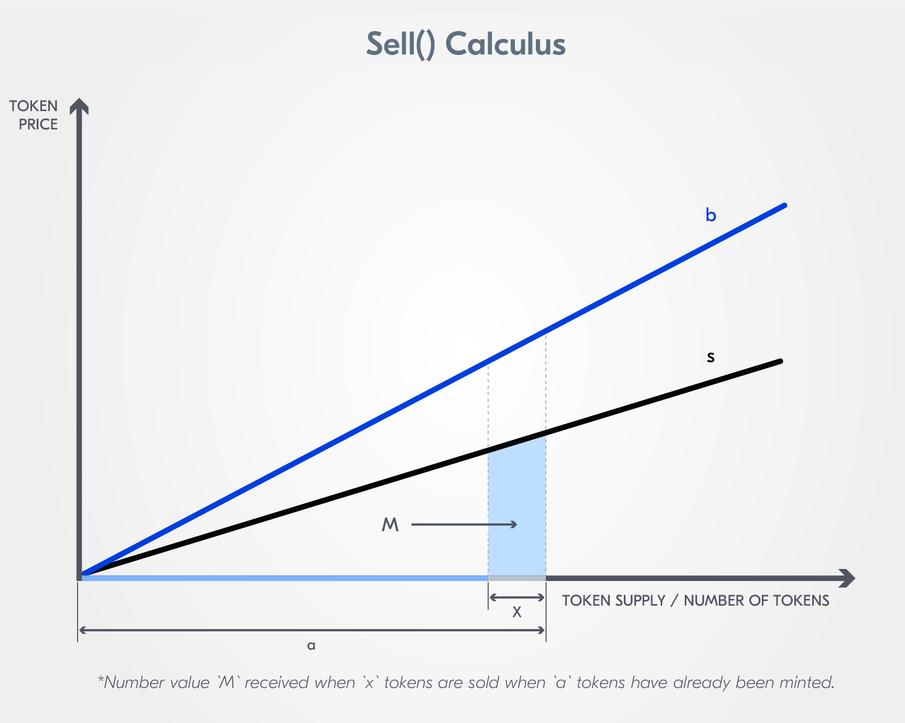
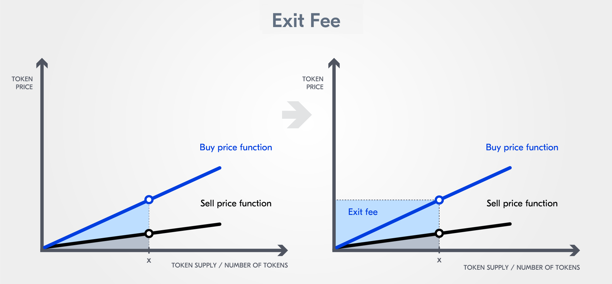

:::info Authors
This content was created by [B9Lab](https://tezos.b9lab.com/) under MIT Licence. It was then adapted and integrated by Nomadic Labs.
:::

This sample smart contract is an implementation of a rolling SAFE, also known as a continiuous programmable equity offering. To see the implementation in action, you may visit the [TZMINT web application](https://tzmint.b9lab.com/) hosted by [B9lab](https://b9lab.com/).

:::info
For a close look at the formulas used for calculation, we recommend consulting the [Continuous Organizations Whitepaper](https://github.com/C-ORG/whitepaper#annex) by Thibauld Favre. In this section, we present an implementation of the whitepaper's ideas.
:::

This smart contract is implemented in [SmartPy](https://smartpy.io/). The tokens are represented as a simple map to keep things simple. In addition, we store everything we want to keep track of on-chain. Here is the part of the contract that initializes the storage:

```python
self.init(
    organization  = organization,                                     # contract administrator
    ledger        = sp.map(l = {organization: sp.as_nat(preminted)}), # token ledger
    price         = initial_price,                                    # initial price before MFG
    total_tokens  = preminted,
    burned_tokens = burned_tokens,
    MFG           = MFG,                                              # minimal funding goal
    MPT           = sp.timestamp(...), # minimum period of time
    
    # percentage of the funds being held in the cash reserve
    funds_ratio_for_reserve    = funds_ratio_for_reserve,
    # percentage of the revenues being funneled into cash reserve
    revenues_ratio_for_reserve = revenues_ratio_for_reserve,

    buy_slope     = buy_slope,
    sell_slope    = sell_slope,
    minimumInvestment  = minimumInvestment,
    company_v          = company_valuation,
    base_currency      = base_currency,
    total_allocation   = total_allocation,
    stake_allocation   = stake_allocation,
    termination_events = termination_events,
    govRights          = govRights,
    company_name       = company_name,
    phase              = 0,                                              # starting under MFG
    total_investment   = sp.tez(0)
)
```

## Contract entrypoints

The contract has **five entrypoints**: [`buy()`](#the-buy-entrypoint), [`sell()`](#the-sell-entrypoint), [`pay()`](#the-pay-entrypoint), [`burn()`](#burning-tokens), [`close()`](#the-close-entrypoint).

:::info
You can find the [full smart contract](#full-contract) and tests at the bottom of this page.
:::

## The `buy()` entrypoint

`buy()` calculates the number of tokens for the sent amount of tez and it mints these tokens. In addition, it should send back the excess amount.

There are **two phases** in the offering regarding the buy price:

1. The **initial phase**: Before the minimum funding goal (MFG) is reached, the buy price is constant;
2. The **slopy phase** (i.e. post-MFG phase): Once the MFG is reached, the buy price increases for each issued token.

### Entrypoint

Let us first have a look at the `buy()` entrypoint and understand the conditions for calling the initial or slope buy function:

```python
# buy some tokens with sender's tez
@sp.entry_point
def buy(self):
#check the phase, dont sell or buy if closed
    sp.if self.data.phase != 2:
        # if token in intialization phase, the price is fixed and all funds are escrowed
        sp.if self.data.total_investment < self.data.MFG:
            # check the excess above MFG and send back
            sp.if sp.utils.mutez_to_nat(self.data.MFG - sp.amount - self.data.total_investment) < 0:
                sp.send(sp.sender, sp.amount - self.data.MFG + self.data.total_investment)
                self.buy_initial(self.data.MFG - self.data.total_investment)
            sp.else:
                self.buy_initial(sp.amount)
        # if initialization phase is past
        sp.else:
            self.data.phase = 1
            self.buy_slope(sp.amount)
```

You can see that we do not allow any action to take place after the closing phase.

We check for excess in two different instances:

* The excess in the `buy()` function, and
* The excess in the `buy_initial` and `buy_slope` function.

The excess check in the `buy()` function makes sure that a buy transaction does not surpass the MFG. The excess in the `buy_initial` and `buy_slope` function calculates the excess amount of tez after a buy transaction, so to say, your change.

### Initial phase - Pre-MFG

The buy price is determined during the **initial phase** by the following lines in the contract code:

```python
# initial phase, the price is fix
def buy_initial(self, amount):
    # calculate amount of tokens from sp.amount and the price
    token_amount = sp.local(
        "token_amount", 
        sp.ediv(
            amount, 
            self.data.price
            ).open_some("Fatal Error: Price is zero")
        )
```

In this phase, the calculation is `token_amount = amount/self.data.price`, where `amount` represents the number of tokens (in tez) sent with the transaction and `self.data.price` is the current price of the token.

After the calculation, `buy_initial` checks if any tokens can be issued. Then it adds the calculated number of tokens to the ledger linking them to the transaction sender. In case no record of the user exists, it creates an entry. The comments in the code should suffice as an explanation:

```python
# fail if no tokens can be issued with this amount of tez
sp.if sp.fst(token_amount.value) == sp.as_nat(0):
    sp.failwith("No token can be issued, please send more tez")
    
# check if the address owns tokens
sp.if self.data.ledger.contains(sp.sender):
    # add amount of the tokens into the ledger
    self.data.ledger[sp.sender] += sp.fst(token_amount.value)
sp.else:
    # put amount of the tokens into the ledger
    self.data.ledger[sp.sender] = sp.fst(token_amount.value)
    
# increase total amount of the tokens
self.data.total_tokens += sp.fst(token_amount.value)

# keep received funds in this contract as buyback reserve
# but send back the excess
sp.if sp.utils.mutez_to_nat(sp.snd(token_amount.value)) > 0:
    sp.send(sp.sender, sp.snd(token_amount.value))

# track how much is invested
self.data.total_investment = self.data.total_investment + amount - sp.snd(token_amount.value)
```

Before calculating the recent value of the total investments, the excess is calculated and sent back to the user.

### Post-MFG phase

Now, let us have a look at the **post-MFG phase**, so to say the "slopy phase" for the `buy()` function.

This time the calculation for the `token_amount` is more complex because of the linear price increase. We have to calculate the [area of the trapezium](https://github.com/C-ORG/whitepaper#buy-calculus) under the price function.

<p align="center">



</p>

Next, the contract does a **reserve calculation** to determine the amount of the excess, which has to be sent back to the transaction sender. In addition, each time someone buys a token, a part of the tez amount in the transaction is kept for the buyback reserve:

```python
# after initial phase, the price will increase
def buy_slope(self, amount):
    # calculate amount of tokens from amount of tez
    # see https://github.com/C-ORG/whitepaper#buy-calculus

    token_amount = sp.local(
        "token_amount", 
        self.square_root(
            2 * sp.utils.mutez_to_nat(amount) /self.data.buy_slope + 
            self.data.total_tokens * self.data.total_tokens
            ) - self.data.total_tokens
        )

    tez_amount = sp.local(
        "tez_amount",
        sp.as_nat(token_amount.value) * self.data.total_tokens * self.data.buy_slope/2 + 
        (sp.as_nat(token_amount.value) + self.data.total_tokens) * sp.as_nat(token_amount.value) * self.data.buy_slope/2
        )

    send_back = sp.local(
        "send_back",
        amount - sp.utils.nat_to_mutez(tez_amount.value)
        )
    # send tez that is too much
    sp.if sp.utils.mutez_to_nat(send_back.value) > 0:
        sp.send(sp.sender, send_back.value)

    # track how much is invested
    self.data.total_investment += sp.utils.nat_to_mutez(tez_amount.value)

    # fail if no tokens can be issued with this amount of tez
    sp.if sp.as_nat(token_amount.value) == sp.as_nat(0):
        sp.failwith("No token can be issued, please send more tez")
        
    # calculate buyback reserve from amount I*amount/100
    buyback_reserve = sp.local(
        "buyback_reserve", 
        sp.utils.nat_to_mutez(self.data.I * tez_amount.value / sp.as_nat(100))
        )
    
    company_pay = sp.local(
        "company_pay",
        amount - buyback_reserve.value
        )

    # send (100-I) * amount/100 of the received tez to the organization
    sp.send(self.data.organization, company_pay.value)
    # this will keep I * amount/100 in this contract as buyback reserve
        
    # check if the address owns tokens
    sp.if self.data.ledger.contains(sp.sender):
        self.data.ledger[sp.sender] += sp.as_nat(token_amount.value)
    sp.else:
        self.data.ledger[sp.sender] = sp.as_nat(token_amount.value)
                
    # increase total amount of the tokens
    self.data.total_tokens += sp.as_nat(token_amount.value)

    # set new price
    self.data.price = sp.utils.nat_to_mutez(self.data.buy_slope * self.data.total_tokens)
    self.modify_sell_slope(send_back.value + company_pay.value)
```

:::info
At the end of a `buy_slope` call, the contract updates the sell slope. This is something we address in the [next section](./rolling-safe-smart-contract-implementation-part-2).
:::

## The `pay()` entrypoint

A user can call the `pay()` entrypoint to send a payment to the organization via the smart contract. If `pay()` is called, the smart contract issues new tokens and by default sends them to the organization.

We allow payments in the slopy phase:

```python
@sp.entry_point
def pay(self):
    # check that the initial phase is over but not closed
    sp.verify(self.data.phase == 1)
    # see https://github.com/C-ORG/whitepaper#-revenues---pay
    buyback_reserve = sp.local(
        "local_amount", 
        sp.utils.nat_to_mutez(
            sp.utils.mutez_to_nat(sp.amount) * self.data.revenues_ratio_for_reserve / 100
            )
        )
    # send sp.amount - buyback_reserve to organization
    amount_to_sent = sp.amount - buyback_reserve.value
    sp.send(self.data.organization, amount_to_sent)

    # create the same amount of tokens a buy call would do
    token_amount = sp.local(
    "token_amount", 
    self.square_root(
        2 * sp.utils.mutez_to_nat(amount_to_sent) /self.data.buy_slope + 
        self.data.total_tokens * self.data.total_tokens
        ) - self.data.total_tokens
    )

    # give those tokens to the organization
    self.data.ledger[self.data.organization] = sp.as_nat(token_amount.value)
            
    # increase total amount of the tokens
    self.data.total_tokens += sp.as_nat(token_amount.value)
```

You can see, it mints the same number of tokens as if `buy()` would have been called. A part of the tez sent with the call is kept in the contract:

```python
# send sp.amount - buyback_reserve to organization
amount_to_sent = sp.amount - buyback_reserve.value
sp.send(self.data.organization, amount_to_sent)
```

## The `sell()` entrypoint

The `sell()` function determines the sell price after the MFG is reached. `sell` calculates the amount of tez for the sent number of tokens when a user wants to sell the offering's tokens.

<p align="center">



</p>

The sell price is lower than the buy price.

:::info
If you are wondering why the sell price is lower than the buy price, make sure to go through the basics in the [Continuous Organizations Whitepaper](https://github.com/C-ORG/whitepaper).
:::

### Entrypoint

Let us have a look at the `sell` **entrypoint**:

```python
    @sp.entry_point
    def sell(self, params):
        sp.if self.data.phase == 0:
            self.sell_initial(params.amount)
        sp.if self.data.phase == 1:
            self.sell_slope(params.amount)
```

This seems less complex than the buy entrypoint. The reason is that we cannot change the phase by selling:

```python
def sell_initial(self, amount):
    # check if the address owns tokens
    sp.if self.data.ledger.contains(sp.sender):
    # check if the address owns enough tokens
        sp.if self.data.ledger[sp.sender] >= sp.as_nat(amount):
            # calculate the amount of tez to send
            # see https://github.com/C-ORG/whitepaper#-investments---sell
            pay_amount = sp.local(
                "pay_amount", 
                sp.utils.mutez_to_nat(self.data.price) * sp.as_nat(amount)
            )
            # burn the amount of tokens sold
            self.burn_intern(amount)
            # send pay_amount tez to the sender of the transaction
            sp.send(sp.sender, sp.utils.nat_to_mutez(pay_amount.value))
            self.modify_sell_slope(sp.utils.nat_to_mutez(pay_amount.value))
```

In the initial phase, one can sell a token and get 100% of the buy price, which remains the same until the MFG is reached. We do not use the `sell_slope` in the initial phase, because the price is fixed but we keep it updated.

In the post-MFG phase, we use the `sell_slope` to calculate the amount of tez to be sent:

```python
def sell_slope(self, amount):
# check if the address owns tokens
sp.if self.data.ledger.contains(sp.sender):
# check if the address owns enough tokens
    sp.if self.data.ledger[sp.sender] >= sp.as_nat(amount):
        # calculate the amount of tez to send
        # see https://github.com/C-ORG/whitepaper#-investments---sell
        pay_amount = sp.local(
            "pay_amount", 
            sp.as_nat(
                self.data.total_tokens * sp.as_nat(amount) * self.data.sell_slope - 
                sp.as_nat(amount * amount) * self.data.sell_slope / 2 
                ) + 
                self.data.sell_slope * sp.as_nat(amount) * 
                self.data.burned_tokens * self.data.burned_tokens /
                sp.as_nat(2 * (self.data.total_tokens - self.data.burned_tokens) )
        )
        # burn the amount of tokens sold
        self.burn_intern(amount)
        # send pay_amount tez to the sender of the transaction
        sp.send(sp.sender, sp.utils.nat_to_mutez(pay_amount.value))
        self.modify_sell_slope(sp.utils.nat_to_mutez(pay_amount.value))
```

The calculation of `pay_amount` looks a bit messy because it depends on `total_tokens`, `self.data.sell_slope`, `params.amount` (the amount of tez sent with the transaction), and `self.data.burned_tokens`:

<p align="center">


</p>

In the formula, our `pay_amount` represents `M`, `x` is the amount of tez sent with the transaction, `x'` is the number of burned tokens, and `a` represents the total number of tokens issued.

As you can see, the sell slope increases if tokens are burned but the buy slope is always constant. This means that the entrypoint `burn` allows for the organization to increase the sell price.

You can see that the contract `burn`s the number of tokens sold.

### Calculating the sell slope

Compared to the buy price calculation, this time it is a bit more complex because we do not have a linear price function for the sell price. The sell slope changes over time. The sell slope depends on the reserve, which is represented by the contract balance:


`a` represents the total number of tokens issued.

```python
# s calculus after each transaction
def modify_sell_slope(self, send_back):
    sp.if self.data.total_tokens != 0:
        self.data.sell_slope = 2 * sp.utils.mutez_to_nat(sp.balance - send_back) / (self.data.total_tokens * self.data.total_tokens)
```

The value of `sp.balance` is the balance of the contract **after the transaction is received but before the contract sends any tez back to the user**. So the helper function needs to know the number of tez sent back.

### Burning tokens

Because burning is a part of the selling process, we define an internal function to burn tokens:

```python
# internal burn function will be called by the entrypoints burn and sell
def burn_intern(self, amount):
    # check if the address owns tokens
    sp.if self.data.ledger.contains(sp.sender):
        # check if the address owns enough tokens
        sp.if self.data.ledger[sp.sender] >= sp.as_nat(amount):
            # "burn"
            self.data.ledger[sp.sender] = sp.as_nat(self.data.ledger[sp.sender] - sp.as_nat(amount))
            self.data.burned_tokens += sp.as_nat(amount)
```

In addition, the contract offers a `burn` entrypoint, in case a token holder wants to burn its tokens:

```python
@sp.entry_point
def burn(self, params):
    self.burn_intern(params.amount)
    self.modify_sell_slope()
```

:::info What is understood by burning tokens?
When a token is supposed to be removed from circulation, one can "burn" them. Often, burning is done by sending tokens to an unusable wallet address, a so-called burn address. Tokens can then no longer be accessed or assigned to an address. This is the case when working with tez.

Since in our contract, the issuer mints its own tokens, there is no need for a burn address.
:::

In the above code, an important aspect to notice is that we do not modify the total number of tokens issued if we burn a token. Thus, the buy price is not affected.

Anyway, there is another mechanism by which users/investors can gain profits from buying tokens: **closing**.

## The `close()` entrypoint

:::tip TODO
If you want to again take a look at the closing phase, the [introduction section of this chapter](/defi/rolling-safe/presentation/#what-is-a-rolling-safe) includes a section on _Stages in a Rolling SAFE_.
:::

<p align="center">



</p>

If the [closing phase](https://github.com/C-ORG/whitepaper#closing) is triggered, the contract buys back each token for the price of the last buy price and pays the token owners their part of the exit fee:

```python
@sp.entry_point
def close(self):
    # check if MPT is reached
    sp.verify(sp.now - self.data.MPT >= 0)

    # check that the initial phase is over but not closed
    sp.verify(self.data.phase == 1)

    # verify this is called by the org
    sp.verify(sp.sender == self.data.organization)

    # check the correct amount of tez is sent
    closing_sell_price= sp.local(
        "closing_sell_price",
        self.data.b * self.data.total_tokens
        )

    closing_sell_amount= sp.local(
        "closing_sell_amount",
        closing_sell_price.value * sp.as_nat(self.data.total_tokens - self.data.burned_tokens)
        )

    sp.if sp.balance < sp.utils.nat_to_mutez(closing_sell_amount.value):
        sp.failwith("Please send more tez for the closing")

    sp.for account in self.data.ledger.items():
        sp.send(account.key, sp.utils.nat_to_mutez(account.value * closing_sell_price.value))
    
    self.data.phase = 2
```

So, the sum of the payments is the exit fee.

Only the contract owner can call `close`. For the `close` transaction to be successful, the contract owner needs to send the exit fee. Note that the minimum period of time (MPT) must be reached if the organization wants to trigger the closing.

Notice that if the data in the ledger increases in size, closing costs more because of:

```python
sp.for account in self.data.ledger.items():
    sp.send(account.key, sp.utils.nat_to_mutez(account.value * closing_sell_price.value))
```

We do not expect this to be a problem because one needs to pay tez to increase the size of the ledger. Alternatively we can create another entrypoint which can be called by the investors to get their tez.

## Full contract

```python
from datetime import datetime, timedelta
import smartpy as sp

class TestHelper:
    # Helper functions for the price testing
    @staticmethod
    def buy_price_helper_initial(buyer, tez_amount, buyer_amount_of_tokens, const_price, scenario, contract, first=False):
        buyer_amount_of_tokens = 0
        # check if user is in the ledger
        if not first:
            buyer_amount_of_tokens = scenario.compute(contract.data.ledger[buyer])
        balance = scenario.compute(contract.balance)
        # call the buy entrypoint
        scenario += contract.buy().run(sender = buyer, amount = tez_amount)
        # check that the excess is sent back
        token_amount = sp.utils.mutez_to_nat(tez_amount) // sp.utils.mutez_to_nat(const_price)
        payed_tez_amount = token_amount * sp.utils.mutez_to_nat(const_price)
        scenario.verify(contract.balance ==  sp.utils.nat_to_mutez(payed_tez_amount) + balance)
        # check that correct amount of tokens is issued
        buyer_amount_of_last_buyed_tokens = scenario.compute(sp.as_nat(contract.data.ledger[buyer]- buyer_amount_of_tokens))
        scenario.verify(buyer_amount_of_last_buyed_tokens == token_amount)
        return token_amount

    @staticmethod
    def buy_price_helper_left(tez_amount, scenario, contract):
        # left side of the equation, have a look at the content for more information
        return scenario.compute(2 * sp.utils.mutez_to_nat(tez_amount) / contract.data.buy_slope + contract.data.total_tokens * contract.data.total_tokens)

    @staticmethod
    def buy_price_helper_right(buyer, buyer_amount_of_last_buyed_tokens, total_amount, scenario, contract):
        # right side of the equation, have a look at the content for more information
        return scenario.compute(buyer_amount_of_last_buyed_tokens*buyer_amount_of_last_buyed_tokens + total_amount*total_amount + 2*total_amount*buyer_amount_of_last_buyed_tokens)

    @staticmethod
    def buy_price_helper_slope(buyer, tez_amount, buyer_old_token_amount, scenario, contract, first= False):
        buyer_amount_of_tokens = 0
        # check if user is in the ledger
        if not first:
            buyer_amount_of_tokens = scenario.compute(contract.data.ledger[buyer])
        # check correct that buyer has the correct amount of tokens
        scenario.verify(buyer_amount_of_tokens == buyer_old_token_amount)
        total_amount = scenario.compute(contract.data.total_tokens)
        buy_price_square = TestHelper.buy_price_helper_left(tez_amount, scenario, contract)
        # call buy entrypoint
        scenario += contract.buy().run(sender = buyer, amount = tez_amount)
        buyer_amount_of_last_buyed_tokens = scenario.compute(sp.as_nat(contract.data.ledger[buyer]- buyer_amount_of_tokens))
        right_side = TestHelper.buy_price_helper_right(buyer, buyer_amount_of_last_buyed_tokens, total_amount, scenario, contract)
        # check if the correct amount of tokens is issued
        # which is also a check of the buy price
        scenario += contract.square_root_test(x = buy_price_square, y = right_side)
        return buyer_amount_of_last_buyed_tokens
    
    def sell_price_helper_slope(tokens, scenario, contract):
        pay_amount = scenario.compute(sp.as_nat(contract.data.total_tokens * sp.as_nat(tokens) * contract.data.sell_slope -
                        sp.as_nat(tokens * tokens) * contract.data.sell_slope / 2
                        ) +
                        contract.data.sell_slope * sp.as_nat(tokens) *
                        contract.data.burned_tokens * contract.data.burned_tokens /
                        sp.as_nat(2 * (contract.data.total_tokens - contract.data.burned_tokens)))
        return pay_amount

class Utils:
    # square root for buy and sell calculus
    @sp.global_lambda
    def square_root(x):
        sp.verify(x >= 0)
        y = sp.local('y', x)
        sp.while y.value * y.value > x:
            y.value = (x // y.value + y.value) // 2
        sp.verify((y.value * y.value <= x) & (x < (y.value + 1) * (y.value + 1)))
        sp.result(y.value)

    #define a private entry point for testing
    @sp.entry_point(private = True)
    def square_root_test(self, params):
        sp.verify(self.square_root(params.x) == self.square_root(params.y))

# PEQ contract sample
# see https://github.com/C-ORG/whitepaper for the definitions

# Contract needs an organization(administrator), a minimal funding goal(MFG) in mutez
# and a minimum period of time(MPT) in years for initialization

class PEQ(sp.Contract, Utils):
    def __init__(
                self,
                organization,
                initial_price,
                MFG,
                MPT,
                buy_slope,
                sell_slope,
                preminted,
                funds_ratio_for_reserve,
                revenues_ratio_for_reserve,
                minimumInvestment =sp.tez(1),
                burned_tokens = 0,
                company_valuation,
                base_currency = "tez",
                total_allocation,
                stake_allocation,
                termination_events,
                govRights,
                company_name
                ):

        self.init(
            organization  = organization,                                     # contract administrator
            ledger        = sp.map(l = {organization: sp.as_nat(preminted)}), # token ledger
            price         = initial_price,                                    # initial price before MFG
            total_tokens  = preminted,
            burned_tokens = burned_tokens,
            MFG           = MFG,                                              # minimal funding goal
            MPT           = sp.timestamp(
                                        int(
                                            (datetime.now() + timedelta(days = 365 * MPT)).timestamp()
                                        )
                                    ), # minimum period of time
            funds_ratio_for_reserve    = funds_ratio_for_reserve,   # percentage of the funds being held in the cash reserve
            revenues_ratio_for_reserve = revenues_ratio_for_reserve,   # percentage of the revenues being funneled into cash reserve
            buy_slope     = buy_slope,
            sell_slope    = sell_slope,
            minimumInvestment  = minimumInvestment,
            company_v          = company_valuation,
            base_currency      = base_currency,
            total_allocation   = total_allocation,
            stake_allocation   = stake_allocation,
            termination_events = termination_events,
            govRights          = govRights,
            company_name       = company_name,
            phase              = 0,                                              # starting under MFG
            total_investment   = sp.tez(0)
            )

    # sell_slope calculation after each transaction
    def modify_sell_slope(self, send_back = sp.tez(0)):
        sp.if self.data.total_tokens != 0:
           self.data.sell_slope = 2 * sp.utils.mutez_to_nat(sp.balance - send_back) / (self.data.total_tokens * self.data.total_tokens)
    # initial phase, the price is fix
    def buy_initial(self, amount):
        # calculate amount of tokens from sp.amount and the price
        token_amount = sp.local(
            "token_amount",
            sp.ediv(
                amount,
                self.data.price
                ).open_some("Fatal Error: Price is zero")
            )

        # fail if no tokens can be issued with this amount of tez
        sp.if sp.fst(token_amount.value) == sp.as_nat(0):
            sp.failwith("No token can be issued, please send more tez")

        # check if the address owns tokens
        sp.if self.data.ledger.contains(sp.sender):
            # add amount of the tokens into the ledger
            self.data.ledger[sp.sender] += sp.fst(token_amount.value)
        sp.else:
            # put amount of the tokens into the ledger
            self.data.ledger[sp.sender] = sp.fst(token_amount.value)

        # increase total amount of the tokens
        self.data.total_tokens += sp.fst(token_amount.value)

        # keep received funds in this contract as buyback reserve
        # but send back the excess
        sp.if sp.utils.mutez_to_nat(sp.snd(token_amount.value)) > 0:
            sp.send(sp.sender, sp.snd(token_amount.value))

        # track how much is invested
        self.data.total_investment = self.data.total_investment + amount - sp.snd(token_amount.value)

    # after initial phase, the price will increase
    def buy_slope(self, amount):
        # calculate amount of tokens from amount of tez
        # see https://github.com/C-ORG/whitepaper#buy-calculus

        token_amount = sp.local(
            "token_amount",
            self.square_root(
                2 * sp.utils.mutez_to_nat(amount) / self.data.buy_slope +
                self.data.total_tokens * self.data.total_tokens
                ) - self.data.total_tokens
            )

        tez_amount = sp.local(
            "tez_amount",
            sp.as_nat(token_amount.value) * self.data.total_tokens * self.data.buy_slope / 2 +
            (sp.as_nat(token_amount.value) + self.data.total_tokens) * sp.as_nat(token_amount.value) * self.data.buy_slope / 2
            )

        send_back = sp.local(
            "send_back",
            amount - sp.utils.nat_to_mutez(tez_amount.value)
            )

        # send tez that is too much
        sp.if sp.utils.mutez_to_nat(send_back.value) > 0:
            sp.send(sp.sender, send_back.value)

        # track how much is invested
        self.data.total_investment += sp.utils.nat_to_mutez(tez_amount.value)

        # fail if no tokens can be issued with this amount of tez
        sp.if sp.as_nat(token_amount.value) == sp.as_nat(0):
            sp.failwith("No token can be issued, please send more tez")

        # calculate buyback reserve from amount I*amount/100
        buyback_reserve = sp.local(
            "buyback_reserve",
            sp.utils.nat_to_mutez(self.data.funds_ratio_for_reserve * tez_amount.value / sp.as_nat(100))
            )

        company_pay = sp.local(
            "company_pay",
            amount - buyback_reserve.value
            )

        # send (100-I) * amount/100 of the received tez to the organization
        sp.send(self.data.organization, company_pay.value)
        # this will keep funds_ratio_for_reserve * amount/100 in this contract as buyback reserve

        # check if the address owns tokens
        sp.if self.data.ledger.contains(sp.sender):
            self.data.ledger[sp.sender] += sp.as_nat(token_amount.value)
        sp.else:
            self.data.ledger[sp.sender] = sp.as_nat(token_amount.value)

        # increase total amount of the tokens
        self.data.total_tokens += sp.as_nat(token_amount.value)

        # set new price
        self.data.price = sp.utils.nat_to_mutez(self.data.buy_slope * self.data.total_tokens)
        self.modify_sell_slope(send_back.value + company_pay.value)

    # buy some tokens with sender's tez
    @sp.entry_point
    def buy(self):
    #check the phase, dont sell or buy if closed
        sp.if self.data.phase != 2:
            # if token in intialization phase, the price is fixed and all funds are escrowed
            sp.if self.data.total_investment < self.data.MFG:
                # check the excess above MFG and send back
                sp.if self.data.MFG - sp.amount < self.data.total_investment:
                    sp.send(sp.sender, sp.amount - (self.data.MFG - self.data.total_investment))
                    self.buy_initial(self.data.MFG - self.data.total_investment)
                sp.else:
                    self.buy_initial(sp.amount)
            # if initialization phase is past
            sp.else:
                self.data.phase = 1
                self.buy_slope(sp.amount)

    # internal burn function will be called by the entry points burn and sell
    def burn_intern(self, amount):
        burn_amount= sp.as_nat(amount)
        # check if the address owns tokens
        sp.if self.data.ledger.contains(sp.sender):
            # check if the address owns enough tokens
            sp.if self.data.ledger[sp.sender] >= burn_amount:
                # "burn"
                self.data.ledger[sp.sender] = sp.as_nat(self.data.ledger[sp.sender] - burn_amount)
                self.data.burned_tokens += burn_amount

    @sp.entry_point
    def burn(self, params):
        self.burn_intern(params.amount)
        self.modify_sell_slope()

    def sell_initial(self, amount):
        # check if the address owns tokens
        sp.if self.data.ledger.contains(sp.sender):
        # check if the address owns enough tokens
            sp.if self.data.ledger[sp.sender] >= sp.as_nat(amount):
                # calculate the amount of tez to send
                # see https://github.com/C-ORG/whitepaper#-investments---sell
                pay_amount = sp.local(
                    "pay_amount",
                    sp.utils.mutez_to_nat(self.data.price) * sp.as_nat(amount)
                )
                # burn the amount of tokens sold
                self.burn_intern(amount)
                # send pay_amount tez to the sender of the transaction
                sp.send(sp.sender, sp.utils.nat_to_mutez(pay_amount.value))
                self.modify_sell_slope(sp.utils.nat_to_mutez(pay_amount.value))

    def sell_slope(self, amount):
        # check if the address owns tokens
        sp.if self.data.ledger.contains(sp.sender):
        # check if the address owns enough tokens
            sp.if self.data.ledger[sp.sender] >= sp.as_nat(amount):
                # calculate the amount of tez to send
                # see https://github.com/C-ORG/whitepaper#-investments---sell
                pay_amount = sp.local(
                    "pay_amount",
                    sp.as_nat(
                        self.data.total_tokens * sp.as_nat(amount) * self.data.sell_slope -
                        sp.as_nat(amount * amount) * self.data.sell_slope / 2
                        ) +
                        self.data.sell_slope * sp.as_nat(amount) *
                        self.data.burned_tokens * self.data.burned_tokens /
                        sp.as_nat(2 * (self.data.total_tokens - self.data.burned_tokens) )
                )
                # burn the amount of tokens sold
                self.burn_intern(amount)
                # send pay_amount tez to the sender of the transaction
                sp.send(sp.sender, sp.utils.nat_to_mutez(pay_amount.value))
                self.modify_sell_slope(sp.utils.nat_to_mutez(pay_amount.value))

    @sp.entry_point
    def sell(self, params):
        sp.if self.data.phase == 0:
            self.sell_initial(params.amount)
        sp.if self.data.phase == 1:
            self.sell_slope(params.amount)

    @sp.entry_point
    def close(self):
        #check MPT is over
        sp.verify(sp.now - self.data.MPT >= 0)

        # check that the initial phase is over but not closed
        sp.verify(self.data.phase == 1)

        # verify this is called by the org
        sp.verify(sp.sender == self.data.organization)

        # check the correct amount of tez is sent
        closing_sell_price= sp.local(
            "closing_sell_price",
            self.data.buy_slope * self.data.total_tokens
            )

        closing_sell_amount= sp.local(
            "closing_sell_amount",
            closing_sell_price.value * sp.as_nat(self.data.total_tokens - self.data.burned_tokens)
            )

        sp.if sp.balance < sp.utils.nat_to_mutez(closing_sell_amount.value):
            sp.failwith("Please send more tez for the closing")

        sp.for account in self.data.ledger.items():
            sp.send(account.key, sp.utils.nat_to_mutez(account.value * closing_sell_price.value))

        self.data.phase = 2

    @sp.entry_point
    def pay(self):
        # check that the initial phase is over but not closed
        sp.verify(self.data.phase == 1)
        # see https://github.com/C-ORG/whitepaper#-revenues---pay
        buyback_reserve = sp.local(
            "local_amount", 
            sp.utils.nat_to_mutez(
                sp.utils.mutez_to_nat(sp.amount) * self.data.revenues_ratio_for_reserve / 100
                )
            )
        # send sp.amount - buyback_reserve to organization
        amount_to_sent = sp.amount - buyback_reserve.value
        sp.send(self.data.organization, amount_to_sent)

        # create the same amount of tokens a buy call would do
        token_amount = sp.local(
        "token_amount", 
        self.square_root(
            2 * sp.utils.mutez_to_nat(d) /self.data.buy_slope + 
            self.data.total_tokens * self.data.total_tokens
            ) - self.data.total_tokens
        )

        # give those tokens to the organization
        self.data.ledger[self.data.organization] = sp.as_nat(token_amount.value)
                
        # increase total amount of the tokens
        self.data.total_tokens += sp.as_nat(token_amount.value)

@sp.add_test(name= "Initialization")
def initialization():

    # dummy addresses
    organization = sp.address("tz1hRTppkUow3wQNcj9nZ9s5snwc6sGC8QHh")
    buyer1 = sp.address("tz1xbuyer1")
    buyer2 = sp.address("tz1xbuyer2")

    # initial price
    initial_price = sp.tez(1)

    contract= PEQ(
        organization = organization,
        buy_slope = 2000,
        sell_slope = 1000,
        initial_price = initial_price,
        MFG = sp.tez(1000),
        preminted = 0,
        MPT = 1, # minimal period of time in years
        funds_ratio_for_reserve = 90,
        revenues_ratio_for_reserve = 80,
        company_valuation = 1000000,
        total_allocation = 4000,
        stake_allocation = 500,
        termination_events = ["Sale", "Bankruptcy"],
        govRights = "None",
        company_name = "TZMINT Demo"
        )

    buy_price_helper_initial = TestHelper.buy_price_helper_initial
    buy_price_helper_slope = TestHelper.buy_price_helper_slope
    sell_price_helper_slope = TestHelper.sell_price_helper_slope

    scenario = sp.test_scenario()
    scenario += contract

    # buy some tokens in the intial phase, verify the token amounts and the buy price
    # and verify that the excess is sent back
    buyer1_token_amount  = buy_price_helper_initial(buyer1, (sp.tez(500) + sp.mutez(1000)), 0, initial_price, scenario, contract, True)
    buyer2_token_amount  = buy_price_helper_initial(buyer2, (sp.tez(200) + sp.mutez(3000)), 0, initial_price, scenario, contract, True)
    buyer1_token_amount += buy_price_helper_initial(buyer1, sp.tez(300), 0, initial_price, scenario, contract)

    # check that the price has not changed
    scenario.verify(contract.data.price == initial_price)
    # check that MFG is reached but surpassed
    scenario.verify(contract.data.MFG == contract.balance)

    # buy some tokens in the slopy phase
    # verify the amount of issued tokens, the buy price
    buyer1_token_amount += buy_price_helper_slope(buyer1, tez_amount= sp.tez(50), buyer_old_token_amount= buyer1_token_amount, scenario= scenario, contract= contract)
    buyer2_token_amount += buy_price_helper_slope(buyer2, tez_amount = sp.tez(400), buyer_old_token_amount = buyer2_token_amount, scenario = scenario, contract = contract)
    buyer1_token_amount += buy_price_helper_slope(buyer1, tez_amount = sp.tez(100), buyer_old_token_amount = buyer1_token_amount, scenario = scenario, contract = contract)
    # verify that the excess is sent back
    buyer1_token_amount += buy_price_helper_slope(buyer1, tez_amount = sp.mutez(51245389), buyer_old_token_amount = buyer1_token_amount, scenario = scenario, contract = contract)

    # now sell some tokens
    # check that the correct amount of tez is sent if one token is sold
    tez_amount = 100
    balance = scenario.compute(contract.balance)
    pay_amount = sell_price_helper_slope(tez_amount, scenario, contract)
    scenario += contract.sell(amount=tez_amount).run(sender = buyer1)
    scenario.verify(contract.balance == balance- sp.utils.nat_to_mutez(pay_amount))
    # update buyer1_token_amount
    buyer1_token_amount= sp.as_nat(buyer1_token_amount- tez_amount)
    # verify the the amount of tokens for buyer1
    scenario.verify(buyer1_token_amount == contract.data.ledger[buyer1])

    # do some other buy calls and verify the token amount and the buy price
    buyer1_token_amount+=buy_price_helper_slope(buyer1, tez_amount= sp.tez(150), buyer_old_token_amount= buyer1_token_amount, scenario= scenario, contract= contract)
    buyer1_token_amount+=buy_price_helper_slope(buyer1, tez_amount= sp.tez(150), buyer_old_token_amount= buyer1_token_amount, scenario= scenario, contract= contract)
    buyer1_token_amount+=buy_price_helper_slope(buyer1, tez_amount= sp.tez(150), buyer_old_token_amount= buyer1_token_amount, scenario= scenario, contract= contract)
    buyer1_token_amount+=buy_price_helper_slope(buyer1, tez_amount= sp.tez(50), buyer_old_token_amount= buyer1_token_amount, scenario= scenario, contract= contract)

    # check the correct amount of tez is sent if one token is sold
    # this will also verify the price for a token
    tez_amount = 1
    balance = scenario.compute(contract.balance)
    pay_amount = sell_price_helper_slope(tez_amount, scenario, contract)
    scenario += contract.sell(amount=1).run(sender = buyer1)
    scenario.verify(contract.balance == balance- sp.utils.nat_to_mutez(pay_amount))

    # Check closing before MPT
    scenario += contract.close().run(sender = organization, valid=False, amount = sp.tez(2400), now= sp.timestamp_from_utc_now().add_days(360))
    # Check closing with wrong account
    scenario += contract.close().run(sender = buyer1, valid=False, now= sp.timestamp_from_utc_now().add_days(365))
    # Check closing with too less tez
    scenario += contract.close().run(sender = organization, valid=False, amount = sp.tez(300), now= sp.timestamp_from_utc_now().add_days(365))
    # Check closing with correct amount of tez
    scenario += contract.close().run(sender = organization, amount = sp.tez(2400), now= sp.timestamp_from_utc_now().add_days(365))

```
