# Getting Started with the Tezos SDK for Unity

Start by checking our [Getting started video](https://youtu.be/0ouzNVxYI9g).

In this Getting Started guide we will cover the following five steps, which are the essentials necessary to begin using our Tezos SDK to leverage the Tezos blockchain for your own Unity game or app development. If there's terminology here you're not familiar with, don't worry; it will be covered when we get to each step:

- Installation of the Unity Editor, if you don't already have that
- Installation of our Tezos Integration SDK in the Unity Editor, within a new project
- Getting a Tezos-compatible wallet as an app or browser plugin (we'll use the **Temple** wallet for our [Inventory Sample Game](/gaming/unity-sdk/inventory-sample-game)) 
- Creating a wallet account for a test network (`ghostnet`) and getting test currency from an appropriate faucet
- Linking this wallet account with the new Unity project

At that point your Unity app will be connected to the Tezos GhostNet test network via your specific wallet address, and you will then be able to invoke specific functionality on smart contracts you have created and deployed to GhostNet, such as those we demonstrate in our [Inventory Sample Game](/gaming/unity-sdk/inventory-sample-game).  Please see the [Inventory Sample Game](/gaming/unity-sdk/inventory-sample-game), and explore that project yourself, to learn how we've implemented a range of common in-game blockchain transactions involving both non-fungible and fungible tokens.  Our [API Documentation](/gaming/unity-sdk/api-documentation) details the exposed methods of our SDK, both for establishing wallet connections and for calling specific smart-contract entrypoints and Tezos data-view functions.  Finally, the last part of our documentation, [Suggestions for Further Use](/gaming/unity-sdk/other-use-cases), suggests a range of potential use cases for leveraging our Tezos integration SDK beyond those implemented in our own [Inventory Sample Game](/gaming/unity-sdk/inventory-sample-game).

For the most part, this SDK documentation will assume users who already have some (or substantial) familiarity with Unity game development, though perhaps little to none with leveraging Web3 generally or with using the Tezos blockchain in particular. If you are closely familiar with each of these domains, you might want to skip "Getting Started" and go directly to the [API documentation](/gaming/unity-sdk/api-documentation), though the [Inventory Sample Game](/gaming/unity-sdk/inventory-sample-game) could still be quite useful in helping you visualize how you might use the SDK in your own game development, for use cases that we either have or haven't addressed.

## Installing the Unity Editor 

Key points:
- Make sure you install Unity Editor version 2021.3.13 or above
- Make sure you enable iOS Build Support, even if you don't plan to build for iOS

Unity releases significant new versions of their Editor multiple times each year.  As with any software, it may seem an unnecessary chore to download and master each new release; and many seasoned Unity developers may still be working with older Editor releases, from 2019 or even before.

The present integration SDK has been developed and tested primarily in Unity 2021.3.13. If you're currently working with an earlier editor, you will need to install version 2021.3.13 or above.

Happily, though, newer versions of Unity do not automatically *displace* older ones; you can run 2021.3.13 and still concurrently run a 2018 version, if you want to continue maintaining, for example, an older game that refuses to build in a more recent editor.  Downloading and managing different Unity installations can be done most easily through the **Installs** tab of your **Unity Hub**.  Unity Hub allows you to keep track of not only your various installs (versions), but also your various projects, and which project was last opened on which version of the editor.  It is also the best way to keep track of which **modules** are installed on which editor version --what you'll need to publish your games or dApps to different platforms such as Windows, iOS, Android, WebGL (games running in a web browser) or other platforms--and to install new modules as needed. 

The following screenshot shows Unity Hub with two Editor installs: 2018.3.12f1 with modules for WebGL and Windows platforms, and 2021.3.5f1 (the LTS designates Long Term Support) with modules for Android, WebGL, iOS and Windows.  Note that from the gear icon of either install I could add further modules (support for additional platforms) if that became necessary:

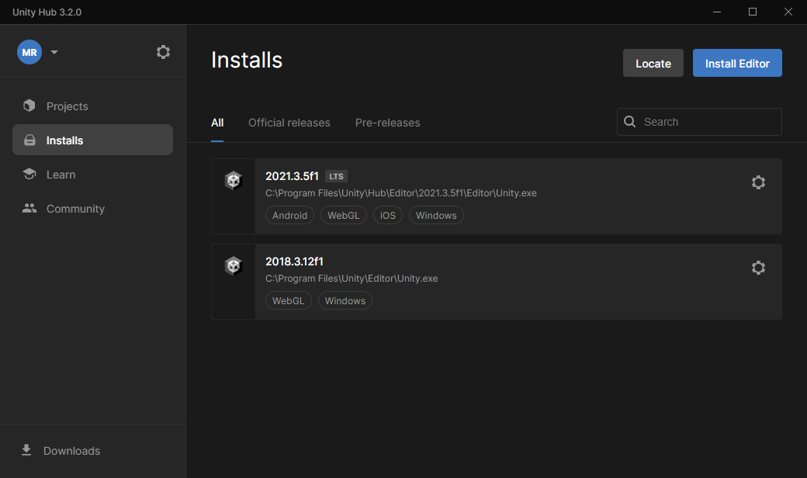

The current version of this SDK supports connecting Unity games and dApps to the Tezos network on the following platforms: WebGL, iOS mobile, Android and Desktop. 

If you are in fact brand-new to Unity, go to https://unity.com/download to download the Unity editor for free, if you are either a student or a person or organization that has made less than $100k from gaming in the past year (see https://store.unity.com/#plans-individual for details on plans and pricing for gaming professionals and large organizations).  You'll be guided to download the Unity Hub first, then (from the blue **Install Editor** button seen above) to select the latest supported editor or a different editor version to download via the Hub.  You'll also create a free account at Unity.com.  

Note that the free "personal" Unity editor contains more or less the full core feature-set of the 'paid/professional versions, and is certainly more than enough to get you well down the path to creating 2D and 3D games, apps and environments for desktop, mobile and web, with rich support for AR, VR and now Web3 development.  The Unity home pages offer links to a wealth of resources to get you started in these various directions, and Youtube has literally thousands of good 3rd-party tutorial videos on all conceivable topics .  So if you are brand-new to Unity, take a look at the available learning resources, create a few demo projects, and when you're ready for Web3 come back to this documentation and let's take the next step.

The current version of the SDK requires iOS Build Support to be enabled, even if you don't plan to build for iOS. This will be fixed in a future update. In the meantime, if you have not enabled it, go to the "Installs" tab of your Unity hub, and click on the settings icon, to the right of the editor, and make sure you enable iOS Build Support.

## Installing the Tezos SDK for Unity

The latest version of Tezos SDK for Unity can be [downloaded from github](https://github.com/trilitech/tezos-unity-sdk).

As we've indicated, the Unity editor can create *many* different kinds of content, for many different platforms; so  while all of the software necessary for the most common gaming-engine uses cases comes installed by default with any Unity editor install (you can reduce or increase these default libraries during the installation process), the remainder is generally handled through plug-ins which you install separately, as needed, and which Unity calls **Packages**.  These packages are added to an existing project from within the editor, and a huge number of them can be accessed via the Package Manager ('Window' tab > 'Package Manager' > 'Packages: Unity Registry').  

### Create a New Unity Project

Unless you are extremely familiar with Unity, it is probably best to create a new, dedicated project to test out any new SDK such as this one.  You are also best off creating a 'New Project' from the Projects tab of the **Unity Hub**: among other things, this makes it easiest to choose which <u>platforms</u> you may want this project to build to, as well as whether you want to use a 2D, 3D, VR or AR project template, with our without example scenes and assets,  In fact, while you can also choose File > New Project from within the editor itself, in newer releases this action will simply launch Unity Hub anyway.   

Give some thought to which project template you want to use for this new project.  By default, the **3D Core** template will be selected for new projects.  If you're certain that you want to create a 2D project for your first Web3 integration, the **2D Core** template (or 2D mobile core) will present a more streamlined interface without a lot of irrelevant controls.  As you'll see, our own [Inventory Sample Game](/gaming/unity-sdk/inventory-sample-game) uses a 2D template.  But the Tezos SDK would provide exactly the same Web3 integration in a 3D game space, and indeed the 2D 'canvases' on which we display information can easily be integrated into an otherwise 3D game.  Whichever template you choose, be sure to give your new project a meaningful **name** (like 'My first Tezos integration project') so you don't just end up with the default My project (1), My project 2, etc.   

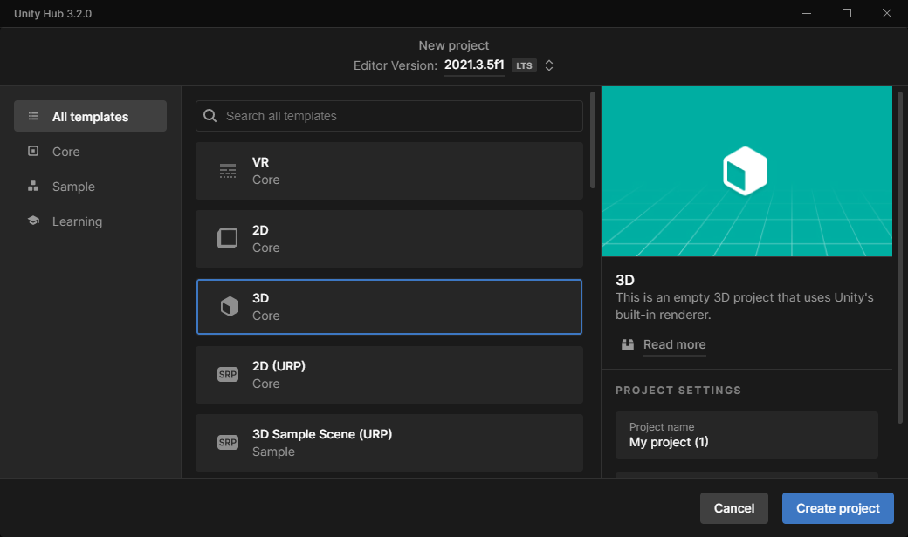

Once the new project has built and the editor has opened, take a moment to orient yourself to the various windows displayed, if you aren't familiar with them already: 

- In the center will be **Scene** and **Game** windows, with 'Scene' toggled open to start.  These display the current scene visually (only one scene to start with, called SampleScene by default).  The Scene view allows you to select, manipulate and add/delete scene elements, and also view the scene from various angles if it is a 3D space.  The Game view displays what the camera sees when the game is actually running.
- to the left top will be the **Hierarchy** panel, which itemizes all game objects in the scene (by whatever you've named them, or their default names) and shows hierarchical relationships when these exist--and it is extremely good practice to nest related objects together in hierarchies, multiple where appropriate, so that this panel doesn't get too crowded.  One can and typically will add new scene elements in this panel, but they'll still need to be physically positioned via the Scene window, at least until you're extremely adept at changing position/rotation/scale properties within the Inspector panel
- The **Inspector** panel, typically to the right of Scene/Game, displays the properties of whatever game object you've selected in the hierarchy. These properties can be extremely numerous and various, as they relate to every aspect of an object's position, appearance, programmatic behavior, and interactions with other game objects and forces in the Unity physics engine.  We'll take up the relevant inspector settings for our [Inventory Sample Game](/gaming/unity-sdk/inventory-sample-game) when we look at that project in detail [with the exception of whatever we end up calling the WalletConnect prefab below]
- Running along the bottom of the screen by default--and all aspects of this layout can be customized--will be the **Project** window, with the **Console** window tabbed behind it.  Whereas the Hierarchy window itemizes only those game objects in the current scene, the Project window itemizes (grouped/nested as appropriate) all elements in the project as a whole: this includes different scenes, Prefabs, Scripts (C#, Js, etc), textures and materials if these are present, as well as all of the Packages or Libraries that have either come with the Project template or that you've subsequently imported yourself.  The contents of whatever top-level folder you've selected in the Project window will be visually displayed in the wider horizontal pane of this window.  You will often drag and drop individual elements displayed in this pane into other windows: prefabs into the Hierarchy (or directly into the Scene window) as a way of adding them to the current scene; scripts into the Inspector to associate a script with a given scene element; in 3D worlds very often textures onto objects in the Scene, etc. 
- The **Console** window, finally, displays output generated by running the scene, or the entire project if it contains multiple linked scenes.   The console will display <u>Messages</u> when the code tells it to (e.g. `Debug.Log(show my value here)`), <u>Warnings</u> if Unity thinks something is not optimal in the code (but it won't stop the project from running), and <u>Errors</u> when either a project will not load correctly in the first place, or some code execution error has halted the playing of a scene once it's been started (there are PLAY/PAUSE/STOP controls at the top of the Scene window).

There are many other editor windows we could discuss, and a swarm of controls associated with each, but this should suffice for initial orientation.

### Change the project settings

Before importing the Tezos SDK package, please go to the project settings, in the player configuration, and uncheck the "Assembly Version Validation" setting.

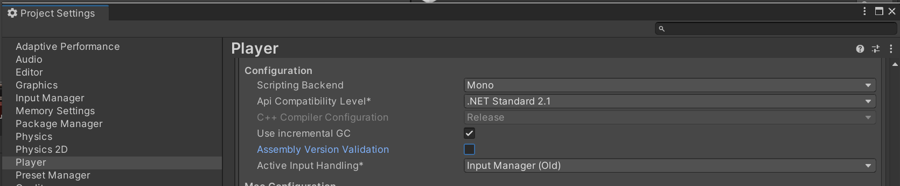

This is necessary because the SDK uses pre-compiled C# libraries (dll) for the PC platform, as part of the Netezos tools used by the SDK. As these libraries include hard-coded references to specific versions of their dependencies, validation errors could occur if the "Assembly Version Validation" setting were enabled, although the project works fine in spite of the version discrepancy.

In case you do this step and disable the setting only after importing the package (thus getting version validation errors), you may uncheck the setting, then re-open the Demo Example scene of the [Inventory Sample Game](/gaming/unity-sdk/inventory-sample-game)

### Install/Import the Tezos SDK package

With your new project open, navigate to the Assets folder in the Project window, and select this folder.  Depending on the project template you chose, the Assets folder will likely contain a single sub-folder called "Scenes" (which in turn will contain your default SampleScene, currently open).  Navigate back up to the Asset folder level so you can add new items at this level.  You'll now open a file explorer and browse to wherever you saved that Tezos package zip you got [from GitHub](https://github.com/trilitech/tezos-unity-sdk).  Unzip it to this same file location, then simply drag the top-level unzipped folder (labeled []) directly into the editor, specifically into the horizontal pane for Assets, right next to the Scenes subfolder.

The Unity editor will recognize this as a Package folder, and will open the "Import Package" dialogue box which will itemize all the components in the package.  Accept the defaults and select "Import"

## Configuring the project settings for each platform

A few extra steps are needed so that you can successfully build your projects for some of the supported platforms.

### Add Newtonsoft package if needed

The latest versions of the Unity Editor include a Version Control package, com.unity.collab-proxy version 2.0.1, that doesn't include Newtonsoft, one of the packages required by the Tezos SDK, that was automatically included before.

If you have version 2.0.1 (or above) of com.unity.collab-proxy, you may need to manually add the com.unity.nuget.newtonsoft-json pacakgae, version 3.0.2 or above. To do this, go to the package manager, search packages by name, input "com.unity.nuget.newtonsoft-json" and install the corresponding packages.

A future version of the SDK will include it automatically so that this won't be necessary anymore.

### Project settings for iOS

After building an XCode project from Unity, you will need to add the BeaconSDK package to your project using the following steps:

- in XCode, press File/Add Packages...
- Type in “BeaconSDK”
- Fetch the latest version
- A restart of XCode may be required
- Select “UnityFramework” target under Targets in project’s properties, and choose “Build Phases” tab
- Under “Link Binary with Libraries”, add Beacon related libraries by pressing “+”

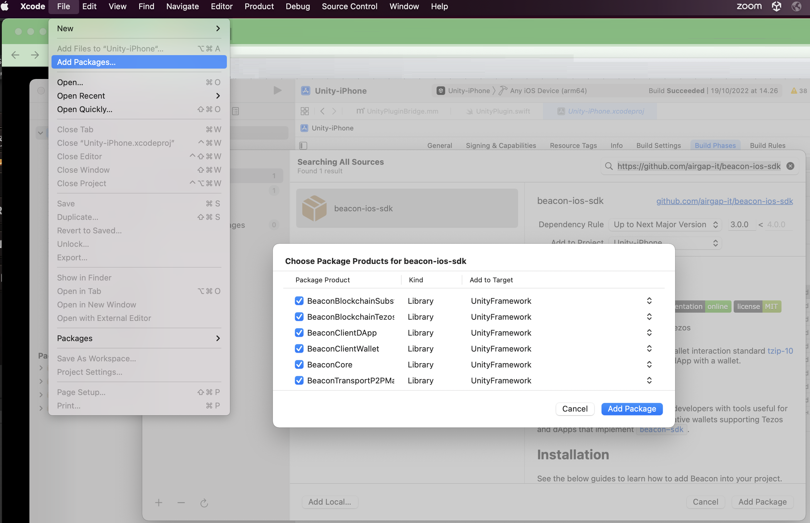

### Project settings for Android

By default, Unity 2021 has the minimum Android API requirement set to be to API Level 22. However, it isn't able to build at this API Level.

A quick fix is to go to Player Settings, and then find under Other Settings the  Identifiction section. Change the minimum API level to "API Level 31", which will trigger Unity to request an Android SDK update. Accept this update.

Once this update is complete, the API level can be reduced down to 23. Note that going directly from "API Level 22" to "API Level 23" without going through the above process doesn't trigger the update and doesn't work.

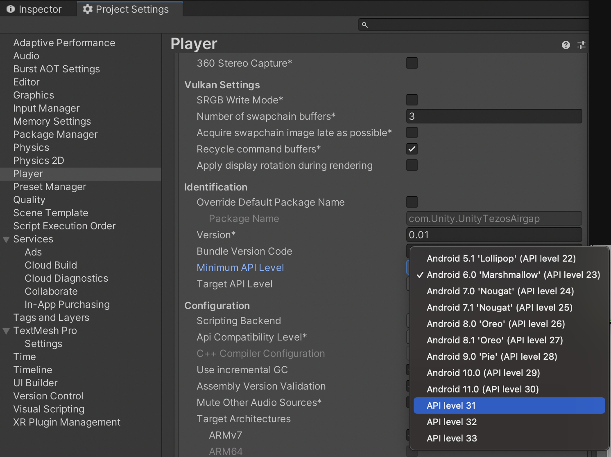

### Project settings for WebGL

For the WebGL platform, Unity uses an index.html template that is to be hosted. When you open the project for the first time, it selects a default index.html template.

Instead, you should change the settings so that it uses a template we created for the project.

To do this:
- go to Player Settings -> Resolution and Presentation
- set  WebGL Template slot to “Airgap”

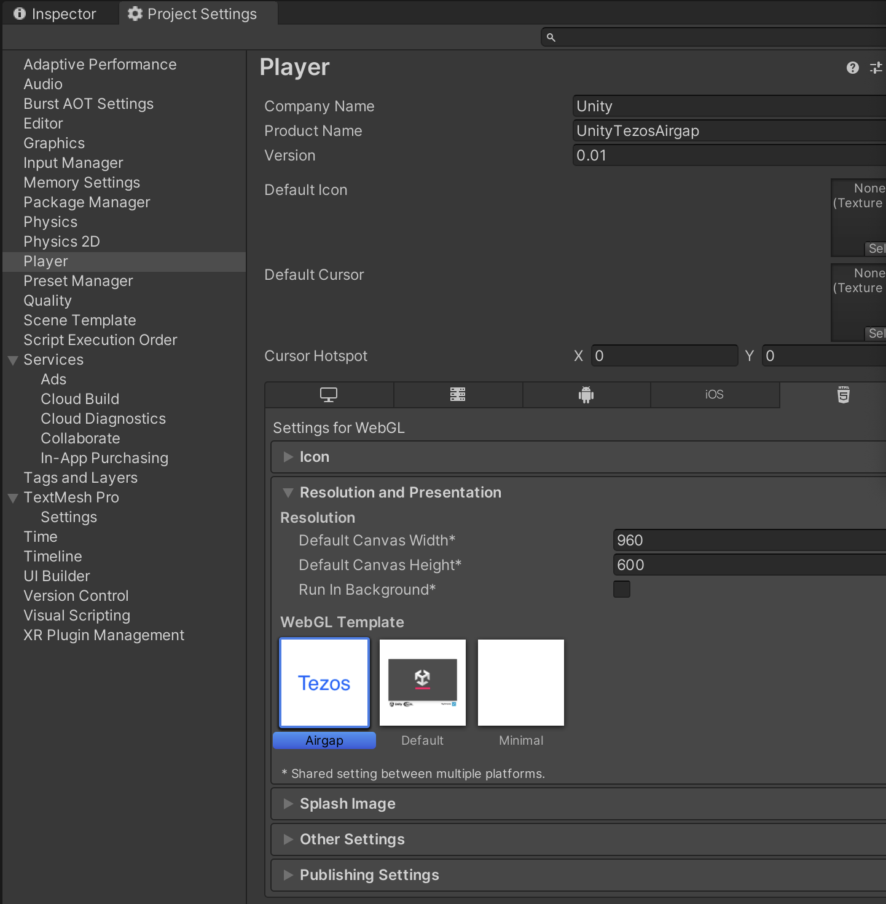

## Getting a Tezos-Compatible Wallet on Your Local Device

##### First: Why Do We Need A Wallet?

If you are new to the Web3 world, you may still be aware that a 'crypto wallet' is the primary way to store cryptocurrency that you have acquired (e.g. BitCoin, ETH or Tezos' own currency, XTZ or Tez).  But cryptocurrency is simply one of many use cases of blockchain technology, and the wallet is your means as a user to grant a particular dApp--whether it's the Tezos-integrated Unity game app we are building here, a distributed finance app, an NFT minting website, or any other blockchain-enabled application--permission to execute blockchain transactions or other blockchain interactions on your behalf.  

Whatever the particular use case, your game/dApp needs to know who the user is, and what permissions they might have with respect to your smart-contract functionality.  The wallet's public key -- it's ID hash -- will allow the blockchain contract to determine this (or at least help to); among other things it is functionally the "userid" with respect to this game or dApp.  The user will demonstrate that they "own" this userid/wallet hash-ID by literally showing the wallet to the game, in the sense of scanning a QR code, or (depending on the game's platform) establishing a link between the game running on a device and a wallet residing on that same device.  But this initial 'pairing' of wallet with dApp/game is only complete once the user has also affirmatively signed or accepted it on their wallet; and if there are in-game transactions beyond this initial authentication (buying or selling in-game NFTs, for example), these will also need to be affirmatively accepted in the wallet that has been paired with the game.    

There are many cryptocurrencies, hosted on different blockchains; and no single wallet will handle all of these currencies. Your user will need a Tezos-compatible wallet, and you as a game developer will need at least one (likely with multiple accounts) as you develop and test your game. 

##### Tezos-Compatible Wallets

Our scenario will assume a 'hot' or internet-connected software wallet residing on some local device.  Major Tezos-compatible software wallets at the moment include Kukai, Temple, Umami and Airgap.  Not all of these wallets have both mobile app and browser-extension versions, and having both of these may be handy, depending on your target game platform.  The **Temple** wallet has both a mobile app and browser extensions, and we will use it in the present guide.  But any Tezos-compatible wallet will work if it can be paired with the game in at least one way.

### Temple, Ghostnet and Free Test-Tez

The Temple mobile app is available on the App Store and Google Play store. There are currently browser extensions for Chrome, Edge, Firefox, Opera, Vivaldi and Yandex.  In developing your game you will probably want to test both the mobile app and one ore more browser extensions, at least if you'd like your game or dApp to be suitable for deployment to different platforms.

When you download any of these wallet apps, you will be asked whether you want to create a new wallet account or import an existing one.  Unless you already have a wallet account with Ghostnet Tez, you'll likely want to create a new one.  The Temple wallet will ask you which blockchain the account is for; in this case of course the answer is Tezos.  As with any new crypto-wallet account creation, this process will generate a unique **seed phrase** (in this case a 12-word phrase) that you will need to store somewhere secure to recover the wallet if it's somehow lost on the device where you have it installed.  You'll also be asked to create a **password** (with a more typical 8+ char format) to unlock your wallet, which you'll certainly need to remember and use frequently.   For identifying the actual account, though, you'll be interested in the **public key** hashid, which will be referred to in our documentation as the **wallet address**.  Here is an Android phone with the Temple app open, showing the two different accounts currently on the wallet:

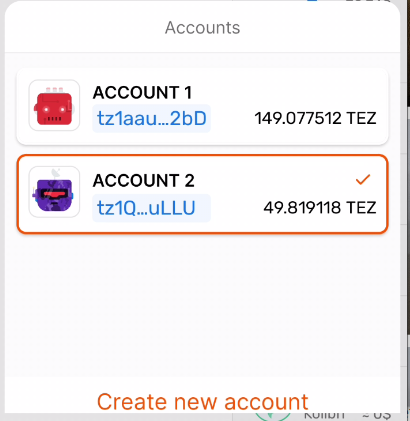

Once you've successfully created one account in your Temple wallet, you'll likely want to create at least one more so you can test sending or buying in-game tokens back and forth between them.  Of course you can do this with wallets on separate devices as well.  It's typically easier to copy/paste a wallet address to an app on the same device (which will be necessary at least for sending tokens from within the game app to a specific wallet address, if you want to leverage that feature), but, as stated above, your app vs wallet install choice will depend in part on whether you want your actual game to target mobile devices, where typically *only* deeplink pairing is feasible, or e.g. WebGL where pairing could be done via either deeplink or QR scan.  

As you see, in the case of multiple accounts on a single wallet, each of these accounts has its *own* wallet address, shown above in blue.  Tezos wallet accounts always begin with "tz-": the full hash strings are typically never shown in the the wallet app, but instead the leading and trailing characters are displayed with elipses between them.  This display is always a link and so can be copied and pasted elsewhere as needed.  Here is the full string for the second account shown above: 

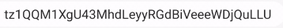`

Once you've created one or more accounts, you'll want to obtain some free **test Tez** for the Tezos Ghostnet test chain, at a minimum to pay for the gas & storage fees incurred as you test transactions while developing your own Tezos-integrated game.  You can do this by navigating in a browser to this address: https://faucet.ghostnet.teztnets.xyz/, where you'll be presented with an interface like the following:

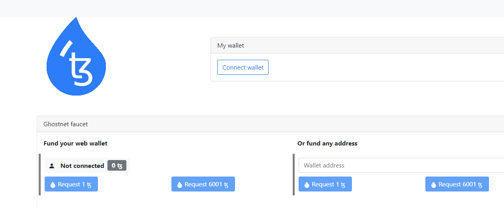

As you see, you have several options here.  The easiest would might be to **Connect Wallet**, which will invite you to pair with an existing wallet account, such as the one you've just created.  You'll get this dialogue box:

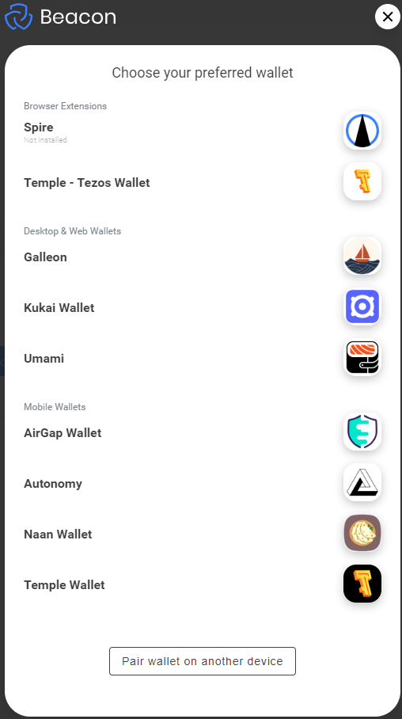

If your newly-created Temple wallet is installed as a **browser plugin**, you would want to choose it as the second option in the list above.  If that wallet is instead installed on a mobile device, you'll want to use the **Pair wallet on another device** button at the bottom, which will present you with a QR code for you to scan from your mobile Temple wallet app.  Either way, you'll need to confirm the pairing from within the chosen wallet, at which point the main Ghostnet interface will change to one like the following:

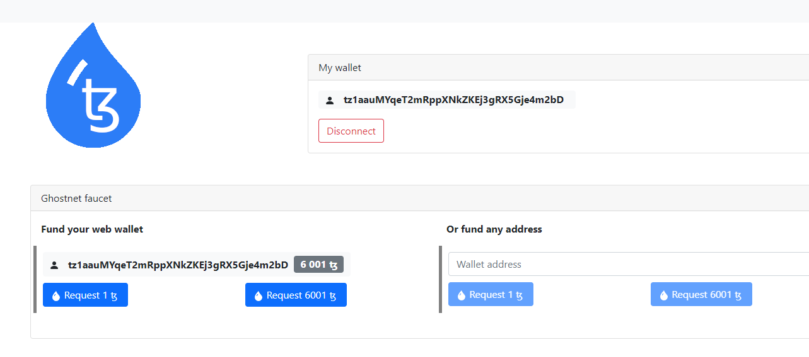

Now your full wallet account string is displayed under "My wallet", and again below "Ghostnet faucet".  In general Web3 parlance, a 'faucet' is a web source from which you can obtain free cryptocurrency.  In the earlier days of crypto, one could obtain small amounts of *real* cryptocurrency (ie, worth actual money) from some such faucets, but those days are gone for the more established crypto coins.  However Tezos, like other chains, maintains a strong interest in encouraging app development on their chain without the developer having to spend real money to pay for development transaction fees; hence this Ghostnet faucet source for test Tez, which will only work with contracts published to the Tezos Ghostnet chain.  You could request a single Tez coin here, but you might as well get the full 6001 test-Tez (certainly if you want to test spending or sending Tez balances).  

Note that there is also an option here to send test Tez from this web page to any arbitrary Tezos wallet address.  This option would be useful if you wanted to send Ghostnet test Tez to a teammate's wallet account, or if you wanted to find another test account of our own that wasn't currently paired.

However you choose to receive your test Tez, be aware that this Tez exists only on the Ghostnet chain.  Here there is an important difference between the current Temple browser plugin and mobile app installs.  A Temple *browser* wallet that's just been paired with the faucet above will show this:

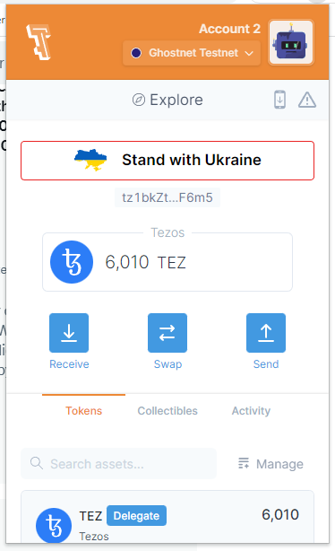

Note that at the top it displays Account 2 (we have two accounts in this wallet as well) because that's the one that was used for the pairing, and then in the dropdown immediately below it displays "Ghostnet Testnet"--because we just finished using the faucet above and received 6001 test Tez, and this transaction was conducted on the Ghostnet network.  This balance is also reflected in the Tezos box.  If we were to click on this network dropdown it would display a long list of potential networks, both Tezos and for other chains that the Temple wallet supports.  If in that dropdown we were to select Tezos **Mainnet**, our displayed balance would fall to 0 because we have not bought real Tez (with real money) for this account.  Again, Ghostnet test Tez exists *only* on that test network.

The handy thing about this Temple browser plugin is that we didn't even need to choose Ghostnet in the network dropdown before pairing this wallet with the Ghostnet faucet; in fact that wallet had never paired with any app on Ghostnet before.  Simply by specifying this wallet account address for pairing, the browser wallet knew to flip itself to the correct network.  Incidentally, the same happens if we use this browser-plugin wallet to pair with our game app; it will automatically choose the correct network for the pairing.  As of this writing, though, Temple has not added this network dropdown yet to their *mobile* Temple app.   So it will instead be necessary to explicitly add the **Ghostnet RPC node** to this app.  Let's go back to the Temple mobile app, now with the full controls revealed in the left pane:

Let's click on the "Settings" control icon at the bottom left, to reveal the settings options:

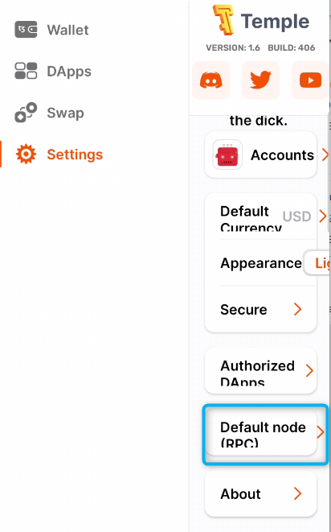

Second from the bottom on the right, highlighted in the blue box in the screenshot above, is the **Default node (RPC)** setting.  Let's click on this;

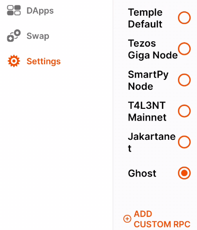

Note that the topmost option displayed here is "Temple Default", which in the case of this account would be the Tezos Mainnet.  But we do not want to connect to Mainnet (at least until we do, when for example we're connecting to a game deployed to Mainnet).  For now we want Ghostnet.   This is the currently-selected option in the app as shown, as we can see, but only because *it has already been added* for this account.  On this account's initial creation, Ghostnet would not even have been an option in this list.  To add this in, we had to use the ADD CUSTOM RPC control at the bottom, which will open the following dialogue:

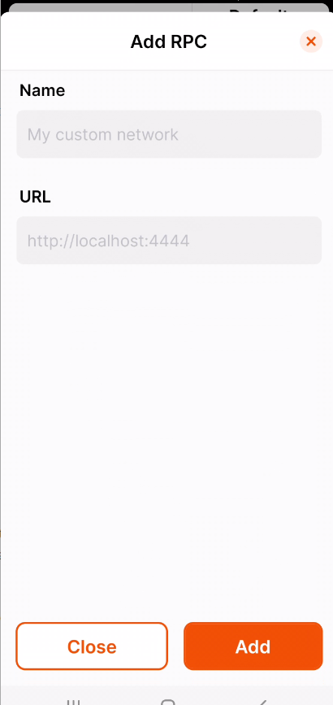

'Name' here is your own custom name/alias for this network -- we happened to use 'Ghost' for Ghostnet. What you do need to get exactly right is the URL, since ultimately a blockchain RPC call is an http call to the server access node for that blockchain.  For Tezos Ghostnet that url is https://rpc.ghostnet.teztnets.xyz/  -- if you get any part of this url syntax wrong, and click on Add, you'll be told to enter a correct URL. Once you do get it right and **Add** this RPC, it will show up in the list of custom RPC nodes that we saw two images above, under whatever name you've given it.  

While this process for the mobile side may seem cumbersome (and the features will hopefully be more fully aligned with the browser plugin in the near future), the good news is that, once you have added in the Ghostnet RPC node to the list, the mobile wallet app *will* automatically flip to this node if it's paired with a dApp that is also published to Ghostnet, whether that be the Ghostnet faucet website or your own game app. 

## Link your Wallet with the New Unity Project

Nearly all of the pieces are now in place for your Unity project to begin interacting with the Tezos blockchain.  If you now return to your Unity project where we've imported the Tezos SDK, in the Project window you will find a **Prefabs** folder, with the single subfolder DemoExample.  Its contents will look something like the following:

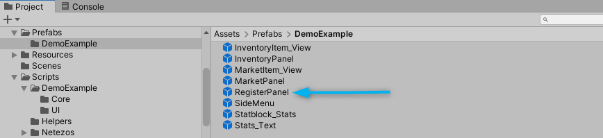

Each of these prefabs is intended to assist you in building a game UI with some or all of the features in our [Inventory Sample Game](/gaming/unity-sdk/inventory-sample-game).  All of these prefabs contain multiple tiers of nested objects, typically with one or more scripts attached to each; and to get a sense of what the rest of them do, you will want to have a look at our [Inventory Sample Game](/gaming/unity-sdk/inventory-sample-game) and in particular the section on the **UI Components**.  Our interest here is primarily with the RegisterPanel prefab (see blue arrow above), which would have the following structure and appearance if dropped directly into a scene:

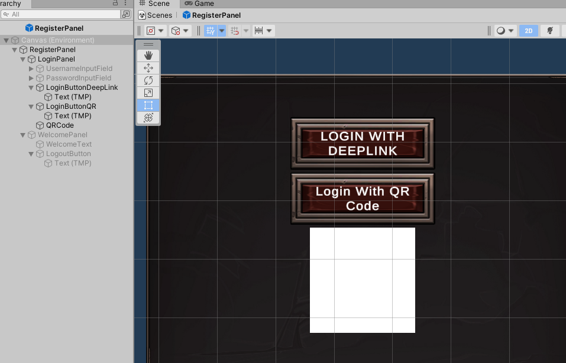

Since we will be exploring the code behind these controls in detail in the [Inventory Sample Game](/gaming/unity-sdk/inventory-sample-game), for now suffice to say that this prefab assumes that the entirety of our SDK package is fully imported into your new project.  Obviously you could simply begin with our own [Inventory Sample Game](/gaming/unity-sdk/inventory-sample-game) project scene (Assets/Scenes/Demo Example), which already has all of the above prefabs deployed to the scene.  But if you have started by creating your own project and importing our package into it, you could instead start with the default SampleScene and still leverage all of our code and prefabs, including the RegisterPanel prefab.  You could even use our entire Demo Example scene as a starting scene, or part of one, since even 3D games very commonly start with one or more 2D panels for login, orientation instructions, etc.  In any case, with the RegisterPanel prefab in your scene (or our scene), the button "Login with DeepLink" will invite you or other users to pair the project app with a Tezos-compatible wallet residing on the *same* device as the game app itself (for example on the same Android or iOS phone or tablet).  In contrast, the button "Login with QR Code" will display an actual QR code in place of the white placeholder seen here, and scanning this with a wallet on a separate device will initiate the wallet pairing.  In either case, you (or the end user) will need to approve the pairing from within the wallet to be paired.  Once you've done so, as long as the pairing is successful the **WelcomePanel** element in the above prefab structure will now be activated; this serves as a success screen and also provides a Logout button to remove the pairing and thus logout the user.

At this point, you'll have successfully linked your Unity app with a crypto wallet, which means that you can now use this pairing to make transaction and other calls between the Unity app and the Tezos network.  The remainder of this document set is intended to help you do this.

