# Inventory Sample Game

### User Experience, Architecture & Code Stack for Each Use Case

The present document is intended to fully explain the **Inventory Sample Game** project, which showcases what we consider to be some core use cases for game development based on this SDK.  This project is a single 2D Unity scene, with a UI composed solely of panel displays and controls.  Essentially, we are modeling a scenario in which a user logs into a game, and then equips a player-character with certain game items which will be useful for combat or survival in an RPG/Adventure type game.  Further game dynamics are not included.  Nevertheless, the **Inventory Sample Game** project demonstrates such core Web3 gaming use-cases as:

- logging in to a game using a Tezos-compatible crypto-wallet pairing
- creating game items typical to an RPG/Action/Adventure Game, but in this case also minted as NFTs on the Tezos blockchain
- displaying these game items in the user's personal inventory, and also placing them in an in-game marketplace for potential sale
- selecting marketplace items to buy for one's personal inventory from the in-game marketplace
- acquiring and using an in-game currency which will also be a fungible token on the Tezos blockchain
- gifting/transferring inventory items or in-game currency to another user's wallet account  

Each of these use cases is supported by a full call stack from the UI elements through a middle or 'business' tier to the public interface of the SDK itself, all implemented in C#, and through the SDK to a smart contract we have created and deployed on the Tezos blockchain (our contract is currently deployed to 'Ghostnet', the Tezos testnet; but eventually you will want your production game deployed to Tezos Mainnet).  Every element here is intended not only for demonstration but potentially for reuse by game developers who would like to pursue the same or similar use cases in their own games.  Any and all of our 2D UI panels can easily be integrated into a more complete 2D *or* 3D game, and more generally the functional components of this **Inventory Sample Game** project could be incorporated into not only RPG/Action/First- or Third-person shooter games but also Real Time Strategy, puzzlers, platformers and other genres--anywhere that you can see an advantage to having game items and/or currency that are both functional within the game context *and* can be publicly displayed and potentially even traded on the Tezos blockchain (see [Suggestions For Further Use](/gaming/unity-sdk/other-use-cases), our final document, for more detail on these various gaming use-cases).  Our SDK package includes all smart-contract source code (in JsLIGO), as well as all source code for the **Inventory Sample Game** project.  Game devs should feel free to deploy our own code as-is, on both the Unity and Tezos side, to get a sense of how the whole system works dynamically, beyond what this document can explain.  We would then invite you to begin extending or modifying both the Unity and Tezos-side code, as needed to suit your own needs.   Of course, the foregoing, and our overall documentation set, assumes use-cases that lie generally in the gaming domain, but the SDK itself could be used by any app, for any purpose, that can be built in Unity and would benefit from Tezos blockchain integration.  

------

### User Experience of our Inventory Sample Game Project

#### Login or Wallet Pairing: DeepLink and QR Scan

The basic layout of our **Inventory Sample Game** project app, when running, is essentially the same on all devices; there is simply a difference in aspect-ratio between the app running on a mobile phone and one running, say, in a browser via WebGL.  To illustrate, here is the Login screen that would be displayed as soon as the game app is opened, when that app has been built to a **mobile** platform:

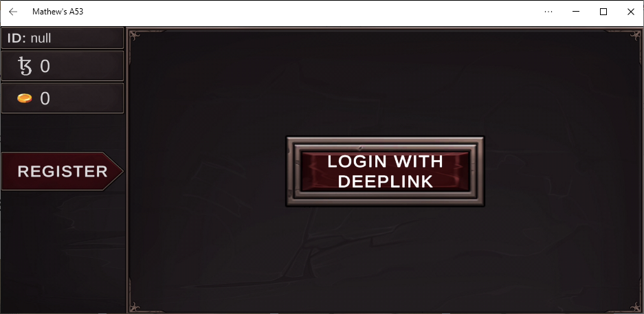

This happens to be an Android phone but the layout would be essentially identical on an iPhone.  Since we have not logged in yet, the UserID indicator reads 'null' and there is 0 balance indicated for both Tez and the local in-game currency.  And here is the same Login screen, this time displaying in a browser as a **WebGL** app:

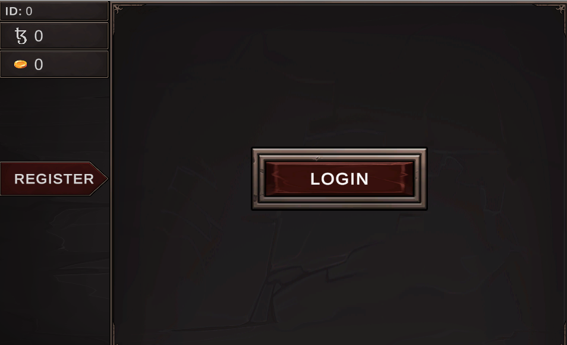

Other than the difference in aspect ratio, we notice one difference in **user controls**: the WebGL version offers a button labeled LOGIN.  We'll see why shortly.  Let's recall first that, since this is a Web3-enabled game app, *logging in* will not mean entering user credentials; instead it will mean establishing a connection (or pairing) with a Tezos-compatible cyrpto wallet (see our [Getting Started](/gaming/unity-sdk/getting-started) document if this idea is unfamilar).  On some platforms there may be several options for establishing this wallet pairing; on others there will only be one.  In the case of WebGL, one option involves pairing with a Tezos-compatible wallet that has been installed as a browser plugin in the same browser in which you're running the WebGL app itself.  In this case we are using the Chrome browser, and have the Temple wallet Chrome browser plugin installed.  If we click on the LOGIN button above, the app will first display a dialogue box allowing us to choose our preferred browser plugin wallet to pair with;

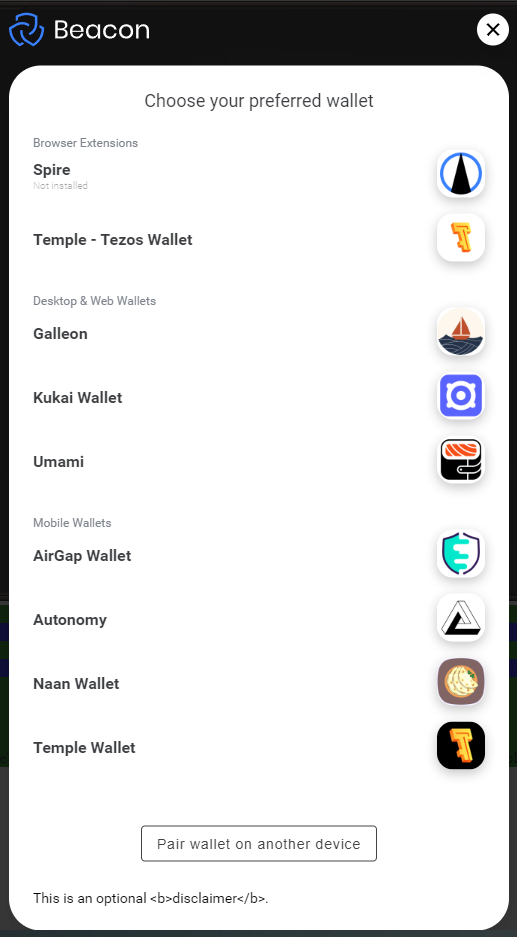

We will use the Temple wallet for all our walk-through examples below, so here we'll select the icon for Temple (second from the top) in this dialogue. This action will immediately open our Temple browser extension, which we'll need to unlock with a password if we haven't already done so; after that we will see the following confirmation screen:

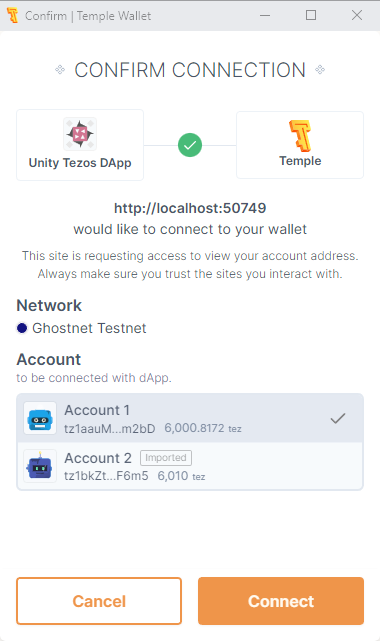

The Temple wallet is telling us several things in this screen. First, it is asking us to verify a connection between itself and the "Unity Tezos DApp", which is the name we've given to our game app.  Any wallet transaction you are asked to verify (or 'sign') should tell you more or less exactly what the nature of that transaction is; we'll see more examples of this below.  Another bit of information is that we are going to connect on the <u>**Ghostnet** Testnet,</u> which is Tezos' test network.  This is because our Tezos contracts (which enable our game) are currently only published to Tezos Ghostnet-- and yours should be too, as long as your game is still in development.  Finally, we are told that we happen to have two *different* Tezos accounts set up on this wallet, identified here as Account 1 and Account 2 but also, we might note, each with a different account ID or hash identifier, beginning with "tz...".  In most Web3 wallets and DApps, the full account hashid is only displayed in this kind of truncated fashion; however, this truncated display is also always a hyperlink, which can be copied to any clipboard in case you need to view the full hash.  In this case the full hash for Account 1 is

tz1aauMYqeT2mRppXNkZKEj3gRX5Gje4m2bD

while the full hash for Account 2 is

tz1bkZtYV1825V6gUJwCgYmiYSS8MGGdF6m5

Finally, there is one further bit of information worth noting here before we press the "Connect" button.  Account 1, which was selected by default, shows a **balance** of 6,000.8172 Tez; Account 2 shows a balance of 6010 Tez.  Let's be clear that this is a balance in 'play' or test Tez, which exist *only* on the Ghostnet test network--these amounts have no actual monetary worth and could not be traded for fiat or other cryptocurrency. The purpose of these balances here is primarily to pay for the gas and storage fees associated with transactions we will want to conduct--these will be 'play' or test fees, on Ghostnet, but the transactions would still fail if there was not a balance present in Ghostnet Tez on the paired wallet (so even if you had a balance in *real* Tez, paid for with real money, such transactions would fail unless you also had Ghostnet Tez).  See our Getting Started section on obtaining Ghostnet Tez for your own test accounts.

Having noted all this, we now press the Connect button in the wallet, and our game DApp immediately reflects this:

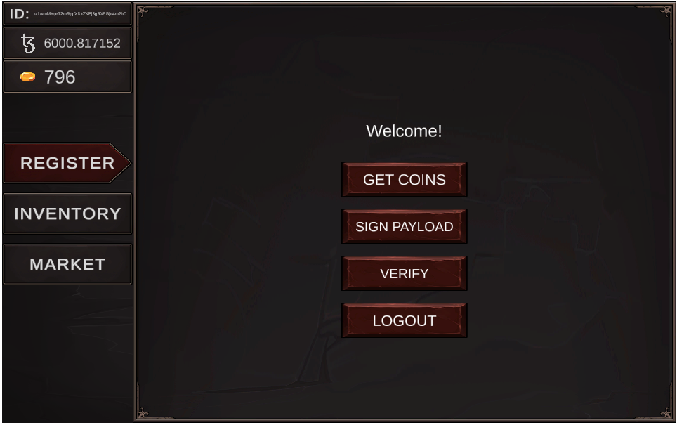

If you compare this with the previous WebGL screenshot, you'll see that much has changed,  We are now presented with a Welcome! screen, with further controls.  Our balance in Tez within the app now reflects the balance shown in the wallet for this account.  Further, we appear to have a balance of in-game currency of 796 coins, which indicates that we have visited this game app from this account before, and used the GET COINS button to get 1000 in-game coins (and we've clearly done some trading since, on which more shortly).

We also note that, in addition to the left-hand REGISTER tab we saw above, we now have additional left tabs for INVENTORY  and MARKET, which we will explore below.  On the Welcome screen itself, besides the GET COINS button (which would have no further action, since the 1000 free coins is a one-time only deal), we now see buttons for SIGN PAYLOAD and VERIFY, which we'll come back to at the very end of this document.  Finally there is a LOGOUT button, if we want to end the session -- or, more likely in a game-development scenario, we want to unpair this particular account and instead pair another one, so that we can test buying or gifting items back and forth between accounts.

But remember that first 'Beacon' dialogue we got when we pressed LOGIN on the game app in WebGL?  It actually offers two different pairing options: beneath the list of wallets to select as browser plug-ins to pair with, at the bottom was a further option --- "Pair wallet on another device":


If we were instead to click this bottom button, we would be presented with the following QR Code for us to scan:

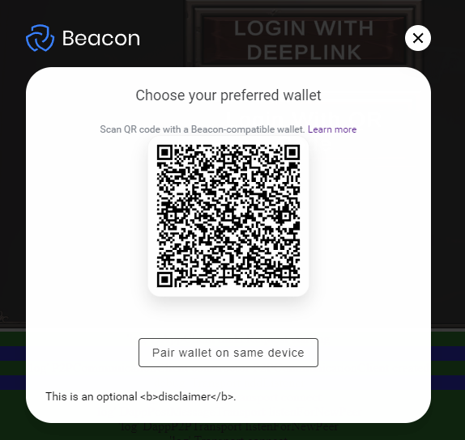


Obviously this kind of optical QR scanning only works if the scanning device is physically separate from the app-hosting device; in this case there is another Temple wallet installed on our mobile phone.  With most modern phones we'd have the option of simply scanning this code directly from our phone's camera app, which would then read the appropriate link and offer to launch our Temple wallet app.   Or we could launch and unlock the Temple app and scan from that app directly.  Either way, we would then be presented with the mobile Temple app's version of that same confirmation screen:

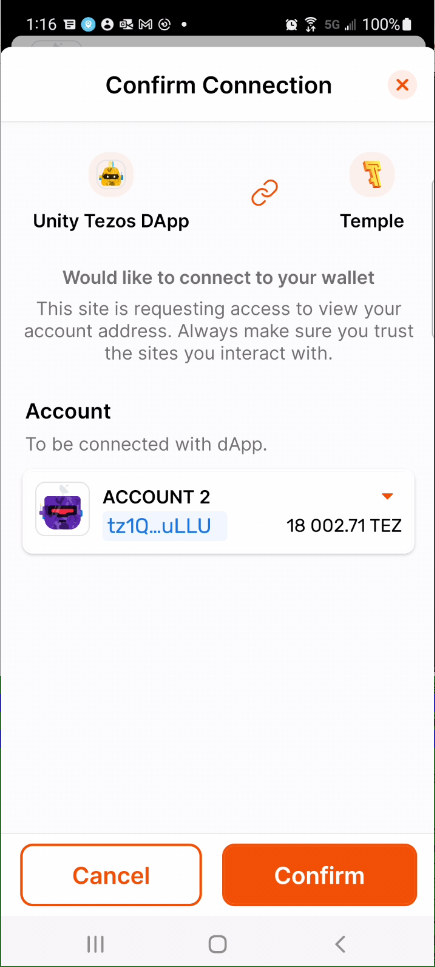

While most of the information displayed on this mobile-wallet confirmation screen is the same as in the browser wallet app (we're again being invited to confirm a pairing with the Unity Tezos DApp), there are some important differences in this display which we'll get to in a bit.  Meanwhile, we will press Confirm, which will allow us once again to pair successfully.   Here is the new WebGL game app Welcome screen:

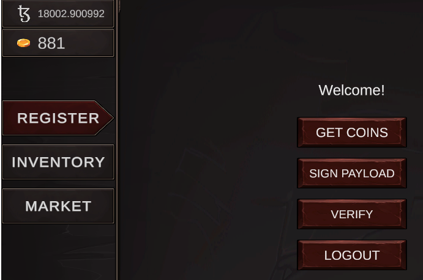

The obvious difference now is in our balances shown: over 18000 Tez (vs just over 6000) and a higher local-coin amount.  That's because the Temple account we've used on that mobile wallet app was a **different account** from the one we paired with as a browser plugin, so it has different balances, both in Ghostnet play-Tez and in local in-game coin.  It will also own different game-objects, which we will inspect shortly.  But first, since the remaining UI features of our **Inventory Sample Game** project are really identical between platforms, let's go ahead and shift to the app running on mobile for the remainder of this UX walk-through, just so we can leverage its horizontal orientation and save some screenshot-height.

To shift fully to mobile we first need to remember that, as we saw in the opening screenshot, when you start the game app on mobile you are *only* given the DEEPLINK pairing option (since it seems unlikely that most users will have two separate mobile devices, which you'd need in order to accomplish optical QR scanning).  So if we were to start up our game app on Android, and click the LOGIN WITH DEEPLINK button, the first thing the game app would do is call up our Temple wallet app.  The app may initially be locked (as it may as a browser plugin-in too), so we'd need our password to unlock it.  We would then be presented with the mobile version of the confirmation screen, which we already saw just above when pairing with the WebGL app from this mobile wallet:

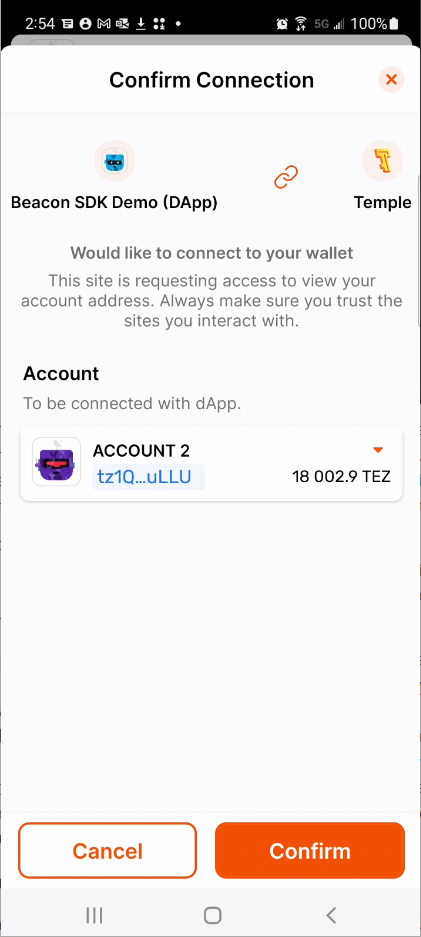


The two mobile-wallet confirmation screens are *almost* identical, even though the first one invited confirmation via QR scan with our game app on a separate device, and this one is confirming deeplink pairing with an app on the same phone.  One difference you might not catch is that the app here is called "Beacon SDK Demo" rather than "Unity Tezos DApp": the published app names are set separately in the Unity editor **Player Settings** when you publish to various platforms, and here different variant names have been used.  But this is actually useful to demonstrate that in this second screenshot we are, in fact, pairing with a *different version* of the game app-- the version published to Android rather than WebGL.  The project codebase we built from is identical, at least as far as we are concerned, so all of the functionality will be the same.  Behind the scenes, of course, the code to implement this app as an Android APK file is entirely different from that needed to implement it as a WebGL app (and different again from an iOS app, or a Windows app).  Most of these differences are handled by the Unity editor when you select the target platform for your build; the remainder was handled by our team in developing the integration SDK itself--and this effort was far from trivial, which is why you are well advised to use our integration SDK for cross-platform Unity/Tezos games rather than crafting your own direct integration with Tezos. 

In any case, from this point forward we'll stick with the mobile game app, paired with the mobile Temple wallet on the same device.  Since we'll be seeing a lot of this mobile Temple confirmation screen, let's note a few differences from the browser app, one of which is the way it displays **account** information.  On both wallets we actually had two separate accounts, but in the browser wallet we saw a list displaying Account 1 and Account 2 (and both their balances in Tez) at the same time.   Here Temple has not completely standardized their plugin and mobile UIs, because in the mobile app by default we are only being shown ACCOUNT 2 here.  ACCOUNT 2 is currently the default on this wallet simply because it's the one we used most recently (to connect to WebGL).  We see the link containing the account hashID, beginning with "tz...", and we see that this particular account has a balance of over 18,000 Tez.  Of course this difference is not especially problematic: that entire white account box is a dropdown, and if we clicked it we would have the option of selecting a different account for pairing, if wished (in this case ACCOUNT 1).  We'll be doing a lot of account-switching as we continue our UX  tour.

What's slightly more problematic here, compared to the browser Temple app, is that nowhere on this mobile-app pairing confirmation screen are we shown the *network* we are connecting to.   It is once again Ghostnet, where our game app's supporting contract currently lives, and the Tez balance we see is again a balance only in Ghostnet play-Tez.  But this balance has only appeared because this particular mobile wallet app has had its default RPC node set to Tezos Ghostnet (Settings > Default Node (RPC) -- but please see **Getting Started** for a step-by-step guide to setting up your mobile wallet app correctly).   Without the Ghostnet RPC Node added to your Temple mobile app, that app will likely fail in attempting to pair with your game app.   This isn't a requirement for the Temple browser plug-in, which automatically toggles to the correct network; and hopefully Temple will align their plugin and mobile functions shortly.  What's important to remember in either case, though, is that our game app requires a Tez balance (however small -- it certainly needn't be thousands of Tez) in *Ghostnet* Tez, not 'real' mainnet Tez, in order to authorize the gas & storage fees for transactions.  The obvious upside is that you can do extensive game development for FREE on Ghostnet, rather than having to constantly pay for transaction fees as you would if you were developing your game app directly on Tezos Mainnet.

So we have confirmed this mobile Deeplink pairing, and now are back to the game app, again displaying the Welcome screen but this time in mobile:

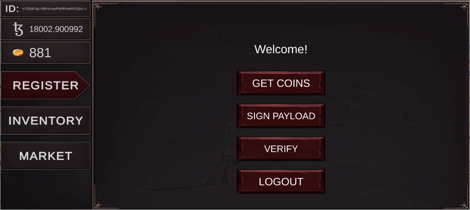

Now, using this more document-friendly portrait format, we can begin our exploration of the rest of the application user experience.

#### The Inventory Panel, and Equipping the Warrior 

We'll begin by clicking on the INVENTORY Tab (having first noted our balance for this account in Tez and in local coin):

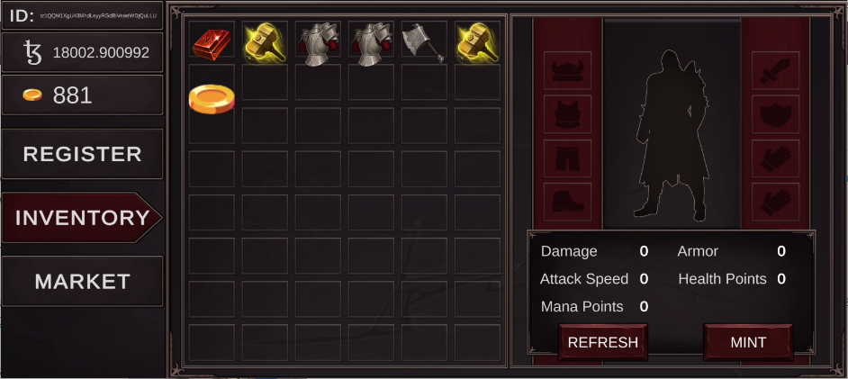

In the "Inventory" tab we see two distinct panels: the first is a grid layout on which there currently appear to be seven items, and the second shows the outline of a warrior figure, with some outline icons to either side, and some statistical values displayed below, all of which are currently zero.  At the bottom of the right-hand panel we have prominent buttons, to MINT and to REFRESH. 

The items in the grid panel are **game items**, such as you might want to have if you were equipping a warrior for successful combat, adventure or survival in an RPC-type live action game, clearly in this case with a medieval theme.   To demonstrate the capabilities of our Tezos integration we needed *some* specific game genre, and this is what we've chosen.  Please keep in mind that any and every part of the UI you have seen or will see below can be swapped out at your discretion, or functionally integrated as you like into whatever game universe you fancy.  The game items shown here are: a magic stone, a war-hammer, two suits of armor, a hand-axe, another war hammer, and finally a coin token which is a visual representation of our balance in local coin or in-game currency.  Obviously if you instead wanted to develop a contemporary shooter, or a zombie-apocalypse survival game, your game items would be different, and your "outfitting" function would probably look different, if you had one at all.  But let's see how ours works:

First, each of these game items are *draggable*, and in the next screenshot we have dragged several of them into position beside the warrior, specifically the war-axe and the armor (we've also minted two more magic stones and one more armor -- minting is entirely random in our **Inventory Sample Game** project, but we'll come back to that):


Note that the statistic values displayed beneath the warrior are no longer zero; instead they are the composite of the individual statistic values inherent in each of the two game-items we've equipped him with so far.   This function might be more clear if we consider a screenshot from a different inventory, with five game-items total, and four deployed to the warrior figure in on the outlines for 'torso' (armor), 'weapon' (war-hammer), and two hand-carried items (two magic stones in this case)

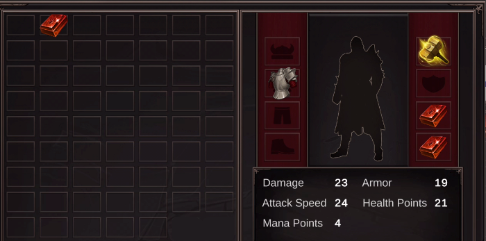

Again, the displayed statistical values are the aggregate of the statistical values of each of the items deployed; there just happen to be more of them in this second case.  It is challenging, in our **Inventory Sample Game** project, to fill out *all* of the warrior's slots because the item categories--torso, head, legs, feet, weapon, both hands--are generated randomly too upon minting, just like the specific item types and item statistics; and therefore one might have to mint or otherwise acquire many items to find, for example, appropriate head-wear like a helmet.  Still, the warrior in the second screenshot might stand a reasonable chance in battle, with aggregate damage potential of 23, armor of 19, attach speed of 24, health points of 21 and Mana points of 4 (whatever those values signify, which for is undefined as we have no actual game dynamics).     But how do we know the statistic values for individual items?  We can learn this  simply by clicking on each item, rather than dragging it:

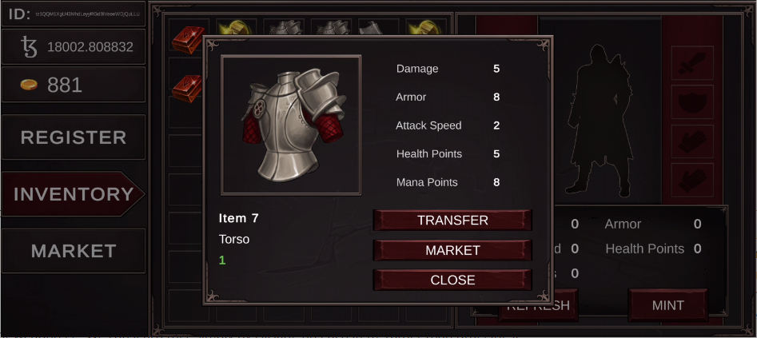

As we see here, clicking on this suit of armor invokes a pop-up panel revealing its specific statistical values--as we've said, in our example these have been randomly generated, without regard for the item type, so one shouldn't necessarily expect them to make too much sense   This particular armor features armor protection of 8; it adds 5 health points, 8 mana points and 5 points to damage.  As with all details in our **Inventory Sample Game** project, these ones are intended merely to suggest features that a fuller game might implement with more complex logic: your armor might have *only* armor stats and health stats, your weapons *only* damage and attack speed, etc.  You might well have different statistics and other game-item properties entirely; ours, as we'll see, are defined by an Item object both at the Unity UI level and in the Tezos smart contract.

Smart-contract?  Yes indeed; the game items you see displayed here exist as item objects in the storage of our game's smart contract: they are in fact non-fungible tokens, aka NFTs, or at least they would fully meet NFT criteria once our contract (or yours) was published on rhe Tezos mainnet, where the tokens could be displayed in a public Tezos NFT marketplace like http://Objkt.com.  Even now, on Ghostnet, the token representing each of these game items is publicly associated with the wallet address that 'owns' them -- ie, the wallet account we're using here--and this ownership could be verified via a Tezos blockchain browser like http://better-call.dev.  In other words we are seeing true Web3 integration in action here.

##### Seeing is Believing: Better Call Dev

A certain amount of skepticism is always healthy, so let's go ahead and spin up better-call.dev to see what it can show us.  First, we need the actual contract address under which these tokens have been minted.  To dip quickly into code we'll explore in depth later, right now this value is hard-coded in a class called ExampleManager, in the local variable definitions near the top:

```csharp
private const string networkName = "ghostnet";
private const string networkRPC = "https://rpc.ghostnet.teztnets.xyz";
private const string contractAddress = "KT1WguzxyLmuKbJhz3jNuoRzzaUCncfp6PFE";
```

Once we know this unique contract address, we can use better-call.dev to learn a huge amount about the contract, including its entrypoints and current storage--most of which we will leave until later.  But let's start with the home page after we've first tabbed to "Ghostnet" and then entered our current contract address:

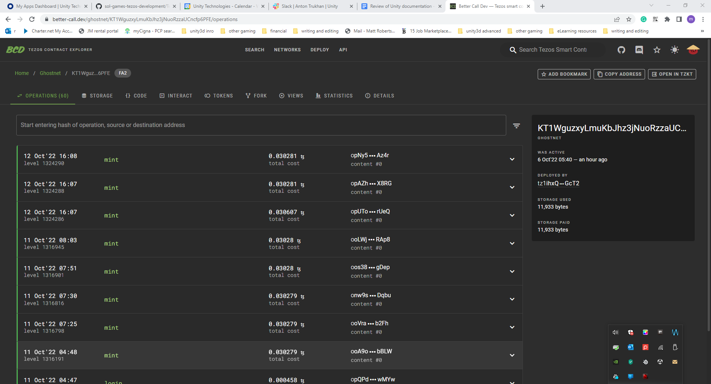

See the address on the right?  That's our current contract, **KT1WguzxyLmuKbJhz3jNuoRzzaUCncfp6PFE** (Tezos contract addresses always begin with 'KT').   You can try inspecting this for yourself; just make sure you're on Ghostnet, and not Mainnet.  Now see all those rows of 'mint' activity on Oct 11th and 12th? That was us minting new objects to show you.  Let's expand the first entry at the top:

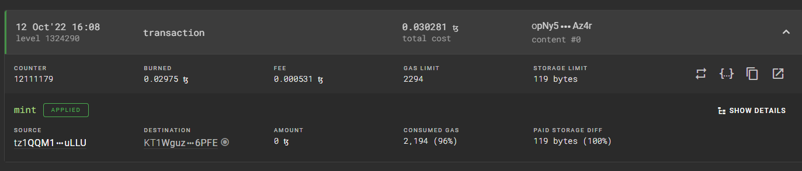

The destination is our specified KT 1Wguz.... contract.  And the source?  tz1QQM1...uLLU -- which happens to be the wallet address we just paired for the current session.  According to BCD the full wallet address is **tz1QQM1XgU43MhdLeyyRGdBiVeeeWDjQuLLU**.  And here is our actual current wallet address in full, as copied from the link we saw when we paired, and pasted into a word doc on the phone:

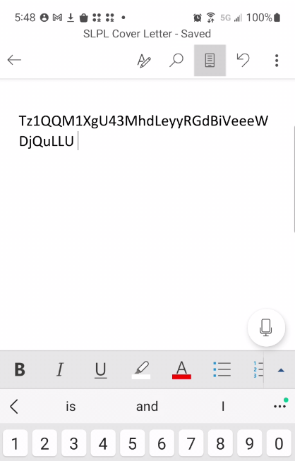

So yes: *this* wallet address is generating *that* activity on *that* contract -- we are minting new Tezos blockchain tokens (though only on Ghostnet here) from a Unity app on a mobile phone.  But doesn't an NFT, or indeed any blockchain token, have to be unique?  What about the multiple suits of armor, or multiple magic stones, that we've seen in the Inventory display?  It's true that our **Inventory Sample Game** project only has a fairly limited number of game-object sprites (2D images), which are displayed by ItemTypeID, and as these are randomly assigned on minting it's inevitable that we'll have repeats.  In other words, there are only a limited number of ItemTypeiDs, and there will be in your game as well (even if your inventory is far larger than ours).  But the **token_id** is unique for each item.  Let's go back and consult the TOKENS tab in Better Call Dev:

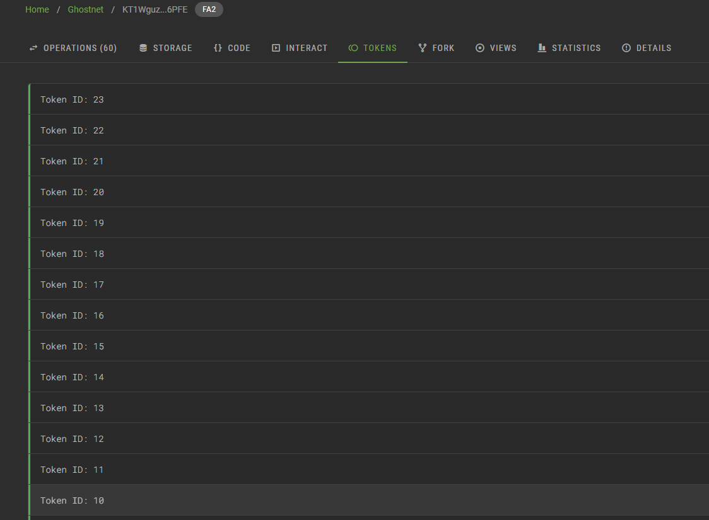

So the highest (most recent) token ID in our contract storage is 23, and we see them going from there down to 10.  If you go back to the screenshot of the suit of armor in the detail pop-out, you'll find it's named "Item 7", which in our code means that this represents token_id 7.  That token ID can also be found via Better Call Dev, but it's past the bottom of the above screenshot.  But here's another suit of armor that we've just minted.  And its name is....

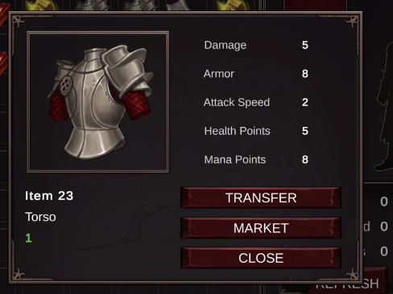

....Item 23.  You might well want a more semantically-useful Name for your game items, but for now the token_id will do just fine.  And not only does this particular game item exist, uniquely, as one token in the storage of our contract and associated (for now) with our specific wallet address, but all of those randomly-generated stat values exist along with it, in its **metadata**.  BCD lets us inspect this too, via the STORAGE tab:

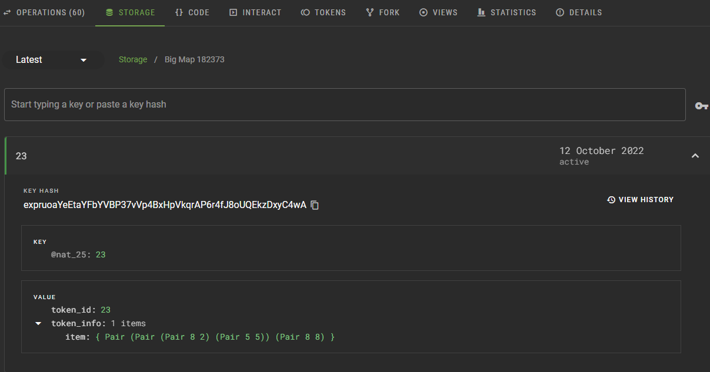

Now the fact that token_id 23 is an item with the associated storage  of `{ Pair (Pair (Pair 8 2) (Pair 5 5)) (Pair 8 8) }` may not be particularly readable -- we will see later that when we retrieve tokens from storage, for instance to build a given user's personal inventory as we've done, we will need to "Humanize" the returned data sets so as to translate them back into things like the named statistics we've displayed above.  But meanwhile, the event of minting that particular suit of armor IS indeed equal to the unique key hash `expruoaYeEtaYFbYVBP37vVp4BxHpVkqrAP6r4fJ8oUQEkzDxyC4wA`, and this will be testified publicly, for all eternity, in a series of blocks stored in every computer node that happens to be hosting the Ghostnet network.  A somewhat fragile immortality compared to Tezos Mainnet, perhaps, but that's why Mainnet charges gas & storage fees in real currency.

Finally, on the subject of tokens: what happens if we click on the game item that represented our balance in in-game currency? Right now, we would see this in the popup:

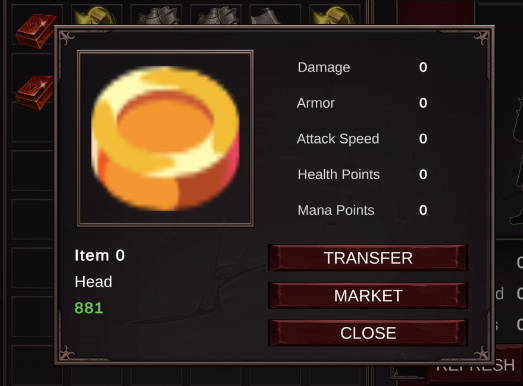

"Item 0"?  Yes, our in-game currency coins are also tokens on the blockchain -- they have a token_id of 0, which in our contract and Unity code designates them as fungible local currency, rather than unique tokens that could become fully-fledged NFTs on Mainnet.  You'll notice that in the other item detail images the green numbers were all 1, indicating that these were in fact all unique tokens.  But this time the green number is 881--because that is our current balance in coins.  Later we'll spend some of that balance, and we can watch both this number and the left-hand balance counter change.  Our balance in local coins is also being tracked on the blockchain, in our contract ownership storage ledger.  


#### Minting

Before we get into the Marketplace tab and on to other functions, we might as well discuss **minting** now since it's already come up.  Unavoidably, because in our current game economy, the only way to introduce new game item tokens into the world of a given contract is by minting them.  As we've mentioned, the first time a user logs into our game as published to a given contract (even for minor revisions, contracts will need to be republished each time and will therefore have new unique addresses), that user can press the GET COINS button and be granted not only 1000 free in-game coins, but also one (random) game item minted to their ownership.  But since one game item isn't especially interesting, we have added a MINT button to the lower right of the Inventory tab, allowing users to mint new items at will.  

##### Switching to a different account

Since our personal inventory has gotten somewhat crowded with the account we were just using, we've now logged out and logged back in with ACCOUNT 1 on our mobile wallet (we did this by going back to the REGISTER tab, clicking the LOGOUT button which presents the login screen again, and then clicking the LOGIN WITH DEEPLINK as we saw before; this time we chose ACCOUNT 1 from within the wallet).  Having completed the new pairing, we return to the game app and to the Inventory tab:

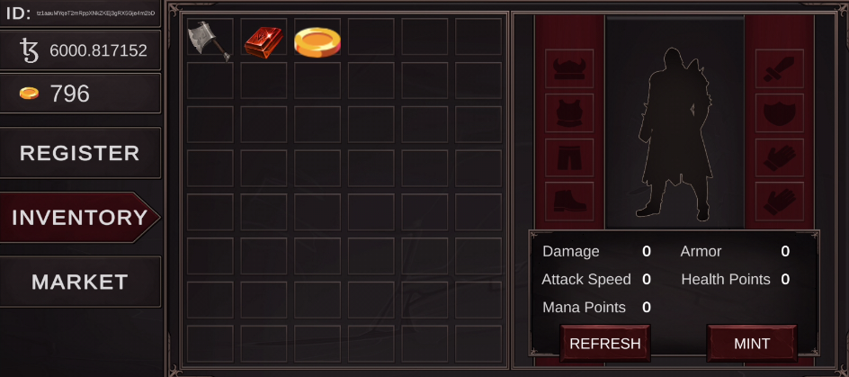

We can immediately tell this is a different account because the balances are different: 6000 and a fraction of (Ghostnet) Tez (vs the other account's 18k Tez), and 796 coins vs the other account's 881.  And, that coin token aside, we see that at the moment we only have two actual game items in this account's personal inventory -- an axe and a magic stone.  We'll now use the MINT button to mint five more items, in rapid succession.  Each time we do so, the game app will call up our paired wallet and ask for confirmation, since this is an on-chain transaction which, at a minimum, will cost gas and storage fees:

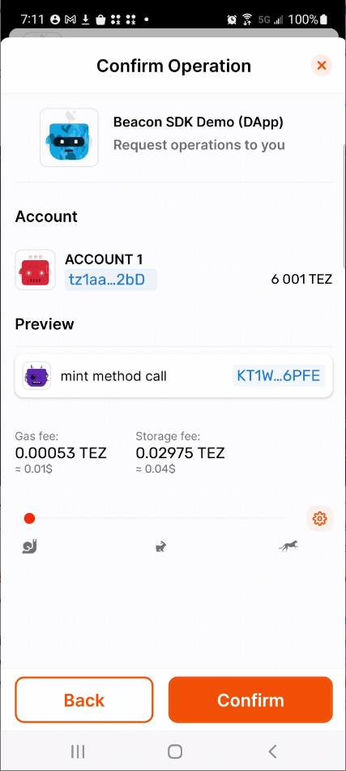 

As with all such confirmation requests, the Temple app supplies us with some information about the proposed transaction.  It originates again with our game app, and the Preview tells us that this is a "mint method call" and then specifies the contract address we've already seen.  The gas and storage fees are also specified -- very tiny, even in play-Tez--but with five mints we should still be able to discern a hit to our Tez balance.  We'll go ahead and confirm this, then do four more minting operations.  In a moment we'll inspect our inventory again, after these five mint requests.

But first, how do we *know* that each of these mint operations was actually successful?  We could simply wait for the item to show up in our inventory, which will typically take 2 to 5 seconds on Ghostnet (as will any other blockchain operation we request below).  But in fact we have implemented a feature to show direct UI confirmation of the success of these transaction requests, as soon as it can possibly be known.  There are actually two popups that will typically appear in quick succession, with the first appearing (at least on Ghostnet) in our game UI within a second or two of confirming a requested chain transaction in the wallet.  The first popup will look something like this:

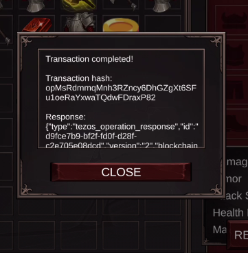

Within several more seconds, this first popup will be displaced by another; if we CLOSE this first popup in the meantime, a new one will be opened; otherwise the text will simply change to the following:

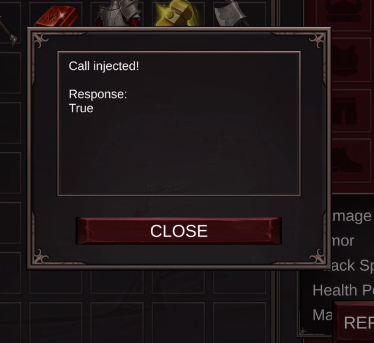

Bear in mind that this is for the case of a successful transaction, as most of yours hopefully will be.  Later we will attempt to force a failure to occur and note the text in that case.   But what are we being shown in these popups?  Without worrying too much about the white text displayed after the first line (obviously the next line in the first popup is the actual transaction hash), we're being told that this transaction has been executed successfully by our contract code on the *default RPC node* --in this case, the one specified forTezos Ghostnet.  This means the code has been executed, contract storage updated where appropriate, and the result submitted to the larger chain; it does *not* mean that, in this same instant, the transaction details have been validated by enough Tezos bakers to be preserved for eternity in every node on the full chain.   But the latter step only takes another few seconds, at least on Ghostnet: the subsequent popup message "Call Injected!" means that this transaction has in fact been injected into the full distributed blockchain where it *will* be viewable on a public browser such as Better Call Dev.  

We should make clear that we have included these popups, in the first instance, to show that it's *possible* to get this kind of transaction-result data from within the app, without direct recourse to an external chain browser or indexer; and in the second instance as a convenience for developers.   Our demo project will ship with this feature, and later we'll see how it's supported by the code.  But you might very well want to disable this feature (not just in the actual UI but also un-subscribe to the relevant events raised by the SDK) for your production end-users.  There are both UX and performance considerations here.  You can be the judge.  

With that said, from here on we will simply take as given that for successful transactions we  have received and then closed the confirmation popup, and proceed with the results as displayed in the main game UI.   Thus, here is our inventory after the five successive mint requests we have initiated and confirmed in our wallet.:

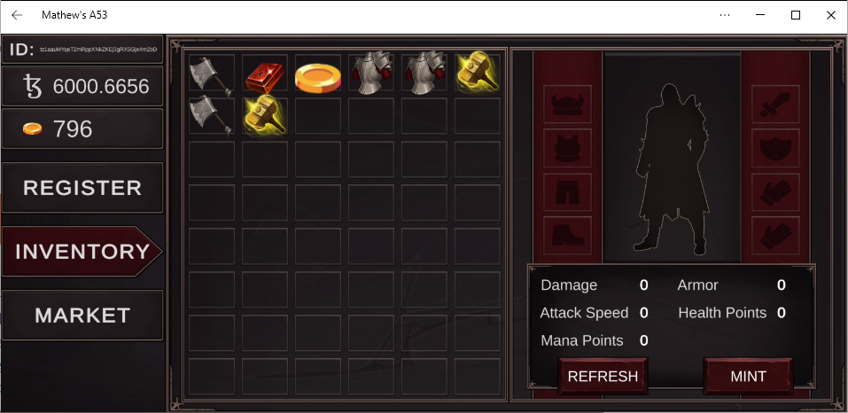

So now, in addition to the original axe and magic stone, we have two suits of armor, another axe and two war-hammers.  Also, if you go back and note the original balance in Tez, you'll see that it's now been decremented by nearly 0.2 Tez.  But beyond simply the additional five items displayed here, and the incremental gas fees, the other magic is in their names, which is to say their token_ids.  Here we have clicked on the last item, the second hammer:

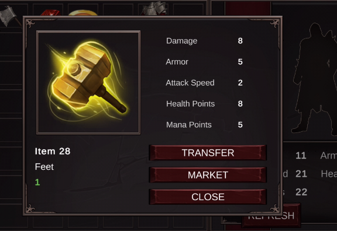

The new war-hammer is Item 28, so we can already guess what we will find in Better Call Dev:

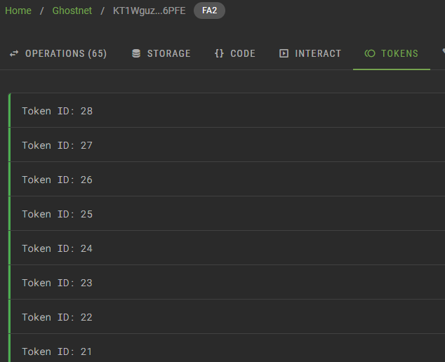

We now have 28 tokens in our contract's storage, rather than 23.  We can also look in the OPERATIONS tab (there were 60 total operations before, now there are 65), and see the details for the latest one:

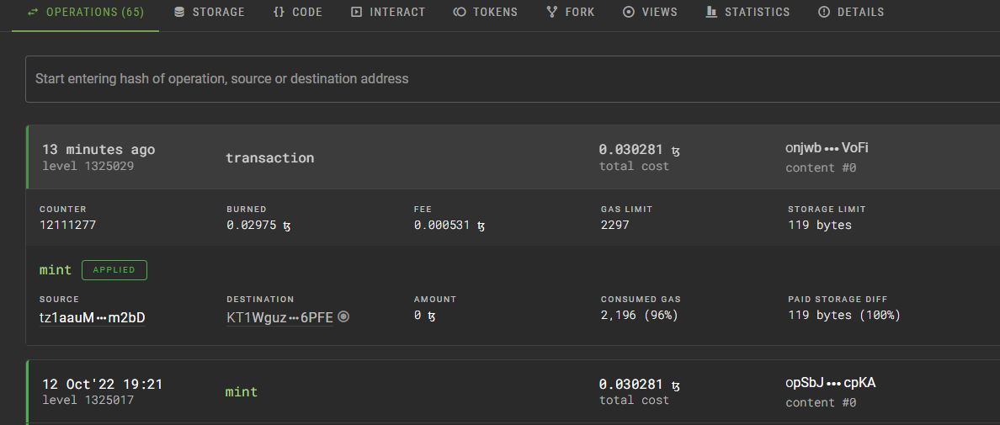

The most recent operation was our final mint, of token 28 -- a mint operation done 13 minutes ago from a SOURCE that happens to be the new wallet address we just logged in with (tziaauM...).  

To recap, then: from a Unity game app running on an Android phone, we have just caused the creation of 5 new, unique tokens in the storage of our contract, in transactions recorded in encrypted blocks on every computer that is running a node of Tezos Ghostnet.  Exactly *how* we've done this will be the subject of further exploration, in this and other documents, once we've looked at the rest of the user experience.

#### The In-Game Marketplace: Putting items on and taking them off

This new account, too, has a fair number of items in Personal Inventory now.  What if we decided we didn't need the duplicates, or even some other items, and wanted to earn some quick coin?  Conversely, what if we wanted items we didn't have and couldn't manage to mint randomly?  This is where the **in-game marketplace** comes in.  At this moment, clicking on the marketplace tab displays this:

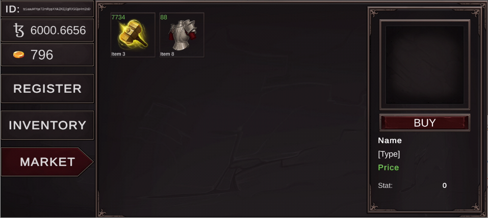

Right now, only two items are offered on the marketplace for sale.  To whom do they currently belong?  There is actually no easy way to determine this (unless they happen to be your own, as we'll see) -- we have intentionally designed this marketplace to be anonymous.  We note the figures in green here: these are the **asking prices**, in coins, for which these items are up for sale.  The war-hammer's owner appears to have asked a truly attention-getting sum, relative to the +/- 1000 coins that most users have in their balance; so we decide to inspect it further.  We click on this item, in the main market display, and it loads into the previously-empty detail box on the right:

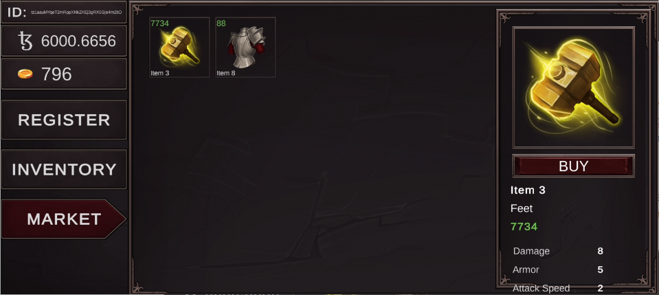

One might have imagined that such an outrageously-priced war hammer would confer the power of Nordic gods -- yet there seems nothing especially impressive about this one, other than the price itself.  We will leave it alone.  On the other hand, that "Item 8" armor for 88 coins seems like a decent deal -- we already have several suits of armor, but perhaps we could sell those and get by with this one?  We click to load it into the right-hand box, then press the BUY button.  This, of course, is another on-chain transaction so it triggers our wallet to open and invites a confirmation:

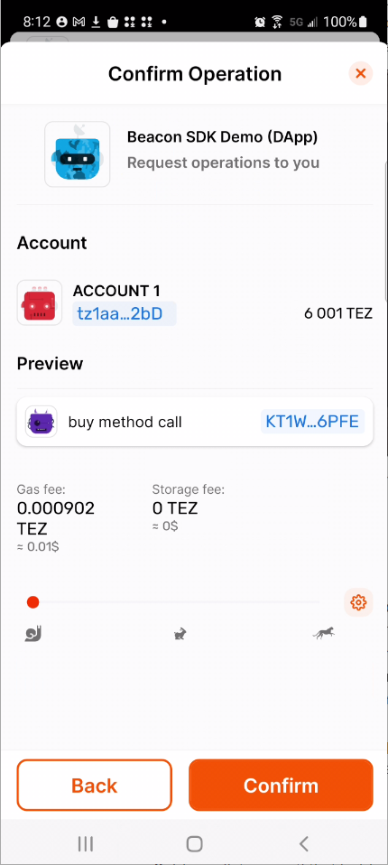


In the wallet app we are given *some* of the details we might want: this is a 'buy method call' from the same app and the same contract we've seen; there is no storage fee (we're not actually using up new storage space, as we were for the mints), and the gas fee is modest as always.  What this screen does *not* show us is the price in local coin we'll be paying, but of course Temple wallet is not set up to convey that kind of information; this is between us and the game, though it will absolutely be a real part of the on-chain transaction.  We'll press Confirm.  

As this is another blockchain transaction, when we return to our game app we'll first see the transaction success popup(s).  Having closed this. We will find that the 88-coin armor has disappeared from the market, and it now appears in our own inventory:

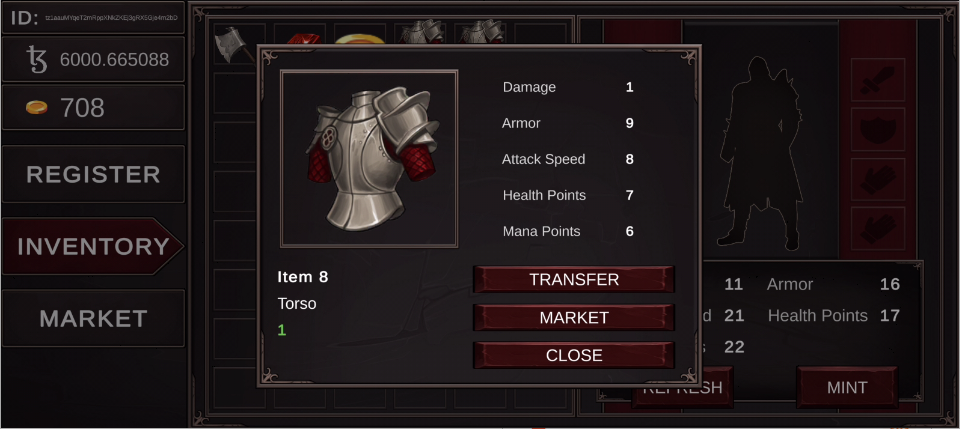

Since we already had several suits of armor, we have clicked on this one to confirm that it is indeed Item 8.  Note that our local-coin balance has now been decremented as well by 88 coins (and whoever owned the armor was credited with the same amount). And of course, we now have a new operation recorded for our contract, per Better Call Dev:

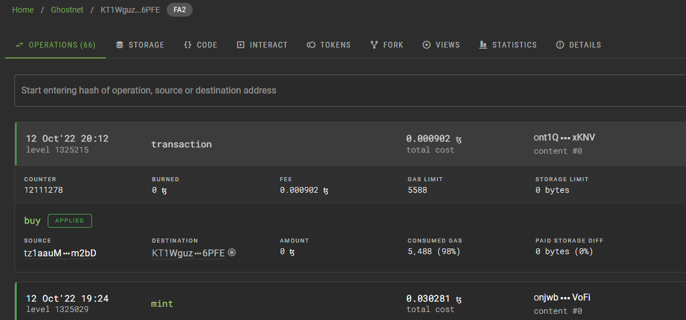

The most recent operation in our contract is now a **buy**, with the source account being, of course, the one we are currently using.  The fees are less for this transaction because no new storage was required: we have simply updated the owner of token_id 8 in storage from the original account to our own, and also incremented their account by 88 coins and decremented ours. 

But now we are feeling coin-poor and overstocked with personal items, so its' time to sell some.  First we select one of our own (freshly-minted) suits of armor, which loads in the inventory detail box;

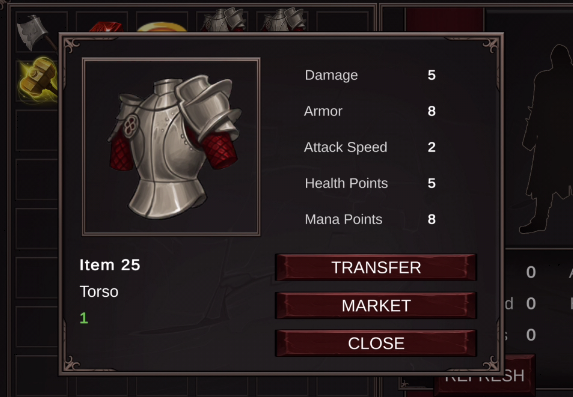

This is item 25, so definitely part of our recent minting spree.  This time we're not so interested in the statistics--though we could be, if there was anything strikingly good or bad about this suit of armor that might affect our asking pricing.  Here we're more interested in the MARKET button, which when clicked will present an add-to-market dialogue:

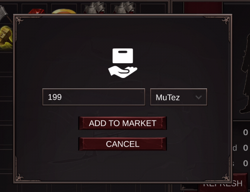

Note that we are invited (actually required) to specify an asking price in local coin.  This box will be empty when you first see it: we have decided to ask 199 coins for this item.  We will then press ADD TO MARKET. Note that this too is an on-chain operation; thus we will need to confirm this transaction too in our wallet:

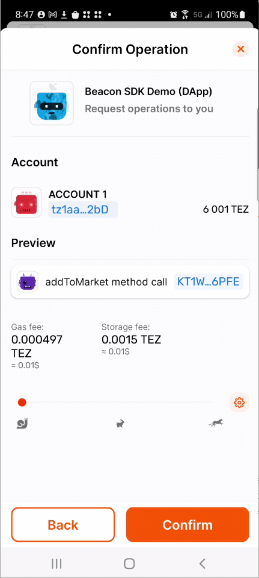

Here the specified method is "addToMarket" (in a separate document we will see all of these functions or entrypoints defined in our contract code).  Note that we do have a very small storage fee here -- much smaller than Mint, but not 0 as with the Buy operation.  This is because, although we are not actually shifting ownership of the item here, we are adding it as a record to the separate **marketplace** ledger in our contract storage.  

Having confirmed this transaction, when we return to the game app (and noted and closed the success popup) we find that the item, Item 25 suit of armor, remains in our personal inventory -- because we still own it, pending a purchase--but it will now also appear in the marketplace, with our specified asking price of 199 coins:

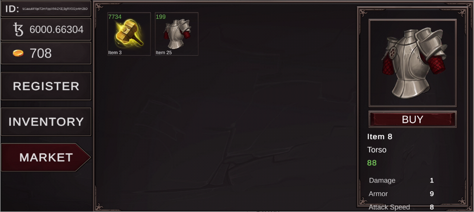

And while there is perhaps no need at this point, we can also verify this transaction on Better Call Dev, just above our purchase of the Item 8 armor:

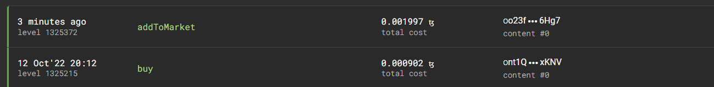

Having established the pattern, we will now go on a marketing spree, and add to the market every item in our inventory other than the Item 8 armor we just bought.  We will keep the 199 asking price for all items, if only to identify that they're all ours.   In our **Inventory Sample Game** project we have not implemented a batch add-to-market feature (though you certainly could, in principle), so these are all individual operations, each requiring their own wallet authorization.  As a result, the marketplace is now brimming with our offerings, all for the low price of 199 coins:

 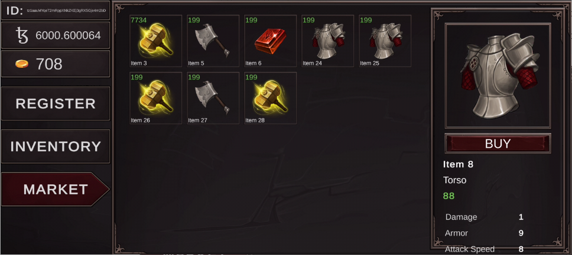

Note that even with the extremely modest fees charged per transaction, they do add up over time.  When we first paired with this second account, the Tez balance was a bit over 6000.8; now it's just barely above 6000.6.   This hardly seems alarming when measured against 6000 whole Tez, but of course we were gifted that Ghostnet Tez in the first place.  If this app were on Tezos Mainnet and the fees were the same (and they could easily be more),  our brief play session would have cost about US $0.35 at current rates.   This might still seem trivial, but you must consider how many iterations and tests it would take you as a game dev to implement this or any significant transactional functionality.  Hence the utility of Ghostnet and play-Tez.      

What if we have placed a bunch of items on the market, like this, and now are second-guessing this decision for some of them?  Perhaps we feel that we'd better hold on to our two war-hammers after all.  To remove them from the marketplace, we do not take that action from this tab but rather return to our Inventory tab, where we can click on the Item 26 war-hammer:

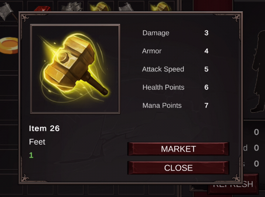

As far as *this* popup is concerned, there is no obvious indication that this is an item we've placed on the market -- unless we knew to notice the absence of the TRANSFER button, which is functionality we will review shortly.  Suffice to say for the moment that one can't transfer an item one owns but that currently is on the market.  The market status of this item 26 will become more clear when we click the MARKET button again here:

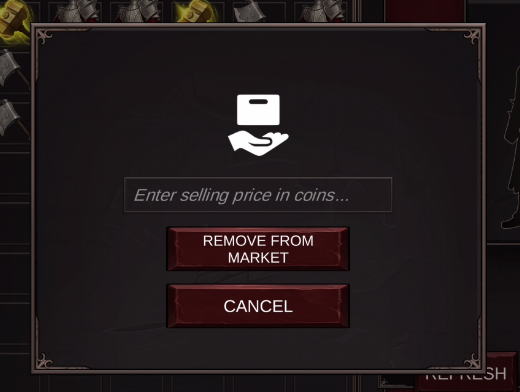

Now in place of an ADD TO MARKET button, we have REMOVE FROM MARKET.  We will click this button.  this is yet another request for an on-chain transaction, so we will get the familiar wallet authorization request:

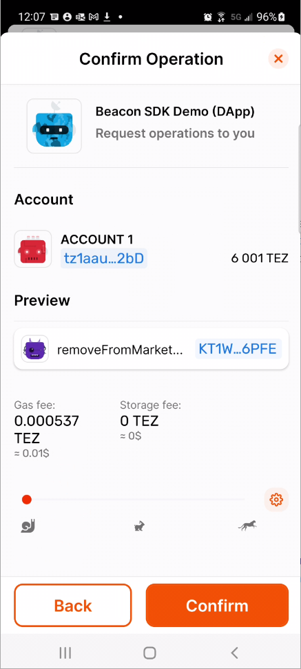

We see the usual DApp name and contract, now specifying a "removeFromMarket" operation in that contract.  There is no storage fee and only a very tiny gas fee: we are not adding any records to storage but in fact deleting a record (for token_id 26) from the marketplace ledger. We press Confirm.  Now when we return to the Marketplace in our game app, the Item 26 warhammer has been removed from the market:

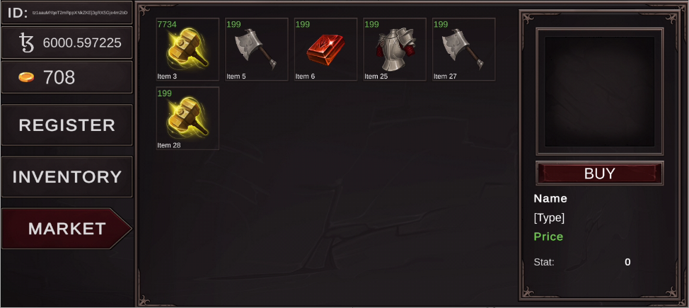

There ARE still warhammers for sale here, but not Item 26.  The Item 3 hammer is the insanely priced one (which will very likely never sell in the life of this contract), and the second one is our other hammer, Item 28, priced like our other items here for 199 coins.

We would love for someone to buy these items, but who?  We will in fact do it ourselves, from the other account on this mobile wallet -- the one we were using to begin with (again, game developers will always want to have multiple wallet accounts).   We go back to the REGISTER tab and press LOGOUT, which will return us to the Login screen and invite a new pairing. We will go back to ACCOUNT 2, the first one we used for mobile deeplink pairing above.  After that pairing is approved  we are returned to the game app's Welcome screen, showing us the following:

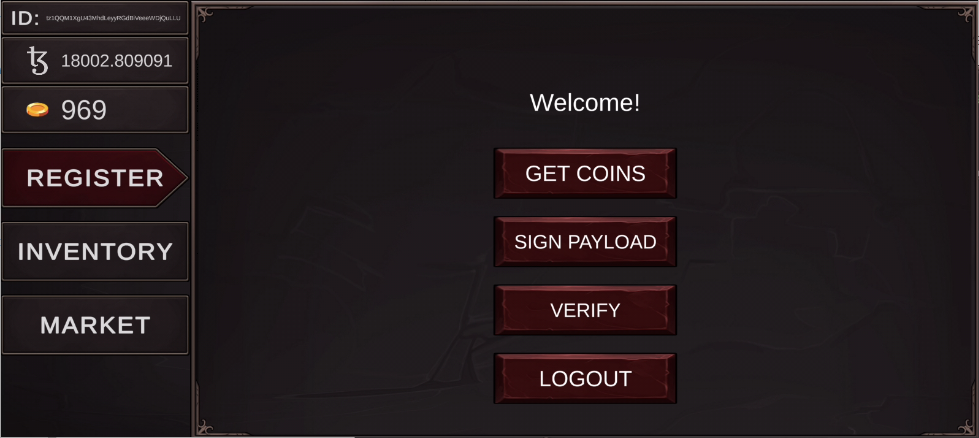

Here we immediately see a balance of 18K (Ghostnet) Tez and 969 local coin, so we know the account is different.  Now a reader with a very good memory might recall that when we last saw this account's balances, the Tez balance was the same but the coin balance was 881.  This account has earned some more coin since then.  From where?  Well, the difference is 88 coins--the exact price that we paid (from ACCOUNT 2) to buy that one suit of armor from the market.  Apparently that suit belonged to this account, so it has been credited for the sales price.

Even with that sale, though, this account's personal inventory is still crowded with items:

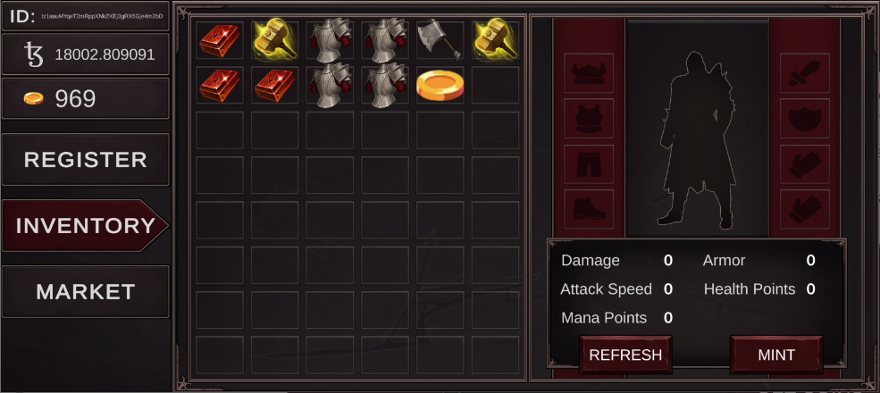

Our inventory is crowded with items, and yet we still have coin to spend here, so we will buy more items from the marketplace.  The marketplace itself looks identical to what we have just seen two images above: it displays identically in all accounts.  

#### Buying Marketplace Items

So we will start buying up those items priced at 199 coins, beginning with the hand-axe, which was item 5.  From the main market display panel, we select it for purchase:

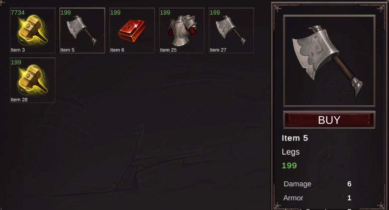

We have already seen what happens when we press BUY: the game app will send the transaction request to our wallet (now paired with ACCOUNT 2) to confirm the purchase.  We'll go ahead and confirm, then return to the Market tab of our game app.  After closing the success confirmation box, we see the following:

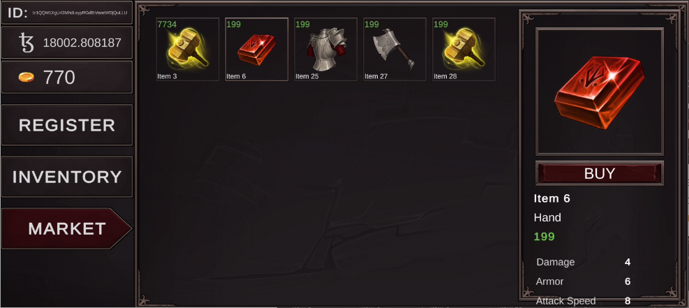

As we see, the 199-coin Item 5 axe is now gone from the marketplace; it's now ours, to be found in our personal inventory.  And we've paid for it: our coin balance has now been debited by 199 coins.  But let's keep buying, spending down our balance as far as we can.  We've clicked on the magic stone (Item 6), so this item in turn has loaded in the right-hand detail panel and we can BUY it from there.  We go though the BUY sequence again, and return once more to the market tab:

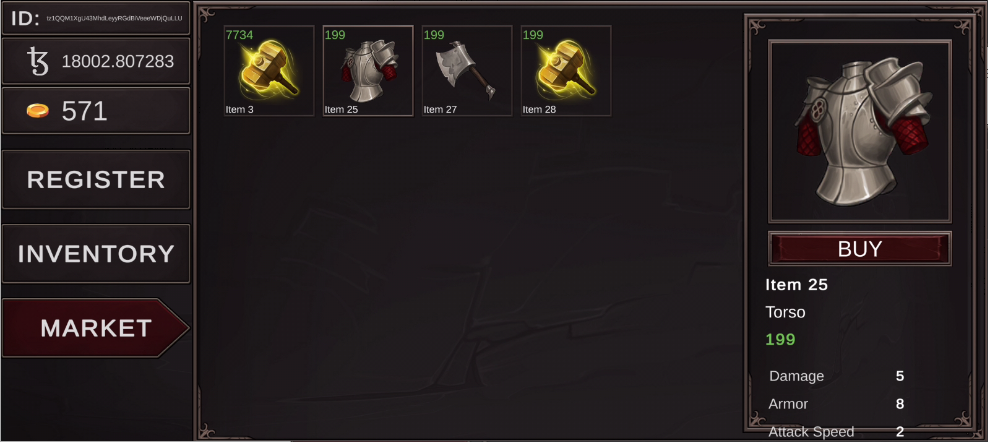

Now the stone is gone (we'll find it in our inventory), and our coin balance is decremented by another 199 coins, now down to 571.  But buying is fun and we can't stop.  We will buy the Item 25 armor (currently shown above in the detail box), and follow this with the Item 27 axe.  After completing both transactions, we return once more to the market we have now nearly emptied out:


But note that we have also nearly emptied out our coin balance: it's down to 173.  If we just had enough for that last war-hammer--not the 7734-coin one, of course, but the one for 199 coins.  Maybe this market will give us credit?  There's only one  way to find out: we select that image to load it into the right-hand panel, then press BUY.  Now in our wallet we see this:

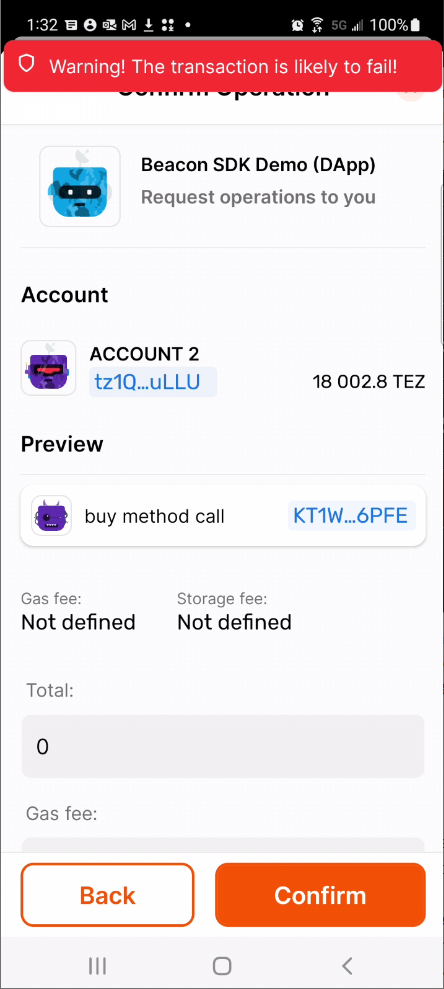

Oh no!  Even though the wallet itself may not have been tracking (or at least displaying) our running balance in coins, our game contract certainly was -- and it evaluated this transaction request as "likely to fail" because our remaining balance was insufficient to cover the asking price.  Some kind of "unsufficient funds" error was returned to the wallet (this is why the Gas and Storage fees are "not defined" here -- the contract has not calculated them because the transaction is invalid to begin with).  When we see this "transaction is likely to fail" notice, the wallet will take no further action--we can continue clicking the Confirm button, but we'll just keep getting the notice again.  We need to instead click the Back button to get us out of this loop and let us return to the game app, with the 199-coin hammer still unpurchased.

We do, though, have a *lot* of items in our personal inventory now:

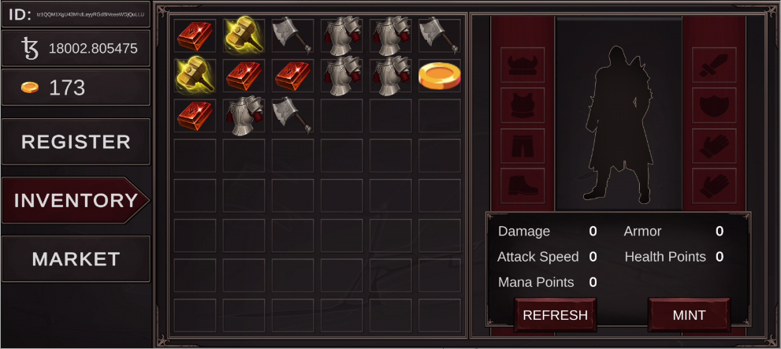

Item-rich and coin-poor, we could of course choose to put any and all of these items on the market ourselves (ie from this account).  Some of them we minted, for free; some of them we've purchased, for 199 coins or other prices.  If we marketed them all for, say, 230 coins, that price *might* still attract buyers and would earn us  a total of 3220 coins, which seems like a handsome profit.  Or, since many of these were minted for free anyway, we could price the lot of them for, say, 170 coins each and undercut ACCOUNT 1 with their 199 coin price.   Selling them all at that price might happen more quickly, and this would still earn us 2380 coins

But what if we our tired of commerce altogether, and would simply like to GIVE our items away.  There's a feature for that too.

#### Transferring Items

When we click on any inventory item that is NOT currently on the market, we've seen we get an Item Detail popup with stat figures and then three controls, one of which is TRANSFER:

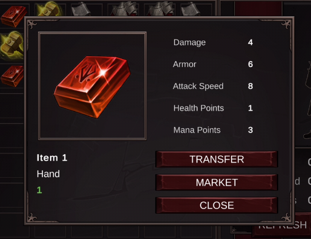

This particular magic stone, the first item in our inventory, happens to be called "Item 1", so we know it was the first token to be minted on this contract by anyone. But we are not sentimental; we've decided to shun all personal possessions including this one.  We will press the TRANSFER button, which brings up a Transfer dialogue:

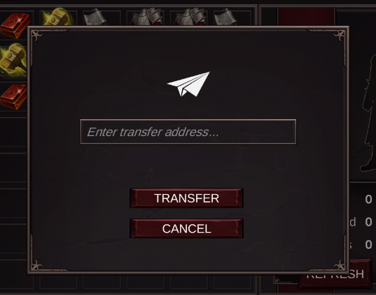

Here we are prompted to enter a "transfer address", and by this is meant *any* valid Tezos-compatible wallet account.  There is at least some degree of error-checking here: for example if we instead enter the string "foo" for an address, and try to transfer our item, we'll receive the "transaction is likely to fail" warning in our wallet and cannot complete the transfer.  However, we would be successful if we happened to enter the Tez wallet address of a total stranger, on the other side of the world.  This is a feature by the way of pretty much all crypto transfers--you need to get the receiver's address hash exactly right, or you'll be sending something to a total stranger.  In our case we will take the easiest route, and simply send this account's tokens to ACCOUNT 1 on this same wallet (simply because it is easiest to copy/paste an account hash id that resides on the same device):


With a valid account address loaded (and better still, one we can verify ourselves), we can now press the TRANSFER button and get a confirmation signal from our wallet, with no warnings:

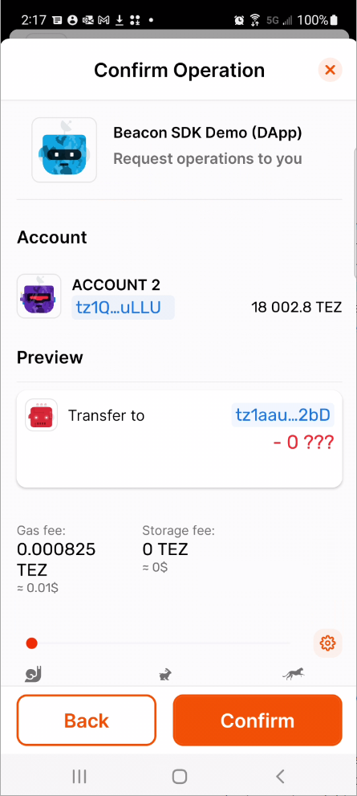

This is a reasonably full message about the proposed transaction: it identifies our game app, and also that this is a transfer to the specified wallet address (tz1aau...); the wallet doesn't identify this address as another account on this very same wallet, but we can't have everything.  Note that the wallet is also baffled about the *amount* we are sending because it isn't an amount (as would be more typical for a transfer); it's a token in our contract storage.  There is a small gas fee but no storage fee, because with this operation we are merely updating our token ownership ledger to a new owner for this token.  We press Confirm and return to our game app, where (after closing the success popup) we see that the item is now gone from our ACCOUNT 2 inventory.  Happy with this unburdening of our possessions, we proceed to transfer seven more of our items to the same ACCOUNT 1 address.  By the way, Better Call Dev is vigilant as ever, recording these eight transfer events for our contract:

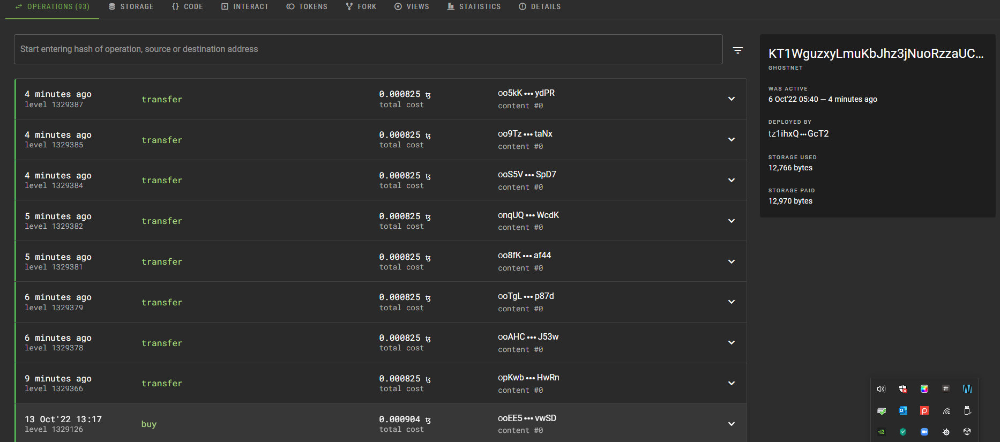

Now our ACCOUNT 2 inventory is considerably emptier--though we've still only given away eight items out of 14, so the rest remain:

`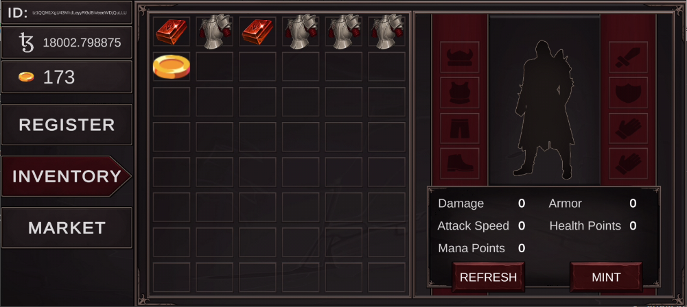

We could give these away too, if we wanted -- there's nothing to prevent it programmatically, since none of the remaining items are currently on the market for sale (and if they were, we could just take them off the market *and* then give them away).  In fact, as a variant of this feature we can even select our *coin* token for transfer.  But before doing that, let's switch back to the other account, which currently has a much higher balance in coin.  From the inventory in that account, we will click on the coin token and bring up the usual **ItemDetailPanel**:

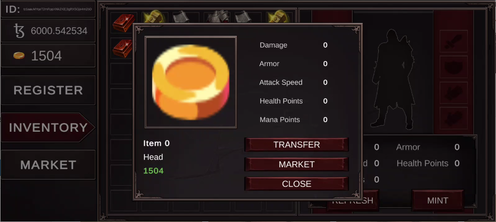

If you scroll back to our magic-stone transfer dialogue above, you'll note that the green figure was "1", indicating that we had only one of that particular token: we may have had more magic stones, but certainly only one named "Item 1"--otherwise our contract storage would have contained more than one token_id 1, and something would have gone seriously amiss.  Here, however, the green figure is instead **1504**.  But this *also* makes sense, because coin tokens are not unique--they all have a token_id of 0 (which is why this item is named "Item 0"), and in the newly-paired account we happen to have 1504 of these coins, as the coin balance also indicates.  So *now*, when we click on TRANSFER here, we will see a variant of the usual Transfer dialogue:

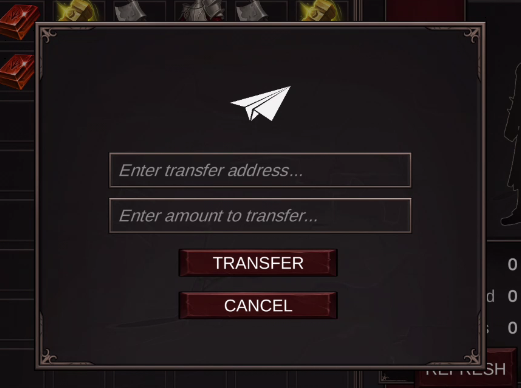

In addition to an entry box for the recipient wallet address, we can also now specify an amount to transfer -- although this transaction too will be "likely to fail" in the wallet if we try to transfer more coin than we actually have.  So we will transfer just 500 of our coins, and again, for ease of testing, we'll simply specify the other account address on our mobile wallet, (from which we transferred the stone to this one):

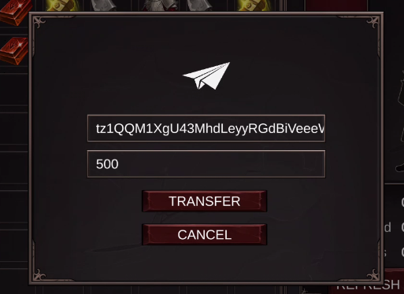

We'll hit transfer, and as usual be asked to confirm the transaction in our wallet.  Having done so, we can go back to the game app and confirm that our local-coin balance has in fact been debited by 500 (it was 1504 before the transfer):

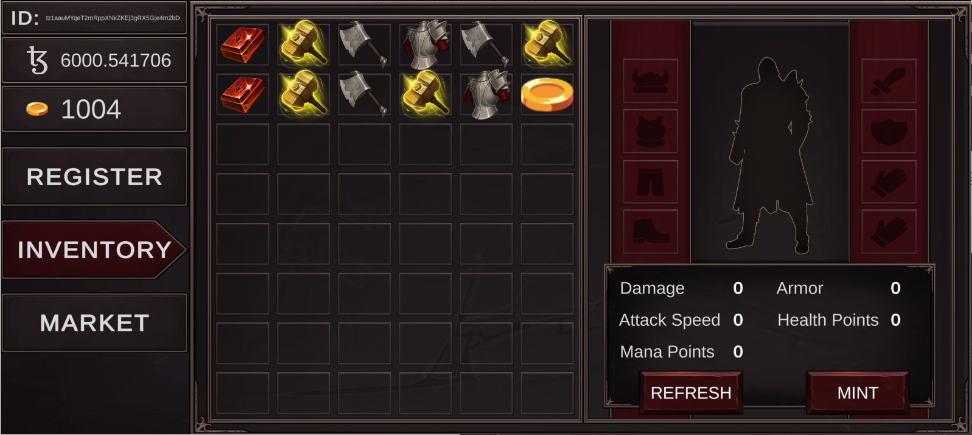

And if we were to logout and re-pair with the tz1QQM... account, we would see that this account has been credited with the 500 coins we just sent. Incidentally, while we're viewing the inventory of the present account, that magic stone in the upper left corner is Item 1, the stone we previously sent over from tz1QQM... (aka ACCOUNT 2).  In fact nearly all of the items in the inventory we're seeing here were transferred from ACCOUNT 2 in the transferring spree above. 

But what, you might be wondering, is the real-world use case for such a TRANSFER feature?  One isn't very evident in the rudimentary **Inventory Sample Game** project we have implemented; but in a fuller, multiplayer game (with real game dynamics), there might well be occasions when another player does you a good turn, or the impulse takes you for whatever reason, and you decide to gift him or her with some object of yours, or some amount of local coin as we've just seen.  You might not know that user's wallet address, but the game would; typically in this kind of scenario you'd simply click (or right-click) on that player's avatar (or perhaps name in a list), and GIFT would be one of the choices.  We are simply demonstrating that this gifting functionality exists via our SDK (and indeed our current contract code), for both unique tokens and for coin, so it would only need to be implemented in the UI as you saw fit.

And with these item transfers, we have exhausted our tour of the **Inventory Sample Game** project user experience, and also indicated the use-cases for which we will trace the Unity call-stack later in this document.


### Architecture of the Demo Project

Having seen the user experience of the running game app, it's time to dive into the architecture that makes that experience possible -- at least on the Unity side.  The public API of the integration SDK that our **Inventory Sample Game** project is consuming will be documented separately, for convenience; and the Tezos smart-contract code will be documented separately as well, in a systematic fashion.  Here we will consider the basic **object model** we are working with in our UI code, then briefly note the location of the scripts that serve the **Inventory Sample Game** project UI and 'middle tier', and finally we'll consider how the UI game-object components are laid out within the Unity editor itself.  

#### Object Model

As we've seen from the user experience, our example scene involves a **user** who logs in, though in the Web3 context this user will be chiefly represented by the **wallet** (or wallet account) that he/she pairs with the game app, first to **register** or authenticate and then to sign any subsequent in-game transactions.  In our scene these transactions primarily involve buying, selling or minting game items, so it will be important to track the **item** objects (for which the model is defined in **IItemModel**).   In the UI layer these game items will for the most part sit in inventory **panels**, each laid out in a **flexible grid**, of which there are two: the user's personal inventory panel (here just referred to as the **Inventory**) and the **Market** inventory panel.  Each item is visually represented by a 2D sprite, and has associated with it a set of **statistics** generally relevant to game items in our genre.  Each item is also **draggable** within the Inventory panel, from one **ItemSlot** to another; and within the (Personal) Inventory tab items can also be dragged from the Inventory grid-panel itself to the 'Hero' area, where there are outlines for each item type.

At the UI level, this object model is represented by the scripts found in the **UI** subfolder within Scripts/DemoExample, with each script (class) descriptively named for the class it represents or manipulates:

### Scripts/DemoExample/UI folder

In the UI folder of Scripts/DemoExample, we find scripts directly related to viewable objects in our UI:

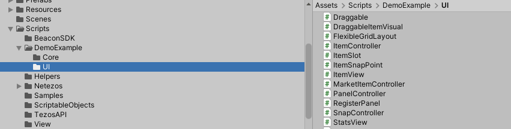


At the top level of the DemoExample subfolder we find scripts to manage the overall UI (**UIManager)**, the personal Inventory (**InventoryManager**) and the Market inventory (**MarketManager**), as well as a class factory for the **ExampleManger** class which will be central to the game's middle tier:

### Scripts/DemoExample/

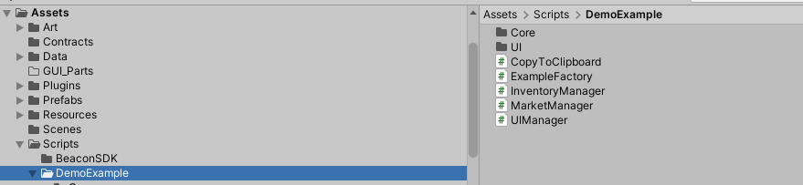


Scripts in the DemoExample/Core folder constitute a middle tier which allows us to read & write **user** and game **item** information in the 'back-end', which in traditional game architecture would be typically be some kind of database, either hosted locally, via network or in a cloud service.  In our Web3 scenario, the actual back-end we are accessing here is provided by smart contracts on the Tezos blockchain itself, but all of that communication is ultimately done via our integration SDK.  So we have created an **ExampleManager** class (and its public interface **IExampleManager**) for all of the various UI-level calls in our particular example to be routed through on their way to the integration SDK's actual interface.  We will see this call stack in detail as we trace out the various use cases below.

### Scripts/DemoExample/Core folder

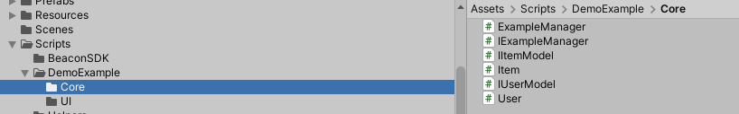

As you can see, the Core folder also contains a class to define our **Item** object at the UI level (and its public interface **IItemModel)**, as well as corresponding **User** and **IUserModel** classes. `IItemModel` in particular will come up quite frequently in our UI operations, and in the translation of item objects brought up from or sent down to the Tezos contract by way of our SDK. 

### ITezosAPI, and Core Classes of the SDK

Alongside the DemoExample folder we have just explored, you will find the folders BeaconSDK, Helpers, Netezos, ScriptableObjects, TezosAPI and View. Of these other folders, the only one that will really concern us here is **TezosAPI** since this contains the actual public SDK interface class `ITezosAPI`, and its implementation class `Tezos`.   

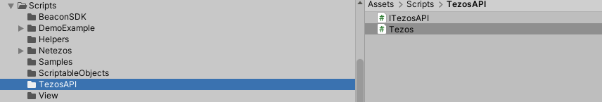

Both Netezos and BeaconSDK are 3rd-party, core component of our integration SDK and out of scope for this documentation, except to the extent that certain Netezos helper functions are used in the preparation and consumption of our public API calls to the SDK.  These functions will be explained as necessary. Obviously all of the core SDK C# code is open for your own inspection, but we strongly recommend you leave this code (and indeed ITezosAPI and Tezos) unmodified if you want our integration SDK to operate as described in this document and the SDK API document.  

------


## Setup of UI Components in the Unity Editor

The **Inventory Sample Game** project comes ready-to-run out of the box, meaning that as soon as you have imported our SDK package *including* the **Inventory Sample Game** project into a new project, you should be able to build that scene to either Desktop, WebGL, Android or iOS (as with any Unity game, you will need to choose which platform to target in the Player window before you build).  Let's continue our tour of the **Inventory Sample Game** project architecture by seeing how the UI tier of this single-scene project is laid out in the **Scene** and **Hierarchy** windows of the Unity Editor. Please go back and review the User-Experience walkthrough earlier in this document if you haven't done so already, as it will be extremely helpful in orienting you to the functions of various UI component. 

Please note that when you first view the Hierarchy for this scene, all of the nested (or child) elements shown below under "Canvas" will likely be collapsed into that Canvas object; we have expanded them here to make them visible for subsequent reference:

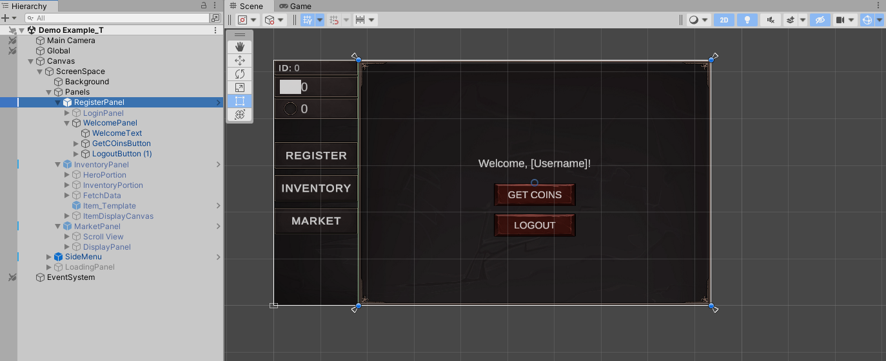

In the Hierarchy window, we first note the four top-level game objects **Main** **Camera**, **Global**, **Canvas** and **EventSystem**.    The absence of arrow icons next to all of these but the Canvas element indicate that the rest do not contain any child elements. Note also that some of the visible child elements here appear greyed out -- this indicates that they are deactivated by default, and therefore not currently visible in the Scene.

##### Main Camera

For those new to Unity, this is a game object added by default to any new Unity scene, whether 2D or 3D; either this or some other camera object is necessary if the scene is to be visible at runtime.  The difference is that in a 3D scene the camera can be positioned, in the scene space, in any relationship to the other game objects in the scene, and will show a different perspective on the action depending on this positioning; in a 2D scene such free repositioning of the camera is not possible, and thus the Game view will always more or less match the Scene view.   

##### Global

This is an empty game object we have added in to manage all the other components of the scene.  We can get the best sense of its function by clicking on the Global object in the Hierarchy and viewing the <u>Inspector</u> properties for this object: 

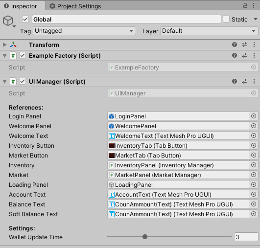

The two scripts attached to this object, `ExampleFactory` and `UIManager`, should be familar from our script overview above.  As the name suggests, the UIManager manages the display of each of the tabs and panels that collectively make up the UI.  All of these elements are defined in the UIManager class as <u>private</u> variables (of either type GameObject or the specific type indicated here in parenthesis), but in each case using the [SerializeField] directive, which forces these variable slots to display in the Inspector, such that objects of appropriate types can be physically dragged into their respective slots from the Hierarchy or other windows.  In our project we've already loaded all of these references appropriately, for this and other gameobjects.  In this case, each of these elements can be found in the Hierarchy under the **Canvas** top-level game object.  We'll look at these in a moment.  We should note first that **EventSystem**, the final top-level game object shown in the Hierarchy, is added by default to any scene to which has been added a Canvas UI object; its purpose is to handle user input to any of the UI controls that may be defined within a Canvas.

The UI components referenced in the UIManager script (and displayed in the above screenshot under References) are the following:

##### **LoginPanel** and **WelcomePanel** 

These two classes (or more accurately, empty game objects containing classes of the same name) can both be found nested beneath the **RegisterPanel** object in the Hierarchy.  **LoginPanel** displays by default when the scene is first loaded at runtime; it also displays by default in the Scene view when the project is first loaded:

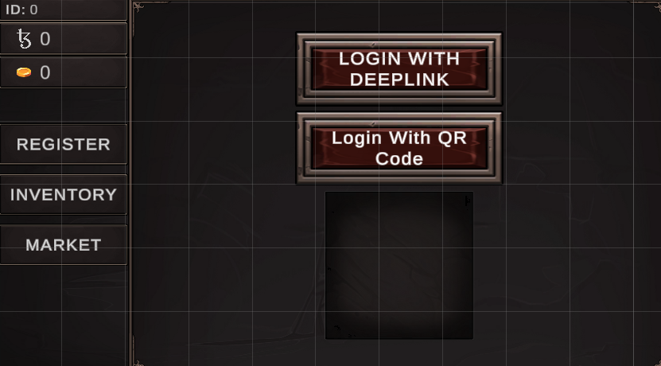

As we see, this panel invites the user to login by pairing this game app with a Tezos-compatible wallet, either through a deep link (wallet is on the same mobile device as game app) or by scanning a QR code (wallet is on a separate device).  All of the elements in this panel can be found nested under the LoginPanel object in the Hierarchy: the two buttons with their associated texts, as well as the **QRCode** object, here showing simply a shaded background color.   At runtime, upon request the **QRCodeView** script attached to this object will generate an actual 2D QRCode texture (or image) which encodes the Tezos QR code pairing link (for more detail see the UX walkthrough as well as Use Case 1 below).  Here are these UI elements as shown in the Hierarchy:

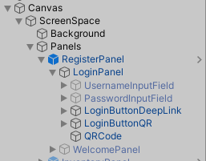

Once wallet pairing has been achieved, through either QR Scan or DeepLinking, this LoginPanel will be replaced by the **WelcomePanel**.  Within the editor this can be displayed in the Scene (or Game) view by temporarily deactivating the LoginPanel and activating the WelcomePanel:

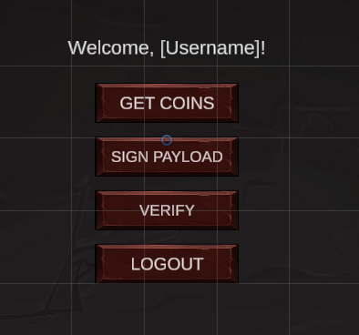

Here [Username] is the placeholder for a real username which could be input on the LoginPanel, though in our Example implementation we are registering only the user's wallet address, so at runtime the screen text is updated to simply say "Welcome!"   As we saw in the UX walkthrough, the **GET COINS** button, which can be found under the WelcomePanel object in the Hierarchy, will dispense 1000 coins of local in-game currency to the paired wallet account.  [NEED TO ADDRESS WHAT SIGN PAYLOAD AND VERIFY BUTTON DO, IF THESE AREN'T TEMP] The **Logout** button, which can also be found under the WelcomePanel object in Hierarchy, has the effect of cancelling the active paring of the user wallet with the app, thus effectively logging the user out of the game.  This action would cause the LoginPanel to reappear in case the user wanted to log back in.  

As you inspect these and further UI panels, please remember what you have activated and deactivated to make a given panel visible. You'll want to undo all this (or simply don't save changes to your project) so that the app will function correctly.   The code is engineered to show and hide these various panels as appropriate, but it can only do so if the component's beginning active/inactive state is what the code expects. 

##### InventoryTab and MarketTab

Returning to the Global/UIManager elements exposed in the Inspector window above, the next two variables are InventoryTab and MarketTab.  Generally speaking, **panels** take up the central space in the game's display area, whereas **tabs** refer to button controls on the left navigation bar visible in our first Editor screenshot--although these will in turn *control* the display of additional central panels.    The Inventory and Market tab buttons themselves, which fill these slots in UIManager, can be found in Hierarchy under Canvas > Screenspace > SideMenu > TabGroup.  The following screenshot shows these elements of the hierarchy expanded, and also shows the tab buttons themselves displayed in the left navigation:


We'll note several elements here.  First, in addition to the Inventory and Market tab buttons, under TabGroup we also see the RegisterTab button.  The Login panel is displayed by default when the app is opened, but a player could use the Register button here to return to the WelcomePanel (see above) if he/she wants to log out, or if the wallet pairing is lost.  Meanwhile, the Inventory button here will display the InventoryPanel, and the Market button will display the MarketPanel.  These are the next two objects in the UIManager slots.  But before we get to these, let's note three more elements that are immediate children of SideMenu: AccountNumber, CoinCase and SoftBalance.  **AccountNumber** will display the id/address of the currently-paired wallet account, in the "ID" field above the tab buttons.  **CoinCase** is the second field and displays the paired wallet's current balance of Tez, ie the official cryptocurrency of Tezos.  **SoftBalance** displays the current account balance of *in-game currency*, which as we saw in the UX walkthrough we have simply called "Coins"--a completely separate kind of fungible token from Tez, but still an on-chain token that is fungible in the sense of being tradeable in whatever amount for a different item, such as a game item on sale in the in-game market.  

##### InventoryPanel

The Inventory Panel displays all game items that currently belong to the user (or more precisely the wallet address used for authentication) and are therefore in that user's personal inventory.  The InventoryPanel game object can be found in Hierarchy under Panels.  It actually contains two visual sub-components, the **InventoryPortion** and the **HeroPortion**.  When you first load this **Inventory Sample Game** project, the InventoryPanel is is inactive by default, but if you explicitly activate it, it will appear over the RegisterPanel we have just seen.  Here it is in the Unity Editor Scene view:

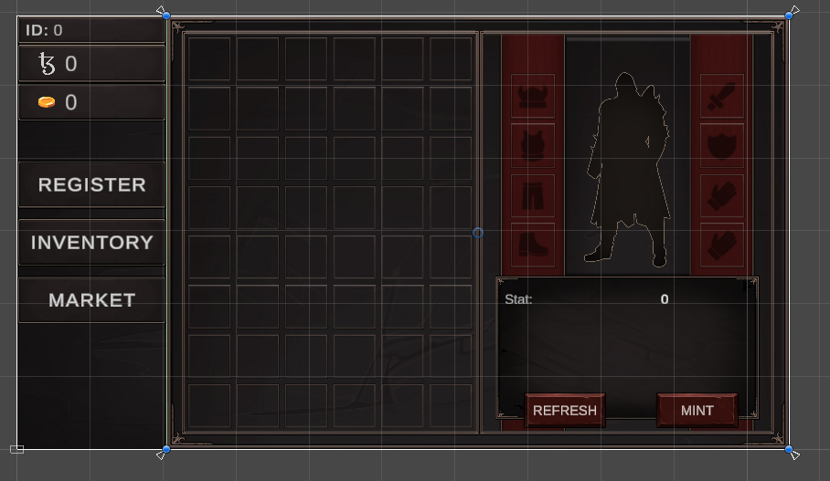

Here are the Inventory Panel components as shown in the Hierarchy, with InventoryPanel activated and most of the subcomponents expanded:

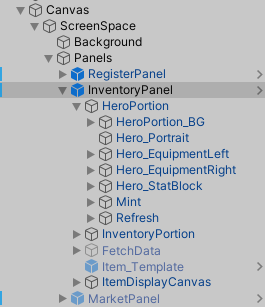

As we saw in the UX walkthrough, the game items displayed in this inventory are not only draggable but **clickable**: clicking one will invoke the item detail popup we saw, called ItemDisplayCanvas/**ItemDisplayPanel**.  Here is that element made visible in Scene view:

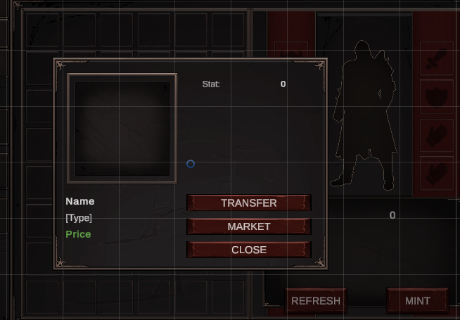

As we've seen, in our current implementation Name will be something like "Item 28", where 28 actually designates the token_id of this game item in our blockchain storage; there may be many items with the same sprite image (suit of armor, hand-axe, magic stone, etc) but each token_id and hence each name will be unique for a given contract.  The stat values displayed here at run-time (for damage, armor, attack speed, health points and mana points) will be those randomly-generated when that item was minted.  

Then we have the TRANSFER and ADD TO MARKET buttons.  Clicking the first will change the popup panel to reveal the Transfer dialogue: 

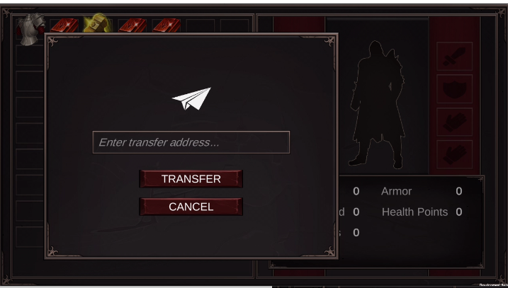

As we've seen, here we are invited to enter any valid Tezos wallet account address, and the further TRANSFER button will transfer ownership of the game item selected to the specified wallet address. 

Clicking on ADD TO MARKET will reveal its own dialogue box, here shown in the Unity Editor scene view:

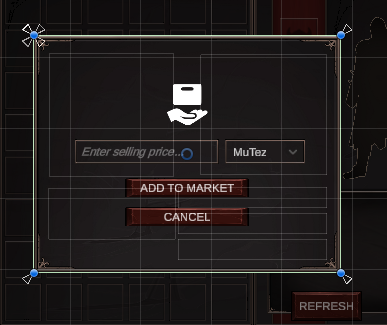

In terms of the Unity editor Hierarchy view, this **ItemDisplay** panel is a child of the ItemDisplayCanvas object, which can be found under InventoryPanel > InventoryPortion.  The buttons and dialogue buttons are children of this panel in turn.  This panel is hidden or *deactivated* by default; note that we have activated it to display in the Game view of the editor in the following screenshot:

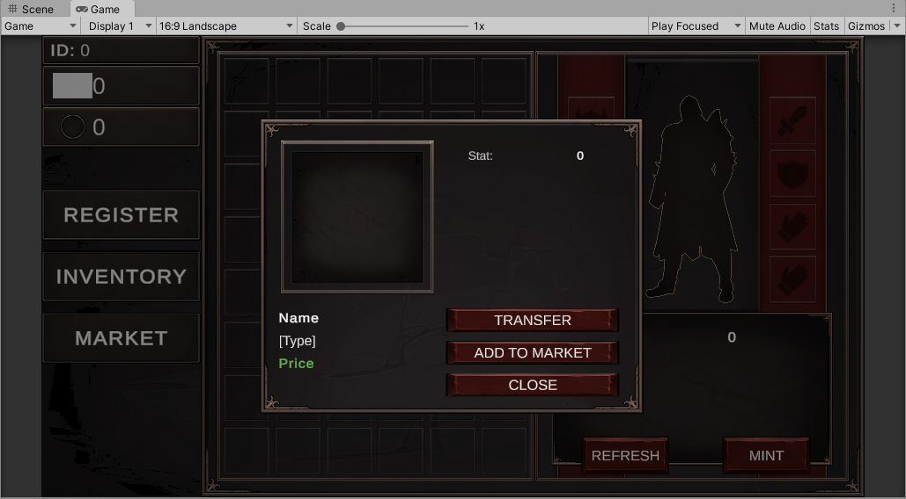

In turn, the TransferItem and AdditemtoMarket dialog boxes are child objects of the ItemDisplayPanel in the hierarchy. Here is the relevant Hierarchy view from the Canvas object on down, with the relevant child objects expanded:

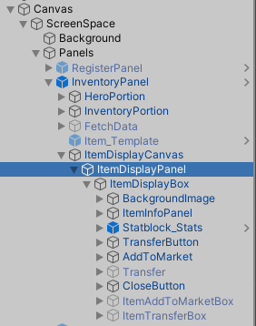

Over on the right-hand side, as we saw in the UX walkthrough, the "HeroPortion" of the panel displays the warrior outline, and the item category outlines around him to which you can drag relevant game items.  Doing so will cause the relevant statistics to display as the sum of the statistics of individual game items thus situated.  This is difficult to visualize outside a running game, so here is is a reminder of a screenshot we saw earlier of a particular account's inventory, with several game items dragged to appropriate places around the warrior figure: 


Finally, of course, the HeroPortion panel also contains the MINT and REFRESH buttons.  Here is the HeroPortion panel expanded in the Hierarchy view of the editor, with the InventoryPortion immediately below:

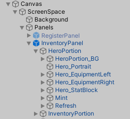

##### MarketPanel

Just as the Inventory left-navigation button displays the InventoryPanel, the Market left-nav button displays the MarketPanel.  As a Hierarchy object the MarketPanel and its children can be seen just below the InventoryPanel:

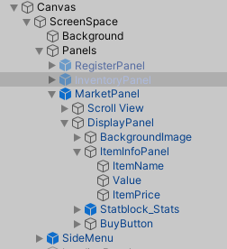

When the Panels object is first expanded, MarketPanel (as well as InventoryPanel) will appear greyed-out, indicated that by default they are deactivated or hidden.  As with any such UI element, you can view it by temporarily activating it in the Inspector for that object, by checking the checkbox next to the object's name, as shown:

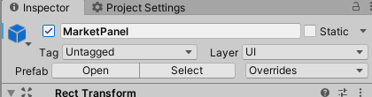

With the MarketPanel now activated, it will display in the editor Scene window like so:


As we have seen, the marketplace panel displays, in the central grid, all items currently placed on the market for sale, showing their image, their asking price and their name.  The panel on the right is called the **ItemInfoPanel**, and is where an item clicked in the main grid will display in greater detail, including statistics; here too we find the BUY button we will need to actually purchase this item.

##### Minting Items

As previously mentioned, the MINT button in the lower-right corner of the Inventory Panel, beneath the warrior figure, will mint a single new game-item NFT which will then appear in your inventory, once you hit REFRESH (the refresh action also occurs automatically on any other user input).  In the Hierarchy, both the MINT and REFRESH buttons are children of the InventoryPanel > HeroPortion. 

------

  

## Call-stack for each use case in the Inventory Sample Game project

Having seen how the UI is laid out, and how it offers user controls for initiating all of the **Inventory Sample Game** project's use cases, it's time to dive into the C# code that makes this all possible.  We will do this by tracing the call stack for each separate use case, from the UI tier down to the public API of our integration SDK.  In ending these call-stacks with the API calls, we will also necessarily reference the smart-contract entrypoints or off-chain view functions on the Tezos network itself (currently we are only deployed to the Ghostnet testnet) which support each of our use cases.   A separate document [LINK] will examine our Tezos-side contract and view implementation, for which we have used the JsLIGO language.  The goal of the present document is to help you become familiar enough with the **Unity**-side implementation to let you begin extending or adapting the **Inventory Sample Game** project, and otherwise building on the SDK foundation, to suit your own gaming needs.  But you will also need to deploy your own instances of our smart contract--initially to Ghostnet-- even if you're using our provided contract code exactly as-is (in the Project view see Assets/Contracts for our source code).  And you'll need to start extending or modifying that Tezos-side code as soon as you depart from the use cases embodied in our **Inventory Sample Game** project.  

For a good overview of the JsLIGO language for smart contract coding see  https://ligolang.org/docs/intro/introduction/.  For those who want a head-start on the specifics of deploying your own contracts to the Tezos blockchain, see https://opentezos.com/ligo/deploy-a-contract.  OpenTezos is the official documentation site of the Tezos blockchain; so for example, an excellent general introduction to what Tezos smart contracts are and do can be found at https://opentezos.com/smart-contracts/simple-nft-contract-1.  These, however, are necessarily generic guides.   Please see [Mathias doc] for a walkthrough of our specific Tezos-side implementation. 

A final note here: the present code walk-through is aimed at readers with **intermediate** skills in Unity C# programming.    If you are a more advanced programmer, feel free to skip any particular explanation and simply note the call-stack itself, at least for enough data read and data insert/update/delete use-cases to get a good sense of how our code architecture is designed, and how the **Inventory Sample Game** project consumes the SDK foundation.  If, on the other hand, you find yourself struggling to understand aspects of the C# code presented here that aren't explicitly explained, it may be useful to begin with some Unity/C# tutorials that are less ambitious than blockchain integration.  

#### Use Case 1: Authentication (Wallet Pairing)

The game session begins with user authentication, which in this case means a pairing with a Tezos-compatible wallet.  We've seen in the UX walkthrough above that this pairing can happen in a several different ways, depending on the **platform** to which the **Inventory Sample Game** project has been built, and the physical location of the wallet itself in relation to the game app.  For example:

1. with the game app deployed to either an Android or iOS mobile device, the pairing would most likely happen via **deeplink** to a wallet installed on that same device (at this writing, the option of QR scan on mobile has been enabled only in Developer Mode)
2. with the game app deployed to a desktop platform, the pairing could happen via deeplink to a wallet installed on that same desktop machine (though only some wallets have that installation option, and Temple is not among them--it comes only as a browser plugin and a mobile app). More likely in this case the pairing would happen via QR Code scan with a wallet installed on a mobile device.
3. with the game app published to WebGL, and thus hosted online, the pairing could happen through either a QRCode scan with a mobile wallet, or through 'injection', which means pairing with a browser-extension wallet where that browser is also hosting the WebGL app.

Since we have focused in our UI walkthrough on mobile-game scenarios, we will continue this focus and begin by considering how the mobile game app pairs with a wallet installed on the same mobile device (one of the deeplinking scenarios).  But as we'll see, this code stack will also tell us much of what need to know about the other options.  

##### DeepLink from mobile app

As we've seen, the LOGIN FROM DEEPLINK button lives on the **LoginPanel**, a child of the **RegisterPanel** prefab.  In the Inspector panel for this button, we see the following OnClick action specified:

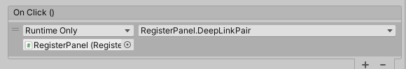

`RegisterPanel.DeepLinkPair()` is simply a passthough to the Deeplink() method of **ExampleManager**,  which is a class that centralizes all of our UI code calls down to our integration SDK's public API:

```csharp
public void DeepLinkPair()
	{
		_exampleManager.Deeplink();
	}
```

Note that ExampleManager also has a public interface class, IExampleManager, which is the actual reference of `_exampleManager`here, but we are interested in the implementation method `ExampleManager.Deeplink()`:

```csharp
public void Deeplink()
    {
        _tezos.ConnectWallet();
    }
```

So we've arrived very quickly at our first API method, `ITezosAPI.ConnectWallet()`.  But this may seem confusing since this method serves both the Deeplinking and the QR Code linking cases, as noted in our [API Documentation](/gaming/unity-sdk/api-documentation).  How does the app know which to call in this case?  Here we need to back up and reconsider the original calling class, RegisterPanel.  This class has the following Start() method:

```csharp
	private IEnumerator Start()
		{
			// skip a frame before start accessing Database
			yield return null;
	
			_exampleManager = ExampleFactory.Instance.GetExampleManager();
			_exampleManager.GetMessageReceiver().HandshakeReceived += (handshake) => _qrCodeView.SetQrCode(handshake);
	#if (UNITY_IOS || UNITY_ANDROID)
			_isMobile = true;
	#else
			_isMobile = false;
	#endif
	
			if (!_isMobile)
			{
			// Disable QR button and image
				SetButtonState(_deepLinkPair, true, true);
				SetButtonState(_qrPair, false, false);
				_deepLinkPair.GetComponentInChildren<TMPro.TextMeshProUGUI>().text = "LOGIN";
				_qrImage.gameObject.SetActive(false);
		}
	}
```

To begin with, then, the relevant action does not begin with the user's click of the pairing button, but rather with the initialization of this RegisterPanel class.  First we call the class factory for ExampleManager to create an instance of that class; then we use this instance to call `ExampleManager.GetMessageReceiver()`--we'll come back to the rest of this call in a moment.   Let's take a look at ExampleManager.GetMessageReceiver():

```csharp
public BeaconMessageReceiver GetMessageReceiver()
    {
        return _tezos.MessageReceiver;
    }
```

**BeaconMessageReceiver** is a class within the Beacon component of our SDK, whose purpose is to define a range of public events which can then be invoked within that class, which is itself exposed in our API:

`public BeaconMessageReceiver MessageReceiver { get; }`

Thus the call to _tezos.MessageReceiver will return an instance of this class.   Since we'll encounter them all at some point, let's go ahead and look at all of the events which can be raised by BeaconMessageReceiver:

```csharp
public event Action<string> ClientCreated;
public event Action<string> AccountConnected;
public event Action<string> AccountConnectionFailed;
public event Action<string> AccountDisconnected;
public event Action<string> ContractCallCompleted;
public event Action<bool> ContractCallInjected;
public event Action<string> ContractCallFailed;
public event Action<string> PayloadSigned;
public event Action<string> HandshakeReceived;
public event Action<string> PairingCompleted;
public event Action<string> AccountReceived;
```

At one point or another, all of these actions will be subscribed by calling code in our **Inventory Sample Game** project, in order to determine the success of operations in our various use cases and the sequences they initiate.  For now we're interested, to start with, in the HandshakeReceived event; because if we go back to the full call made in this instance to MessageReceiver--

`_exampleManager.GetMessageReceiver().HandshakeReceived += (handshake) => _qrCodeView.SetQrCode(handshake);`

--we see that we are subscribing to the `HandshakeReceived` event, with an output that calls the SetQrCode() method of the **QRCodeView** class (passing in this handshake).  QRCodeView will pertain to the separate QR Code method of pairing; for now, how is this HandshakeReceived event raised?  

##### The Handshake

Here we need to return to a point made early in the UX walkthrough -- that hidden beneath the public face of our API is a great deal of complexity, and much of that complexity relates to how the same game app on different platforms handles all the functionality of the SDK, including the initial wallet connection.  We will definitely not make a habit of looking beyond that public API, because most readers will not need to be concerned with the inner workings of the SDK.  But it's a trickier question when it comes to subscribing to these events, as this is one of several cases where inner-SDK functionality must be directly exposed to users of our SDK  In this particular instance it will certainly be helpful to understand just what "handshake" means in this context; so we will look at the API's implementation method for ConnectWallet(): 

```csharp
public void ConnectWallet()
		{
#if UNITY_WEBGL
			_beaconConnector.ConnectAccount();
#elif UNITY_ANDROID
			_beaconConnector.RequestTezosPermission();
			Application.OpenURL($"tezos://?type=tzip10&data={_handshake}");
#elif  UNITY_IPHONE
			_beaconConnector.ConnectAccount();
			Application.OpenURL($"tezos://?type=tzip10&data={_handshake}");
#endif
		}
```

Considered as an operation, 'handshake' here means that the game app has established an initial connection with the wallet app.  This happens in all cases by way of **IBeaconConnector**, the BeaconComponent class directly responsible for wallet connections.  Of course, `_handshake` is also a lengthy string variable which encodes this handshake operation as a unique url, which would, for example, be translated into the unique pattern of the QR Code if were taking that approach to pairing.  An example of this handshake string, copied from a QR Code offered up by the WebGL app, follows: 

Px8f36UtZrQCKMVk37gQN2nesBMMjupr6zQDZ3MopxrzWjDcFxnBX5XAVDsy9zyuU5T1PZ6WYCQpn1hW2NCVVzGmtNggBJkEWvgikxSYNnpRPUaphAbWEeV7FtJj7RRF2SVtD9UL4AAmZNhgwxZn3MZP9SeLqxmB15VySdr5VVnvo9PAxX8odM6dLsdxhfX3NmrFJFBTvSxr495Yt5GbriXshRemueALqXQ99swYoaD8EoXyC3eiGKhEyCspnTbNgUXBhedJZpMo5dXchRUy2uWq8PoGJJWySZo5mKttu6reo7AgqeuxvYD8DjvwKV1eEMoLAmMaTcwK5uA4

A string variable looking something like this will be passed around throughout the handshake code that follows, though fortunately we won't need to consider it again for a while.  IBeaconConnector itself is an interface class, and its implementations are platform-specific: _beaconConnector in the case of WebGL is actually a class named BeaconConnectorWebGL, and in this case the ConnectAccount() method will open that dialogue box we may remember from the very beginning of our UX walkthrough, the one that invited users (of the WebGL app) to select a browser-plugin wallet for 'injection' pairing, OR "pair with a wallet on another device", which will launch a QR code (which is the one from which we've just copied the handshake string above).  In other words, our WebGL game implementation handles both pairing options via a single call, to our API's ConnectWallet() method (which, for WebGL, is simply a pass-through to BeaconConnectorWebGL.ConnectAccount).  

However, as we see, if we are instead on Android or iOS, we must first call another BeaconConnector method, RequestTezosPermission(), and then the application will open a connection to the Tezos-compatible wallet on that device, with the signal that this is a handshake.  We have already gone far enough down this rabbit-hole of platform-specific and inner-SDK code; suffice to say that the  concrete result of such a ConnectWallet() call on a mobile phone will be, as we saw, to open the Tezos-compatible wallet on that same device and cause it to request permission for a pairing.  Simply by opening the screen *requesting* that permission, the wallet will cause the `HandshakeReceived` action to be raised.  This is useful for the RegisterPanel to know, because if it can't establish physical communication with the wallet, the pairing cannot proceed and some error message would typically be raised to the game app's Login UI.

But the pairing itself is not accomplished yet--not until the user has actually authorized it from their wallet; and *this* action will cause another event to be invoked.  Or really two: PairingCompleted in the case of iOS, and WalletConnected in the case of Android (and other platforms).  Don't even ask.  What matters is that we understand the end result: the user authorizes the pairing, and the game app then knows this pairing was fully successful, and it's time to exchange the LoginPanel for the **WelcomePanel**.  As with all major UI panel changes, this is orchestrated by the **UIManager** class, so we will not be surprised to find this class, too, subscribing to the wallet-pairing events (as it will with some the other events raised by BeaconMessageReceiver).  `UIManager.Start()` will call the InitializeCallbacks() method of that class:

```csharp
private void InitializeCallbacks()
	{
		_manager.GetMessageReceiver().AccountConnected += OnAccountConnected;
		_manager.GetMessageReceiver().AccountConnectionFailed += OnAccountConnectionFailed;
		_manager.GetMessageReceiver().AccountDisconnected += OnAccountDisconnected;
		_manager.GetMessageReceiver().ContractCallCompleted += OnContractCallCompleted;
		_manager.GetMessageReceiver().ContractCallFailed += OnContractCallFailed;
		_manager.GetMessageReceiver().ContractCallInjected += OnContractCallInjected;
	}
```

Again, what interests us here in particular is `AccountConnected`, but we should also be able to see the utility of `AccountConnectionFailed` and `AccountDisconnected`.  in the happy case, however, UIManager will receive the AccountConnected message and thus call `OnAccountConnected()`:

```csharp
private void OnAccountConnected(string account)
	{
		if (!string.IsNullOrEmpty(account))
			OnSignIn(true);
	}
```

 After testing to make sure that a specific wallet account string has indeed been passed back along with the AccountConnected action, we call OnSignIn() with a true boolean:

```csharp
public void OnSignIn(bool success)
	{
		AllowUIAccess(success);
		DisplayWalletData();
	}
```

Two final steps, then.  First, passing in the success boolean to AllowUIAccess():

```csharp
public void AllowUIAccess(bool allow)
	{
		loginPanel.SetActive(!allow);
		welcomePanel.SetActive(allow);
		inventoryButton.gameObject.SetActive(allow);
		marketButton.gameObject.SetActive(allow);
	}
```

Here, as long as pairing was successful, is where we are actually making the LoginPanel invisible, making the WelcomePanel visible, and also making visible and clickable the Inventory and Market tabs.  Deeplink pairing is complete. There is also a call to DisplayWalletData(), the purpose of which is to display the paired account's current balance in both Tez and local coin (which will be 0 on a first pairing) but presumably not thereafter).  But DisplayWalletData is really a separate use case, and will be considered below as Use Case 2.


##### QR Code Pairing

We've already learned much of what we need to know about the QR Code pairing route as well.  For one, we've seen that the QR Code option button, as well as the actual panel on which the app displays a QR Code texture, is explicitly disabled if the platform is WebGL: WebGL doesn't need our functionality for this since it handles that natively.  And the actual Handshake event and (once the user confirms the pairing) the subsequent AccountConnected event will be raised and will trigger the same UI response, whatever the pairing method.  You need to know about these events because your code, too, will need to subscribe to and respond to them, if you want successful pairing through our SDK.  Really all that remains is to inspect our **QRCodeView** class, which handles the actual display of the QR code in those cases -- really just desktop and the mobile developer mode -- in which we need to display this code for a pairing.

 The specific call made by the RegisterPanel class was to to the public method QRCodeView.SetQRCode(), but the full class is brief enough to inspect in its entirety here:

```csharp
    public class QRCodeView : MonoBehaviour
    {
        [SerializeField] private RawImage _rawImage;
        private Texture2D _texture;
        
    	void Start()
    	{
        	_rawImage.texture = _texture = new Texture2D(256, 256);
        	_texture.filterMode = FilterMode.Point;
    	}
    
    	public void SetQrCode(string handshake)
    	{
        	var uri = "tezos://?type=tzip10&data=" + handshake;
        	EncodeTextToQrCode(uri);
    	}
    
    	public void EncodeTextToQrCode(string text)
    	{
        	var colors = Encode(text, _texture.width, _texture.height);
        	_texture.SetPixels32(colors);
        	_texture.Apply();
    	}
    
    	private Color32[] Encode(string text, int width, int height)
    	{
        	var writer = new BarcodeWriter
        	{
            	Format = BarcodeFormat.QR_CODE,
            	Options = new QrCodeEncodingOptions()
            	{
                	Width = width,
                	Height = height
            	}
        	};
        	return writer.Write(text);
    		}
    	}
```

The _rawImage variable is a reference to the QRCode empty game object which can be found in the editor Hierarchy view as a child of the RegisterPanel > LoginPanel:

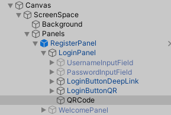

If you view this object's properties in the Inspector, you'll find the QRCodeView script attached, and this object set there as the reference. This object is essentially a blank canvas of 256 x 256 pixels -- it has the same background texture as the rest of the game.  The actual scannable QR code needs to be projected onto this.  We might recall that `HandshakeReceived` is an event raised by the Beacon component, but `handshake` is a specific string variable passed back to the UI along with that event, which in our example looked like this:

Px8f36UtZrQCKMVk37gQN2nesBMMjupr6zQDZ3MopxrzWjDcFxnBX5XAVDsy9zyuU5T1PZ6WYCQpn1hW2NCVVzGmtNggBJkEWvgikxSYNnpRPUaphAbWEeV7FtJj7RRF2SVtD9UL4AAmZNhgwxZn3MZP9SeLqxmB15VySdr5VVnvo9PAxX8odM6dLsdxhfX3NmrFJFBTvSxr495Yt5GbriXshRemueALqXQ99swYoaD8EoXyC3eiGKhEyCspnTbNgUXBhedJZpMo5dXchRUy2uWq8PoGJJWySZo5mKttu6reo7AgqeuxvYD8DjvwKV1eEMoLAmMaTcwK5uA4

This string will be added to the uri  "tezos://?type=tzip10&data=", and the result will be passed into the private method EncodeTextToQrCode(), though the real magic happens in the final private method of the class:

```csharp
 private Color32[] Encode(string text, int width, int height)
    {
        var writer = new BarcodeWriter
        {
            Format = BarcodeFormat.QR_CODE,
            Options = new QrCodeEncodingOptions()
            {
                Width = width,
                Height = height
            }
        };
        return writer.Write(text);
    }
```

**Color32** is a native Unity function, but **BarcodeWriter**  and **BarcodeFormat** are helper classes from ZXing, an open-source project whose library has been included in our QRCodeView class (you can find it on Github at https://github.com/zxing).   ZXing stands for "Zebra Crossing", which we feel approaches Baking Bad as a cool-project name.  Certainly what they allow us to do here is magical, though we might take it for granted in this world of everyday QR scanning.  In any case, with this we have our massive handshake string encoded and the displayed as a QR texture, and we may scan it from a remote-device wallet in such a way as to pair that wallet with exactly this correct dApp, out of al the dApps at all the watering-holes on the Serengheti.   


#### Use Case 2: Game Displays a Running Count of the User's In-Game Currency Balance and Wallet Tez Balance

Now that our game app is paired with a wallet, by whatever means, let's continue with the first use case that occurs by default, with no further user action beyond returning to the game app itself.  As we saw in the UX walkthrough above, the first indication that  a user has paired successfully with the account they intended to is the display of wallet currency balances, both in Tez and in local in-game coin.  For example, here is a successful account pairing on mobile, showing just this balance information on the left of the screen:

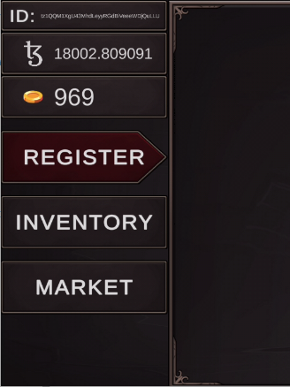

This happens to be our balance in Tez and local coin just after logging in with this account, but the balances will be updated again after every user action.  How does this display and update happen?  Let's start by going back to the Unity editor and determining the UI components responsible for this display.  In the Editor Scene view, all visible items are clickable (click any item until that specific item is highlighted, as shown below).  Here we see the Tez balance display box is highlighted, and we can also see in the Hierarchy view that the highlighted item is an empty game object named **CoinCase**.  If we were to click on the coin balance display just below that, we'd see that this one is another empty game object called **SoftBalance**.  For that matter, the ID display just above the Tez counter is a third game object called **AccountNumber**. 

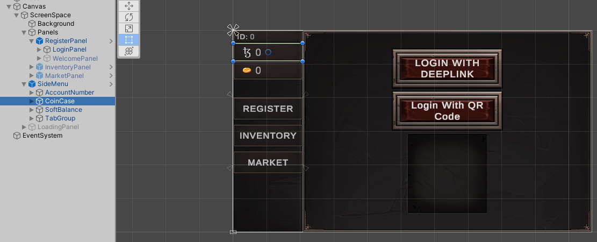

Since each of these game objects has a left-pointing arrow in the inspector, we know that each can be expanded to reveal child elements:

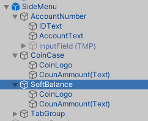  

The Tez and SoftBalance (local coin) counters both have 'logo' elements, with images attached (as we'd see in the Inspector panel for each of these objects), and each has an amount Text.  The AccountNumber object has an element for the text "ID" and another to display the actual wallet account string, also as a text (the balance figures themselves would seem to be floats or ints, but for display purposes Unity will always cast such numeric type variables to text).  So the question is, how are each of these texts actually set?  If we view the Inspector details for each of these elements in turn, we would find that no *script* is attached to any of them, which means that these text properties are being manipulated at runtime from outside this immediate set of objects.    In fact even SideMenu, the parent of all these left-hand UI elements, has no controlling script attached to it. 

We must instead go back to the **Global** gameobject in the Hierarchy, and to the **UIManager** script attached to that game object.  From the various object variables exposed in the Properties window when we click on the Global game object, we recall how the UIManager class controls essentially every top-level element exposed in the UI:


What interests us here are the three final slots under UIManager/References: the Account text, which is the account hashid display, the Balance text which will display the Tez balance, and the SoftBalance Text which will display our current balance in in-game currency.  To see how each are populated, let's begin by looking at the `Start()` method of UIManager:

```csharp
private void Start()
	{
		AllowUIAccess(false);
		inventoryButton.OnTabSelected.AddListener(AccessInventory);
		marketButton.OnTabSelected.AddListener(AccessMarket);
		inventory.onInventoryRefresh.AddListener(AccessInventory);
		inventory.onItemMint.AddListener(MintItem);

		_lastCheck = DateTime.Now;
	}
```

Much of what is being done here is adding event listeners to certain objects controlled by this class (and physically set in the References slots above): thus selecting the Inventory Tab will trigger a method of this class called `AccessInventory()`; selecting the Market tab will trigger a call to `AccessMarket()`. The onInventoryRefresh event of the InventoryManager class will trigger another call to `AccessInventory()`, and the onMintItem event will trigger the `Mintitem()` method of the present UIManager class.  We will explore each of these calls in subsequent use cases.    But note that the very first thing Start() does here is set the method `AllowUIAccess` to false, which has the effect of setting the welcome panel and the Inventory and Market buttons to inactive.  And the last thing this method does is set _lastCheck to the current timestamp.  

The value of AllowUIAccess will remain `false` until the user has successfully paired their wallet with the game, an action handled in the RegisterPanel class as we saw in Use Case 1.  We saw there that a pairing attempt will trigger `UIManager.OnSignIn()`:

```csharp
public void OnSignIn(bool success)
	{
		AllowUIAccess(success);
		welcomeText.text = success? "Welcome!" : "Pairing failed or timed out";
		DisplayWalletData();
	}
```

If that wallet pairing was successful, then `AllowUIAccess` is set to true--displaying the Welcome panel and enabling the Inventory and Market buttons--and we are also shown a success message of "Welcome!" Finally we have a call to the method `DisplayWalletData()` in the UIManager class.  This is the method we're looking for in the present use case.  We will see it called again as the final step for the UIManager methods AccessInventory() and AccessMarket(), for use cases 3 and 7 respectively.  So this method is called whenever the app expects that there might be a change to the Inventory and/or Market displays, and thus potentially to a user's wallet balance as well.  Here is `UIManager.DisplayWalletData()`:

```csharp
 void DisplayWalletData()
    {
        IExampleManager db = ExampleFactory.Instance.GetExampleManager();
        string accountNum = db.GetCurrentUser().Address;
        SetAccountText(accountNum);
        db.GetBalance(SetBalanceText);
        db.GetSoftBalance(SetSoftBalanceText);
    }
```

This method uses the Example class factory to instantiate an **ExampleManager** class, which it will then use to pull all three data elements we're interested in displaying here.  Mostly we're interested in the final two, as these can and often will change within a game session while the UserID will not; but since we've seen it here and will see it in future use cases, we'll begin with `ExampleManager.GetCurrentUser()` , a method which derives the current active User object.  Here is `ExampleManager.GetCurrentUser()`:

```csharp
public User GetCurrentUser()
	{
        return CurrentUser;
	}  
```

This method's logic simply indicates that `CurrentUser` is a variable stored locally in the ExampleManager class.  To find this variable's definition  we need to view the IsRegistered() method of this same class, which again is called as part of the wallet-pairing process:

```csharp
public string IsRegistered(Action<bool> callback = null)
    {
        string account = _tezos.GetActiveWallet();
        string address = _tezos.GetActiveWalletAddress();
        _currentUser = new User("Placeholder", account, address);
        _tezos.MessageReceiver.AccountAddressChanged += SetCurrentWalletAddress;
        return _currentUser.Identifier;
    }
```

Here we have two calls to our actual API: to `ITezosAPI.GetActiveWallet()` and to `.GetActiveWalletAddress()`.  The first of these returns an object which is at least potentially an array of strings, including the user's name as well as their actual wallet account address; the second returns only the account address itself as a string.  The object variable _currentUser, which is of type **User** as defined in the User class, will be loaded with the value "Placeholder" (for the **Name** property--our **Inventory Sample Game** project has no means to input a name, but yours might), the value of account for the property **Identifier** [THIS IS A STRING, SO WHY ON EARTH DO WE TWO SEPARATE API CALLS?], and finally the value of address (the actual wallet address) for the value of **Address**.   ExampleManager's initial variable definitions have already set `CurrentUser` equal to this local variable _currentUser, so once wallet pairing is successful and `IsRegistered()` is called, `CurrentUser` will be populated with all available information on the current wallet account. Of course we are only interested in the Address property in any case: this is what we will be displaying as the UI string accountNum.

Moving on to the actual current balances (in Tez and in local coin), we then have a call to `ExampleManager.GetBalance()` and another to `ExampleManager.GetSoftBalance().`  Here is `ExampleManager.GetBalance()`:

```csharp
public void GetBalance(Action<ulong> callback)
    {
        var account = _tezos.GetActiveWalletAddress();
        var routine = _tezos.ReadBalance(callback);
        CoroutineRunner.Instance.StartCoroutine(routine);
    }
```

This method begins by making a call to `Tezos.GetActiveWalletAddress()` [WHICH WE WILL IGNORE SINCE IT CAN'T POSSIBLY BE NECESSARY HERE -- WE'VE ALREADY GOT THE ACTIVE ACCCOUNT STORED LOCALLY IN THIS CLASS, SO WE DERIVE IT AGAIN FROM THE SDK?] 

We then have a call to the API method `ITezosAPI.ReadBalance()`, which will be called as a **coroutine**--the coroutine call is necessary because this is an http data READ operation which may have noticeable latency.  Here is the public signature of `ITezosAPI.ReadBalance()`:

```csharp
/// <summary>
        /// An IEnumerator for reading the account's balance
        /// Can be called in a StartCoroutine()
        /// </summary>
        /// <param name="callback">callback action that runs with the float balance is fetched</param>
        /// <returns></returns>
 public IEnumerator ReadBalance(Action<ulong> callback);
```

We note two things here, also flagged by the in-code comments.  First, this API method is defined as an **IEnumerator**, as it must be since it's being called as a coroutine, even though with this particular method we expect only a single data record to be returned, the current account's balance in Tez (or actually in MuTez).  More typically in C#, an IEnumerator is used to return an enumeration or list of objects, so this kind of data return is frequently handled with a foreach loop or other iteration logic.  In this case we're just deriving a single value, but in C# any method called as a coroutine must be an IEnumerator. Several other data-read methods of our API, which we'll see in further use cases, *will* expect multi-record data returns and therefore will not only need to be called via coroutines but their returns will need to be handled with iteration logic.  In this case we expect a single data record only. 

The second thing to note here is that the data record returned will be of type ulong (we'll see why this is necessary for a MuTez balance), and that it will be returned in a **callback** action, which in fact is the only input parameter of the method.  This means that the calling method will specify what action to take (typically another local method to call) in order to process the data returned.  Actually, the direct calling method, `ExampleManager.GetBalance()`, is really just passing this same callback action down from (and then back to) the UIManager class, where the originating call was`db.GetBalance(SetBalanceText)`.  In short, the active wallet account's balance (in MuTez) will be retrieved from the API (which is responsible for reading directly from the paired wallet), sent back to ExampleManager and then back to `UIManager.DisplayWalletData()`, where this return will trigger the method `UIManager.SetBalanceText()` to display the data, as a balance in Tez.  Here is that display method:

```csharp
void SetBalanceText(ulong balance)
	{
		// balance is in mutez (one millionth of tezos)
		var floatBalance = balance * 0.000001;
		balanceText.text = (floatBalance).ToString();
	}
```

So what is a MuTez?  It is one millionth of a whole Tez.  We are accustomed to fiat currency like dollars, pounds and Euros being denominated to two decimal places: 1 US 'cent' or penny is worth $0.01 US dollar. But cryptocurrencies can vastly outstrip fiat currency valuations: a single Bitcoin was worth nearly $70,000 about a year before this writing.  XTZ or Tez, the crytocurrency of Tezos, has been far more modest in its valuation to date vs the fiat currencies, but the Tezos chain is also far more modest in its gas and storage fees--we may recall from the UX walkthrough that these might be something like 0.000042 Tez.  Yet smart contracts cannot store or manipulate float values like this, but only whole integers (or actually nat or natural numbers); so the value 0.000042 Tez must be stored instead as 42 MuTez.  Or to take the actual Tez balance we began with, 18002.809091 Tez would need to be recorded as 18002809091 MuTez.  The SetBalanceText() method must multiply this returned value in MuTez by 0.000001 to convert it back to the whole Tez balance we want to display, and then of course cast this float to a string value to actually set the UI element balanceText.text.  

This leaves one more call in `DisplayWalletData()`, this one to get our 'soft balance' or balance in our in-game coins.  Here is that final method, `ExampleManager.GetSoftBalance()`:

```csharp
 public void GetSoftBalance(Action<int> callback)
    {
        GetSoftBalanceRoutine(callback);
    }
```

This immediately calls the private method of the same class which actually sets up the **coroutine** call:

```csharp
private void GetSoftBalanceRoutine(Action<int> callback)
    {
        var caller = _tezos.GetActiveWalletAddress();

        var input = new MichelinePrim()
        {
            Prim = PrimType.Pair,
            Args = new List<IMicheline>()
            {
                new MichelineString(caller),
                new MichelineInt(softCurrencyID)
            }
        };

        CoroutineRunner.Instance.StartCoroutine(
            _tezos.ReadView(contractAddress, "get_balance", input, result =>
            {
                var intProp = result.GetProperty("int");
                var intValue = Convert.ToInt32(intProp.ToString());
                callback(intValue);
            }));
    }
```

We already understand why this method requires a callback action -- in this case the data return will trigger a call to (and be handled by) the method `UIManager.SetSoftBalanceText()`.  And again we ae setting up a coroutine call to one of our API methods -- this time a very important, multipurpose method called `ITezosAPI.ReadView()`,  which we'll see repeatedly in further use cases.  How to set up the input data for a ReadView() call, and how to handle the return data, is discussed in considerable detail in our API documentation, so we will provide only a condensed explanation here.  First, ReadView() is not a use-case-specific method but a general way for our SDK to call Tezos **views**, which are off-chain functions, hosted on a single RPC node, to efficiently retrieve data stored on-chain in smart contract storage.  We need to make such a call here because, unlike our Tez balance, our balance of in-game currency is not directly available to the wallet but is only known to our contract storage, so we must instead read it from the Tezos network itself.  Since ReadView() is a generic method, we must specify as input parameters our particular `contractAddress` *and* the specific view function that interests us here, namely `get_balance`; we also need a way to specify any further parameters that this particular function may need, which in this case are the `caller`, or the current active wallet address (retrieved from `Tezos.GetActiveWalletAddress()` as we've already seen), and a `softCurrencyID` which has been defined earlier in this class as 0 to indicate local-coin rather than Tez balance.   

These final two arguments must be composed into a json string (here called `input`) that is immediately readable by the Michelson code in which the contract is compiled--and this format is not particularly easy to hand-compose in C#.  To aid us here we call on a set of helper functions made available by the Netezos component of our SDK, contained in the related classes MichelinePrim, PrimType, MichelineString and MichelineInt.  Again, please see our API guide for more detailed information.  Here suffice to say that our `get_balance` view function will be able to read this input correctly, and return the current balance in local coin as recorded in the ownership storage ledger for our contract, in association with that particular wallet address.  

Here is the actual public signature for the `ITezosAPI.ReadView()` method, which will hopefully make more sense after the preceding explanation:

```csharp
 /// <summary>
        /// An IEnumerator for reading data from a contract view
        /// Can be called in a StartCoroutine()
        /// </summary>
        /// <param name="contractAddress">destination address of the smart contract</param>
        /// <param name="entryPoint">entry point used in the smart contract</param>
        /// <param name="input">parameters called on the entry point</param>
        /// <param name="callback">callback action that runs with the json data is fetched</param>
        /// <returns></returns>
        public IEnumerator ReadView(string contractAddress, string entryPoint, object input,
            Action<JsonElement> callback); 
```

Of course this method too must be defined as an IEnumerator: in this *particular* case we are expecting a single integer value to be returned (our balance in coins), so as with the Tez balance inquiry we won't need to handle the return with iterative logic, which also means we won't need any further Netezos assistance in helping us parse a complex, multi-record return data structure (this will not be true for some further uses of this API method, such as FetchInventoryItems and FetchMarketItems).  In addition to `contractAddress`, `entrypoint` (even though a view function is not technically an entrypoint) and the `input` string, we also need to specify a callback function, which as we've seen is `UIManager.SetSoftBalanceText()`.  The latter will simply cast the returned integer value as text and display it as the coinamount text element in the upper-left portion of our UI.

So *that* is what `UIManager.DisplayWalletData()` does.   If this account seems somewhat intimidating, bear in mind that we've actually rolled together three use cases in one: displaying the currently-paired wallet address, displaying that wallet's Tez balance--which has been retrieved via an RPC call to the wallet app itself--and displaying the local or soft-currency balance, which has been retrieved through a separate and much more multi-tiered RPC call to the Tezos network itself.  A final point to make in this regard is that this kind of call cannot be used to display a 'running' balance in the way Unity games typically display running balances of health-points or similar measures; such calls often happen once every frame update, or about 30 times each second; and it would be insanely expensive and high-latency to use any of our API calls in this manner.  Instead, in our implementation DisplayWalletData() is called when the user first logs in (pairs a wallet), and then whenever the user performs any blockchain operation that might alter their balances.  


#### Use Case 3: Fetch Inventory Items

Having paired our game app with a wallet, opened up a direct channel of communication with the Tezos blockchain and fetched some individual data elements from the Tezos network, we can now examine another use of the ReadView() method in which we're going to be returning a much more complex set of data.  Let's consider the case of a user who has already visited the example scene at least once before, and has acquired multiple items in their personal inventory through some combination of minting and market purchase. Just a reminder, from our UX walkthrough, of what the Inventory tab might look like in this scenario:


What is the call stack involved in displaying all of these items in the inventory panel?  Let's remember that these items, despite the duplication in images we see here (4 stones, 4 suits of armor, 3 axes, 2 hammers), each represent a unique token in our contract storage, and their existence and ownership by this specific paired wallet can be publicly verified, as we've seen, on Better-Call.dev or other Tezos chain explorers (though only on the Ghostnet test network at this point).   Because we have caused this inventory data to be fetched by clicking on the Inventory tab (or by clicking the REFRESH button), let's begin by considering the mechanics of the actual UI display here, and then work down from there to our API call.

##### Inventory -- UI Display

From our overview of the **Inventory Sample Game** project scripts we may remember that there is an **InventoryManager** class, which is attached to the inventoryPanel gameobject we see displayed here in the running game.  Let's consider the Init() method of this class:

```csharp
public void Init(List<IItemModel> items)
	{
		//ClearInventory();
		UpdateItems(items);
		UpdateSnapController();
	}
```

In this method 's signature, `items` is an object List of the type **IItemModel**.  If we looked at the IItemModel class, we would see that it defines an **item** at this UI level as an object with properties including 

- ItemTypeID (this identifies whether the item is, in our game, a suit of armor, axe, stone, war-hammer, etc)
- ResourcePath, 
- Name (in our implementation, a string consisting of "Item " + the actual **token_id** of that item)
- an array of Stats (Damage, Armor, AttackSpeed, Healthpoints, Manapoints), 
- ID (the actual token_id of that item in our contract storage), 
- Price, and 
- Owner 

We can guess that the much of the action here is happening in UpdateItems(), into which this `items` list is being passed.  Here is that method:

```csharp
public void UpdateItems(List<IItemModel> items)
	{
		UpdateStatsView();
		_lastHeldItems.Clear();
		foreach (IItemModel item in items)
		{
			_lastHeldItems.Add(item.ID);
			if (!_itemIDtoDraggable.ContainsKey(item.ID))
			{
				AddItem(item);
			}
		}
		foreach (var itemToRemove in _itemIDtoDraggable)
		{
			if (!_lastHeldItems.Contains(itemToRemove.Value.Item.ID))
			{
					itemToRemove.Value.CurrentSlot.RemoveItemInSlot();
			}
		}
}
```

The first call here, to `UpdateStatsView()`, has to do with equipping the warrior figure on the right side of the display by dragging items over to the category slots around him, which will then display the aggregate statistics of all the items dragged over; this is something one hardly needs to do just to view your inventory, and technically it should be considered its own use case.  Setting that aside, our first task is to clear out any existing list of `lastHeldItems`, which is an integer list containing all of the item IDs displayed in the inventory the last time this Update method was called.  We are then iterating through the object list items that has been passed in.  For each item we are adding its ID to a new version of lastHeldItems, and also testing to see if that itemID already exists in a separate object dictionary called `itemIDtoDraggable`.  If it *doesn't* exist, we call another method `AddItem()`, passing in that (new) item object.  Let's consider this AddItem() method, before returning to consider the second iteration (through the itemIDtoDraggable dictionary) happening in UpdateItems().  Here is `InventoryManager.AddItem()`:

```csharp
private void AddItem(IItemModel itemModel)
	{
		Draggable newItem = Instantiate(itemPrefab, this.transform);
		ItemReseource itemRes = Resources.Load<ItemReseource>(itemModel.ResourcePath);
		if (itemRes != null)
			newItem.Sprite = itemRes.ItemSprite;
		else
			Debug.LogError("Could find resource file for " + itemModel.ResourcePath);
		newItem.Item = itemModel;
		newItem.OnClick = OnItemClicked;
		draggables.Add(newItem);
		ItemSnapPoint emptySlot = GetFirstEmptySlot();
		if (emptySlot != null)
		{
			newItem.SetCurrentSlot(emptySlot);
			_itemIDtoDraggable[itemModel.ID] = newItem;
		}
		else
		{
			Debug.LogError("Trying to add an item but Inventory is full!");
			return;
		}
	}
```

Essentially, `AddItem` is concerned with the mechanics of actually displaying these item objects, in the inventory grid, in a form that is visible, clickable and draggable.  The method begins by instantiating a `newItem` of type Draggable (which holds all of the item object data but also allows the item to be dragged, clicked, and set into a particular slot), and an `ItemRes` of type **ItemResource**, which is loaded from the `ResourcePath` property of each item data object, *if* such an ItemResource can be located. As of this writing there are currently five assets in the Resources/items folder:

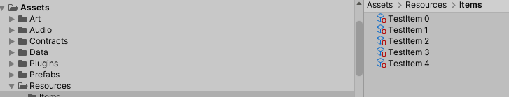

We have actually seen all of these resources (or rather their associated sprite images) in the UX walkthrough: "TestItem 0" is the coin icon indicating that the user owns some number of in-game coins; the itemTypeID for this kind of token is 0.  TestItems 1 through 4 are the armor, axe, magic stone and hammer, and in our implementation these correspond to itemTypeIDs 1-4 -- which, as we'll see later, are generated randomly (but only in a range of 1-4) when we mint new items.  We will also see that the ResourcePath is built from the string "Items/TestItem " + the ItemTypeID.  So for a given item, the Resources.Load operation might be looking for a full resource path of Assets/Resources/Items/TestItem 1 (or 2 or 3 or 4).  Obviously this is a fairly rough-and-ready means of associating contract-level items with visible (draggable) items, but it works for our implementation.  If you wanted 20 possible inventory items rather than 4 (excluding the coin marker), you'd obviously need 20 sprite resources but you'd also need to change the contract mint entrypoint logic so that it was generating itemTypeIDs in a range of 1-20.  Of course with 20 possible game items you'd also very likely want a more friendly resource naming convention (e.g., actually calling the resources by their semantic names: hammer, sword, shield, helmet, axe, armor, high-heeled boots, etc); but if you did that, somewhere in the Unity code you'd need to index these friendly names to the itemTypeID integers in order to make the association with contract storage.

In any case, if the specified resource IS found, that resource sprite is loaded as the sprite of the draggable newitem, this object is added to the `draggables` list, and the object is then placed  (by way of the method Draggable.SetCurrentSlot) in the first available empty slot in the Inventory grid. The item is then added to the dictionary _itemIDtoDraggable, which we just saw in the UpdateItems() method.  Returning to that method, let's look now at the second iteration performed here:

```csharp
foreach (var itemToRemove in _itemIDtoDraggable)
		{
			if (!_lastHeldItems.Contains(itemToRemove.Value.Item.ID))
			{
					itemToRemove.Value.CurrentSlot.RemoveItemInSlot();
			}
		}
```

Nothing we have seen so far has cleared away a cached version of this itemIDtoDraggable dictionary, so at this point it would simply be accruing new items whose item ID (token_id) were found in the item list brought up from contract storage.  So now we are iterating through this dictionary and making sure that in each case the item ID *is* contained in the newly-built lastHeldItems ID list.  If that ID is not present in the new list, that item is removed from its slot in the inventory display grid. 

We are passing over the more detailed mechanics of how we make each displayed item draggable from place to place, since this relates to very specific UI design decisions we've made that you may or may not want to replicate.  If you're interested in exploring these specifics, you'll want to investigate the `Draggable` class as well as `DraggableItemVisual`, `ItemSnapPoint` and `SnapController`, all found in Scripts/DemoExample/UI.  Here it's probably more important to understand the basic linkage between an Item data object retrieved from our Tezos smart-contract storage and an image asset that can be displayed, in this case in the personal inventory. 

##### Fetching the Inventory 

So where has this list of items come from, in terms of our Example code? Nowhere in the InventoryManager class.  Here we need to remember that both InventoryManager and the companion class MarketManager have a higher-level manager, the **UIManager** class.  This class is attached to the Global (empty) game object in the Hierarchy, and viewing this in the Inspector we recall that this class directly controls all of the visible components in the UI:

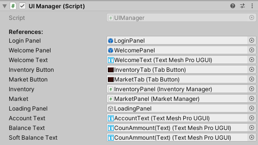


In the previous use case we already took a look at the `Start()` method of this UIManager class:


```csharp
private void Start()
	{
		AllowUIAccess(false);
		inventoryButton.OnTabSelected.AddListener(AccessInventory);
		marketButton.OnTabSelected.AddListener(AccessMarket);
		inventory.onInventoryRefresh.AddListener(AccessInventory);
		inventory.onItemMint.AddListener(MintItem);

		_lastCheck = DateTime.Now;
	}
```

As we've seen, much of what `Start()` is doing here is adding event listeners to various user controls, and the first one it adds is an OnTabSelected (essentially OnClicked) event listener to the Inventory tab, such that clicking on it calls a method named `AccessInventory()`.  This seems promising. The same method is also called upon the onInventoryRefresh Event in InventoryManager, which turns out to be invoked when the REFRESH button is clicked.  Here, then, is the `UIManager.AccessInventory()` method:

```csharp
private void AccessInventory()
	{
		loadingPanel.SetActive(true);
		
		_manager.FetchInventoryItems(PopulateInventory);
		
		DisplayWalletData();
	}
```

The **loadingPanel** is a UI element we haven't considered yet: it displays a "Loading..." text over the top of currently-displayed panels while a data-fetch operation is underway.  Since we are retrieving data from the Tezos network via http, this operation can easily take up to several seconds.  That retrieval itself is initiated in the following line.  We've seen that **ExampleManager** (here `_manager`) is what communicates directly with the public API of our SDK (we could have called directly from our UI classes to the API, but it seemed cleaner to have a centralized '"data access layer" object for all our Example code).  Here is the `ExampleManager.FetchInventoryItems()` method: 

```csharp
public void FetchInventoryItems(Action<List<IItemModel>> callback)
    {
        var sender = _tezos.GetActiveWalletAddress(); // Address to the current active account

        var destination = contractAddress; // our inventory contract
        var entrypoint = "view_items_of";
        var input = new { @string = sender };
        
        CoroutineRunner.Instance.StartCoroutine(
            _tezos.ReadView(contractAddress, entrypoint, input, result =>
            {
                Debug.Log("READING INVENTORY DATA");
                // deserialize the json data to inventory items
                CoroutineRunner.Instance.StartCoroutine(
                    BeaconSDK.NetezosExtensions.HumanizeValue(result, networkRPC, destination, "humanizeInventory",
                        (ContractInventoryViewResult[] inventory) => OnInventoryFetched(inventory, callback))
                );
            }));
    }
```

So here is another call to our API's `ReadView()` method, and as in the previous use case we are again specifying 

- the `contractAddress` (we are using a single contract which defines entrypoints and view functions for all of our use cases, but you may choose otherwise), 
- the `sender` (again, the current active wallet address), 
- an `entrypoint` named "view_items_of"  (as with all calls to ReadView, this is not really an entrypoint but a view function); and finally
- the string `input`, which for this function need only consist of as single argument, the sender: in other words, we want all items in the ownership storage ledger associated with whatever current active wallet address is stored by the SDK.  

In this case, then, there is nothing complicated about composing the `input` string which would require the aid of the Netezos MichelinePrim helper functions that we saw with GetSoftBalance().  What we *will* have, however, is a quite complex data return structure.  We already know that there will be 15 separate item objects in that data return, each with values for ItemID (=token_id), ItemTypeID, and all of the statistic information we've seen displayed in the UX walkthrough.  That would be complex enough to parse if we had name/value pairs for each of these properties of each item in the json return string; but this is a direct return from a Michelson view function , and in this format there are only property *values*, not names--these are presented in a deterministic order, to be sure, but it would still be a grueling exercise to parse this output directly with C# code.  Fortunately Netezos rescues us here with another helper function, "HumanizeValue".  Again, the HumanizeValue function is much more fully detailed in the API documentation, which you are strongly urged to consult before using `ReadView()` for yourself.  Here we will address its action more briefly.  Note first that we actually have a nested set of two coroutines in this call.  The first (outer) coroutine is the call to ReadView() itself, passing in the parameters we have just seen.  The Michelson-formatted data returned from that is here called `result`.  This result structure is then fed into a second (inner) coroutine call, to a function that needs to be referred to by its full namespace: `BeaconSDK.NetezosExtensions.HumanizeValue`, like so:

```csharp
CoroutineRunner.Instance.StartCoroutine(
            _tezos.ReadView(contractAddress, entrypoint, input, result =>
            {
                CoroutineRunner.Instance.StartCoroutine(
                    BeaconSDK.NetezosExtensions.HumanizeValue(result, networkRPC, destination, "humanizeInventory",
                        (ContractInventoryViewResult[] inventory) => OnInventoryFetched(inventory, callback))
                );
            }));
```

For *its* input parameters, we see, this HumanizeValue function requires the `result` structure from ReadView(), the `networkRPC` (which in our case is hardcoded at the top of the ExampleManager class as Ghostnet, or specifically "https://rpc.ghostnet.teztnets.xyz") and the `destination` contractAddress again, as well as a specific entrypoint name, "humanizeInventory".  The output of this call will be an object list called `inventory`, of the type `ContractInventoryViewResult[]`, and the callback method specified will be `OnInventoryFetched()`, a method of the ExampleManager class.  

`ContractInventoryViewResult` is another class defined in the ExampleManager script, as follows:

```csharp
public class ContractInventoryViewResult
    {
        public string id { get; set; }
        public string amount { get; set; }
        public ContractItem item { get; set; }
    }
```

And in turn, `ContractItem` is another class in the same script, defined as follows:

```csharp
public class ContractItem
    {
        public string damage { get; set; }
        public string armor { get; set; }
        public string attackSpeed { get; set; }
        public string healthPoints { get; set; }
        public string manaPoints { get; set; }
        public string itemType { get; set; }
    }
```

In short, `inventory` will be an object list containing data elements--all strings--which each have *named* values for the properties of ID, amount (which really only applies to our coin token, as the others are unique), and then damage, armor, attackSpeed, healthPoints, manaPoints (all of our stats) and finally an itemType.  This is good to know, but simply defining the output as conforming to this data model in the C# layer will not actually magic the name/value pairs into existence.  For this magic we need HumanizeValue, through which Netezos will return to our actual contract and find the specific entrypoint defined as "humanizeInventory".  In the present document we will generally avoid looking at our Tezos contract code, as this is best left to systematic inspection in a separate document.  But since this is our first encounter with HumanizeValue, this once we will try to demystify it a bit and take a look at the entrypoint defined in our "main" contract script (see Assets/Contracts/main.jsligo) as "HumanizeInventory":

```csharp
HumanizeInventory:      (_p : set<view_inventory_result>    ) => failwith("Netezos use only"),
```

The failwith direction here essentially means "don't call this entrypoint if you're not the Netezos SDK", but fortunately we *are* using Netezos to call it.  More interesting here is the referenced data structure "view_inventory_result".  Searching our main.jsligo contract code for this, we find 

```js
type view_inventory_result =
{  
// @layout:comb

  id: int, 
  amount: int,
  item: Item.t
};
```

So here we have a defined data type with properties for id (int), amount (int), and then an item of type `Item.t`.  We happen to know that this syntax directs us to the **Item** module (item.jsligo in the same directory), where we find

```js
// Item stats definition
export type t = 
{
// @layout:comb
  // inventory type: leg, torso, hand, consumable, etc
  itemType : int,
  damage : int, 
  armor : int,
  attackSpeed : int,
  healthPoints : int,
  manaPoints : int
};
```

And there we have it: within the contract itself, an `inventory_result` data structure is defined that gives names to all of the properties we want named in a ContractItem (or ContractInventoryResult).  It's still up to the HumanizeValue function to sync the names with the values for all of our item records--that part can remain magic--but the list called `inventory` returned from the inner, HumanizeValue coroutine call *will* contain name/value pairs for all data elements for each of the (many) item records.   And this is the object list returned to ExampleManager, with the callback call to OnInventoryFetched().  

```csharp
private void OnInventoryFetched(ContractInventoryViewResult[] inventory, Action<List<IItemModel>> callback)
    {
        List<IItemModel> dummyItemList = new List<IItemModel>();
        
        var owner = _tezos.GetActiveWalletAddress();
        
        if(inventory != null)
            foreach (var item in inventory)
            {
                var id = Convert.ToInt32(item.id);
                var itemType = id == 0 ? 0 : Convert.ToInt32(item.item.itemType) % 4 + 1;
                int amount = id == 0 ? Convert.ToInt32(item.amount) : 1;

                var stats = new StatParams(
                    Convert.ToInt32(item.item.damage),
                    Convert.ToInt32(item.item.armor),
                    Convert.ToInt32(item.item.attackSpeed),
                    Convert.ToInt32(item.item.healthPoints),
                    Convert.ToInt32(item.item.manaPoints)
                );

                dummyItemList.Add(new Item(
                    (ItemType)itemType, 
                    "Items/TestItem " + itemType, 
                    "Item " + id, 
                    stats, 
                    amount, 
                    id,
                    owner));
            }
        
        callback?.Invoke(dummyItemList);
    }
```

We pretty much know already what this method has to do.  It is taking in an `inventory` list of type ContractInventoryResult[], and iterating through this list to convert it to another list more useable by the UI code.  Even as readable name/value pairs, the json list returned by HumanizeValue is still a string array, as any data must be that is conveyed via an http call.  For each item object, then, we want to convert to Int32 all the data (ID, amount, itemType, all the stat values) that should be Int.  We will load each of these converted items into a new `dummyItemList`, of type `Item`, which we have already seen defined by our Item C# class:

```csharp
public Item(ItemType type, string resourcePath, string name, StatParams parameters, float price, int id, string owner)
    {
        Type = type;
        ResourcePath = resourcePath;
        Name = name;
        Stats = parameters;
        Price = price;
        ID = id;
        Owner = owner;
    }
```

While doing this Add operation, we are also constructing the appropriate strings for resourcePath ("Items/TestItem " + itemType) and for name ("Item " + token id).   This conversion complete for each item object, `dummyItemList` can then be passed back up from this method to UIManager, where the UpdateItem() method now has a list of items it can work with, to display visible, draggable and clickable game items.  

We should note finally that `UIManager.AccessInventory()`, which initiated this whole call, ends by calling `InventoryWalletCheck()`, which is really just another call to `DisplayWalletData()`.  That call should be made with discretion, but certainly any user action that necessitates refreshing the Inventory view will probably also necessitate refreshing the wallet balances.


#### Use Case 4: Upon Initial Login, Game Grants User In-Game Currency on Request (and Mints One Game Item)

The previous use cases both involves data <u>reads</u> from the Tezos network.  Let's now consider a use case in which the game app actually updates (or writes new) data stored in association with particular wallet accounts in our contract storage.  Upon the user's **initial** login, the game grants the user a certain amount of in-game currency, which we've set at 1000 coins. This can be used for item purchases from the market, as we saw in the UX walkthrough.  So users of our **Inventory Sample Game** project will, by default, begin their journey with 1000 coins each; their balance from there will go up or down depending on buying and selling decisions.  This same function, at the contract level, will also mint the user one randomly-chosen game item, which will therefore appear (along with the coin icon) in their Inventory tab when they first view it.

As we have seen, when a user successfully logs in (pairs a wallet), they get the WelcomePanel screen which includes a GET COINS button.  Granting these coins will be its own on-chain transaction, and so, like all such transactions, will need to be authorized in the paired wallet before proceeding: 

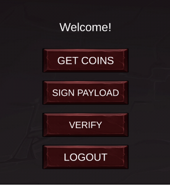

We will return in our final Use Case to the SIGN PAYLOAD and VERIFY buttons, which are there to demonstrate some very specific test functionality that's not really integrated into the overall app experience.  GET COINS certain is; but one might ask why GET COINS is a button at all, rather than simply a call (named something like `OnFirstLogin()`) made automatically by the app upon a first successful pairing.  The answer is that this IS an on-chain transaction, requiring its own confirmation by the wallet.  Pairing itself already required a wallet confirmation; so imagine if you were a new user, logging in for the first time: you'd authorize the pairing, and then immediately -- before even returning to the game app -- you'd be presented with *another* authorization request, this time for the GET COINS operation, if that call were indeed automated as part of a hypothetical OnFirstLogin() method.  This would be extremely confusing for most first-time app users who may or may not have prior experience with crypto wallets of any kind; they would likely guess that the pairing operation had failed somehow. It is far less confusing for users to pair successfully, get the Welcome screen, then select GET COINS as a separate user operation, for which it would make a lot more sense to receive the separate wallet confirmation request.  Of course, with this UX decision it is certainly conceivable that a user might login, skip GET COINS and simply proceed directly to the Inventory and Market tabs, but at some point they would likely feel the need to get some coins, so this one-time function would be waiting for them whenever they chose to exercise it.  As noted, this function also mints the user one game item, which will be waiting for them in their inventory and hopefully help illustrate what the Inventory tab is all about.

In terms of code, the GetCoinButton (a child object of the WelcomePanel), has the following OnClick)_ setup:

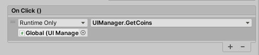

and the `UIManager.GetCoins` method is as follows:

```csharp
public void GetCoins()
	{
		_manager.GetCoins();
	}
```

Following the call stack down to ExampleManager.GetCoins(), we have:

```csharp
public void GetCoins()
    {
        var destination = contractAddress;
        var entryPoint = "login";
        var parameter = "{\"prim\": \"Unit\"}";

        _tezos.CallContract(contractAddress, entryPoint, parameter, 0);

#if UNITY_IOS
        Application.OpenURL("temple://");
#elif UNITY_ANDROID
        Application.OpenURL("tezos://");
#endif
    }
```

Here we see a first call to our other generic API method, `ITezosAPI.CallContract()`.  This method can be used to perform any operation (as defined by the designated entrypoint name) in any contract, provided only that this operation does *not* involve returning a data value.  That is what the `ReadView()` method is for.  In terms of parameters, `CallContract()` requires

- a `destination` which is the current contractAddress (we hardcode this value earlier in ExampleManager)
- an entrypoint name, which in this case is "login" --we'll return later to why this isn't something like 'getCoins'
- a `parameter` which functions the same as the `input` parameter in `ReadView()` (and will in fact be called `input` in the actual method signature below).  In other words, parameter/input is a json string structure containing any and all arguments that the specified entrypoint requires to function.  In this *particular* case the value of this input will be the single string "Unit", (actually a specific type in JsLIGO which indicates there is no required substantive input value), so in this case we can hand-compose in the necessary Michelson-readable  format as `"{\"prim\": \"Unit\"}"`.  
- finally we have an amount parameter, for those operations involving the transfer of Tez or local-coin currency in a specified amount.  Here it is 0.

In the ITezosAPI class itself, the CallContract() method signature is as follows: 

```csharp
 /// <summary>
        /// Performs an operation in the contract
        /// </summary>
        /// <param name="contractAddress">destination address of the smart contract</param>
        /// <param name="entryPoint">entry point used in the smart contract</param>
        /// <param name="input">parameters called on the entry point</param>
        /// <param name="amount">amount of Tezos sent into the contract</param>
 public void CallContract(string contractAddress, string entryPoint, string input, ulong amount = 0);
```

As we have already considered the required parameters, we will only note that this method is defined as a `public void` -- it is not an IEnumerator so cannot be called via coroutine, and indeed cannot return a data result of any kind.  In general there is far less complexity involved with CallContract() than ReadView() -- though we will see subsequent use cases where the `input` string involves more elements than simply the single value "Unit", and where we will therefore require the Netezos MechelinePrim helper functions to help us compose it.

This concludes the Unity example-project side of the GET COINS call stack.  To see the details of the login entrypoint within our contract code, see our separate contract-code documentation [link].  We already know the general function of this entrypoint: to determine whether the wallet address initiating the call (which the contract is able to derive independently) has made this call previously, and if not, to add 1000 in-game coins to the ownership ledger in association with that user's wallet address, and then make a single further call to the mint entrypoint to mint a single random (or in truth pseudo-random) game item, which will also be added to the contract storage ledger in association with that user's wallet address.  If the user *has* made this call previously, for this specified contract, no new coins or items will be awarded.    


#### Use Case 5: User can select items from Inventory to place for SALE on in-game marketplace

We may recall from the UX walkthrough that when a user clicks on a game item within their personal inventory, an **ItemDisplayPanel** opens up which contains the details of that item (name, statistics, etc) plus several control buttons.  Here's that panel displayed inside a running game on mobile, where the user has selected a war-hammer from their inventory:


In Use Case 10 below, we will take a look at the function of the TRANSFER button, but for now we are interested in the MARKET button.  In the Inspector, that button's OnClick() event is set to make visible (set active) an object called **ItemAddtoMarketBox**, a child of ItemDisplayPanel in the Hierarchy.  That dialogue box looks like this in a running game:


As we see, the user is invited to specify a selling price,  which we have entered in this case as 199 in-game coins [NOTE: THIS WORDING ASSUMES THAT TEZ-PRICING FEATURE IS NOT IMPLEMENTED, BUT THEN WILL NEED NEW SCREENSHOT]. Why 199 coins?  In our implementation a user can specify whatever asking price they want, from 0 coins (if they're feeling very charitable) to hundreds of thousands of coins.  A 0-coin war-hammer might sell very quickly (as would a 1-coin or 10-coin war-hammer), but wouldn't be very profitable.  A 200,000-coin suit of armor would never sell at all, in a game economy where few users would ever have a coin balance much above 2000.  Users simply have to make their own pricing judgments. 

In any case, in this box we also have the final ADD TO MARKET button, whose OnClick() action is set in the Inspector to `ItemController.AddItemtoMarket()`.  The ItemController script is attached to the ItemDisplayPanel, and we see in the Inspector that two object variables are exposed:

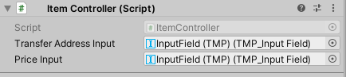

The Transfer Address will relate to the game-item Transfer use case detailed as Use Case 10 below; its InputField has been loaded from the **ItemTransferBox** that will be the dialogue for that use case.  The Price Input field is what interests us here, loaded from the selling price input field of the ItemAddtoMarketBox.  Here is the `ItemController.AddItemtoMarket()` method:

```csharp
public void AddItemToMarket()
    {
        int price = int.Parse(priceInput.text);
        ExampleFactory.Instance.GetExampleManager().AddItemToMarket(item.ID, price);
    }
```

The asking price input is converted from text to int, and the method then instantiates ExampleManager and calls the AddItemtoMarket() method of that class, passing in the ID of the item object, the price, and OnItemAddedToMarket() as the **callback** action.  Here is `ExampleManager.AddItemtoMarket()`:     

```csharp
public void AddItemToMarket(int itemID, int price)
    {
        var entryPoint = "addToMarket";       
        var parameter = new MichelinePrim()
        {
            Prim = PrimType.Pair,
            Args = new List<IMicheline>()
            {
                new MichelinePrim()
                {
                    Prim = PrimType.Pair,
                    Args = new List<IMicheline>()
                    {
                        new MichelineInt(0), // (currency ID = 0) represents coins
                        new MichelineInt(price),
                    }
                },
                new MichelineInt(itemID), 
            }
        }.ToJson();
        
        _tezos.CallContract(contractAddress, entryPoint, parameter, 0);
        
#if UNITY_IOS || UNITY_ANDROID
        Application.OpenURL("tezos://");
#endif
    }
```

Here we have another call to our `CallContract()` API method, as usual specifying the contractAddress as `destination`, the `entrypoint` which in this case is named "addToMarket", an input string `parameter` and, again, an amount of 0: the asking price will not be passed in here but will instead be one of the arguments passed in within the parameter or `input` string structure itself.   In this case we need a total of three arguments in that input structure: a currencyID (of 0, to indicate a price denominated in local-coin), the selling price itself, and finally the itemID to be offered for sale.  As we have noted, hand-composing this input string in a format readable by the contract's Michelson code is a challenging task, so in this case we will call on the Netezos helper classes MichelinePrim, PrimType, IMicheline and MichelineInt; after composing the Pair of currencyID and price, we add in ItemID as a separate MichelineInt (again, for more on the Micheline helper classes please see our API documentation).   We have already inspected the signature of ITezosAPI.CallContract(), so at this point we should know all we need to about this particular API call.

As to the details of the "AddtoMarket" entrypoint in our contract, we will again leave that to the separate documentation of our contract code [LINK].  Here is a summary: "AddtoMarket" takes in the tokenID, asking price and currency type, as we've seen, and itself derives the `sender` (that is, the wallet address which has made this call, and which therefore represents the token's `owner` and potential seller).  With this, the contract creates a new entry in the marketplace storage ledger, with the combination of owner & token_id as the key, and the combination of currencyType and price as the value.  This is, of course, the ledger from which we'll read when we want to display all items currently on the in-game marketplace (next use case).  Mission accomplished: our chosen game item is now displayed for sale on the in-game market, along with the price we've asked for it.

##### Event-driven Popups

But since this is an actual on-chain contract transaction, what about the two consecutive popups we see which indicate the success (and then injection) of this transaction?  As we saw in Use Case 1, wallet pairing, our API exposes the BeaconMessageReceiver class, a Beacon component that raises public events (Actions) when triggered by a variety of use cases.  Here is the full set of events again:

```csharp
public event Action<string> ClientCreated;
public event Action<string> AccountConnected;
public event Action<string> AccountConnectionFailed;
public event Action<string> AccountDisconnected;
public event Action<string> ContractCallCompleted; // will trigger the "Transaction Completed" popup
public event Action<bool> ContractCallInjected; // will trigger the subsequent "Call Injected!" popup
public event Action<string> ContractCallFailed;
public event Action<string> PayloadSigned;
public event Action<string> HandshakeReceived;
public event Action<string> PairingCompleted;
public event Action<string> AccountReceived;
```

In the wallet pairing workflow, we were interested in the `HandshakeReceived`, `PairingCompleted` and `AccountConnected` events.  These events, like the rest, will always be *raised* by our SDK when the corresponding actions occur, but for our **Inventory Sample Game** project's UI to make use of them, as we saw in the case of wallet pairing the relevant events must be *subscribed to* as well, and then acted on in some manner.  For the events that interest us here, this subscription happens in the initialization of the UIManager class which has overall control of all UI elements:

```csharp
private void Start()
    {
        _manager = ExampleFactory.Instance.GetExampleManager();
        InitializeCallbacks();
        AllowUIAccess(false);
        inventoryButton.OnTabSelected.AddListener(AccessInventory);
        marketButton.OnTabSelected.AddListener(AccessMarket);
        inventory.onInventoryRefresh.AddListener(AccessInventory);
        inventory.onItemMint.AddListener(MintItem);
    }

private void InitializeCallbacks()
    {
        _manager.GetMessageReceiver().AccountConnected += OnAccountConnected;
        _manager.GetMessageReceiver().AccountConnectionFailed += OnAccountConnectionFailed;
        _manager.GetMessageReceiver().AccountDisconnected += OnAccountDisconnected;
        _manager.GetMessageReceiver().ContractCallCompleted += OnContractCallCompleted;
        _manager.GetMessageReceiver().ContractCallFailed += OnContractCallFailed;
        _manager.GetMessageReceiver().ContractCallInjected += OnContractCallInjected;
    }
```

The second method, InitializeCallbacks(), makes a call for each of the events subscribed to here, to `ExampleManager.GetMessageReceiver()` which is simply a passthrough to the API:

```csharp
public BeaconMessageReceiver GetMessageReceiver()
    {
        return _tezos.MessageReceiver;
    }
```

So BeaconMessageReceiver will raise the events, and UIManager can respond accordingly.  The ContractCallCompleted event will trigger the private method OnContractCallCompleted():

```csharp
private void OnContractCallCompleted(string response)
	{
		DisplayPopup("Transaction completed!\n \n" +
		             "Transaction hash: " + JsonUtility.FromJson<Transaction>(response).transactionHash +
		             "\n \nResponse: \n" + response);
	}
```

Here is a reminder of the actual popup displayed by this first method, responding to the ContractCallCompleted event:


We see the "Transaction Completed!" text, followed by a line break, and then the **transaction hash** which has been derived from the event itself.  Or to be more precise, the event (raised by the Beacon class) is responding to an actual message sent from the Tezos RPC node that this transaction has been executed successfully.  This is the same transaction hash we would see on Better Call Dev for this transaction, as highlighted here in blue (it's not *literally* the same transaction, as the one captured above was from several days earlier--but this is another **AddToMarket** transaction from our app on the same contract):

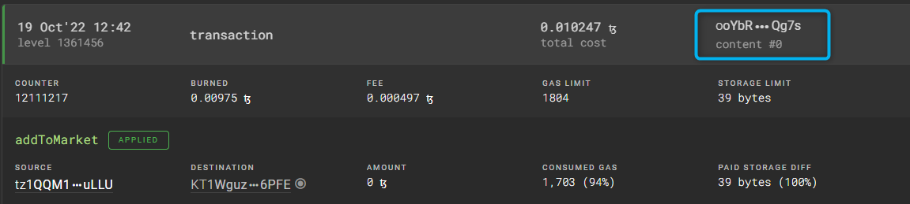

The 'response' text that follows the transaction hash in our popup is the complete json string returned from the contract, which includes the hash and a variety of other contract metadata information.  Our popup window is technically scrollable so one could inspect the full response string there, but it's difficult to do this in practice as this popup will be replaced by another one within a few seconds (as a developer you'd probably be much better off simply doing a Debug.Log() or similar console write of the response data from this event).  Here's a reminder of the second popup:


This one is triggered by the separate `ContractCallInjected` event, to which we've also subscribed, and which calls the method OnContractCallInjected().  

```csharp
private void OnContractCallInjected(bool result)
    {
        if (result)
        {
            _manager.FetchMarketItems(PopulateMarket);
            _manager.FetchInventoryItems(PopulateInventory);
            DisplayWalletData();
        }

        DisplayPopup("Call injected!\n \n" +
                    "Response: \n" + result);
    }
```

We need to remember that these are two separate events -- they may be only seconds apart for our contract calls on Ghostnet, but the second event signals actual human intervention -- one or more bakers has validated the transaction that was just made, and injected it into the blockchain proper. Only *then* would it actually be visible on in a public Tezos browser like Better Call Dev.  A contract call could presumably succeed (raising the first event) but then was only much later validated, or even *never* validated, for instance if your contract happened to specify 0 or insufficient gas and/or storage fees --though more likely this would result in a "likely to fail" message from your wallet, and a ContractCallFailed event raised from Beacon.  As we've seen, we subscribe to this event as well in UIManager, and if we were to receive this event we would instead call the method OnContractCallFailed().  [This kind of failure is actually not the easiest thing to invoke intentionally in our **Inventory Sample Game** project (without messing with code better left alone), but one sure way is to try to purchase a marketplace item for which we do not have sufficient coin balance.  Here is such a popup, when we have just attempted to purchase a suit of armor marketed for 200,000 coins]


#### Use Case 6: Marketplace Panel displays whatever Game Items are currently for sale 

While this function is implied by the previous use case, the code-stack for this display is entirely separate from that of Use Case 5, and is triggered by the display of the Market Panel itself.  As we recall, the Market panel looks like this as displayed in the Unity editor Scene view:


And here is a screenshot of the Market display panel in a game running on a mobile phone, showing a total of eight items in the marketplace:


Each of these items has been placed for sale on the market by **some** user of our **Inventory Sample Game** project (in our UX walkthrough we actually placed all the 199-coin items ourselves, though not necessarily under this account). Each item has its own tile displaying the image, the name and the specified asking price in green.  We have also just clicked on the Item 8 armor, and so it has been loaded into the (previously empty) **item full display** panel on  the right, displaying the item name again, as well as the category of item it is (in this case things you wear on your "torso"), the asking price again, and then the individual statistics beneath.  And of course there is a prominent BUY button.

In Use Case 8 we will consider what happens when a user clicks the BUY buttton; for now we will look at the code that displays the current marketplace inventory in the first place, whenever the Market tab is selected.  This is a relatively simple data fetch operation, with a pattern that closely follows Use Case 3: Fetch (Personal) Inventory Items, though it will have its own code path throughout.  

##### MarketPlace -- UI Tier

As usual we begin with the UI tier.  We are currently viewing the **MarketPanel,** so let's click on that element in the Unity editor Hierarchy {it's a child of the objects Canvas/ScreenSpace/Panels/} and view its properties in the Inspector panel:

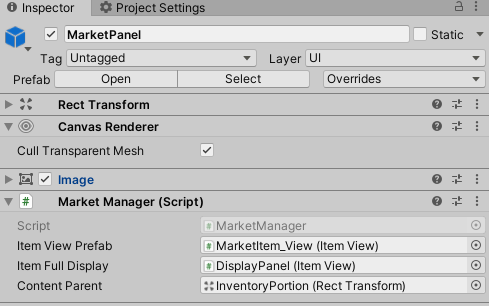

We see that the `MarketManager` script is attached to the MarketPanel UI element, and that this script exposes slots for an Item View Prefab, the Item Full Display and a Content Parent.  Since each of these slots has already been loaded with the appropriate object types (all such Inspector slots will be pre-loaded throughout our game structure), we can select each in turn within the slots and its location in the Project or Hierarchy will be briefly highlighted.  This is often helpful when trying to understood such Inspector object-variable assignments. Thus when we select the first one, `MarketItem_View,` we will see that this object can be found in the project's **Prefabs** folder:

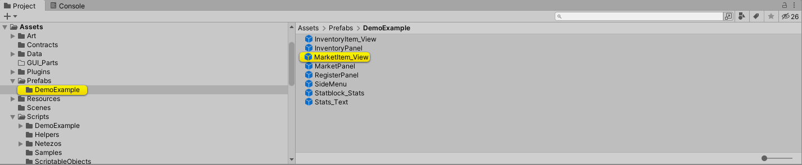

All of the prefabs we have created for this Demo Example are UI components of one kind or another, little packages of related parts that are intended to work together.  Sometimes these are bundled as prefabs purely for convenience; for example the InventoryPanel, MarketPanel, RegisterPanel and SidePanel all have pre-set controls, displays and graphics, and the appropriate code attached to each component.  We have already seen how these various panels are designed to lay out in relation to each other in the User experience--though of course you could arrange them any way that made more sense to your own workflow, and typically they would still work (if you encounter a missing reference error, this likely means that the particular prefab isn't modularized to that full extent).  Sometimes, though, elements have been designated prefabs so that they can be instantiated in any necessary number at run-time, very often with attributes that will be set programmatically.  So if we were to click on the MarketItem_View prefab itself, as highlighted here in the project, the Unity editor would show us the following:

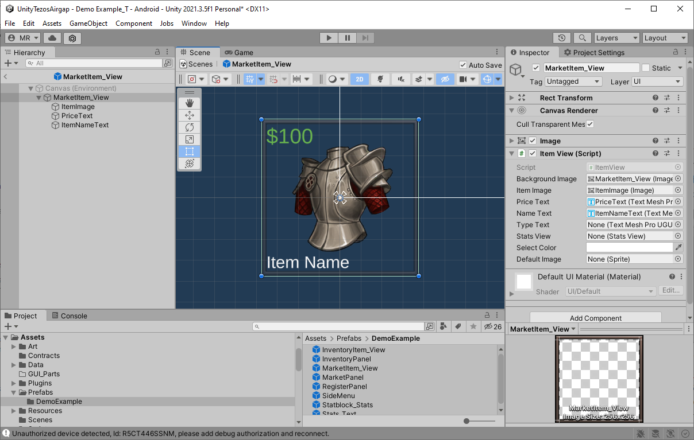

Note that now the Hierarchy only shows us the elements that make up this prefab itself, and we see in the Inspector that attached to MarketItem_View is the **ItemView** script, which itself exposes a whole array of object elements that can be set in the inspector. The first four of these slots is currently filled in, and if we were to select each of these in turn in the inspector we would see, briefly highlighted in the Inspector: the MarketItem_View object itself, the Itemimage, the PriceText and the ItemNameText. The suit of armor is the *defaul*t image set here, which is why it displays in a non-running game, but obviously the app itself is also capable of displaying any number of different images and associated names, and any number of different **prices**--  so these properties of the ItemView class can clearly be seet at runtime.  If we were to peek into the ItemView class itself, we'd find that in the `DisplayItem()` method

- the item.price, item.name and item.type are all drawn from an **item** object (of type IItemModel) which has been passed into the method; these string values are then each loaded into the appropriate text element
- the image sprite is loaded from a collection found in item.resourcepath, as we've seen this defined in the FetchInventoryItems case
- an object array StatsView is loaded with the appropriate statistic values for this item, even though these won't display until the item is selected to display in the ItemFullDisplay panel

Inspecting the properties, component structure and associated scripts of any prefab is a good idea, to give you a better sense of what exactly it's doing for you.  But `ItemView.DisplayItem()` is only concerned with displaying a *single* item object, out of an array or list that's clearly handled elsewhere.  So how has the MarketPanel known to instantiate and display exactly these eight instances of this prefab (in our case), with images and characteristics appropriate to these different game items?  Here we need to return back up to the `MarketManager`class attached to the MarketPanel object, and take another look at the three object variables exposed in the Inspector view:

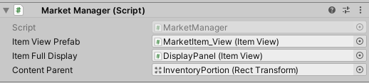

Item View Prefab is what we have just been inspecting.  Item Full Display is loaded with the **DisplayPanel** object in the hierarchy, a child of MarketPanel.  By default this is set to inactive, but if we manually activate it in the Explorer we can confirm that DisplayPanel IS the right-hand panel in which selected items are displayed in all their details, and with the BUY button beneath.  Finally, Content Parent is set to the object InventoryPortion, a rectangular display grid which in this case displays all of the current Marketplace items.  Let's take a look at the MarketManager class then, starting from its first four methods:

```csharp
public class MarketManager : MonoBehaviour
{
    [SerializeField] private ItemView itemViewPrefab;
    [SerializeField] private ItemView itemFullDisplay;
    [SerializeField] private Transform contentParent;

    private List<ItemView> _marketItems = new List<ItemView>();
    private ItemView _currentSelectedItem;
    
     public void Init(List<IItemModel> items)
    {
        ClearMarket();
        
        foreach (var item in items)
            AddItem(item);
    }

    public void CheckSelection()
    {
        if (_currentSelectedItem == null) return;

        itemFullDisplay.DisplayItem(null, null);
    }
    
    private void AddItem(IItemModel itemModel)
    {
        ItemView newItem = Instantiate(itemViewPrefab, contentParent);
        newItem.DisplayItem(itemModel);
        newItem.OnItemSelected = OnItemSelected;
        _marketItems.Add(newItem);
    }

    private void ClearMarket()
    {
        _marketItems = new List<ItemView>();
        foreach (Transform child in contentParent)
        {
            Destroy(child.gameObject);
        }
        CheckSelection();
    }
}
```


Having declared the three 'visible' variable objects we've already seen (via the directive `SerializeField)`, this class also declares a private object List of `_marketItems`, as well as `_currentSelectedItem` as a single object.  The `Init()` method first calls `ClearMarket(),` which iterates through any existing marketItems list and destroys any child of the contentParent, which we may recall was set to the InventoryPortion display grid itself.  With all non-relevant or outdated inventory cleared away, we will then iterate through a new list of **item** objects that has been passed in to `MarketManager.Init()`, in each case calling the AddItem method, which in turn will 

- instantiate the DisplayItem prefab itself as a child of the market inventory grid itself; 
- call `NewItem.DisplayItem()` (which, as we've just seen, loads values for name, price, type, and stat values from the specified item object into appropriate text fields, and finds the correct display image), 

- for that object set an OnItemSelected event to trigger the local method `OnItemSelected()`, and finally 
- adds this new DisplayItem object to the `_marketItems` object list.  

So in essence we're seeing the conversion of one object list to another: the first is a list of item objects with various data attributes, which has come from elsewhere, and the second is the `_marketItems` list which hold *displayable* versions of the original items.  In the in-game screenshot above there were a total of eight game items in each list (three war-hammers, two armors, two axes and a magic stone): the code in MarketManager has simply converted the pure data-object items into visible marketItems. And of course each item now has an OnItemSelected() event listener, such that whenever a user clicks on any of these items displayed in the market inventory grid itself, we'll get a call to the `OnItemSelected()` method, the final method of this class:

```csharp
private void OnItemSelected(ItemView selectedItem)
    {
        if (_currentSelectedItem != null)
            _currentSelectedItem.Unselect();

        if (_currentSelectedItem == selectedItem)
        {
            selectedItem.Unselect();
            if (itemFullDisplay != null)
                itemFullDisplay.ClearItem();
            _currentSelectedItem = null;
            return;
        }

        selectedItem.Select();
        _currentSelectedItem = selectedItem;
        if (itemFullDisplay != null)
            itemFullDisplay.DisplayItem(selectedItem.Item, selectedItem.CachedSprite);
        itemFullDisplay.GetComponent<MarketItemController>().SetItem(selectedItem.Item);
    }
```

Other than handling the selection, unselection and NULL cases for each selectedItem, what interests us here are the final two lines.  We know that `itemFullDisplay` has been set equal to the Full Display panel on the right; DisplayItem is thus a call to `ItemView.DisplayItem()` as this script is attached to the display panel object.  So `DisplayItem()` is called, passing in the Item object and CachedSprite of the selected item.  This item will thus be displayed fully in the right panel, including the statistic values which could not be displayed in the market inventory grid itself.  But this is still the *same* display object; we're just displaying it in two places at once.  The final call, to another script attached to the Full Display Panel called MarketItemController, will have more to do with what happens if the user chooses to BUY this selected item, and will thus be considered in the next use-case.

##### Marketplace -- Fetching the Data

Meanwhile, however, we still need to determine where the original list of item objects came from; so far we have only seen how these are displayed and can then be manipulated by the user.  To get further into the data call we must remember, again, that the MarketManager class, like InventoryManager, is itself orchestrated by the **UIManager** class.  It was in UIManager that we found the `AccessInventory()` method which ultimately derived the list of a user's inventory game items from our contract storage. Let's go back to UIManager once more and recall its `Start()` method:

```csharp
private void Start()
	{
		_manager = ExampleFactory.Instance.GetExampleManager();
		InitializeCallbacks();
		
		AllowUIAccess(false);
		inventoryButton.OnTabSelected.AddListener(AccessInventory);
		marketButton.OnTabSelected.AddListener(AccessMarket);
		inventory.onInventoryRefresh.AddListener(AccessInventory);
		inventory.onItemMint.AddListener(MintItem);
	}
```

In use-case 3 we saw how the event of selecting the Inventory tab has the effect of calling the `AccessInventory()` method of this class.  Now we see that in the following line, selecting the Market tab (to display the marketplace) has the effect of calling the `AccessMarket()` method.  Let's take a look:

```csharp
private void AccessMarket()
	{
		loadingPanel.SetActive(true);
		
		_manager.FetchMarketItems(PopulateMarket);
		
		DisplayWalletData();
	}
```

Again we begin by setting the **loadingPanel** to active (making visible a "loading..." text over the current display, while we wait for data to be retrieved). Then we create an instance of ExampleManager, calling the `ExampleManager.FetchMarketItems()` method and passing in `PopulateMarket` as the **callback** method -- this is a method of the present class, UIManager, which will be called with the data structure returned from `ExampleManager.FetchMarketItems()`.  Finally we have a separate call to`DisplayWalletData()`, to update the user's balances in Tez and local coin.  But what really interests us here is `ExampleManager.FetchMarketItems()`:

```csharp
public void FetchMarketItems(Action<List<IItemModel>> callback)
    {
        var destination = contractAddress;
        var entrypoint = "view_items_on_market";
        var input = new MichelinePrim
        {
            Prim = PrimType.Unit
        };
            
        CoroutineRunner.Instance.StartCoroutine(
            _tezos.ReadView(contractAddress, entrypoint, input, result =>
            {
                // deserialize the json data to market items
                CoroutineRunner.Instance.StartCoroutine(
                    BeaconSDK.NetezosExtensions.HumanizeValue(result, networkRPC, destination, "humanizeMarketplace",
                        (ContractMarketplaceViewResult[] market) => OnMarketplaceFetched(market, callback))
                    );
            }));
    }
```

Here we have another call to our API `ReadView()` method: in fact this call is strikingly similar in its structure to FetchInventory in Use Case 3, which should not be too surprising since once again we are fetching a data structure with a potentially considerable number of individual item-objects (though of course it could also have few or none, as in fact could FetchInventory).  Again, `destination` will be our current contractAddress.  The `entrypoint` name in this case is "view_items_on_market"--really another view function, not technically an entrypoint; ReadView() only calls views.  The `input` string need only consist of the single string element "Unit", which we've seen hand-composed in the past but can also be composed using the MichelinePrim helper functions, in this case calling Prim = PrimType.Unit.  "Unit", by the way, is not a random string; it is a predefined type in JsLIGO whose purpose is to signal that the specified function involves no substantive input arguments.  

Why aren't we passing in any specific arguments to `view_items_on_market`?  Because we're essentially selecting the entirety of the current marketplace storage ledger: all items put up for sale by all users, as long as these are still currently for sale.  As with FetchInventory we have two nested coroutines: the first is the actual ReadView() call, which will output a data structure called `result` which is Michelson-formatted (lots of values but no names for properties); the second passes this result structure into a HumanizeValue call, this time specifying "humanizeMarketplace" as the defined function which will help Netezos find the correct set of property names for this fetch.  The HumanizeValue call will itself return an object list called `market,` of type ContractMarketplaceViewResult-- a class which defines the following properties:

```csharp
public class ContractMarketplaceViewResult
    {
        public string id { get; set; }
        public string owner { get; set; }
        public string currency { get; set; }
        public string price { get; set; }
        public ContractItem item { get; set; }
    }
```

And we've already seen that ContractItem is itself defined as

```csharp
public class ContractItem
    {
        public string damage { get; set; }
        public string armor { get; set; }
        public string attackSpeed { get; set; }
        public string healthPoints { get; set; }
        public string manaPoints { get; set; }
        public string itemType { get; set; }
    }
```

Thus, the calling code (ExampleManager.FetchMarketItems) is prepared to receive an object list `market` containing items with all of these named properties -- but it is once again up to the magic of HumanizeValue to pair up names and values for each of the item records being returned. The market item list has all the properties of the inventory list, but also additional ones: we need to know the `owner` for each item on the market (when there was only a single owner for any given inventory list), and we also need to know the asking price of each item.

Again, the reader is urged to carefully consider both this and the FetchInventory example, as well as the more generalized explanations in our API guide, *and* the discussion of the relevant functions and entrypoints in the Contract code documentation [LINK], before using ReadView() for any use case that deviates from our defined object models.  `ReadView()` is intended as a widely-applicable data fetch method, but it is highly dependent on the Unity calling code and the supporting contract code being fully aligned as to the expected data model on either side.  This is generally true for CallContract() as well, of course--our contract code is designed to support our specific use cases--but ReadView() can be particularly exacting depending on the complexity of the data being returned (which isn't always complex: you may be fetching a single account balance in local coins, or even -- as in the next use case--returning a simple boolean as to whether or not a given item is on the market).              

So in this case we now have a human-readable `market` object list returned from the inner coroutine call to HumanizeValue, which also had a specified **callback** action of OnMarketplaceFetched().  Here, finally is `ExampleManager.OnMarketplaceFetched()`:

```csharp
private void OnMarketplaceFetched(ContractMarketplaceViewResult[] market, Action<List<IItemModel>> callback)
    {
        List<IItemModel> dummyItemList = new List<IItemModel>();

        if(market != null)
            foreach (var item in market)
            {      
                var id = Convert.ToInt32(item.id);
                var itemType = id == 0 ? 0 : Convert.ToInt32(item.item.itemType) % 4 + 1;
                var currency = Convert.ToInt32(item.currency);
                var price = Convert.ToInt32(item.price);
                var owner = item.owner;
                            
                var stats = new StatParams(
                    Convert.ToInt32(item.item.damage),
                    Convert.ToInt32(item.item.armor),
                    Convert.ToInt32(item.item.attackSpeed),
                    Convert.ToInt32(item.item.healthPoints),
                    Convert.ToInt32(item.item.manaPoints)
                );

                dummyItemList.Add(new Item(
                    (ItemType)itemType, 
                    "Items/TestItem " + itemType, 
                    "Item " + id, 
                    stats, 
                    price,
                    id,
                    owner));
                            
            }
                        
        callback?.Invoke(dummyItemList);
    }
```

The operation here is virtually identical to what we saw in Use Case 3 with OnInventoryFetched(): we're iterating through an object list returned from the contract (in this case `market` rather than `inventory`), and for each `item` object in the original list we are creating a new item object which conforms to **IItemModel**, our item data structure for UI display purposes.  This means, first, that all the numeric values that were returned as strings are converted to Int32: each of the item's statistic values, the item id (token_id), the item *type* id, the currency (type) id, and in this case also the `price`, ie the market asking price set by the user.  Every market item also has an `owner` so this value (a wallet account hashID) is transferred as well. Finally, as each of these new items is added to the new object list `dummyItemList`, the ResourcePath and Name properties are once again derived from ItemTypeID and ItemID. 

The new list dummyItemList is then itself returned as a callback.  Let's remember that `ExampleManager.FetchMarketItems()` was called by `UIManager.AccessMarket()`, with the specific call looking like this:

`ExampleFactory.Instance.GetExampleManager().FetchMarketItems(PopulateMarket);`

So the callback will pass the new `dummyItemList` to the `PopulateMarket()` method of this same class:

```csharp
private void PopulateMarket(List<IItemModel> items)
	{
		Action action = () =>
		{
			market.Init(items);
			loadingPanel.SetActive(false);
		};
		StartCoroutine(DoActionNextFrame(action));
	}
```

Here `market` is a reference to the Game object **MarketPanel** (as set in the Inspector for the UIManager class), and as we saw early in this use case, the MarketPanel has attached to it the MarketManager class.  Here we will want to call `MarketManager.Init()`, at which point we finally have the list of `items` that will be displayed in the MarketPanel UI by that class.  


#### Use Case 7: Owner of an Item Can Remove that Item from the Marketplace

Obviously the purpose of displaying items on the marketplace is for other users to buy them, or at least window-shop; but before we consider the BUY use-case, what happens if the original owner decides not to sell a particular item after all?  Here is the running-game Market display that we saw in the previous use case:


It turns out we have actually listed all of these 199-coin items on the market ourselves, from the currently-paired account.  But now we decide that we want to keep at least one of our war-hammers rather than sell it.  To take it off the market, we may recall, we do not do this from the Market tab; instead we navigate back to our own Inventory and select the item there (all items listed on the market will still appear in our Inventory, as they still belong to us).   Here we've selected the Item 26 war-hammer, so it appears in the ItemDisplayPanel popup window:


This is the usual item detail display, except that this time there is no TRANSFER button: an item on the market cannot be transferred (see Use Case 10 for that operation).   For the present use case we're interested again in the MARKET button.  But first, how does the app know, from within Inventory, that this item is on the market already?  

##### Is Item on Market?

Clearly the app has already gleaned this information when the ItemDisplayPanel is opened.  The class actually responsible for launching this panel is **InventoryManager**: when an inventory item is clicked, the OnClicked event invokes the following method:

```csharp
public void OnItemClicked(Draggable item)
	{
		itemView.transform.parent.gameObject.SetActive(true);
		itemView.gameObject.SetActive(true);
		itemView.DisplayItem(item.Item, item.Sprite);
		itemView.GetComponent<ItemController>().SetItem(item.Item);
	}
```

Here `itemView` is a reference to the **ItemView** class, which is attached to the ItemDisplayPanel game object. So when an inventory item is clicked, this panel is made visible (its parent in the hierarchy, ItemDisplayPanel, is also made visible).  We then call `ItemView.DisplayItem()`, which actually displays the item image, name and stats; and finally we get a reference to the ItemController script also attached to this panel, and via that we call `ItemController.SetItem()`:

```csharp
public void SetItem(IItemModel newItem)
    {
        item = newItem;
        
        // is the item already on the market or not
        ExampleFactory.Instance.GetExampleManager().IsItemOnMarket(item.ID, item.Owner, OnIsItemOnMarket);
        
        // check the amount of the item (using the price)
        _hasMoreThanOneItem = item.Price > 1;
        amountInput.gameObject.SetActive(_hasMoreThanOneItem);
        
        // reset input fields
        transferAddressInput.text = "";
        amountInput.text = "";
        priceInput.text = "";
    }
```

The call to `ExampleManager.IsItemOnMarket()` appears to be just what we're looking for:

```csharp
public void IsItemOnMarket(int itemID, string owner, Action<bool> callback)
    {
        var entrypoint = "is_item_on_market";
        
        var input = new MichelinePrim()
        {
            Prim = PrimType.Pair,
            Args = new List<IMicheline>()
            {
                new MichelineString(owner),
                new MichelineInt(itemID)
            }
        };
        
        CoroutineRunner.Instance.StartCoroutine(
            _tezos.ReadView(contractAddress, entrypoint, input, result =>
            {
                var boolString = result.GetProperty("prim");
                var boolVal = boolString.GetString() == "True";
                
                callback?.Invoke(boolVal);
            }));
    }
```

So we are making another `Tezos.ReadView()` coroutine call, this time passing in the entrypoint `is_item_on_market` along with our current contract address and an Args parameter (yet another name for the `input` string), in this case using the Micheline helper functions to compose the string to hold arguments for owner (the current wallet address) and itemID.  We might remember that owner+ItemID is the key in the marketplace contract ledger, so in this Tezos view function we're simply searching to determine if a marketplace record with that combination exists.  If it does, we return true; if not we return false.  With such an elementary data return there is no need for HumanizeValues() here; either the specified item is on the market or it isn't.

The API ReadView() call thus returns a boolean, which is passed back from ExampleManager to ItemController, where this event triggers the method `OnIsItemOnMarket()`:

```csharp
public void OnIsItemOnMarket(bool success)
    {
		addToMarketButton.gameObject.SetActive(!success);
   		removeFromMarketButton.gameObject.SetActive(success);
   		transferButton.gameObject.SetActive(!success);
    }
```

So by the time the ItemDisplayPanel is made visible, the app will know to show or hide certain controls, both here and in the ensuing dialogue. `addtoMarketButton` is not the MARKET button on this first panel (which remains visible in either case) but rather the ADD TO MARKET button in the dialogue box that appears when the first MARKET button is clicked.  The ADD TO MARKET button is only shown there when the success condition fails -- that is, when IsItemOnMarket returns true.  Conversely, a different button labeled REMOVE FROM MARKET is made visible when the success condition succeeds -- that is, the item is indeed already on the market.  Meanwhile, the TRANSFER button on this first panel will also be hidden, as we've already seen in practice, when the item is found to be on the market already.  

Here, then, is the AddItemToMarketbox panel (the dialogue box invoked by MARKET), now in the case where the item is already on the market:


##### Removing the Item from the Marketplace

With the correct button revealed, then, we can finally trace the RemoveItemFromMarket stack itself.  This is quite straightforward. As one might expect, clicking on the REMOVE FROM MARKET button will trigger the `ItemController.RemoveItemFromMarket()` method, which in turn calls `ExampleManager.RemoveItemFromMarket()`

```csharp
public void RemoveItemFromMarket(int itemID)
    {
        Debug.Log("Removing Item " + itemID + " from market.");
        
        var destination = contractAddress;
        var entryPoint = "removeFromMarket";
        
        var sender = _tezos.GetActiveWalletAddress();
        var parameter = new MichelinePrim()
        {
            Prim = PrimType.Pair,
            Args = new List<IMicheline>()
            {
                new MichelineString(sender), 
                new MichelineInt(itemID)
            }
        }.ToJson();

        _tezos.CallContract(contractAddress, entryPoint, parameter, 0);
        
#if UNITY_IOS || UNITY_ANDROID
        Application.OpenURL("tezos://");
#endif
    }
```

As with AddToMarket in Use Case 5, here we have another call to our CallContract() API method.  As always with CallContract() we have three parameters: the `destination` or current contract address, the `entrypoint` name (here "removeFromMarket"), and the `parameter` or input string, here composed (with the aid of our MichelinePrim helpers) of two elements: the `sender` (current active wallet account) and the `itemID`.  Finally we add 0 for the amount argument.  

By the way, you may have noticed that CallContract() and other calls requiring a wallet confirmation will typically end with the conditional code to OpenURL("tezos://") in the case of an iOS or Android platform.  This is to ensure that the user's mobile wallet (since we assume a deeplink pairing for mobile) is not only opened but brought into focus on the device.

Although you can inspect the "removeFromMarket" entrypoint in the contract code documentation, its operation is clearly quite straightforward too: any record in the marketplace storage ledger containing that combination of sender and itemID (and there can only be one, at most) will be deleted.  This item will thus no longer be part of the next FetchMarketItems operation, so will no longer be displayed in the UI. And with this, our designated item -- it was a war hammer in this example -- is back off the market. 


#### Use Case 8: User can select items from Marketplace to BUY for their personal inventory

So we have items on the Market for sale, and now some user wants to buy one.  Let's recall  what the relevant UI control looks like: here we've opened the Market tab *and* we've clicked on a particular item in the main grid display, a 200-coin suit of armor, causing it to be loaded into the (previously empty) item full display panel (MarketPanel > **DisplayPanel**) on the right:

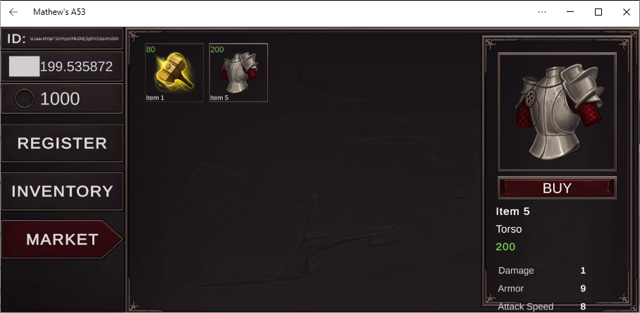

Finally we are ready to see what happens when we click the BUY button.  This button, a child of the DisplayPanel object, has the OnClick event defined as follows in the Inspector:

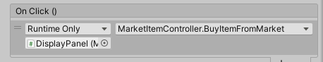

We are thus directed to `MarketitemController.BuyItemFromMarket()`:

```csharp
public void BuyItemFromMarket()
    {
        if(item != null)
            ExampleFactory.Instance.GetExampleManager().BuyItem(item.Owner, item.ID);
        else
            Debug.LogError("No item selected!");
    }
```

Other than the error handling to address the case where a user has clicked the BUY button without first selecting an item, we note that we're passing in to the ExampleManager method the item's *current* owner--which will *not* be the current active wallet account, as that is the *buyer*--plus the item ID (which is ultimately the token_id from storage), and a callback action, `OnItemBoughtFromMarket`.  Here is `ExampleManager.BuyItem()`:

```csharp
public void BuyItem(string owner, int itemID)
    {
        var destination = contractAddress;
        var entryPoint = "buy";
        
        var parameter = new MichelinePrim
        {
            Prim = PrimType.Pair,
            Args = new List<IMicheline>
            {
                new MichelineString(owner), 
                new MichelineInt(itemID)
            }
        }.ToJson();

        Debug.Log(destination + " " + entryPoint + parameter);
        _tezos.CallContract(contractAddress, entryPoint, parameter, 0);
        
#if UNITY_IOS || UNITY_ANDROID
        Application.OpenURL("temple://");
#endif
    }
```

As with adding an item to the market, and taking it back off, here is another call to our generic CallContract() API method. As always `destination` is the current contractAddress, the `entrypoint` in this case is called "buy", and we have a `parameter` input string which in this case will contain the two elements `owner` (the original owner of the item) and `itemID`.  Again we are using the MichelinePrim functions to help us compose this input string.  The final parameter (`amount`, in the `CallContract()` signature) is again set to 0.   

As you will discover in our contract documentation [LINK], the "buy" entrypoint (like all of our entrypoints) is defined in the **Main** module of our contract (Assets/Contracts/main.jsligo), though much of the actual logic is contained in a "marketplace_buy" function found in the **transfer** module (Assets/Contracts/FA2/transfer.jsligo).   But even the summary version of this transaction is fairly detailed, as we are asking the contract to  do a number of steps in sequence:

1. derive the `caller` of this contract operation, which will be the buyer in this case
2. find the asking `price` for this token_id (or really owner/token_id combination) from the current marketplace ledger
3. determine whether the caller/buyer actually has enough coins in their ownership to cover the asking price (failing this check will return the error "insufficient funds"; this specific error wording is not displayed in the game app, but when the wallet app is opened to confirm this transaction, we will see the message "This transaction is likely to fail", as in fact we did at one point in the UX walkthrough).  If funds are sufficient,
4. Update the ownership ledger so that ownership of this token changes from seller/owner to buyer
5. credit the seller's ownership ledger with additional coins in the amount of the specified asking price
6. debit the buyer's ownership ledger with the same amount of coins
7. finally, remove the item record itself from the marketplace ledger 

So once the user has pressed BUY for a certain item, and then confirmed this transaction in their wallet, when they return to the game app the purchased item will no longer be displayed in on the Market; instead it will be displayed in their own Inventory, and they will also see their in-game coin balance reduced appropriately.  IF the original owner happened to be logged in at the same time, they would also see the item disappear from *their* inventory, and they would see *their* coin balance increase accordingly.  But the transaction only needs to be authorized by the buyer's wallet, not the seller's.  This is in fact why placing an item on the market in the first place is itself a transaction that must be wallet-authorized: because in taking this action you as the seller are effectively authorizing the game app (and the buyer) to conclude a purchase, at some unknown point in the future, without involving you at all. 


#### Use Case 9: User has the ability to mint their own game items at any time

We have already referred to minting a number of times in this document, and we may recall that the 'hero portion' of the inventory panel (displaying the warrior figure) includes a MINT as well as REFRESH button at the bottom:

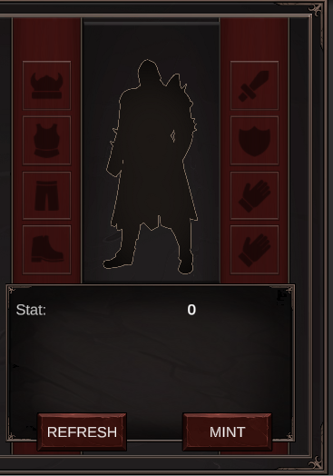

This MINT button provides a way for the player to mint new game item token whenever they choose.  As always, the new game item will be *random* -- that is, both the kind of item and its statistics will be generated randomly (or in reality pseudo-randomly, as explained below).  The item will then be owned by the player's account and (upon REFRESH, or any other action that triggers a new FetchInventory) will appear in the player's Inventory panel. 

We have also seen that the GET COINS button in the Welcome screen makes its own call to mint a single game item for a user logging in for the first time; the purpose of that was to ensure that, when the user first viewed their Inventory panel, it would contain at least one game item and hopefully make it easier to understand what that inventory panel was for.  The MINT button here is one of two ways that the user can acquire *additional* game items, the other being the purchase of game items from those available in the marketplace, which we've just seen in the previous use-case.   

In terms of code, the MINT button is set in the Inspector to call **InventoryManager.OnMintButtonClicked()**:

```csharp
public void OnMintButtonClicked()
	{
		onItemMint.Invoke();
	}
```

OnItemMint() is one of the UnityEvents which is listened for (as we have seen in previous use cases) by the UIManager in its Start() method:

```csharp
private void Start()
	{
		_manager = ExampleFactory.Instance.GetExampleManager();
		InitializeCallbacks();
		
		AllowUIAccess(false);
		inventoryButton.OnTabSelected.AddListener(AccessInventory);
		marketButton.OnTabSelected.AddListener(AccessMarket);
		inventory.onInventoryRefresh.AddListener(AccessInventory);
		inventory.onItemMint.AddListener(MintItem);
	}
```

So this OnMintItem event will trigger the `MintItem()` method of the current class, UIManager:

```csharp
private void MintItem()
	{
		_manager.MintItem();
	}
```

As we see, this method creates the usual ExampleManager class instance, and in this case calls the `ExampleManager.MintItem()` method:

```csharp
public void MintItem()
    {
        var destination = contractAddress;
        var entrypoint = "mint";
        var input = "{\"prim\": \"Unit\"}";

        _tezos.CallContract(contractAddress, entrypoint, input, 0);

#if UNITY_IOS || UNITY_ANDROID
        Application.OpenURL("temple://");
#endif
    }
```

Once again we are calling the generic `Tezos.CallContract()` API method.  As usual, `destination` is the current contract address, the `entrypoint` name in this case is "mint", and our input string here, as in several previous use cases, is the single string value "Unit"--which, as we've seen before, indicates to JsLIGO that no substantive input arguments are required here. We could still use the MichelinePrim helper function to help compose this input string, but it's also easy enough to hand-compose, as "{\"prim\": \"Unit\"}".  

Why does the "mint" entrypoint require no substantive arguments?  Because, as we learned in the UX walkthrough, the contract is minting the new item 'randomly'--or really pseudo-randomly, with a seed generated from the current time-stamp and a specified algorithm for each of the 'random' values. These randomized values will be the ItemTypeID (which determines whether we are minting, e.g., a war-hammer, axe, stone, suit of armor, etc) as well as the individual statistic values for Damage, Armor, AttackSpeed, HealthPoints and ManaPoints.    In our implementation, the statistic values have a *range* that is entirely arbitrary, and both this range and the 'randomizing' algorithm are identical for each stat, but this is purely for demonstration purposes.  in a more fleshed-out game, it would probably make sense for a weapon to be heavier on damage and attackspeed stats, while a suit of armor was more about armor and healthpoints stats.  Mana might apply to a consumable or potion, and of course magic stones could conceivably contribute to any and all of these stats, being magic.  Of course, this whole *set* of stats is arbitrary too, and won't necessarily suit the items in your own game genre at all; but just be aware that if you want to replace them with a different set of stats, you will need to make this change to both the contract code and Unity code, wherever the item object model on either side is evoked or assumed in data-handling.  For a reminder of these touch-points see especially Use Cases 3 and 6 above (FetchInventory and FetchMarketItems), as well as the relevant contract documentation.  See also our final document, [Suggestions for Further Use](/gaming/unity-sdk/other-use-cases). 

Meanwhile, ItemTypeID is similarly 'randomized' but in our implementation is constrained to a range of 1-4, because at present we only have four types of item as image/sprite resources: the axe, the hammer, the suit of armor and the magic stone.  If you changed this range to, say, 20, but made no other changes to our code, the result would be the minting of many game items that would exist a tokens in storage, could be retrieved by FetchInventory and even placed as draggable items in the Inventory grid, but would not actually be *visible* as they would have no corresponding image resource.  Again, see Use Case 3 for the mechanics of displaying items of different types.  

Finally, token_id (or ItemID), a crucial property at both the contract and UI level, is not derived randomly during the mint operation but rather derived from the current-highest token_id in storage, + 1.  The other really crucial property, of course, is `owner` -- the current active wallet address for whom the new token is minted; but this can be derived from within the contract itself (as `sender`, the wallet account that called the contract function).  In short, the effect of the mint entrypoint is to generate a new token in the ownership storage ledger, associated with the `sender` wallet account and given the now-highest token_id (for that particular contract); and also to insert a new token_metadata record in the metadata storage ledger, associating the new token_id with the various properties that have just been pseudo-randomly generated.  The new item is born, and can now be fetched to that user's Inventory (and also seen, as we witnessed in the UX walkthrough, as a 'mint' event and a token record in a public Tezos chain explorer like http://better-call.dev).  


#### Use Case 10: User has the ability to transfer/gift their own game items & coins to any wallet account address

We've also seen that the ItemDisplayPanel, invoked when a user clicks on an item in their Inventory display grid, contains among other controls a TRANSFER button, at least if that item is not currently on the market:


And when this button is clicked, we see the following Item Transfer dialogue:


except in the case when the coin icon has been selected, for a coin transfer, in which case we see one additional input field:


So in this transfer dialogue, the user may enter any valid Tezos wallet address, and in the case of a coin transfer they must also specify an amount to be transferred (which must be no more than their own current balance of local coin).  Upon clicking the final TRANSFER button, ownership of this selected item (or coins, in the specified amount) will be transferred from the sender to...whomever is in possession of the entered wallet account.  As we explained in the UX walkthrough, the real-world use case for this might be more obvious in a fully-fleshed out multiplayer RPG/adventure game, where there could be scenarios in which one user will simply want to gift, in-game, a useful item (or some amount of coins) to another user, sometimes a teammate and sometimes a stranger who has simply done something friendly or helpful in the game.  Our **Inventory Sample Game** project is not designed for multi-user play, so this gifting function is instead demonstrated in this simplified form, where the user enters any arbitrary (but hopefully valid) Tezos wallet address and then commits the Transfer.  Like all transactions this one must be approved by the *sender's* active wallet, but the receiving wallet could be anywhere in the Tezos ecosystem and certainly not on-hand to approve the transfer from their end.  This, incidentally, is true of most standard cryptocurrency transfers as well, which is why it's quite important to use the *correct* receiving wallet address.  In our game's contract logic, an ownership ledger is simply being updated to reflect the new, specified owning wallet account for a given token.  There is no way for our contract to know anything more about the receiving wallet than the account address itself. 

For this reason, as a game dev it's an excellent idea to test this function by sending an item to a 2nd account on your own Tezos wallet, which will have its own distinct address; we did this in our UX walkthrough. Or the second account could live in a separate wallet installed on a different physical device.  Either way, you could log out of the game with your first account and log in (pair) with your second, to verify that the transferred item indeed appears in your new Inventory. 

So what are the mechanics of this transfer?  We've already seen the code stack as far as invoking the **ItemDisplayPanel** itself, by clicking on the item in the main inventory grid (see use cases 5 and 7 above).  We've also seen that the TRANSFER button itself is only displayed if that item is not currently on the market.  If the TRANSFER button *is* present, clicking on it will open the transfer dialogue box we have just seen, called **ItemTransferBox**--a child of ItemDisplayPanel in the hierarchy.  This panel allows input of the receiver's wallet address (and coin amount in the case of a coin transfer), and then has its own TRANSFER button to initiate the actual transfer process. This button's Onclick() event is set in the Inspector as follows:

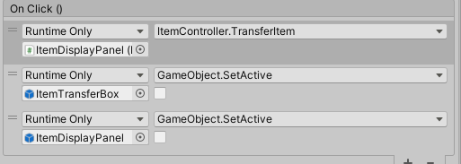

The ItemController class can be found with the other UI control scripts, at Scripts/DemoExample/UI.  Here is the `ItemController.TransferItem()` method:

```csharp
public void TransferItem()
    {
        string destAddress = transferAddressInput.text;
        string amountString = amountInput.text;
        int amount = 1;
        if (_hasMoreThanOneItem)
            amount = (amountString == String.Empty)? 1 : int.Parse(amountString);
        ExampleFactory.Instance.GetExampleManager().TransferItem(item.ID, amount, destAddress);
    }
```

The variable `destAddress` is loaded from the transfer address specified, while `amountString` will be loaded only if the amountInput box is visible, so only in the case of a coin transfer.  If this string is empty, it's a regular item transfer and so the variable `amount` will remain = 1; if this string is *not* empty, `amount` is instead set to an int conversion of the coin amount entered as a string.  Then, as usual we are instantiating an ExampleManager class, and here calling the `TransferItem()` method. passing in the `ItemID`, the amount, the destination address that's been specified, and a callback action `OnItemTransfered`, which simply refers to a boolean for success or failure.  `ExampleManager.TransferItem()` follows:    

```csharp
public void TransferItem(int itemID, int amount, string address, Action<bool> callback)
    {
        var destination = contractAddress; // our temporary inventory contract
        var sender = _tezos.GetActiveWalletAddress();
        var entrypoint = "transfer";
        var input = "[ { \"prim\": \"Pair\", \"args\": [ { \"string\": \"" + sender + "\" }, [ { \"prim\": \"Pair\", \"args\": [ 			{ \"string\": \"" + address + "\" }, { \"prim\": \"Pair\", \"args\": [ { \"int\": \"" + itemID + "\" }, { \"int\": 				\"" + amount + "\" } ] } ] } ] ] } ]";

        _tezos.CallContract(contractAddress, entrypoint, input, 0);

#if UNITY_IOS || UNITY_ANDROID
        Application.OpenURL("tezos://");
#endif
        callback?.Invoke(true);
    }
```

Here we have a final use of our generic `CallContract()` API method.  As always this method will take three parameters: the `destination` (contract address), the `entrypoint` (in this case called "transfer"), and an `input` string.  Note that we're also deriving `sender` here (the ActiveWalletAddress), but that is because it will be one element included in the input string.

For reasons known only to the developers, on this occasion this string is composed by hand, even though we could certainly have used our MichelinePrim helpers here.  If nothing else, this is a demonstration of why those Netezos Micheline helper functions are useful, as this string takes some effort even to read, let alone to compose correctly (and bear in mind that while it's wrapping in this document, in the actual C# code it must all be written on a single line).  Essentially, we have several nested pairs of values, which among them will include the `sender's` wallet address, the receiving wallet address (called `address` here), the `itemID`, and finally the `amount`sent (either 1, for unique tokens, or the specified amount in coins).

Once again, we will leave a detailed inspection of the "transfer" entrypoint to the contract code documentation [link].  The action is something like that of the "Buy" use-case, except that that this transaction is non-reciprocal, since it's as gift.  If a single, unique item is being transferred, the storage ownership ledger will simply be updated to transfer ownership from the sender to the receiver.  If an amount of coin is being transferred, the sender's balance in coin (as indicated in the token_id=0 record of their ownership ledger) will be debited by the specified amount, and the receiver's ledger balance will be incremented by the same amount -- unless the receiving wallet address really is a random stranger, not even part of this game, in which case a new token=0 entry will be created in the ownership storage ledger and that new wallet address associated with it.
