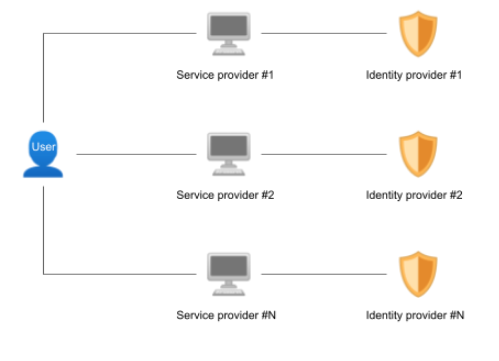
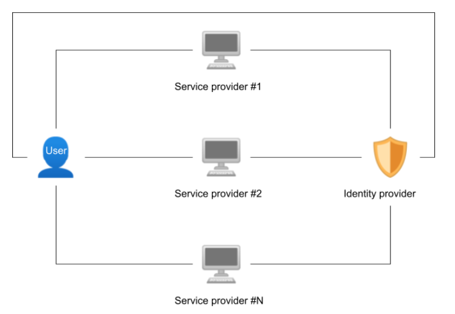

The following presentation of different ID systems is inspired by the work of Omar Dib and Khalifa Toumi in their article “Decentralized Identity Systems: Architecture, Challenges, Solutions, and Future Directions” (Dib, Omar; Toumi, Khalifa, 22).

## Centralized identities

Centralized identity-management systems are based on the traditional paradigm whereby an entity holds its own ID system which allows it to manage access to its services. These entities are therefore responsible for collecting, storing, and using the personal data and identities of their users. This is the approach currently taken by most private and public organizations such as social networks, governments, banks, and websites.

The above diagram represents how the vast majority of digital identity systems work: the authentication mechanism is principally based on the connection between a username and password. The username/password pair is usually stored in a database hosted by each service provider.

The quality of these data storage systems can vary widely, ranging from the top-quality, high-security systems used by governments, public institutions, and financial services to the often very poor-quality offerings of social media apps with little or no verification system.

This centralized and silo-based paradigm has enabled the rapid development of numerous online services, but its limits are becoming apparent, particularly in terms of security and confidentiality. As the information is managed by a single centralized entity, this entity is the only one with total control over that information and responsibility for its security. Yet these solutions are rarely interoperable, and they force users to have multiple identities because they have to create a new identity for every service they need to access.

According to a study by Digital Guardian published in 2020 (Lord), of 1,000 people surveyed in 2017:

- **29% of users said they didn’t know how many accounts they owned**, because they had too many to count

- In the USA, **each email address is used for an average of 130 different accounts**

- **20%** of those surveyed said they **used the same password everywhere**

This demonstrates that the fragmentation of identities presents a significant risk for users because of the multiple accounts created.

The centralization of an identity system also demands significant resources from the entity responsible for storing and protecting the data. In order to provide an adequate level of security to satisfy users and regulators, it must invest heavily in human and material resources and security measures.

## Federated identities

A federated identity system is a group of service providers who rely upon one single trusted centralized identity provider. In this scenario, the service providers accept the conditions, standards, and execution of the identity provider and build their own identity management based on these elements. Examples include the numerous websites that rely on the identities provided by well-known actors such as Facebook or Google to manage user sign-ins and accounts.

For users, this system has the advantage of simplifying how they handle their accounts and passwords. They only have to manage one single identity, established by the main provider, with which they can access numerous services.

The confidence that the service providers place in federated identities will depend largely on the quality of the system and the reputation of the entity providing it.

Yet there are downsides to federated identities. Through their centralized identity management systems, service providers and the identity provider can trace the activities across different services.