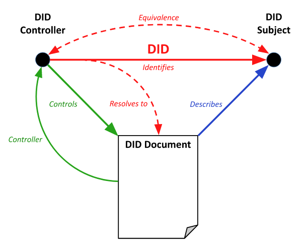

## Architecture

Entrepot DID = DID warehouse

Certificats DID = DID credentials

Resolveur DID = DID resolver

Client DID utilisateur = DID client user

Authentification DID = DID authentication

Applications et services = applications and services

### Decentralized identifiers

As seen above, DIDs are identifiers that users create, hold, and control independently of any organization or government.

### Decentralized systems

DIDs are based on decentralized systems which provide the necessary mechanisms and functionality for a decentralized identity solution to work.

### User DID clients

DID clients are applications which allow people to use decentralized identities. They allow you to create DIDs, manage data and authorizations, and sign/validate requests linked to the DIDs.

### DID resolvers

DID resolvers are servers which use a set of DID drivers to provide a standard DID lookup and resolution method, and return the DID document.

### DID identity warehouses

A network of cloud servers and physical devices (cell phones, computers) which facilitate data storage and interactions with identities.

### Verifiable DID credentials

Credentials signed by DID are based on standard formats and protocols, such as those defined by W3C. They allow identity owners to generate, present, and verify requests. This is the basis on which trust is established between users and the entities using these identities.

### Decentralized applications and services

The DIDs associated with Identity Hub personal datastores enable the creation of a new category of apps and services. They store data with the user’s Identity Hub and work within the limits of the authorizations granted to them.

## Process

### DID generation

The process of creating a DID is defined by each DID method. Some DID methods, like **did:key**, are purely generative, so that a DID and DID document are generated by turning a unique piece of cryptographic material into a standard form.

Other DID methods may require the use of a verifiable data registry, where the existence of the DID and DID document is only recognized by third parties after registration, as defined by the chosen DID method. Other processes may be defined by a particular DID method.

### DID lookup and retrieval

A DID is a specific type of URI, thus it may refer to any resource. According to the norm [RFC3986](https://www.w3.org/TR/did-core/#bib-rfc3986): the term “resource” is used in a general sense to mean anything that could be identified by a URI. A resource is not necessarily accessible via the Internet.

The DID controller determines the DID subject. It should not be possible to determine the DID subject by looking at the DID itself, since DIDs can generally only be understood by machines and not humans. A DID is unlikely to contain information on the DID subject, so additional information on the DID subject is only discoverable by resolving the DID to the DID document and obtaining a verifiable proof on the DID.

The diagram below shows the process of lookup and retrieval through a DID Client.

### DID disclosure and authentication

The DID refers to the DID subject and resolves to the DID document (following the protocol specified by the DID method). The DID document is not a separate resource from the DID subject and does not have a URI separate from the DID. Rather the DID document is an artifact of DID resolution controlled by the DID controller for the purpose of describing the DID subject. This distinction is illustrated by the graph model below.

The authentication verification relationship is used to specify how the DID subject is expected to be authenticated, for purposes such as logging into a website or engaging in any sort of challenge-response protocol.

If authentication is established, it is up to the DID method or other application to decide what to do with that information. A particular DID method could decide that authenticating as a DID controller is sufficient to, for example, update or delete the DID document. Another DID method could require different keys or a different verification method entirely to be presented in order to update or delete the DID document than that used to authenticate.

### Managing authorizations

Let’s look at a case where the DID subject is also the DID controller. This is the case when an individual or organization creates a DID to self-identify.

From a graph model perspective, even though the nodes identified as the DID controller and DID subject in the below figure are distinct, there is a logical arc connecting them to express a semantic equivalence relationship.

In this case, the DID subject (also the controller) has total control over its DID document.

The second case is when the DID subject is a separate entity from the DID controller. This is the case when, for example, a parent creates and maintains control of a DID for a child; a corporation creates and maintains control of a DID for a subsidiary; or a manufacturer creates and maintains control of a DID for a product, an IoT device, or a digital file.

From a graph model perspective, the only difference from the figure above is that there is no equivalence arc relationship between the DID subject and DID controller nodes. In this case, the DID subject has no control over its DID document.