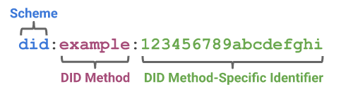
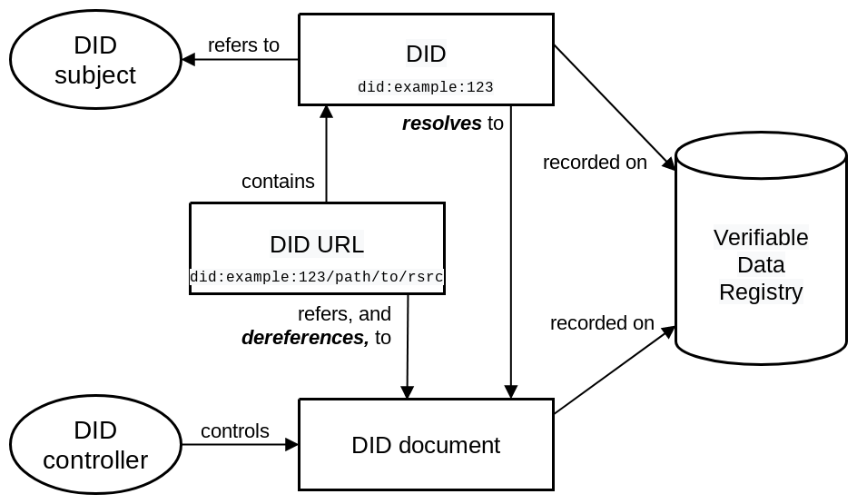

## Decentralized identifiers

Now that we’ve covered the different components of decentralized identities, let’s take a closer look at decentralized identifiers and how they are used. The following is based on W3C’s definition of decentralized identifiers.

## Definition

Decentralized identifiers enable the creation of decentralized, verifiable digital identities. These identities can represent people, organizations, businesses, etc. The aim of these identifiers is to be completely decoupled from centralized or federated entities.

External entities may nevertheless play a part in the process, but in a much more limited way. Indeed, the only actions that can be taken by third parties are the issuing and verification of proofs. Furthermore, as we have seen, disclosing the proof will only involve sharing confirmation of the veracity of the information, without revealing the underlying information itself. The decision to disclose the proof is at the sole discretion of the data owner.

DIDs are [URIs](https://fr.wikipedia.org/wiki/Uniform_Resource_Identifier) that associate a DID subject with a DID document allowing identification and interactions associated with that subject.

As outlined above, each DID document can express cryptographic material, verification methods, or services that provide a set of mechanisms enabling a DID controller to prove control of the DID.

A DID is a text string consisting of three parts:

- a scheme identifier
- an identifier for the DID method
- a DID method-specific identifier attributed to the owner


<p align="center">



</p>

The example DID above, taken from [W3C’s definition](https://www.w3.org/TR/did-core/#a-simple-example), represents a DID document. A DID document contains information associated with the DID, such as the means of cryptographically authenticating a DID controller. We will look at DID controllers in more detail later.

```bash
{
"@context": [
"https://www.w3.org/ns/did/v1",
"https://w3id.org/security/suites/ed25519-2020/v1"
]
"id": "did:example:123456789abcdefghi",
"authentication": [{
// used to authenticate as did:...fghi
"id": "did:example:123456789abcdefghi#keys-1",
"type": "Ed25519VerificationKey2020",
"controller": "did:example:123456789abcdefghi",
"publicKeyMultibase": "zH3C2AVvLMv6gmMNam3uVAjZpfkcJCwDwnZn6z3wXmqPV"
}]
}
```

## Goals

Decentralized identifiers are essential components of verifiable credentials.

Let’s take a closer look at the design goals set out by W3C.

|  Goal  | Description       |
| :--------------- |:--------|
| Decentralization  |   Eliminate the requirement for centralized authorities or single point failure in identifier management, including the registration of globally unique identifiers, public verification keys, services, and other information.| 
| Control | Give entities, both human and nonhuman, the power to directly control their digital identifiers without the need to rely on external authorities.|    
| Privacy | Enable entities to control the privacy of their information, including minimal, selective, and progressive disclosure of attributes or other data.|
| Security | Enable sufficient security for requesting parties to depend on DID documents for their required level of assurance.|
| Proof-based | Enable DID controllers to provide cryptographic proof when interacting with other entities.|
| Discoverability | Make it possible for entities to discover DIDs for other entities, to learn more about or interact with those entities.|
| Interoperability | Use interoperable standards so DID infrastructure can make use of existing tools and software libraries designed for interoperability.|
| Portability | Be system and network independent, and enable entities to use their digital identifiers with any system that supports DIDs and DID methods.|
| Simplicity | Favor a reduced set of simple features to make the technology easier to understand, implement, and deploy.|
| Extensibility | Where possible, enable extensibility provided it does not greatly hinder interoperability, portability, or simplicity.|

## Architecture

In the previous section, we covered the main elements of a decentralized identity solution. We will now turn to the essential components of a DID.

The diagram below, taken from [the W3C definition](https://www.w3.org/TR/did-core/#architecture-overview), gives an overview of the architecture of a DID, as well as the relationship between the elements with which it interacts. The following descriptions of these elements are also taken from the W3C definition.

<p align="center">



</p>

## DIDs and DID URLs

A decentralized identifier, or DID, is a URI composed of three parts: the scheme DID, a method identifier, and a unique, method-specific identifier specified by the DID method.

DIDs are resolvable to DID documents. A DID URL extends the syntax of a basic DID to incorporate other standard URI components such as path, query, and fragment, in order to locate a particular resource—for example, a cryptographic public key inside a DID document, or a resource external to the DID document.

## DID subjects

The subject of a DID is the entity identified by the DID. The DID subject might also be the DID controller. The subject of a DID could be a person, group, organization, or even a concept.

## DID controller(s)

The controller of a DID is the entity (person or organization) that has the capability—as defined by a DID method—to make changes to a DID document.

It is generally necessary to control a whole set of cryptographic keys in order to make these changes.

A DID may have more than one controller, and the DID subject can be the DID controller, or one of them.

## Verifiable data registries

In order to be resolvable to DID documents, DIDs are typically recorded on an underlying system or network of some kind. Regardless of the specific technology used, any such system that supports recording DIDs and returning data necessary to produce DID documents is called a verifiable data registry. Examples include blockchains, decentralized file systems (such as IPFS), databases of any kind, peer-to-peer networks, and other forms of trusted data storage.

## DID documents

DID documents contain information associated with a DID. They typically express verification methods, such as cryptographic public keys, and services relevant to interactions with the DID subject. A DID document can be serialized.

## DID methods

DID methods are the mechanism by which a particular type of DID and its associated DID document are created, resolved, updated, and deactivated.

## DID resolvers and DID resolution

A DID resolver is a system component that takes a DID as input and produces a conforming DID document as output. This process is called DID resolution. The steps for resolving a specific type of DID are defined by the relevant DID method specification.

## DID URL deferencers and DID URL dereferencing

A DID URL dereferencer is a system component that takes a DID URL as input and produces a resource as output. This process is called DID URL dereferencing.