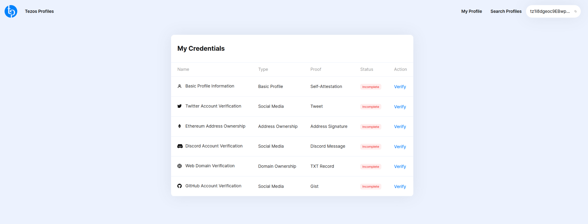
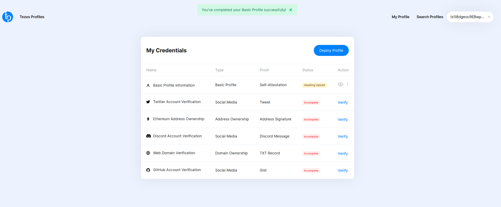
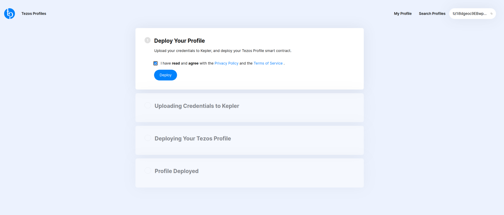
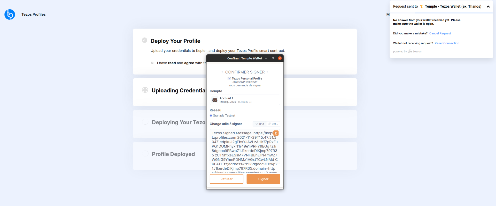
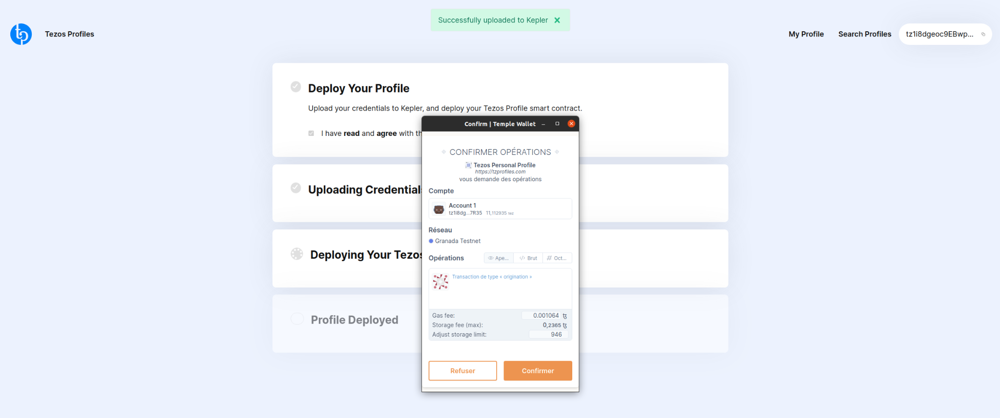
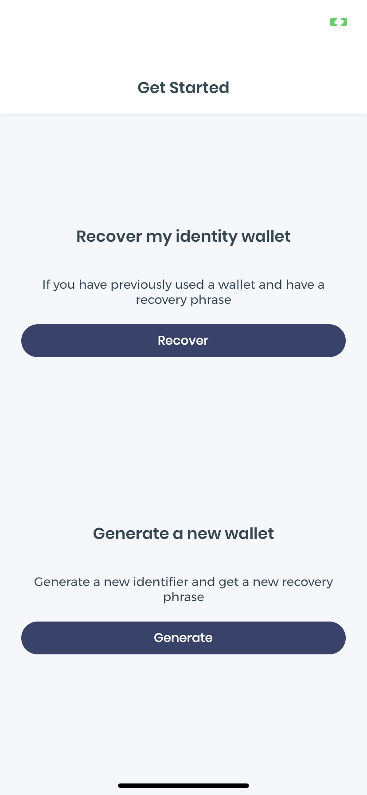
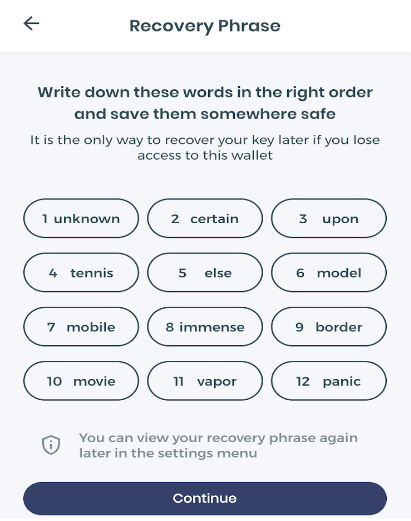
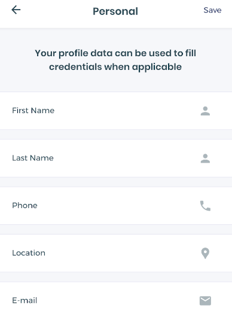
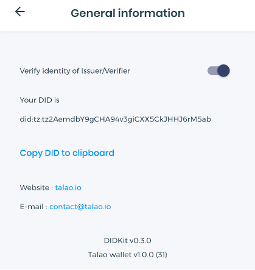
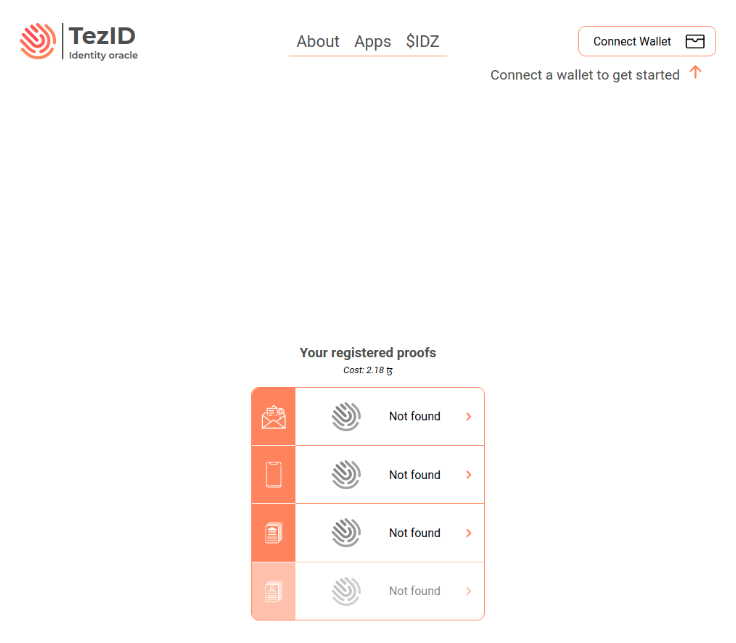

Below are the solutions that are currently being built on the Tezos blockchain.

## Spruce Systems

[Spruce Systems](https://www.spruceid.com/) is a company building an open-source accreditation framework conforming to W3C norms around decentralized identifiers. It is ready to be rolled out and extensible to the IT systems of businesses and governments.

Among their key products are:

- **Kepler**: A decentralized storage system which uses smart contracts to define where your data is stored and who can access it.
- **Credible**: a wallet with credibility (Apache 2.0) for self-sovereign identity.
- **DIDKit**: a multiplatform toolkit for working with decentralized identifiers and W3C verifiable credentials.
- **SSI**: A RUST library for decentralized identity.
- **Keylink**: a digital signature tool.

### Tezos Profiles

[Tezos Profiles](https://tzprofiles.com/) is a web application developed by Spruce Systems, that helps Tezos users to regain control of their digital identity and use it on different platforms. It allows users to create verified profiles by proving control of their public social media accounts and self-attested information. These verified profiles are then linked to their Tezos accounts, allowing any platform to resolve and establish trusted information to reduce the risk of identity theft.

Here’s an overview of the decentralized Tezos Profiles app:

A basic profile is created through the following stages:

1. The user connects to their Tezos wallet and completes their self-attested information. This could be simple information about themselves, or claiming ownership of social media accounts (Twitter, Discord, GitHub).

2. The user can then deploy their profile using the “Deploy Profile” button. In this example, we have only filled in the information concerning the “Basic Profile.”

3. The user must then accept the terms and conditions using the “Deploy” button.

4. The application then asks the user to sign the information they are claiming ownership over using their wallet.

5. The transaction deploying the smart contract corresponding to the user profile must then be submitted. The user profile controls the smart contract containing the URL and hashing of the contents of the claims. (Approximate cost: 0.23 tez.)

The profile is now deployed on the Tezos blockchain. The “View on TzKt” button allows you to see the contract on the Tezos blockchain.

(Optional) The user can update the content of the smart contract and approve additional storage operations to update or delete requests. Users can also have greater control over the active contents of the contract by using their Tezos account, and even define the URL in the smart contract to point toward files on their own web host.

The ID information from tzProfiles is stored in a storage service on kepler.tzprofiles.com. The service can produce a public URL which anyone can access, allowing users to create, update, and delete data using their Tezos wallet to sign requests. Although bare instances of IPFS can be replicated by unknown parties, Kepler adds authorizations around IPFS to restrict replication so that users can delete their data and may reasonably withdraw if they wish to.

## Talao

[Talao](https://www.talao.io/) is a self-sovereign identity solution which has implemented an easily integrable electronic wallet with minimal dependencies and regardless of its environment, whether for projects carried out by companies or by institutions. It aims to facilitate the widest possible take-up of self-sovereign identity concepts and technologies.

Talao offers the first smartphone wallet available on the Apple and Google stores that carries identity in the format of the Tezos network. The Tezos blockchain has many advantages for SSI identities, in particular that of open governance, high security, and a proof-of-stake consensus, which makes it one of the least energy-consuming in the world. This wallet allows all Tezos applications to offer their users an SSI identity to access their services.

Here’s what the wallet interface looks like on iOS:

By clicking on “Generate a new wallet,” you are given a recovery phrase (which must be kept secret) allowing your wallet to be identified:

You can also modify your personal information in the application:

In the general information section, we can see our DID with the Tezos address which has been generated for us:

## Gravity

SSI solutions to promote financial inclusion.

[Gravity](https://www.gravity.earth/) allows individuals, small businesses, and NGOs to gather their verifiable data in a digital wallet and build identities and trusted digital relationships that are private, portable and persistent.

Based on Spruce’s stack, the project operates in three key areas: identity for humanitarian aid, financial inclusion, and governmental identity.

Gravity also incorporates:

- **DIGID**: Dignified Identities in Cash Programming, developed with the Norwegian Red Cross and Save the Children.

- **Educational credits**: Developed with the UNPD, these credit letters will be granted to Syrians in temporary protection in Turkey.

## TezID

[TezID](https://tezid.net/) is an identity oracle on the Tezos blockchain. It allows users to prove ownership of certain digital assets such as email addresses, telephone numbers, etc.

TezID is a smart contract containing registered addresses and verified proofs for each of these addresses. Users can register their address as well as their various proofs. The oracle is used to verify these proofs.

How to use TezID?

The user connects their wallet to the TezID app:

They register the data over which they want to claim ownership (email, phone number, address):

The user then registers one of the supported proofs with the TezID Smart Contract and requests a verification code from the oracle.

The oracle verifies the uniqueness of the property (you cannot register the same email twice). The oracle sends a verification code to the property.

The user receives the verification code and enters it in the TezID app.

Finally, the oracle marks the proof as verified in the Smart Contract.

This solution can be used from other Smart Contracts to verify that a Tezos address is associated with a real human being.