In this chapter, we will show you how to use the octez suite, and more specifically, `octez-client`, to call and deploy contracts.

To make it as easy as possible for you to give it a try, we will use [gitpod](https://gitpod.io) with a virtual machine we have setup with all the necessary software, including the octez suite and the vscode editor and language compilers. Gitpod runs directly in your browser.

Of course, you may also do all this in your local environment as well, for example by doing a checkout of our repository at https://gitlab.com/nomadic-labs/training-gitpod.

This chapter contains three sections:
- [Octez client: initial configuration](#octez-client)
- [Calling a contract](#call-contract)
- [Deploying a contract](#deploy-contract)

## <a name="octez-client">Octez client: initial configuration</a>

This section will guide you through all the steps to prepare a gitpod environment, create a Tezos test account, check your balance, and the balance of other people.

Make sure you understand what you do at each step, and don’t just copy the commands blindly.

### 1. Setup gitpod

Create or log in to your Gitpod account at https://gitpod.io/login, using your existing GitHub or GitLab credentials.

### 2. Open our gitpod environment

Open our [training gitpod](http://gitpod.io/#https://gitlab.com/nomadic-labs/training-gitpod), that should open the gitpod environment we have prepared.

If your Gitpod account was created with a GitHub credential, you must authorize GitPod to access repositories hosted on GitLab.

### 3. Point octez-client to a Tezos test network

To point octez-client to a public node of a Tezos test network, input the following command:

```bash
octez-client --endpoint https://rpc.ghostnet.teztnets.xyz config update
```

Note that public nodes come and go, and the url above may not always work,or not correspond to the latest version of the protocol. A list of public nodes can be found [here](https://tezostaquito.io/docs/rpc_nodes/) and [here](https://teztnets.xyz/) especially for testnets. Make sure you pick a test network, and not Mainnet.

If everything goes well, the output should look similar to this:

<p align="center">

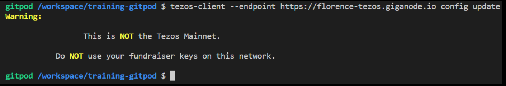

</p>

### 4. Disable warnings about connecting to a test network

Input the following command:

```bash
export OCTEZ_CLIENT_UNSAFE_DISABLE_DISCLAIMER=yes
```

### 5. Generate a Tezos address and fund it

To generate an account and funt it, follow these [instructions](../../tezos-basics/cli-and-rpc/cli-and-rpc.md#account-funding).

### 6. Check your account’s balance

Input the following command, replacing alice with your alias:

```bash
octez-client get balance for alice
```

If everything is set up correctly, it should output a single line the amount of tez the faucet allocated to your address.

<p align="center">

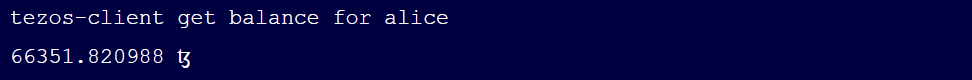

</p>

### 7. Share your address with others

You can find the address of your account in the json file, on the line that starts with “pkh”. It starts with tz1.

You can now retrieve your address (it starts with tz1, tz2 or tz3) with the command:

```bash
octez-client show address alice
```

You can share this address with other people, so that they can send you some tez.

### 8. Check your account on a block explorer

Go to <https://tzkt.io/> and select the test network you are using, in the drop-down menu (top left):

<p align="center">

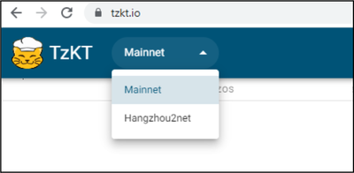

</p>

In the search area of TzKT, paste the address of your account.

Check that the balance corresponds to what you saw with the command line.

<p align="center">

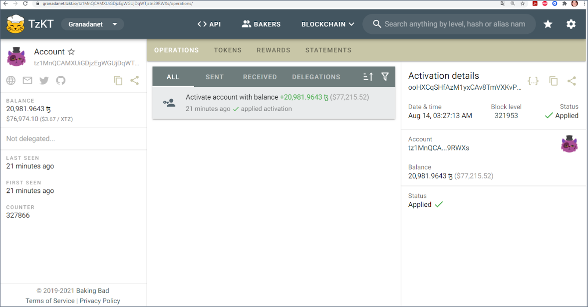

</p>

Note that sometimes, it takes a few minutes for your account to be visible.

### 9. Create an alias for another account

Create an alias for another account, so that you don’t have to input the full address every time you want to do transactions with that account.

For example to create an alias for your friend bob, input the following command:

```bash
octez-client remember contract bob [address of bob]
```

You can then check your friend’s balance.

### 10. Save your configuration

Gitpod closes after 30 minutes of inactivity.  Saved files are preserved, but not environment variables. To avoid having to re-configure each time you (re)open your workspace, you can create a config.sh file.
To create the file and open it in the vscode editor, input the following command:

```bash
code config.sh
```

Edit the content of this file, with commands that you want to run automatically:

```bash
octez-client --endpoint https://rpc.ghostnet.teztnets.xyz config update
export OCTEZ_CLIENT_UNSAFE_DISABLE_DISCLAIMER=yes
octez-client remember contract bob [address of the contract]
octez-client import secret key alice unencrypted:edsk...
```

You can retrieve your secret key with:

```bash
octez-client show address alice --show-secret
```

### 11. Recover your gitpod workspace after a deconnexion

Gitpod turns your workspace off after 30 minutes of inactivity, to save server resources.

If your tab is still open, you can just click on a button to restart it.

However, if you closed that tab or your browser, you can go to https://gitpod.io, where you will see links to your previously used workspace. You can open it from there.

Once your workspace is reopened, input the following command, to run the commands you saved in your config.sh file:

```bash
source config.sh
```

## <a name="call-contract">Octez client: calling a contract</a>

This section will guide you through every step needed to make simple calls to contracts using octez-client.

### 1. Send Tez to another address

You can transfer tokens from your account, to any account for which you created an alias.

For example, if your account is named alice, and you created an alias for your friend bob, input the following command to transfer 5 tez to bob:

```bash
octez-client transfer 5 from alice to bob
```

You could also directly input the destination address instead of the alias.

The transfer is not immediate! You need to wait for a baker to include your transaction in a block. To be really sure that the block is final, you should then wait for two more blocks after that.

When testing (and only when testing), we add `--wait none` to the command, to avoid having to wait for these two extra block:

```bash
octez-client --wait none transfer 5 from alice to bob
```

**Practice:** exchange your addresses with others and do a few transactions. (Just be sure you’re on a testnet!).

### 2. Check your transactions on a block explorer

Remember that you can access the status and history of any account, using one of the block explorers available for Tezos.

Go to https://tzkt.io/, then make sure you select the correct network, then search for the address of the account you want to check.

Look for the recent transactions, and check that your balance has been updated.

Remember that it may take a couple of minutes for the block explorer to show the changes.

### 3. Create an alias for a smart contract

Here is the address of a contract, on the `ghostnet` test network:

```bash
KT1AeHhAyyWGfAizceN7AhEkCbMwEZFfEG7g
```

Note that smart contract addresses start with "KT".

Start by creating an alias for this contract, using the same command as for a regular account.

For example, if you want to use the alias `contract1`, input this command:

```bash
octez-client remember contract contract1 [address of the contract]
```

### 4. Check the balance of the contract

Just like a regular account, a contract has a balance, that you can check with the following command (using the alias you selected earlier):

```bash
octez-client get balance for contract1
```

### 5. Call a simple contract with only an int as parameter

This is a very simple contract, that stores a single value in its storage: a number, of type int.

All you can do with it is to call it, and send a new value, that it will store in its storage.

Pick a new value. For example here, we pick 432, but pick your own, so that it’s different from other users.

Then input this command to call the contract, so that it will replace its storage with your value:

```bash
octez-client --wait none transfer 5 from alice to contract1 --arg '432'
```

Let's decompose the elements of this command:

- `--wait none` indicates that we don't wait for the transaction to be final
- `transfer 5` indicates that we are sending 5 tez to the contract
- `from alice` indicates that the caller address (and sender of the 5 tez) is alice
- `to contract1` indicates the destination of the call: our contract
- `--arg '432'` is how we provide the parameter of the contract call

Remember to use the correct aliases instead of `alice` and `contract1`.

Note that the symbol `'` has variants like `‘` or `’` that look very similar but will not be accepted.

Note that we didn’t need to send 5 tez and could have saved tokens, by putting `transfer 0` instead.

### 6. Check the output and see that it was successful

The output is quite long, and contains lots of information:

<p align="center">

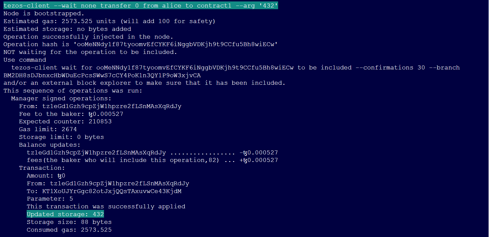

</p>

Look for the new value of the contract’s storage and this message.

```bash
This transaction was successfully applied
Updated storage: 432
```

In some cases, you may get an error, and not see this, for example if there was some connection issue with the node.

This doesn’t mean the transaction didn’t happen. If that’s the case, check the history of transactions of your account on an explorer. Remember to wait a couple of minutes if you don’t see it immediately.

### 7. Check the result on a block explorer

To check the activity on a contract, we will use a different block explorer, better call dev.

Go to https://better-call.dev/.

In the search area, input the address of the contract you want to check.

<p align="center">

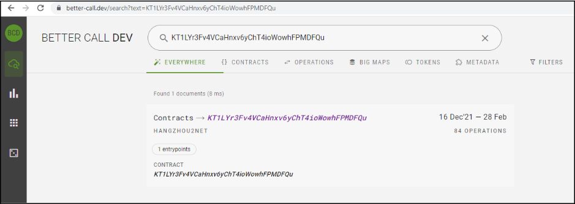

</p>

When you see the contract in the results, click on it to open the page. You will then see the list of recent transactions for this contract:

<p align="center">

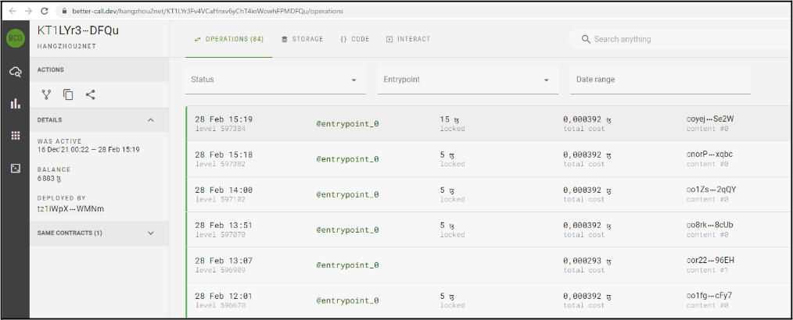

</p>

Click on a transaction to see the details:

<p align="center">

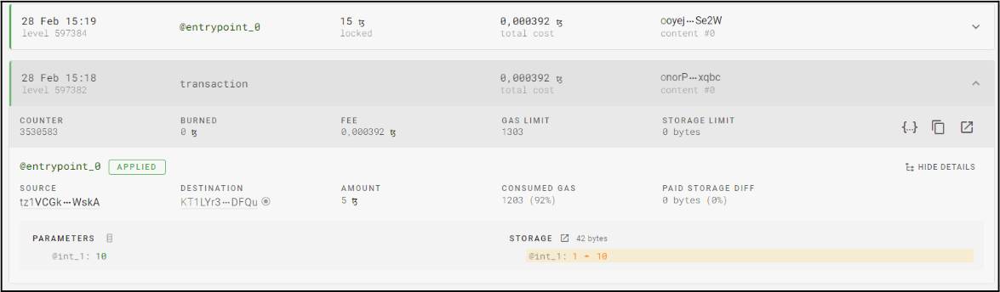

</p>

You should be able to find your transactions, as well as other people’s transactions on that contract.

### 8. Call a contract with a string as a parameter, that increases the storage

Here is the address of another contract on the `ghostnet` test network:

```bash
KT1XWjfX2sFzDS1u1vhu8WumVYqQRKJRcvNW
```

This contract that can be called with a string as a parameter. It stores a string, and after every call, it will add a comma to the storage, then the value of your parameter.

A string is a sequence of characters, that you can delimit between two double-quotes: `"`.

For example the string `Hello World!` is expressed as `"Hello World!"`.

When you input a command, remember that the value of the parameter should be put between two single quotes, for example '432'  for a number. For a string, this means you will have single quotes outside, and double quotes inside, like this:

```bash
'"Hello World!"'
```

Note that just like `'`, the symbol `"` has variants like `“` or  `”` that look similar but will not be accepted.

When you call that contract, the amount of data it stores will increase. You will need to pay for that extra storage, by burning some tez. To indicate how many tez you are accepting to burn at the most, add this at the end of your command. For example, if you accept to burn 0.1 tez:

```bash
--burn-cap 0.1
```

Your final command, will look like this (this should be a single line):

```bash
octez-client --wait none transfer 0 from alice to contract2 --arg '"Hello"' --burn-cap 0.1
```

### 9. Check that the result is correct

Make sure the output is correct and you see the expected value of the new storage.

Also make sure you explore this contract in a block explorer, and see your transaction there, and the new value of the contract’s storage.

### 10. Call more advanced contracts

If you want to call contracts that have more complex parameters, you can get help by letting better call dev generate the command line for you.

Load the contract, then go to the "Interact" tab:

<p align="center">

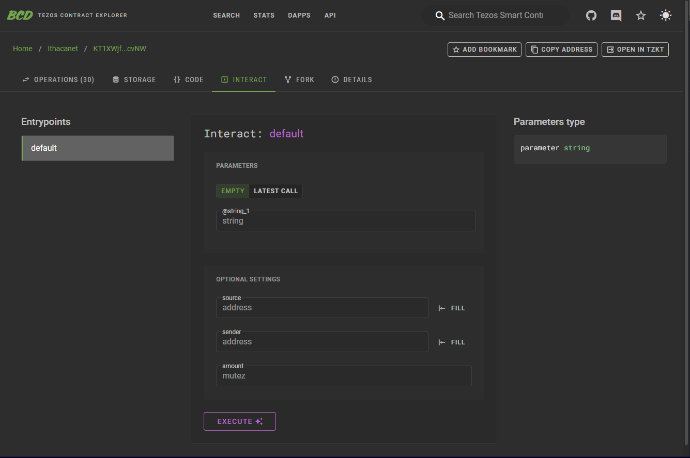

</p>

Use the user interface to input the parameters, then click on "Execute", and select "octez-client".

<p align="center">

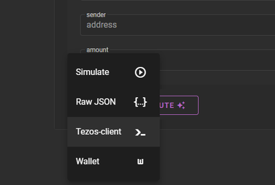

</p>

Better Call Dev will then show you the command line, with a placeholder for your address (or alias):

<p align="center">

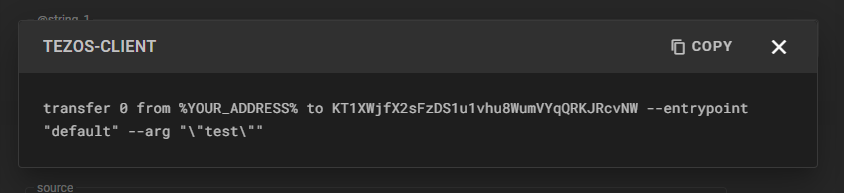

</p>

## <a name="deploy-contract">Octez client: deploying a contract</a>

### 1. Fetch the code of the contract

Let's try to redeploy our first contract:

```bash
KT1XWjfX2sFzDS1u1vhu8WumVYqQRKJRcvNW
```

Make sure you use the correct address, otherwise you may encounter issues, in particular if you use a different contract that needs to be called with different parameters.

The first step is to obtain the michelson code of this contract. The easiest way is to use a block explorer.

Go to https://better-call.dev/.

Input the address of the contract you want to find the source code of.

Click on the contract in the results, then on the contract page, open the “code” tab:

<p align="center">

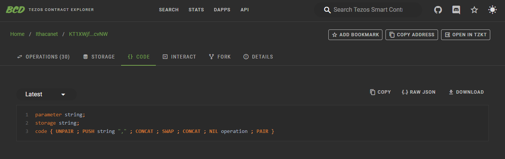

</p>

You should then see the Michelson source code of the contract:

```michelson
parameter string;
storage string;
code { UNPAIR ; PUSH string "," ; CONCAT ; SWAP ; CONCAT ; NIL operation ; PAIR }
```

### 2. Put it in a .tz file

To deploy a copy of this contract, you need to put its content in a file, with the `.tz` extension, for example `myContract.tz`

Start by copying the contract by clicking on the “copy” button in the top-right corner, or by selecting the code, and using keyboard shortcuts (like ctrl+C on windows) to copy it.

In your gitpod environment, create a file and open it directly in your vscode editor, by using the following command:

```bash
code myContract.tz
```

Then, in the editor, paste the content of the contract that you copied.

Save it using ctrl+S.

Make sure everything ok by displaying the content of the file using this command line:

```bash
cat myContract.tz
```

The content should be displayed below.

### 3. Run the contract origination command

Now that the Michelson source code of your contract is in a file, you can run a command to originate it on the Tezos test network your client is connected to.

Input the following command (in a single line):

```bash
octez-client originate contract myContract transferring 0 from alice running myContract.tz --init '"Hello"' --burn-cap 0.1
```

This command will originate a new version of the contract you copied, and have the number you used as its initial storage content.

Let's decompose the elements:

- `octez-client originate contract` is the command to use to originate a contract
- `myContract` tells what alias you want to give to this contract
- `transferring 0` is the amount you want to put in the balance of your contract
- `from alice` tells from which account you want to originate the contract, and transfer the tez from
- `running myContract.tz` defines what file contains the Michelson code of your contract (its relative path).
- `--init '"Hello"'` sets the initial value of the storage. In our case, the storage is simply a string.
- `--burn-cap 0.1` sets the maximum amount of tez you are willing to burn to pay for the storage of the code and initial value

Make sure you replace the first `myContract` with the alias you want to use, `alice` with the alias you chose for your account, and `myContract.tz` with the path you used. Try to put a different string instead of `"Hello"`.

The output should show you the address of your contract. It starts with `KT`.

### 4. Check your contract on a block explorer

Using the address in the output of the previous call, go to better call dev and find your newly deployed contract.

### 5. Call your own contract

Call your contract exactly like you called the same contract in the previous exercise. Just make sure you use the new alias you chose when deploying it.

Check again that you see the result on better-call-dev.
